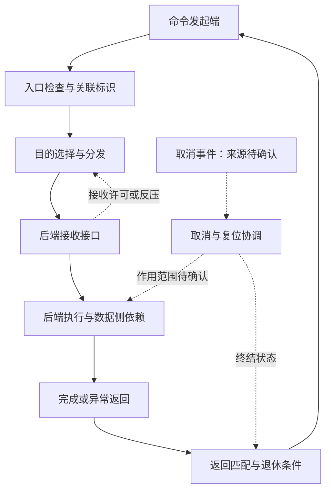

# CF：命令分发、返回与控制事件的研究方案

版本：v1.1；日期：2026-09-24；依据：[研究范本 v1.3](../chip-study-plan.md)。状态：规划完成，三轮详细研究均未开始。下一步先核对 shaobo 的 CF 接口角色及消息语义，再写正常命令闭环。

资料集：[sources.md](../sources.md)。先读 [模块 README](README.md)、本方案与 L1/L2 的仓库摘要，随后按问题查看 R7/R8、FAB4；这些公开材料提供设计方法，不能替代缺失的独立 CF 规格。

## 逐篇笔记与本方案的研究落点

先查[模块资料索引](sources/README.md)了解每篇讲什么，再读对应详细笔记；笔记内保留原文链接、版本、阅读位置、机制及重要限制。本次仅补资料与修订规划，下面的论文轮次完成状态不变。

| 微架构位置 | 对应轮次 | 可直接复用的技术笔记 | 本次补充的研究重点 |
| --- | --- | --- | --- |
| 命令身份与端点访问 | 第 1 轮 | [L1](../SDMA/sources/L1-external-glossary-scope.md)、[L2](../SDMA/sources/L2-external-shaobo-scope.md)、[IO10](sources/IO10-gfx90-register-control.md)、[MG4](../SMN/sources/MG4-smn-indirect-access.md) | CF 保持 Command Fabric；GRBM/SMN 只是控制访问参照，外部目标接口需本地复查。 |
| 接纳、排序和完成 | 第 1–2 轮 | [R8](../SWITCH/sources/R8-axi-ordering-contract.md)、[R7](../SWITCH/sources/R7-floonoc-paper.md)、[FAB4](../DF/sources/FAB4-dma-fence-contract.md)、[FAB7](../DF/sources/FAB7-amdgpu-fence-lifecycle.md)、[SD2](../SDMA/sources/SD2-sdma52-completion-maintenance.md) | credit、接收确认、工作完成及原命令完成逐项找责任者，不把 AXI 默认当 CF 协议。 |
| 共享状态与异常退出 | 第 3 轮 | [MG1](../SMU/sources/MG1-smu-message-table.md)、[IO9](../PCIE/sources/IO9-pci-error-recovery.md)、[MG8](../IH/sources/MG8-irq-dispatch-lifecycle.md) | 控制请求也会等待共享资源；超时、取消和复位后的旧返回必须有退出约定。 |

## 名称、边界与事件上下游

当前 CF 按 shaobo 语境解释为 Command Fabric。行业检索可以使用 command interconnect、command dispatch、request/completion protocol、control message network、transaction tracking。这些是功能类比，不能将 CF 自动改称 Infinity Control Fabric、SMN、CANE，也不能认为所有名为 command 的通道都属于 CF。

现有 README 记载 BE 经 CF 接收命令并返回 EOC、异常、cancel、credit 等信息，回指 L2。本轮读到的是仓库现存摘要，未复读独立 SDMA 项目原件；消息方向、编码和有效条件仍须本地核对，尤其不能从“cancel”名字猜测谁向谁取消什么。

代表性事件采用“发起端提交一项后端任务 → CF 交接到 BE → BE 通过数据侧工作 → 返回相关控制状态”。研究按事件发起到消费再回报推进。FE/BE/TBE 内部拆分与执行由外部 SDMA 项目解释，本方案只保留边界合同。DF 的数据完成可能是生成某种控制返回的前置，但其具体条件待确认；CF 和 DF 不因这种依赖变成一条相同网络。

## 微架构骨架与闭环

以下是用于提问的功能模型，不声称真实 CF 必然分组交换、带集中事务表或采用下图队列实现：

发起端先确保能记录尚未完成任务，再提交目的与任务上下文；CF 只有在目标可接受时才交接。接收资源释放可以早于执行完成，因此 credit、接受确认、后端工作完成、原始命令完成必须逐一找产生者和消费者。返回通过关联信息找到正确任务，发起端按规定退休；一个原始命令若被拆分，完成汇合可能在 FE/BE，不能未经证据塞进 CF。

异常闭环与正常闭环使用同一任务身份。讨论取消时区分尚未接受、已经接受但未执行、已发生部分副作用三种阶段，并核对迟到返回和标识复用的交叉情况。可研究 generation/epoch 作为避免旧响应误配的候选手段，但是否存在对应硬件字段待确认。事务表、资源计数、超时监测可以分布在端点，图中功能不预设物理归属。

## 研究主题与资料定位

| 架构位置与级别 | 需要回答的问题 | 就近阅读入口与边界 |
| --- | --- | --- |
| 发起与分发，核心 | 谁发命令、谁选后端；目的/上下文/任务 ID 如何区分；一项请求拆分成多少后端工作，谁保留关联 | [CF README](README.md) 与 [模块映射](../module-map.md) 中的 L1/L2 摘要；本地接续核对原始资料已有定位。没有公开规格支持的字段不填写位宽 |
| 接收与容量，核心 | 信用代表命令槽、队列项还是其他资源；返还条件是否依赖执行；返回通道能否被命令堵死 | [R8：AXI Issue H](https://developer.arm.com/-/media/Arm%20Developer%20Community/PDF/IHI0022H_amba_axi_protocol_spec.pdf)，A3.3 的握手依赖用于学习怎样写接口规则；CF 不因此采用 AXI 握手或通道  技术笔记：[R8](../SWITCH/sources/R8-axi-ordering-contract.md)。 |
| 标识与顺序，核心 | 同一上下文不同目标的返回怎样匹配；允许哪些乱序；命令顺序与数据观察顺序在哪里建立 | [R7：FlooNoC v1](https://arxiv.org/html/2409.17606v1)，III-A 比较端点重排与限制注入；仅作设计取舍参考，不预定 CF 必须有 ROB  技术笔记：[R7](../SWITCH/sources/R7-floonoc-paper.md)。 |
| 完成与错误，核心 | EOC 到底终结哪一层任务；软件可见成功需要哪些额外条件；失败是否仍然需要终结并归还资源 | [FAB4：Linux v6.12 dma-fence.h](https://github.com/torvalds/linux/blob/v6.12/include/linux/dma-fence.h)，`dma_fence_get_status_locked`、`dma_fence_set_error`：软件完成可区分成功/失败。它不证明 CF EOC 与 Linux fence 一一对应  技术笔记：[FAB4](../DF/sources/FAB4-dma-fence-contract.md)。 |
| 取消、复位与并发，核心/条件 | 取消的发起者、作用范围、确认点；取消和正常返回交叉如何裁决；reset 是否需要 quiesce/drain；VF/上下文隔离是否由此接口承担 | 本地目标规格待查；先复用 [SWITCH 正文](../switch/switch_detailed_guide.md) 第 21、32、38.4 章的生命周期问题，再核对 CF 特性，不复制其教学状态机作为目标答案 |

公平性和延迟需求只在真实竞争处研究；广播、多播、独立取消网络、优先级、跨 die CF、完整虚拟化上下文切换均为条件相关。扩展研究可以比较集中与分布式跟踪，但必须由已观察的瓶颈或恢复困难驱动。

## 三轮研究与论文增补

| 轮次 | 范围、前置与核心问题 | 阅读入口 | 产出与完成条件 |
| --- | --- | --- | --- |
| 1：正常任务与接口合同 | 先核实目标代际和消息角色；从发起、选择后端、接受到返回，划清 CF、发起端、执行端职责 | L1/L2 的仓库摘要及本地只读原始定位；R8 A3.3 作规则书写参考 | 建 `CF/technical-paper.md`，写功能图、消息分类、正常事务时序与关键未知。每个事件能回答谁发、谁收、意味着什么；同名消息不跨代际套用 |
| 2：并发、排序与资源闭环 | 依赖第 1 轮；研究有限容量、ID 生命周期、多个后端返回、反压与数据侧完成依赖 | R7 III-A、R8 A5/A6；本地 CF/BE 接口契约 | 补充资源归还图、顺序域、credit/EOC/原始任务完成对照；用慢后端与交错返回解释是否能前进。明确哪些机制由端点承担，不把网络接收等于执行完成 |
| 3：取消、异常与恢复复审 | 依赖稳定的任务身份和完成定义；核对 reset/cancel 中已接受任务、部分副作用和迟到返回；再检查性能观察点 | FAB4 指定函数、SWITCH 生命周期章节、目标 cancel/reset 资料待查 | 补充有限状态表或事件表、故障恢复职责与延迟观测边界。正常完成/失败/取消不能重复退休或漏还资源；未知副作用不能被写成成功取消，无资料时保留待决分支 |

三轮足以覆盖当前已知职责，不因 SWITCH 有六轮而复制。若确认 CF 包含复杂跨 die 路由或独立可靠协议，再单独加轮；若网络完全透明，则将研究重点放在端点契约并缩短输运章节。

## 本地接续与待确认

优先取得接口消息表，核对 credit 粒度与 EOC 的准确层级，再解决 cancel 的方向、终结点及与数据侧排空的关系。代码和论文只能辅助设计推理，缺少的 CF 事实不得用软件 fence 或 AXI 完成定义替代。

从第 1 轮开始维护同一正文；每轮将新增结论整合回功能图、资料集与本文件状态，并在 README 保留资料集位置和下一步。外部 `sdma_repo` 只读、不复制规格；完成 CF 详细研究后，再把确定的控制/数据接口约定交给后续系统复核。
