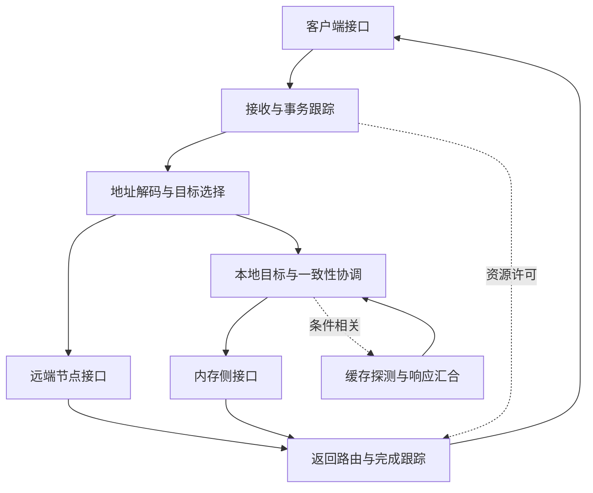

# DF：从客户端数据事务到内存与远端节点的研究方案

版本：v1.0；日期：2026-09-24；依据：[研究范本 v1.2](../chip-study-plan.md)。状态：规划完成，以下五轮详细研究均未开始。下一步执行第 1 轮，先核对目标代际与 BE 数据接口，再建立本地读写闭环。

资料集：[sources.md](../sources.md)，本模块优先 P1、FAB1–FAB3。接续时先读 [README](README.md)、本方案，再看资料简介与实际阅读范围；不要把资料登记当成目标设计已核验。

## 研究对象与上下游

DF 保留 Data Fabric 名称。联合检索 data fabric、coherent interconnect、home/target agent、address decoder、memory interleaving、fabric endpoint；后四类是功能入口，不是 AMD 模块别名。P1 中 SDF 为 Scalable Data Fabric，CS 为 Coherent Slave，CAKE 为 Coherent AMD socKet Extender；这些名字来自 Ryzen 参考，不能直接证明 shaobo/anshi 的结构。Infinity Fabric 覆盖更广的互联技术，不能与某个 DF 实例、SWITCH 或本项目 CF 画等号。

主场景采用已有摘要支持的 SDMA BE 向 DF 发起数据访问，先研究请求方向，再追踪读数据和状态返回。上游还可能有缓存、hub、I/O 等客户端，但端口清单待目标资料确认；下游按本地内存、远端 fabric、I/O 地址范围分支。地址在 DF 入口属于哪种空间、何处完成翻译，必须与 UTCL/HUBS 的接口约定核对，不能默认所有客户端都提交同一种 PA。

研究顺序为“客户端约定 → DF 事务职责 → 所需输运机制 → 内存目标”。DF 后阅读 [SWITCH 方案](../SWITCH/research-plan.md)，表示先理解需求再理解输运，不声称硬件必然串接或包含。CF 则是独立命令支路。

## 功能微架构与请求闭环

下图是研究用功能分解，方框不是已知 RTL 实例；CS、CAKE 的对应关系仅在核实目标资料后填写。

一次本地读：接收端核对地址属性、源标识及返回资源；目标选择确定内存归属；必要的一致性动作先满足数据来源与权限条件；内存侧返回数据和状态；返回端匹配原请求、结束相应生命周期。远端读在目标选择后经远端接口交接，响应仍须匹配原请求。写入则另行定义“接受、数据已交付、可被观察、对上游完成”的不同边界。若目标不接收，压力回到入口；解码失败、poison 或远端故障必须有定义的终结方式，不能只清事务表。

关键资源按职责研究：outstanding 跟踪、返回关联信息、目标队列、探测/响应依赖、远端发送与返回容量。它们可以位于不同物理模块；本阶段不预定条目数、包格式或固定一致性状态机。

## 架构主题与阅读入口

| 位置与优先级 | 关键研究问题 | 资料及阅读目的 |
| --- | --- | --- |
| 入口与目标选择，核心 | 客户端属性如何保留；地址范围、交织/hash、目的节点及返回源如何对应；重映射配置何时生效 | [FAB2：Linux v6.12 df_v3_6.c](https://github.com/torvalds/linux/blob/v6.12/drivers/gpu/drm/amd/amdgpu/df_v3_6.c)，读 `df_v3_6_query_hashes` 与通道查询；只支持所列 GPU 的配置观察 |
| 内存侧地址边界，核心 | 系统地址与控制器 normalized address 怎样区分；hole、base/limit、交织与 GPUVA 翻译为何是不同问题 | [FAB3：AMD ATL core.c](https://github.com/torvalds/linux/blob/v6.12/drivers/ras/amd/atl/core.c)，读 `norm_to_sys_addr`；这是 RAS 软件反解参考，不是 DF 在线流水图 |
| CS 相关协调，条件相关 | 哪些访问进入一致性域；home/序列化点、缓存探测、数据来源与内存接口各由谁负责；atomic 在何处执行 | [P1：GDC 2019](https://gpuopen.com/gdc-presentations/2019/gdc-2019-s2-amd-ryzen-processor-software-optimization.pdf)，打印页 21–23 的本地/远端 refill；[FAB1：CDNA 3 白皮书](https://www.amd.com/content/dam/amd/en/documents/instinct-tech-docs/white-papers/amd-cdna-3-white-paper.pdf)，Memory 部分。只比较职责，不拼接两代微架构 |
| CAKE 相关远端边界，条件相关 | 本地/远端路由如何划分；跨封装与封装内链路是否不同；流控、可靠性和事务重试责任在哪里 | P1 打印页 21–23；FAB1 “Communication and Scaling”；进入链路细节时引用 SWITCH/PHY，不重写 Router 教程 |
| 全路径进展与可观测性，核心 | 何时释放事务/返回资源；何种等待会成环；如何区分链路拥塞与目标服务慢 | [R7：FlooNoC](https://arxiv.org/html/2409.17606v1)，III-A 的端点排序与资源预留作方法参考；FAB2 的 `df_v3_6_pmc_get_count` 等计数器访问作观察入口，事件含义另查匹配代际资料 |

NUMA/分区、虚拟化隔离、原子与复杂一致性按目标场景触发；adaptive routing 等优化是扩展，不能先于基本事务闭环。

## 五轮研究与论文增补

| 轮次 | 范围、问题与前置 | 阅读入口 | 产出及完成条件 |
| --- | --- | --- | --- |
| 1：接口与本地事务 | 先定代际、入口地址空间、请求/返回字段类别；完成一个读与一个写，列出外部模块负责的动作 | 仓库 L1/L2 摘要、P1 打印页 21–23、FAB1 Fig.6；外部原文只在本地授权目录核对 | 在 `DF/technical-paper.md` 建职责图、接口表、请求时序。读者能追到数据与状态的最终归属；缺少协议时用明确的教学合同，不填假字段 |
| 2：地址归属与资源 | 依赖第 1 轮接口；研究地址解码、交织、outstanding、目标队列、返回关联与反压 | FAB2 指定函数、FAB3 `norm_to_sys_addr` | 补充地址分层示例与资源生命周期。能解释相邻地址去哪里、错误地址怎样结束、何时可复用标识；不把 RAS 反解称为 MMU |
| 3：CS 与访问语义 | 依赖目标类型与内存属性；先确定哪些 coherence/atomic/ordering 机制适用，再研究争用、探测和数据来源 | P1 本地/远端 refill；FAB1 Memory；目标一致性协议待查 | 补充职责矩阵和条件路径。能区分缓存一致性、顺序约束、写可见和完成；没有目标证据的协议只作参考，并压缩此轮范围 |
| 4：CAKE 与远端交接 | 依赖第 2–3 轮和 SWITCH 的 NI/D2D 接口结论；研究跨边界请求、响应、错误以及 reset/drain 责任 | P1、FAB1 Communication；[SWITCH 方案](../SWITCH/research-plan.md) 的第 4 轮资料 | 补充本地与远端差异、资源等待图及恢复责任。不能以链路 ACK 代替事务完成；不知道的实际 PHY/协议保持待确认 |
| 5：性能与一致性复审 | 依赖前面适用分支；针对热点内存目标、长 RTT、混合请求选少量能区分瓶颈的场景 | FAB2 perfmon；既有 SWITCH 第 22–23、45 章 | 形成观测点和假设驱动的实验方案，必要时局部模型。能将吞吐/尾延迟限制归因到入口、网络或目标，并回改原图；模型结果不写成芯片实测 |

## 未决问题与本地执行入口

优先补目标 block diagram、客户端/目标端口契约、地址映射与一致性域；其次确认 CS/CAKE 在目标代际是否存在、承担何种职责，以及 DF 与 SWITCH 的真实关系。目标规范不足不阻塞通用研究，但限制可写成目标事实的范围。

本地 Codex 从第 1 轮开始，正文拟维护于 `DF/technical-paper.md`，方案保留在本文件；每轮结束把新结论整合回同一架构并更新状态、资料集及 README 接续入口。当前只建立规划，不新建空论文、不运行占位仿真。深度跨模块复核要等相关模块取得实际研究结论后开展。
