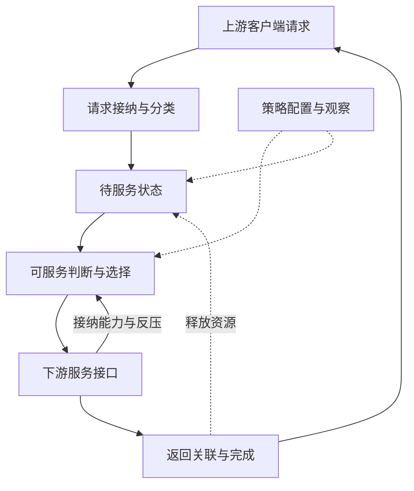

# EA 多轮研究与论文方案

依据范本：v1.4；方案版本：v1.1；日期：2026-09-24。**状态：规划完成，四轮详细研究均待执行。** 下一步选择一个公开参考实例，确认 EA 的输入、输出与完成边界。

接续：[模块上下文](README.md) → 本页 → [资料集 VM6](../sources.md#vm6)、P3、P5 → 原文。资料简介留在资料集；后续创建本目录 `technical-paper.md`，将每轮结果整合到同一架构，并在本页记录完成状态和下一步。

## 逐篇笔记与本方案的研究落点

先查[模块资料索引](sources/README.md)了解每篇讲什么，再读对应详细笔记；笔记内保留原文链接、版本、阅读位置、机制及重要限制。本次仅补资料与修订规划，下面的论文轮次完成状态不变。

| 微架构位置 | 对应轮次 | 可直接复用的技术笔记 | 本次补充的研究重点 |
| --- | --- | --- | --- |
| 请求接入与下游服务 | 第 1 轮 | [P3](../GC/sources/P3-gl2-metrics.md)、[P5](../GC/sources/P5-mi200-counters.md)、[VM6](sources/VM6-gcea-metrics.md)、[C05](../HUBS/sources/C05-mmhub-dagb-ea.md) | GCEA 计数器与 C05 中 EA 结构属于不同来源；先分别画路径，目标映射待核实。 |
| 共享存储、bank/group 与资格 | 第 2 轮 | [C05](../HUBS/sources/C05-mmhub-dagb-ea.md)、[EA1](sources/EA1-rr-arbiter.md)、[MEM12](../UMC/sources/MEM12-ramulator-hbm-controller.md)、[VM5](../UTCL2/sources/VM5-mask-paper.md) | 研究命令/数据配对、list manager、占用与多类 credit；RR 只作为有 ready/lock 语义的对照。 |
| 返回、维护与性能解释 | 第 3–4 轮 | [VM6](sources/VM6-gcea-metrics.md)、[MEM1](../UMC/sources/MEM1-pg276-hbm-controller.md)、[FAB7](../DF/sources/FAB7-amdgpu-fence-lifecycle.md) | 区分接纳/下发/返回、顺序约束及瓶颈位置；不能把 UMC 行命中调度自动归给 EA。 |

## 对象、术语与上下游

EA 沿用 AMD Efficiency Arbiter，既有 MI200 名称入口见 P5。联合检索 efficiency arbiter、memory request arbitration、memory-system interface、QoS、backpressure。公开 gfx115x 文档使用 GCEA（Graphics Core Efficiency Arbiter），是**有代际边界的功能参考**，不能认定本项目 EA 就是同一 GCEA 实例。

研究从已建立的上游访问请求出发。公开参考场景采用 gfx115x 的 GL2 下游请求，[P3 实际可读版本](https://rocm.docs.amd.com/projects/rocprofiler-compute/en/docs-7.14.0/conceptual/rdna/gl2-cache.html)把 GL2 与 GCEA 路径相连。先复用 [GC](../GC/research-plan.md)的 GL2 请求和返回约定，再研究 EA 怎样选择和交接流量。C05 页图另提供 MMHUB 内 EA 的参考结构，包括 shared command/data memory、list manager、bank/group 和 credit；它与 gfx115x GCEA 不是同一来源。目标场景中 hub/其他客户端是否接入 EA，仍列为 [HUBS](../HUBS/research-plan.md)接口待查，不能把全部 MMHUB 流量强制经过 EA。 技术笔记：[P3](../GC/sources/P3-gl2-metrics.md)。

下游以“系统/内存服务接口”表示，后续与 [DF](../DF/research-plan.md)、[UMC](../UMC/research-plan.md)核实连接。公开 gfx115x 指标页将 GCEA、SARB、内存接口和返回指标合在一个性能观察阶段 [VM6]；**指标分组不证明 RTL 包含层次**。请求标为 DRAM 方向也不意味着一定触达 DRAM，可能在系统级 cache 得到服务 [P3]。

## 整体功能微架构与请求闭环

下面是围绕接入、选择、下发和返回建立的**功能研究骨架**。它不是 AMD 已公开的 EA RTL 图。队列形态、仲裁算法、目标分区及事务重排能力均未确认，后续先研究接口需要，再决定需要哪些内部状态。

代表性读闭环：GL2 或确认接入的客户端提交请求 → EA 接收并记录其等待状态 → 在下游允许、顺序约束满足时选择可发请求 → 下游接纳后记录尚未完成的事务 → 读数据/状态返回到正确客户端 → 释放资源并继续接收。写和原子请求是否有不同通道、配对、顺序或完成点，作为条件分支核实，不从读取场景直接推广。

必须同时解释三个时刻：上游把请求交给 EA、EA 把请求交给下游、原请求得到协议规定的完成。这三者之间可能各自阻塞。“仲裁器忙”不等于有效带宽高，出现停顿也不能只归因为仲裁算法；返回拥塞和下游服务不足都应先定位。

## 从架构提出研究问题

| 架构位置 / 优先级 | 研究内容与问题 | 资料直链与阅读位置 |
| --- | --- | --- |
| 上游接入 / 核心 | 请求来自哪些客户端？读写/原子/探测如何分类？是否按目标或服务类别区分资源？ | [P3](https://rocm.docs.amd.com/projects/rocprofiler-compute/en/docs-7.14.0/conceptual/rdna/gl2-cache.html)，GL2 request statistics；仅支持 gfx115x 公开路径  技术笔记：[P3](../GC/sources/P3-gl2-metrics.md)。 |
| 可服务判断 / 核心 | 何时因下游反压、顺序或资源不足不可发？如何避免将不可发请求长期挡在前面？ | [VM6](https://rocm.docs.amd.com/projects/rocprofiler-compute/en/docs-7.14.0/conceptual/rdna/gcea.html)，System arbiter 指标；内部资格判断逻辑待查  技术笔记：[VM6](sources/VM6-gcea-metrics.md)。 |
| 选择与效率 / 核心 | throughput、等待时间、公平性和请求合并之间如何取舍？是否存在明确服务保证？ | [VM6](https://rocm.docs.amd.com/projects/rocprofiler-compute/en/docs-7.14.0/conceptual/rdna/gcea.html)，DRAM read/write、chained requests；指标名称不是算法证明  技术笔记：[VM6](sources/VM6-gcea-metrics.md)。 |
| 返回与在途资源 / 核心 | 如何关联客户端、释放占用并避免重复完成？读写完成是否含可见性承诺？ | [VM6](https://rocm.docs.amd.com/projects/rocprofiler-compute/en/docs-7.14.0/conceptual/rdna/gcea.html)，Return interface；具体协议待核实  技术笔记：[VM6](sources/VM6-gcea-metrics.md)。 |
| 翻译与数据竞争 / 条件 | 若 PTW 和业务数据共享资源，是否需要区分延迟敏感度？谁拥有调度权？ | [VM5](https://rausavar.github.io/pubs/mask-asplos18.pdf)，第 4、5.3 节，只作跨类型干扰对照，不搬入其 DRAM 调度器作为 EA  技术笔记：[VM5](../UTCL2/sources/VM5-mask-paper.md)。 |
| 一致性、复位和错误 / 条件 | 探测是否进入同一实例？异常/复位时有哪些未完成事务需要处置？ | [VM6](https://rocm.docs.amd.com/projects/rocprofiler-compute/en/docs-7.14.0/conceptual/rdna/gcea.html)，Probe Requests 为观察线索，不能据此定义完整一致性协议  技术笔记：[VM6](sources/VM6-gcea-metrics.md)。 |
| 可观测性 / 核心 | 如何区分没请求、不能下发、下游慢、返回阻塞？不同计数器分母能否比较？ | [VM6](https://rocm.docs.amd.com/projects/rocprofiler-compute/en/docs-7.14.0/conceptual/rdna/gcea.html)，SARB busy/stalled/starving、request/return 与归一化说明  技术笔记：[VM6](sources/VM6-gcea-metrics.md)。 |

## 四轮研究安排

### 第一轮：定位 EA 与可工作的请求路径

- **前置与范围：** 上游 GL2/客户端基本接口已能解释；先用 gfx115x 公开路径建立参考，再明确本项目哪些端口尚待证实。
- **阅读：** P3 的 GL2→GCEA 段，VM6 的阶段说明、read/write 与 return interface；P5 只核对 MI200 术语，不混合产品参数。
- **产出：** 论文总图、输入输出约定、一次读与一次写的接收/下发/返回流程，标明下游服务而非预设真实 DRAM 终点。
- **完成条件：** 读者能区分缓存命中、EA 接纳、下游接纳和最终完成；每条目标连接都有证据或待查标记。

### 第二轮：共享存储、竞争、顺序与反压

- **前置与范围：** 第一轮交接成立后，研究多源同时请求、下游暂停、不同目的地可服务性及读写竞争。
- **阅读：** C05 的 EA shared memory、list manager、bank/group 和多类 credit；EA1 的请求/ready/lock 公平仲裁对照；VM6 System arbiter 与 chained request；VM5 仅用于思考共享资源干扰。
- **产出：** 在骨架上补入参考实例的命令/数据配对、共享槽、链表/空闲池、bank/group 及各 credit 的分配/释放；再列选择所需状态、资格条件及资源释放；比较简单公平选择与效率优先的适用条件，所有候选策略都标为教学对照。
- **完成条件：** 能解释一个持续拥塞场景的进展与饥饿风险，明确还需要什么协议才能证明公平性；不把 round-robin、iSLIP 或 DRAM 行命中策略直接认定为 EA 算法。

### 第三轮：复杂请求与完成闭环

- **前置与范围：** 已建立正常并发路径，再核实原子、探测、一致性属性、顺序约束、错误与复位是否适用。
- **阅读：** VM6 Return interface / Probe Requests；对应上游和下游方案已有的完成语义。目标接口资料不足时只列最小责任边界。
- **产出：** 请求类别、阻塞条件、返回状态和释放条件表；扩展一条返回受阻及一条错误退出场景，明确已接收但未完成事务的责任方。
- **完成条件：** 复杂行为与正常路径共享同一接口解释；不能仅凭有 probe 指标推定 EA 是一致性 home 或拥有完整目录。

### 第四轮：性能诊断与论文收敛

- **前置与范围：** 功能和完成条件清晰后，围绕真实场景分析瓶颈，区分工作负载流量、仲裁效率和下游能力。
- **阅读：** VM6 SARB busy/stalled/starving、request/return、带宽的单位与归一化；确认目标芯片是否有对应事件，计数器不可用时保留所需观察量。
- **产出：** 场景—现象—候选瓶颈—所需证据表，完成 EA 与上游/下游接口一致性检查；只有无法用请求序列讲清的争议才安排小型仲裁模型。
- **完成条件：** 每个瓶颈判断说明其他可能原因和需要的观察量；性能优化回到已有资源，不用公开产品带宽数值填补目标参数。

## 优先未知项与下一步

第一轮先核实目标 EA 的名称语境、客户端、实例数量及下游接口；第二轮再核实服务类别、顺序与反压机制；第三轮判断原子、探测及错误恢复的适用性。目标 QoS、算法、队列深度与性能参数均未确认，不能提前固定。

本地 Codex 下一步先读本模块索引中的 P3/VM6 与 C05/EA1 笔记，再创建第一轮论文的边界图和一个请求闭环。无目标框图时可以完成公开参考部分，待查目标映射保持独立；不要把 GCEA 指标页面变成所有 AMD EA 的统一 RTL 规格。

## 2026-09-25 资料补齐对本方案的影响

第 2–3 轮优先复用 [VM5](../UTCL2/sources/VM5-mask-paper.md)、[R8](../SWITCH/sources/R8-axi-ordering-contract.md)。用 MASK 的翻译阻塞权重和 DRAM 预算研究优先级传播，保留工作负载/公平性边界；接口侧 burst、错误完成和 exclusive 例外已补，不能靠仲裁选中等同真正完成。 本次仅更新依据和研究落点，不把任何待执行论文轮次改为完成。

## U24：请求地址到 HBM bank 的跨模块落点

接入轮次：第 1–3 轮。核对已选目标或地址如何进入队列、仲裁和下发；查清内部 bank/group、端口和 HBM 资源之间是否有映射；跟踪多目标反压及返回资源，不能由仲裁器名称推定地址 hash。

按[跨模块专题方案](../HBM/address-interleaving-plan.md)与[单模块聚焦规则](../chip-study-plan.md#文档用途与单模块聚焦)，先研究本模块的输入地址、配置/映射、输出目标与局部地址、子请求范围和返回关联，保存所需外部接口及依赖问题、假设和影响。必要接口疑点立即核实；相关模块的核心基础具备后，再统一完整路径与地址例子。详细稿采用[当前写作方法](../chip-study-plan.md#详细文档写作方法)，可选深入问题不自动成为必做项；本次方案更新不计为完成新研究轮次。
