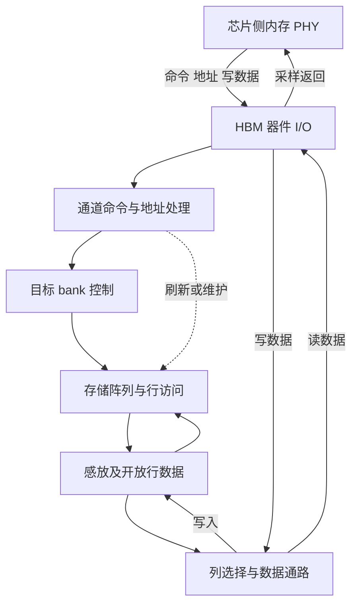

# HBM 微架构研究与论文规划

依据范本 v1.4；方案 v1.2，2026-09-25。当前完成规划与相关资料初读，**论文轮次尚未开始**。下一步执行第 1 轮：选择一个明确代际的公开接口参考，建立逻辑资源图及与 UMC/PHY 的一次读写闭环，并开始 U24 的跨模块地址追踪。

资料集：[模块逐篇索引](sources/README.md)，主线优先 MEM1、MEM12/MEM13、MEM11，接口交接联读 MEM16。接续先读 [UMC 方案](../UMC/research-plan.md) 的命令/维护约定和 [PHY 方案](../PHY/research-plan.md) 的采样/就绪约定，再浏览来源简介。后续在本目录集中维护一份技术稿；按问题补读接口资料并更新版本与阅读范围；厂商数据手册仅在具体器件参数影响问题时查阅。

## 当前范围与运用标准（U23）

以可见接口行为为中心：逻辑层级及共享资源、命令与数据、行冲突、刷新及恢复、错误边界。器件内部只保留解释这些行为所需的内容，厂商数据表降为可选背景。 按 [项目上下文](../project-context.md#hbm-接口研究范围) 的场景/状态/等待条件验收；厂商器件数据表不是必读或阻塞项，轮次完成状态保持不变。

## 逐篇笔记与本方案的研究落点

先查[模块资料索引](sources/README.md)了解每篇讲什么，再读对应详细笔记；笔记内保留原文链接、版本、阅读位置、机制及重要限制。本次仅补资料与修订规划，下面的论文轮次完成状态不变。

| 微架构位置 | 对应轮次 | 可直接复用的技术笔记 | 本次补充的研究重点 |
| --- | --- | --- | --- |
| 接口层级与共享资源 | 第 1 轮 | [MEM1](../UMC/sources/MEM1-pg276-hbm-controller.md)、[MEM13](sources/MEM13-ramulator-hbm3-model.md)、[MEM11](sources/MEM11-jedec-scope-gap.md) | 先明确 channel/PC/bank、访问粒度与共享资源；MEM9/MEM10 仅按需辅助容量与带宽的数量级检查。 |
| 命令、时序和维护 | 第 2–3 轮 | [MEM13](sources/MEM13-ramulator-hbm3-model.md)、[MEM12](../UMC/sources/MEM12-ramulator-hbm-controller.md)、[MEM2](../UMC/sources/MEM2-ramulator2-paper.md)、[MEM11](sources/MEM11-jedec-scope-gap.md) | 用模型理解层级约束，完整 JEDEC 未读时不能以模型命令表声称标准合规。 |
| 保护域与持续性能 | 第 3–4 轮 | [MEM1](../UMC/sources/MEM1-pg276-hbm-controller.md)、[MEM3](../UMC/sources/MEM3-amdgpu-ras.md)、[MEM14](../UMC/sources/MEM14-umc810-ras-address.md)、[MG11](../RSMU/sources/MG11-umc67-ras-comparison.md) | ODECC、parity、UMC ECC、poison 和页面隔离不是同一个保证；采样窗口可能有间隙。 |

## 研究对象、行业入口与最小前置

HBM 是 High Bandwidth Memory，属于 stacked DRAM / 3D-stacked memory；stack/cube、channel、pseudo-channel、bank、row buffer、TSV 是不同层面的研究入口，不是同义词。HBM2、HBM2E、HBM3、HBM3E 等必须注明代际及产品来源，不能将一代参数填入另一代的图。

代表性请求路径为上游 UMC 发命令，经内存 PHY 到 HBM 的通道与存储阵列，再由读路径反向返回；HBM 是这条支路的目标端。它与 UMC 是接口关系，不归为 UMC 内部逻辑；芯片侧 PHY 与 HBM 器件侧 I/O 也须分清。HBM 内部同样按命令接收→资源选择→阵列访问→数据返回展开研究，不把其硬套成 packet router。

UMC 第 1 轮可先从本方案借用最小前置：bank 中开放行决定访问状态，读写列操作依赖相应行准备，切换行及刷新占用时间。HBM 全部研究仍排在内存 PHY 之后。主线选有较完整公开技术说明的 PG276 HBM2 接口实例，后续以实际目标代际替换；不据此宣称 AMD GPU 使用相同器件、控制器数或地址映射。

## 结构骨架与一次读写

下图表示单个相关访问域的**逻辑功能参考视图**，不是 die/TSV 的物理连线。channel、pseudo-channel、bank 的数量及共享资源以所选器件为准；另画物理 stack 图时必须区分封装连接、base/interface die、DRAM dies 与 TSV，不能把逻辑 channel 数等同堆叠层数。

一次读开始时，UMC 已选出符合器件状态/时序要求的命令。若 bank 无所需开放行，先完成必要的 PRE/ACT；行数据经感放建立可访问状态，RD 选择列并按 burst 送出数据，PHY 采样后交回 UMC。访问同 bank 的另一行需要转换行状态，访问不同 bank 也可能共享命令或数据资源，因此“很多 bank”并不自动意味着完全并行。

一次写以同样的行准备为前提，WR 及关联数据通过 I/O/列路径进入选定行，再按器件要求完成写恢复和后续状态转换。HBM 接收到命令不能被当作 GPU 写请求已完成：事务响应/排序由 UMC 和上游协议解释。器件刷新或 self-refresh 改变可访问窗口，UMC 的维护安排与器件实际执行共同闭环；错误检测和上报也要分别核实器件、接口及控制器的责任。

## 子模块与 feature 研究重点

| 位置与优先级 | 要建立的认识与就近资料 |
| --- | --- |
| 逻辑层级，核心；封装细节，背景 | 为什么 stack、channel、pseudo-channel、bank、die 不可互换计数？读 [PG276 Topology](https://docs.amd.com/r/en-US/pg276-axi-hbm/HBM-Topology) 与 [Micron HBM3E FAQ](https://www.micron.com/products/memory/hbm/hbm3e) 的组织条目。物理 die 映射仅在具体问题需要时查目标器件手册，不由容量反推，也不作为当前验收项。  技术笔记：[MEM1](../UMC/sources/MEM1-pg276-hbm-controller.md)、[MEM9](sources/MEM9-micron-hbm3e.md)。 |
| 通道与共享接口，核心 | 哪些命令/数据资源独立，哪些在 pseudo-channel 间共享？访问粒度、burst 与上游请求粒度怎样对应？读 [PG276 Topology](https://docs.amd.com/r/en-US/pg276-axi-hbm/HBM-Topology) 的共享 CAC 与 pseudo-channel 讨论；仅用于该 HBM2 实例。  技术笔记：[MEM1](../UMC/sources/MEM1-pg276-hbm-controller.md)。 |
| bank、开放行及命令，核心 | 从 bank 状态解释 ACT/PRE/RD/WR 的前置，区分行命中、行冲突与 bank 并行。读 [PG276 Address Map](https://docs.amd.com/r/en-US/pg276-axi-hbm/HBM-Address-Map-and-Protocol-Considerations)；[Ramulator II-B](https://arxiv.org/html/2308.11030v2#S2.SS2)作为状态/时序约束的表达方法，非规范。  技术笔记：[MEM1](../UMC/sources/MEM1-pg276-hbm-controller.md)、[MEM2](../UMC/sources/MEM2-ramulator2-paper.md)。 |
| 刷新和内容保持，核心 | 普通刷新、self-refresh、温度条件对可访问资源及恢复等待有何影响？读 [PG276 Refresh/Power](https://docs.amd.com/r/en-US/pg276-axi-hbm/Reorder-Refresh-and-Power-Savings-Options-Tab)，需要精确规则时再核相应代际的 [JEDEC 接口文档](https://www.jedec.org/standards-documents/docs/jesd238)（全文待查）。不把控制器 GUI 选项当器件命令完整定义。  技术笔记：[MEM1](../UMC/sources/MEM1-pg276-hbm-controller.md)、[MEM11](sources/MEM11-jedec-scope-gap.md)。 |
| 接口错误与保护边界，核心；器件内部纠错，可选 | on-die ECC、接口 parity、控制器 ECC 分别保护何处、向外可见什么？先读 [MEM1](../UMC/sources/MEM1-pg276-hbm-controller.md) 的错误接口与 [MEM3](../UMC/sources/MEM3-amdgpu-ras.md) 的软件观测边界。器件内部编码及 repair 按需研究；[MEM10](sources/MEM10-samsung-hbm3.md) 的产品概述仅用于提出核验问题。 |
| 带宽、容量与功耗，核心 | 区分 pin rate、总 I/O 宽度、有效数据量与端到端带宽，解释命令资源、行冲突、刷新和温度引起的限制。读 [PG276 Raw Throughput](https://docs.amd.com/r/en-US/pg276-axi-hbm/Raw-Throughput-Evaluation)（详细计算待第 4 轮读）与 Micron FAQ；厂商峰值不是目标系统实测。  技术笔记：[MEM1](../UMC/sources/MEM1-pg276-hbm-controller.md)。 |
| 新代际与高级可靠性，条件相关/扩展 | 只在目标确实需要时研究 HBM4、repair、ECS、RFM/扰动防护及更复杂封装。先核命令与可见接口，避免由其他 DRAM 标准同名 feature 推断 HBM 必然支持。 |

## 四轮实施方案

HBM 四轮围绕“接口资源—典型访问—维护及错误边界—运用”，以芯片侧能观察和控制的行为为中心。无需另设大量调度轮次，UMC 计划覆盖的调度策略在这里仅引用其对器件流量的影响。

| 轮次与范围 | 前置、阅读位置与关键问题 | 文档产出与完成条件 |
| --- | --- | --- |
| 1：代际、组织与接口地图 | 前置为 UMC/PHY 输入输出约定。读 [PG276 Topology](https://docs.amd.com/r/en-US/pg276-axi-hbm/HBM-Topology)、[Address Map 的物理地址表](https://docs.amd.com/r/en-US/pg276-axi-hbm/HBM-Address-Map-and-Protocol-Considerations) 和 [Micron FAQ](https://www.micron.com/products/memory/hbm/hbm3e)；确认采用哪代参考，核对单位。 | 形成逻辑组织图、接口职责及共享资源表；物理堆叠只需帮助辨别名词的简要背景。验收：channel/PC/bank/die/stack 能分别解释；跨代数字和目标未知参数没有混入同一结构。  技术笔记：[MEM1](../UMC/sources/MEM1-pg276-hbm-controller.md)、[MEM9](sources/MEM9-micron-hbm3e.md)。 |
| 2：bank 工作过程与命令约束 | 前置为第 1 轮组织。读 PG276 Address Map 的开放行及 bank-group 讨论、[Ramulator II-B](https://arxiv.org/html/2308.11030v2#S2.SS2)；先用符号约束解释资源等待，并对照 MEM13/MEM11 已读范围；只有具体参数影响结论时才查匹配的标准或器件表。 | 写出读、写、行冲突和跨 bank 访问的状态/时间线，解释约束对应哪项资源。验收：能区分逻辑命令先后与精确计时参数；无原文的数字继续留空。  技术笔记：[MEM2](../UMC/sources/MEM2-ramulator2-paper.md)。 |
| 3：刷新、低功耗与错误边界 | 前置为第 2 轮正常访问。读 [PG276 Refresh/Power](https://docs.amd.com/r/en-US/pg276-axi-hbm/Reorder-Refresh-and-Power-Savings-Options-Tab)、[Error Protection](https://docs.amd.com/r/en-US/pg276-axi-hbm/Data-Path-Error-Protection) 的相关正文。重点解释 refresh、自刷新、访问恢复与外部可见错误；ODECC 只保留保护边界，内部编码按需扩展。 | 将暂停与恢复加入访问模型，形成器件/PHY/UMC 的保护职责表。验收：说明内容保持和访问恢复条件，不承诺未证实的纠错覆盖；repair 等只按实际资料展开。  技术笔记：[MEM1](../UMC/sources/MEM1-pg276-hbm-controller.md)。 |
| 4：代际差异、资源瓶颈与论文收束 | 前置前三轮及 UMC/PHY 对应章节。读 [PG276 Raw Throughput](https://docs.amd.com/r/en-US/pg276-axi-hbm/Raw-Throughput-Evaluation) 及 MEM12/MEM13 的命令模型，复用 UMC 性能解释；需要数值例子时注明公开参考版本或教学假设。 | 用连续、跨行、随机以及多通道不均衡场景解释有效带宽，建立带条件的代际差异表，回修整体图。验收：每项损失能落在命令、阵列、I/O 或维护资源上；不会只用 pin rate 宣称应用加速比。  技术笔记：[MEM1](../UMC/sources/MEM1-pg276-hbm-controller.md)。 |

## 未决项、来源限制与接续

优先固定参考代际、接口职责和逻辑资源，解释通道共享范围、bank 组织、burst/访问粒度、训练就绪、刷新条件及外部错误；目标实例映射待证据补入。厂商/料号、具体 stack 数及器件内部参数只在问题需要时确认，不作为起步条件。公开 PG276 的 Topology 段有容量单位混写，引用该例时必须与 Address Map 表交叉核对；只有需要器件级结论时再核具体料号，不能机械抄写。

本次已读厂商技术指南的相关正文，**没有读到 JEDEC JESD235/JESD238 全文或具体 HBM 料号完整数据手册**。JEDEC 页面不可访问、Micron Product Brief 获取被拒绝、Samsung 说明详细手册需索取，均已记入资料集。当前先完成典型机制与接口运用；仅在需要精确命令/时序、电气或器件专属 RAS 结论时定向补足一手材料，不将整份数据表获取列为必补任务，不凭产品概述补齐规范。

第 1 轮可先完成明确标注的 HBM2 公开参考，待目标证据到来替换差异。完成本模块后，先检查 UMC/PHY/HBM 三份方案接口用词是否一致；用户 U24 已确定地址 interleave 与完整访存路径为核心专题，按 [专题方案](address-interleaving-plan.md) 在相关轮次持续核对，不再等待全部模块研究后才决定。

## 2026-09-25 资料补齐对本方案的影响

第 1–3 轮优先复用 [MEM1](../UMC/sources/MEM1-pg276-hbm-controller.md)、[MEM13](sources/MEM13-ramulator-hbm3-model.md)、[MEM11](sources/MEM11-jedec-scope-gap.md)。MEM11 已从纯入口推进到 JESD238A 正文转录选读，支持 PC、共享命令与 CK/DQS 的架构分解；相关规范图表仍待问题驱动的核验；具体料号 datasheet 仍未取得，按 U23 降为可选参考。 本次仅更新依据和研究落点，不把任何待执行论文轮次改为完成。

## U24：请求地址到 HBM bank 的跨模块落点

接入轮次：第 1–2 轮及第 4 轮整合。bank 等资源层级与共享范围、地址到 stack/channel/PC/BG/bank/row/column 的映射为核心必做内容。与上游共同维护逐地址追踪例子，解释单笔跨边界请求及不同地址序列造成的行冲突、并行与热点；器件 datasheet 可选不削弱这些机制深度。

执行 [跨模块专题方案](../HBM/address-interleaving-plan.md)，将本模块的输入地址、配置/映射、输出目标与局部地址、子请求范围、返回关联填入同一组例子，结论写回本模块论文。先做资源/路径，再做映射、拆分返回和应用；不等所有模块论文完成，不将本次规划更新计为已完成研究轮次。
