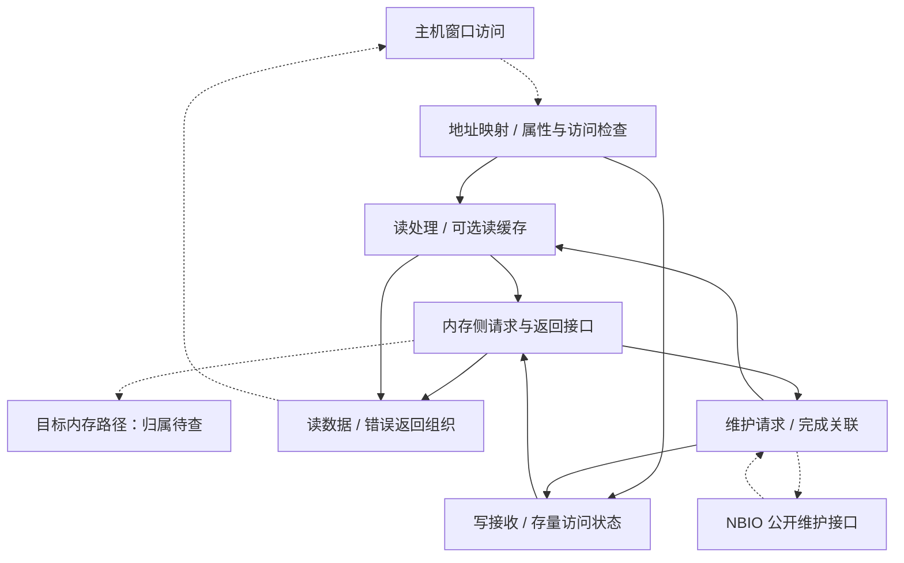

# HDP 多轮技术论文研究方案

方案版本：v1.1；日期：2026-09-24；依据：[研究范本 v1.3](../chip-study-plan.md)。当前完成相关资料初读和规划，**论文研究轮次均未开始**。下一项：执行第 1 轮，先确认目标 HDP 代际及主机窗口的地址语义，再建立可解释读、写和维护事件的整体架构。

接续入口：[模块上下文](README.md) → 本方案 → [资料集 IO6–IO7](../sources.md#io6)，再按问题读 [IO5](../sources.md#io5)、[IO10](../sources.md#io10) 和 [IO2](../sources.md#io2)。后续技术正文在 HDP 目录维护，资料摘要不重复抄入上下文。

## 逐篇笔记与本方案的研究落点

先查[模块资料索引](sources/README.md)了解每篇讲什么，再读对应详细笔记；笔记内保留原文链接、版本、阅读位置、机制及重要限制。本次仅补资料与修订规划，下面的论文轮次完成状态不变。

| 微架构位置 | 对应轮次 | 可直接复用的技术笔记 | 本次补充的研究重点 |
| --- | --- | --- | --- |
| 历史职责与现代接口 | 第 1–2 轮 | [IO7](sources/IO7-bkdg-hdp-history.md)、[IO5](../NBIF/sources/IO5-nbio74-host-bridge.md)、[IO6](sources/IO6-hdp40-maintenance.md) | 旧 UMA APU 只用于命名/窗口概念，不能套用其容量上限。 |
| 维护与可见性闭环 | 第 2–3 轮 | [IO2](sources/IO2-linux-device-io.md)、[IO3](../PCIE/sources/IO3-linux-dma-api.md)、[IO10](../CF/sources/IO10-gfx90-register-control.md)、[SD2](../SDMA/sources/SD2-sdma52-completion-maintenance.md)、[MG1](../SMU/sources/MG1-smu-message-table.md)、[FAB7](../DF/sources/FAB7-amdgpu-fence-lifecycle.md) | CPU copy、HDP flush/invalidate、按请求者匹配的 request/done、ring fence 和 SMU 表传输按实际完成范围连接。 |
| 低功耗、RAS 和代际差异 | 第 3–4 轮 | [IO14](sources/IO14-hdp60-power-sequence.md)、[MEM3](../UMC/sources/MEM3-amdgpu-ras.md)、[IO9](../PCIE/sources/IO9-pci-error-recovery.md) | 读清/写清、VF 分支、时钟 override 与状态保持分别核对，不靠 callback 返回值猜硬件。 |

## 范围与术语

AMD 历史文档使用 **Host Data Path**：Family 15h Models 60h–6Fh BKDG Rev 3.05 第 2.14.2.2 节将 HDP 与 host 对 framebuffer 的地址转换联系起来 [IO7]。本项目保留 HDP 命名，目标全称与覆盖范围仍需核对；联合检索 host aperture、framebuffer aperture、host data path cache、HDP flush、read-cache invalidate。这些词有的是职责或子功能，不代表整个模块相互等价。

HDP 不是 PCIe 协议的别名，也不能自动当作全 GPU 的一致性控制器、GL2 数据缓存或 UTCL2 地址翻译缓存。[Linux v6.12 `hdp_v4_0.c`](https://github.com/torvalds/linux/blob/v6.12/drivers/gpu/drm/amd/amdgpu/hdp_v4_0.c) 给出 flush/invalidate、non-surface base、RAS 和电源管理入口；这支持对应研究主题，不揭示完整 RTL。旧 APU 手册与新驱动分别保留适用范围，不拼成一颗真实芯片。 技术笔记：[IO6](sources/IO6-hdp40-maintenance.md)。

研究次序承接 [PCIe](../PCIE/research-plan.md) 的请求类型和 [NBIF](../NBIF/research-plan.md) 的窗口/控制契约；再面向内存侧。目标下游是哪个 hub、fabric 或控制器，尚不能固定为 HDP → MMHUB → DF → UMC 的串行链。

## 上下游契约与功能架构

| 边界 | 本轮规划必须交代的内容 |
| --- | --- |
| 主机访问入口 | 哪类地址窗口命中 HDP，地址偏移怎样对应设备内存，长度与字节使能如何保留；NBIF/PCIe 之间的实际适配位置待查 |
| 内存侧 | 读写请求的地址域、属性和完成语义；返回数据、拒绝/错误及反压；不能默认与 GPUVA 请求走同一翻译链 |
| 缓存维护侧 | 谁触发 flush/invalidate，覆盖哪些已接收访问，完成由哪个状态证明，和后续访问怎样排序 |
| 管理侧 | 初始化基址、功能使能、VF 可访问范围、低功耗和 RAS 的 owner；寄存器配置关系与硬件包含分别记录 |

下图是依据公开功能组织的**参考微架构骨架**。读缓存只用于有相关维护机制的版本；“写接收与存量状态”表示需要研究的职责，不预设一定存在独立写缓存。具体上下游连接用虚线标为待核实。

主要数据闭环选 CPU 读 framebuffer：主机窗口请求经地址映射进入 HDP 的读处理，具备缓存的版本要区分可服务的命中与向内存侧取数；得到有效数据或失败结果后返回原访问，随后由上游承担适用的 PCIe Completion。写路径则接收地址/有效字节和数据，向内存侧推进；posted 事务没有对应读返回，因此需要单独定义接收、排出和消费者可见的观察点。

维护闭环有公开程序证据：[IO10 `gfx_v9_0_ring_emit_hdp_flush`](https://github.com/torvalds/linux/blob/v6.12/drivers/gpu/drm/amd/amdgpu/gfx_v9_0.c) 使用 NBIO 提供的 request/done 地址和引擎 mask 构造等待。它证明一个公开版本具备请求/等待协作；**不能单凭等待完成，声称 CPU 缓存、GL2、HDP、内存控制器和 DRAM 已全部排空。** 需追查该维护操作的范围与返回条件；另外，`hdp_v4_0_flush_hdp` 的寄存器写入路径没有在此函数内显式轮询，不能把“函数返回”直接解释为同一种硬件完成。 技术笔记：[IO10](../CF/sources/IO10-gfx90-register-control.md)。

## 按架构位置研究子模块与 feature

| 架构位置/优先级 | 研究问题与约束 | 资料直链及定位 |
| --- | --- | --- |
| 窗口与地址映射，核心 | host aperture、GPU framebuffer 地址与 nonsurface base 的关系；窗口大小与总 VRAM 为什么要分别理解？ | [IO7 原厂 BKDG](https://www.amd.com/content/dam/amd/en/documents/archived-tech-docs/programmer-references/50742_15h_Models_60h-6Fh_BKDG.pdf) §2.14.2.2，历史角色；[IO6](https://github.com/torvalds/linux/blob/v6.12/drivers/gpu/drm/amd/amdgpu/hdp_v4_0.c) `hdp_v4_0_init_registers`，公开基址设置  技术笔记：[IO7](sources/IO7-bkdg-hdp-history.md)、[IO6](sources/IO6-hdp40-maintenance.md)。 |
| 读写处理与资源，核心 | 读缓存何时有效、冲突怎么处理？写请求保留哪些状态？跨接口宽度、局部写和反压影响哪些资源？ | [IO6](https://github.com/torvalds/linux/blob/v6.12/drivers/gpu/drm/amd/amdgpu/hdp_v4_0.c) `invalidate_hdp`、`init_registers`；队列、命中策略和地址转换细节须目标资料，不从寄存器名猜完整实现  技术笔记：[IO6](sources/IO6-hdp40-maintenance.md)。 |
| 维护与可见性，核心 | flush 与 read-cache invalidate 的对象、触发方、完成条件、先后依赖各是什么？ | [IO6](https://github.com/torvalds/linux/blob/v6.12/drivers/gpu/drm/amd/amdgpu/hdp_v4_0.c) 两种维护回调；[IO5](https://github.com/torvalds/linux/blob/v6.12/drivers/gpu/drm/amd/amdgpu/nbio_v7_4.c) remap/REQ/DONE；[IO10](https://github.com/torvalds/linux/blob/v6.12/drivers/gpu/drm/amd/amdgpu/gfx_v9_0.c) 等待调用  技术笔记：[IO6](sources/IO6-hdp40-maintenance.md)、[IO5](../NBIF/sources/IO5-nbio74-host-bridge.md)、[IO10](../CF/sources/IO10-gfx90-register-control.md)。 |
| 软件发布与消费，核心 | CPU 写队列后 GPU 消费、GPU 写结果后 CPU 读取，各自需要哪些域的顺序/维护？ | [IO2](https://docs.kernel.org/6.12/driver-api/device-io.html) `ioremap_wc`、posted write/readback；具体芯片的必要操作与顺序留到维护轮核验  技术笔记：[IO2](sources/IO2-linux-device-io.md)。 |
| 代际、隔离与恢复，条件相关 | invalidate no-op 是否意味着硬件自动维护、缓存取消或其他机制？PF/VF 初始化为何不同？SRAM 错误后哪些数据不能再信任？ | [IO6](https://github.com/torvalds/linux/blob/v6.12/drivers/gpu/drm/amd/amdgpu/hdp_v4_0.c) IP_VERSION 分支、VF 早退、RAS 和 clock gating；no-op 原因仍待查  技术笔记：[IO6](sources/IO6-hdp40-maintenance.md)。 |

## 四轮研究与写作

| 轮次 | 架构范围与前置基础 | 阅读入口、文档产出与完成条件 |
| --- | --- | --- |
| 1. 主机窗口到内存的基本架构 | 明确 HDP 范围与地址域，建立读写闭环；前置为 PCIe posted/completion 区别、NBIF 窗口接口摘要 | 读 [IO7](https://www.amd.com/content/dam/amd/en/documents/archived-tech-docs/programmer-references/50742_15h_Models_60h-6Fh_BKDG.pdf) §2.14.2.2、[IO6](https://github.com/torvalds/linux/blob/v6.12/drivers/gpu/drm/amd/amdgpu/hdp_v4_0.c) `init_registers`。产出地址表、骨架图与读写两例；验收为历史参考和目标实现各自清楚，访问没有越过未解释接口  技术笔记：[IO7](sources/IO7-bkdg-hdp-history.md)、[IO6](sources/IO6-hdp40-maintenance.md)。 |
| 2. 缓存、缓冲与并发数据流 | 沿地址接收、读写服务、下游等待、返回研究；前置为第 1 轮地址与端口契约 | 读 [IO6](https://github.com/torvalds/linux/blob/v6.12/drivers/gpu/drm/amd/amdgpu/hdp_v4_0.c) read-cache、watermark、power 分支并补目标资料；复用 [IO2](https://docs.kernel.org/6.12/driver-api/device-io.html) WC 语义。产出资源/状态职责图、同址读写与下游拥塞案例；验收为可见性和资源释放点明确，未知队列深度不虚构  技术笔记：[IO6](sources/IO6-hdp40-maintenance.md)、[IO2](sources/IO2-linux-device-io.md)。 |
| 3. 维护命令及生产者/消费者可见性 | 数据路径与 flush/invalidate 控制闭环结合；前置为存量访问、读缓存和完成观察点 | 读 [IO6 维护函数](https://github.com/torvalds/linux/blob/v6.12/drivers/gpu/drm/amd/amdgpu/hdp_v4_0.c)、[IO5 remap/REQ/DONE](https://github.com/torvalds/linux/blob/v6.12/drivers/gpu/drm/amd/amdgpu/nbio_v7_4.c)、[IO10 等待函数](https://github.com/torvalds/linux/blob/v6.12/drivers/gpu/drm/amd/amdgpu/gfx_v9_0.c)。产出 CPU→GPU 与 GPU→CPU 两个带前提的交接例子；验收为 flush、invalidate、TLB 维护、MMIO readback、软件 fence 不互相替代，每个“完成”注明覆盖域  技术笔记：[IO6](sources/IO6-hdp40-maintenance.md)、[IO5](../NBIF/sources/IO5-nbio74-host-bridge.md)、[IO10](../CF/sources/IO10-gfx90-register-control.md)。 |
| 4. 代际差异、异常与性能收敛 | 把缓存缺席/自动维护候选、VF 权限、RAS、时钟/复位纳入同一架构；前置为第 3 轮维护范围 | 读 [IO6](https://github.com/torvalds/linux/blob/v6.12/drivers/gpu/drm/amd/amdgpu/hdp_v4_0.c) 各 IP_VERSION、RAS、VF、clock gating 分支。产出适用条件表、暂停恢复时序和瓶颈解释；验收为 read-cache invalidate 的 no-op 原因有证据或仍标未知，不能从软件省略推断全系统一致性  技术笔记：[IO6](sources/IO6-hdp40-maintenance.md)。 |

## 未决问题与下游移交

最先核实目标 HDP 接入位置、地址转换范围和实际内存侧接口；其次是读缓存是否存在、哪些 host/peer 访问经过它，以及 flush completion 的精确定义。源码里某版本设置 `HDP_MMHUB_CNTL` 仅证明对应配置关联，不能据此确认所有 HDP 都直接接 MMHUB。Resizable BAR、peer DMA 或 coherent host 接口只在目标支持后作为条件专题，避免把 host aperture 一概写成 PCIe 或把整个可见 VRAM 都当成缓存容量。

移交内存侧研究的内容是请求地址域、读写属性、反压和维护完成契约；UMC/HBM 的调度、训练和存储细节不在 HDP 重讲。后续 Codex 每轮先读资料集摘要及版本限制，维护一份不断充实的正文；没有直接资料的结构可保留教学参考，并明确待确认，不能通过补画方框把它升级为目标事实。
