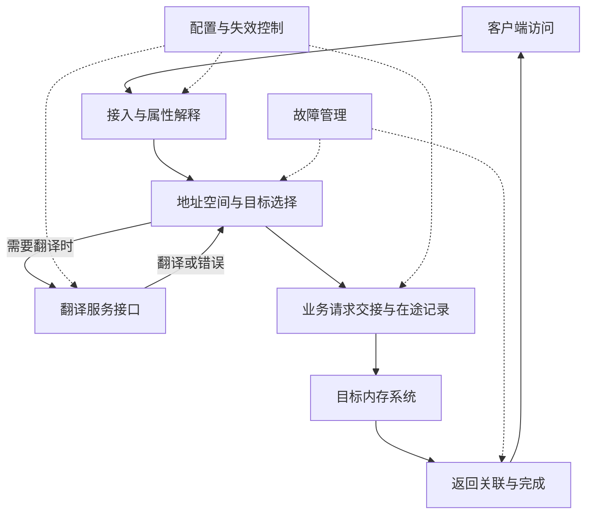

# HUBS（MMHUB / CH）多轮研究与论文方案

依据范本：v1.3；方案版本：v1.1；日期：2026-09-24。**状态：规划完成，五轮详细研究均待执行。** 下一步核实客户端和地址接口，建立 MMHUB 的基本访问闭环。

接续：[模块上下文](README.md) → 本页 → [资料集](../sources.md#vm1)的 P2、VM1–VM3 → 原文。资料集保存内容简介和真实阅读范围；本页保存任务与进度。后续在本目录创建 `technical-paper.md`，MMHUB 与 CH 分节维护，不创建子模块目录；逐篇资料保存在 `sources/`。C05 转换正文仍缺失；本次已读仓库现有页图，未访问或恢复本地原件，结构与版本边界见 C05 笔记。

## 逐篇笔记与本方案的研究落点

先查[模块资料索引](sources/README.md)了解每篇讲什么，再读对应详细笔记；笔记内保留原文链接、版本、阅读位置、机制及重要限制。本次仅补资料与修订规划，下面的论文轮次完成状态不变。

| 微架构位置 | 对应轮次 | 可直接复用的技术笔记 | 本次补充的研究重点 |
| --- | --- | --- | --- |
| Hub 集成及翻译服务边界 | 第 1–2 轮 | [P2](../GC/sources/P2-amdgpu-hardware.md)、[C03](../UTCL2/sources/C03-utcl2-topology.md)、[C05](sources/C05-mmhub-dagb-ea.md)、[VM2](sources/VM2-mmhub-v2.md)、[VM12](sources/VM12-gfxhub-v2.md) | 用 MMHUB/GFXHUB 版本差异核对 aperture、client 与翻译服务；CH 继续待定位。 |
| 数据/地址交接与共享资源 | 第 2–3 轮 | [C05](sources/C05-mmhub-dagb-ea.md)、[EA1](../EA/sources/EA1-rr-arbiter.md)、[VM6](../EA/sources/VM6-gcea-metrics.md)、[IO3](../PCIE/sources/IO3-linux-dma-api.md) | DAGB、地址 TLB/数据 FIFO、scoreboard、EA 共享存储及 bank-group 需放回同一工作流。 |
| 失效、故障和通知 | 第 3–5 轮 | [VM3](../UTCL2/sources/VM3-gpuvm-invalidation.md)、[VM10](../UTCL2/sources/VM10-iommu-spec.md)、[IO11](../PCIE/sources/IO11-ats-pri-pasid.md)、[MG6](../IH/sources/MG6-ih60-ring-hardware.md) | 核对 GPUVM/ATC 分支、VM 类型标签差异和 fault 出口，不把不同来源编码合并。 |

## 范围与先后关系

HUBS 是用户指定的学习分组，不能画成已经确认的 RTL 父实例。MMHUB 联合检索 memory hub、GPU memory interface、VM hub；GMC 在驱动中是管理组织，也不能直接等同本模块。**CH 保留原缩写**，不自动展开为 Compression Hub、Coherent Hub 或 GCHUB。既有摘要仅提到 `compression_mode` 属性，远不足以确定其完整职责 [L3]。

上游采用仓库已有 shaobo TBE 写回涉及 MMHUB 的场景 [L2]，只复用 [SDMA 外部入口](../SDMA/README.md)已有接口认识，不复制 FE/BE/TBE 规格。公开客户端映射作为另一个参考场景：[P2](https://docs.kernel.org/gpu/amdgpu/driver-core.html#gpu-hardware-structure)明确 hub 接入随架构变化，因此不把公开 Navi 路由覆盖到 shaobo。下游先以“目标内存系统接口”占位，再由 [DF](../DF/research-plan.md)、[EA](../EA/research-plan.md)等方案核实实际交接，不预设它们全部串联。

研究顺序先理解 [UTCL1](../UTCL1/research-plan.md)和 [UTCL2](../UTCL2/research-plan.md)的服务契约，再看 hub 如何与翻译服务、业务访问和配置管理协作。这是知识依赖，不证明公共 UTCL2 位于 MMHUB 内。HUBS 方案优先解释集成与责任交接，翻译算法引用 UTCL2，存储调度引用对应下游。

## 整体功能微架构

图为 **MMHUB 研究骨架**。公开软件接口支持研究上下文、地址窗口与 fault 管理；内部缓冲、仲裁层次及旁路归属仍需目标证据。CH 暂不接入图中，待知道职责与接口后再决定其研究位置，不能画一条没有证据的连接。

代表性闭环选择一个写回请求：客户端提交地址、写数据及适用的访问属性 → hub 根据接口模式解释上下文和地址 → 如需翻译，调用服务并处理权限/故障 → 业务请求被下游接收，保留完成所需信息 → 返回成功或错误，释放资源并恢复上游流量。另用读请求补充数据返回路径。写请求“已接收”“已返回”及“对指定观察者可见”可能不同，具体语义要从协议确认。

另一条控制闭环是上下文配置/失效：管理方配置窗口或页表上下文 → 确立配置可用的条件 → 处理已有翻译及业务在途访问 → 返回完成。是否需要停止接收、等待哪些事务以及恢复顺序均是研究问题；不能从驱动函数顺序直接还原 RTL 时序。

## 架构主题与资料

| 架构位置 / 优先级 | 研究问题 | 资料直链与阅读用途 |
| --- | --- | --- |
| 客户端接入 / 核心 | 每类客户端送入 VA 还是已翻译地址？实例与接入随代际如何变化？ | [P2](https://docs.kernel.org/gpu/amdgpu/driver-core.html#gpu-hardware-structure)，GMC、hub 连接说明；[VM2](https://github.com/torvalds/linux/blob/v6.12/drivers/gpu/drm/amd/amdgpu/mmhub_v2_0.c)，client ID 表，仅代表列出的 IP 版本  技术笔记：[VM2](sources/VM2-mmhub-v2.md)。 |
| 地址窗口与上下文 / 核心 | GPUVM、aperture、system/local memory 如何选路，哪些属性影响权限和后续服务？ | [VM1](https://github.com/torvalds/linux/blob/v6.12/drivers/gpu/drm/amd/amdgpu/amdgpu_vm.c)，GPUVM；[VM2](https://github.com/torvalds/linux/blob/v6.12/drivers/gpu/drm/amd/amdgpu/mmhub_v2_0.c)，`init_gart_aperture_regs` / `init_system_aperture_regs`  技术笔记：[VM1](../UTCL2/sources/VM1-gpuvm-address-spaces.md)、[VM2](sources/VM2-mmhub-v2.md)。 |
| 翻译集成 / 核心 | 哪些逻辑在 hub 内，哪些为外部服务？UTCL2、PTW 与 ATC 是否都存在？ | [VM2](https://github.com/torvalds/linux/blob/v6.12/drivers/gpu/drm/amd/amdgpu/mmhub_v2_0.c)，TLB/cache 初始化与 2.1.x ATCL2 相关注释，防止跨版本拼图  技术笔记：[VM2](sources/VM2-mmhub-v2.md)。 |
| 业务交接与返回 / 核心 | 地址、访问属性、顺序和响应标识由谁保持？下游背压和错误怎么返回？ | [P2](https://docs.kernel.org/gpu/amdgpu/driver-core.html#gpu-hardware-structure)提供外部边界；具体目标协议待查，不据公共框图确定队列 |
| 失效、fault、恢复 / 核心 | 哪个 hub 收到失效？哪个客户端报错？如何避免复位/门控期间丢失完成？ | [VM2](https://github.com/torvalds/linux/blob/v6.12/drivers/gpu/drm/amd/amdgpu/mmhub_v2_0.c)，fault 解码；[VM3](https://github.com/torvalds/linux/blob/v6.12/drivers/gpu/drm/amd/amdgpu/gmc_v9_0.c)，`flush_gpu_tlb`  技术笔记：[VM2](sources/VM2-mmhub-v2.md)、[VM3](../UTCL2/sources/VM3-gpuvm-invalidation.md)。 |
| CH 与压缩属性 / 条件 | CH 是处理、传递还是消费属性？是否改变数据布局、长度或元数据路径？ | [既有 CH 边界](README.md)，仅有 L3 摘要；目标模块说明与接口资料待查，没有足够证据时不展开算法 |
| 性能与集成 / 条件 | 区分翻译等待、业务下游拥塞、返回阻塞和控制停顿 | [VM2](https://github.com/torvalds/linux/blob/v6.12/drivers/gpu/drm/amd/amdgpu/mmhub_v2_0.c)，读写请求/返回及翻译门控名称只作观察入口，不推断精确实现  技术笔记：[VM2](sources/VM2-mmhub-v2.md)。 |

## 五轮研究安排

### 第一轮：hub 边界与基本访问

- **前置与范围：** 已有客户端请求契约；选定一种明确的访问，梳理输入地址类型、目标选择、输出请求、返回路径。
- **阅读：** P2 的 GMC/hub 段；VM1 GPUVM；VM2 client ID 表和 aperture 配置函数。
- **产出：** 论文范围、MMHUB 总图、客户端到内存系统的读写闭环，以及“已知/公开参考/待查”接口表。
- **完成条件：** 能说明一次访问由谁接收、翻译、下发和完成；CH 未知不妨碍 MMHUB 主线，也不被虚构为必经路径。

### 第二轮：地址、翻译与属性交接

- **前置与范围：** 第一轮边界和 UTCL2 服务基础完成；研究 aperture、GPUVM 上下文、权限、memory type/访问属性在何处产生或改变。
- **阅读：** VM2 `setup_vm_pt_regs`、`init_tlb_regs`、`init_cache_regs`、`setup_vmid_config`；引用 UTCL2 对应章节，不重复写通用页表教程。
- **产出：** 按场景记录地址变化与属性责任，补翻译成功/失败分支；明确系统 IOMMU 只在适用配置出现。
- **完成条件：** 每一属性的使用者可定位；没有证据时不定义 NC/CC/UC 的目标行为，不把翻译 cache 命名当成数据缓存证据。

### 第三轮：在途访问、反压与完成语义

- **前置与范围：** 已明白地址与属性，再解释并发读写、下游接纳、返回配对、顺序约束及需要保留的资源。
- **阅读：** 第一轮接口证据与 VM2 读写/返回门控相关函数名称，结合下游已完成的接口契约；内部仲裁策略资料仍待查。
- **产出：** 业务请求生命周期、不同等待位置、返回拥塞和错误回收示例，区分接收确认与架构可见的完成。
- **完成条件：** 正向请求与反向返回共同闭环；不因功能骨架需要缓冲，就臆造固定深度、虚通道或 round-robin 算法。

### 第四轮：失效、fault 与管理协作

- **前置与范围：** 了解在途资源后，研究指定 hub/VMID 的失效、故障归因、复位与门控的协作边界。
- **阅读：** VM2 `get_invalidate_req`、`print_l2_protection_fault_status`、`set_fault_enable_default`；VM3 `flush_gpu_tlb` 的 semaphore/request/ACK 路径。
- **产出：** 控制事件与数据请求的交叉时序，列明错误报告、retry 条件、失效完成和恢复所需前提；与 [IH](../IH/research-plan.md)、[SMU](../SMU/research-plan.md)只交代接口。
- **完成条件：** 能把“哪次访问出错”“哪个状态应失效”“哪次控制已完成”分开解释，保留软件 workaround 的版本边界。

### 第五轮：CH 定位、条件机制与整体收敛

- **前置与范围：** MMHUB 主路径已经稳定。先核实 CH 职责与位置；若没有资料，本轮只完成未知边界和 MMHUB 收敛，CH 深入任务保持未执行。
- **阅读：** 模块上下文的 CH 记录；后续取得的目标框图/接口中与 `compression_mode` 直接相关的说明。没有资料时不代用其他厂商压缩器定义 CH。
- **产出：** 有证据时加入 CH 功能位置、输入输出和适用 feature；否则保留一个待查入口。复核全篇的地址、控制、返回与性能解释。
- **完成条件：** MMHUB 论文形成一致整体；CH 的未执行范围清楚可接续，不能把“已识别资料缺口”记为“CH 技术研究完成”。

## 关键未知项与下一步

优先补目标 hub 顶层、客户端与地址模式、UTCL2/PTW/ATC 归属、下游接口和写完成定义。CH 首先需要全称或功能说明与端口，随后才能决定研究轮次；不因用户分组而推定父子或串接关系。

本地 Codex 从第一轮开始，在本目录论文中落实一个有边界的 MMHUB 请求闭环。对目前未读的本地资料，在文件实际可用的本地环境按既有只读约定核对，原件继续不上传；新增可引用结论依项目证据规则维护，不恢复缺失正文。本次已读现有页图，具体结构、原始标签冲突和阅读范围见 C05/C03 笔记；不能将参考图自动认定为目标结构。
