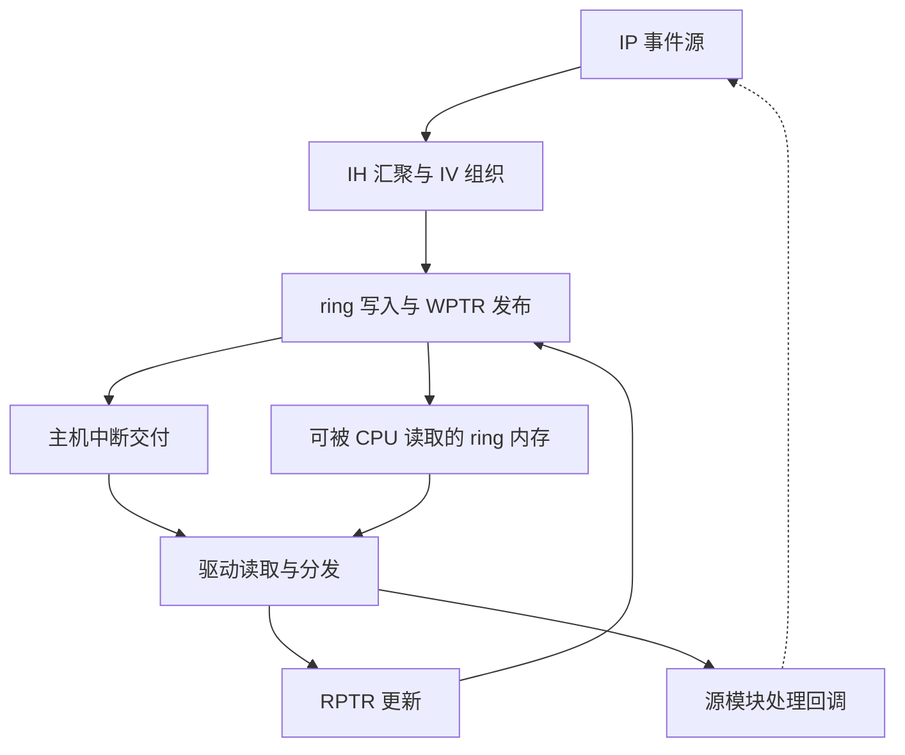

# IH 多轮微架构研究方案

范本：v1.2；方案：v1.0；日期：2026-09-24。状态：规划完成，四轮详细研究待执行。下一项：选择一类事件源，完成从事件产生到驱动分发的第 1 轮结构说明。

## 术语、范围与资料

AMD IH 为 Interrupt Handler；联合检索 interrupt aggregation、interrupt vector ring、event delivery、MSI/MSI-X。IH 硬件、CPU 上执行的 IRQ handler 和源模块的处理回调是不同主体，ring 中的 IV 也不同于 PCIe MSI 向量。最终章节保留 IH 命名，不把所有中断控制器等同 AMD IH。

采用 [P2](../sources.md) 的职责说明以及 Linux v6.12 [MG6–MG8](../sources.md#mg6) 的 IH v6.0、公共 ring 和 IRQ 分发实现。源模块内部的事件判断、恢复和业务完成留在对应模块；IH 研究事件携带的信息、汇聚存储、主机通知和消费闭环。多 ring、PASID/VMID、self interrupt、VF 等功能按已选 IP 版本确认，不能把 v6.0 配置推广至全部 AMD GPU。

## 上下游与公开功能骨架

研究顺序沿“事件源 → IH → 存储和通知 → CPU IRQ handler → 源模块回调”推进。图是软件可观察行为形成的功能骨架；事件入口的 RTL 仲裁/队列尚需硬件资料，不预设优先级与深度。

典型闭环：源 IP 产生带身份的事件 → IH 将 IV 写入 ring 并发布写指针 → 主机收到中断 → 驱动取得 WPTR、按可见性要求读取 IV → 按 client/src 等信息分发 → 推进 RPTR 告知消费位置。源模块若需清除事件或 ACK，另由其处理流程完成；RPTR 前移不等于源设备状态已清除。

主机通知与 ring 数据访问是两种接口，不能假定每一个 IV 都对应独立 CPU 中断。事件发生、入 ring、CPU 分发、业务恢复也是不同完成点。读取场景中要核对 IV 数据、指针写回和 IRQ 可观察的顺序；下游消费不及时可能导致积压或溢出，硬件是否可对源反压须查具体环节，不能默认中断绝不丢失。

## 子模块和 feature 研究位置

| 架构位置 / 优先级 | 研究问题与直达材料 |
| --- | --- |
| 事件入口与身份；核心 | client_id、src_id、ring_id、VMID/PASID/node 各辨认什么；[amdgpu_ih.c](https://github.com/torvalds/linux/blob/v6.12/drivers/gpu/drm/amd/amdgpu/amdgpu_ih.c) 的 decode_iv_helper；字段出现不证明源端完成了隔离 |
| ring 存储与指针；核心 | ring 基址、寻址、DMA 分配、WPTR shadow/writeback、RPTR/doorbell 如何形成生产消费契约；[amdgpu_ih.c](https://github.com/torvalds/linux/blob/v6.12/drivers/gpu/drm/amd/amdgpu/amdgpu_ih.c) 的 ring_init、process；[ih_v6_0.c](https://github.com/torvalds/linux/blob/v6.12/drivers/gpu/drm/amd/amdgpu/ih_v6_0.c) 的 enable_ring、get_wptr、set_rptr |
| 主机通知与分发；核心 | MSI/MSI-X/INTx 配置选择、IRQ handler、源回调和可睡眠工作怎样分工；[amdgpu_irq.c](https://github.com/torvalds/linux/blob/v6.12/drivers/gpu/drm/amd/amdgpu/amdgpu_irq.c) 的 irq_init、irq_handler、irq_dispatch；只用该版本说明接口 |
| 溢出与连续事件；核心 | WPTR overflow 如何检测/清除，恢复 RPTR 的策略会丢掉哪些记录；[ih_v6_0.c](https://github.com/torvalds/linux/blob/v6.12/drivers/gpu/drm/amd/amdgpu/ih_v6_0.c) 的 get_wptr。恢复继续消费不保证恢复被覆盖的 IV |
| 多 ring/VF/复位；条件相关 | self interrupt 更新第二 ring 的 WPTR、work 调度、rearm、初始化/停机的顺序；同文件 self_irq、irq_rearm、irq_init/irq_disable，配合 MG8 work handlers |
| 源端反馈；条件相关 | SMU 事件的 ACK/re-enable 与 IH RPTR 分离；[smu_v13_0.c](https://github.com/torvalds/linux/blob/v6.12/drivers/gpu/drm/amd/pm/swsmu/smu13/smu_v13_0.c) 的 irq_process [MG2]，仅为另一个公开源端例子，不断言与所选 IH 实例同片集成 |

## 四轮研究方案

入口压力的代表场景采用连续 page-fault 事件：首先界定源模块何时产生一次事件，再分别研究 ring 增长与主机通知频率。[ih_v6_0.c](https://github.com/torvalds/linux/blob/v6.12/drivers/gpu/drm/amd/amdgpu/ih_v6_0.c) 的 irq_init 配置了相关 storm/flood 控制，并有条件地重定向某类事件到 ring1。后续应解释这些配置改变的是记录、通知还是处理节奏，不把降低 CPU 中断次数直接解释成丢弃同等数量的错误事件。

该场景同时检验共享资源的边界：高频源是否影响其他源的等待，软件批量消费能否赶上写入，第二 ring 的 self interrupt 是否足以保证继续处理，以及复位期间尚未消费的事件由谁处置。现有代码足以提出这些问题，确切仲裁优先级、源端队列和硬件丢弃规则仍需匹配 IP 版本的资料，不能由寄存器名字补写。

| 轮次 | 架构范围、核心问题及前置 | 阅读入口 | 文档产出与完成条件 |
| --- | --- | --- | --- |
| 1：事件入口到源回调 | 选定 IP 版本和一个事件类型，定义事件产生、IV、主机 IRQ、回调的职责；前置是源模块何时报告、报告哪些身份 | P2；[MG7](https://github.com/torvalds/linux/blob/v6.12/drivers/gpu/drm/amd/amdgpu/amdgpu_ih.c) decode_iv_helper；[MG8](https://github.com/torvalds/linux/blob/v6.12/drivers/gpu/drm/amd/amdgpu/amdgpu_irq.c) dispatch | 整体图、事件字段用途表、一次交付时序；能跟踪事件到正确回调，不混淆 IV、MSI 向量与源状态 ACK |
| 2：ring/DMA/指针可见性 | 从入口扩展到 ring producer/consumer、内存位置、回绕及发布顺序；前置为所选 ring 的配置和 CPU 可访问条件 | MG7 ring_init、process；[MG6](https://github.com/torvalds/linux/blob/v6.12/drivers/gpu/drm/amd/amdgpu/ih_v6_0.c) enable_ring、get_wptr、set_rptr | 内存与指针关系图、发布/消费顺序、回绕例子；能解释为何读取 WPTR 后还要保证数据可见，避免把 pointer 单位或地址空间混淆 |
| 3：汇聚压力与异常交付 | 前置是单 ring 正常消费闭环；研究消费积压、overflow、重复触发、无新数据 IRQ、未注册源，按证据再纳入多 ring/self interrupt | MG6 overflow 分支、self_irq；MG8 handler/work/dispatch；入口仲裁硬件资料待查 | 异常路径、积压来源与观测量、丢失边界；区分可继续处理和已丢记录，软件 loop 行为不冒充入口 RTL 仲裁 |
| 4：生命周期和源端恢复 | 前置为可用通知/内存路径及源端 ACK 约定；研究 enable/disable、复位、VF 条件分支、恢复后旧事件如何处理 | MG6 irq_init/irq_disable、irq_rearm；MG8 init/fini；MG2 源端 ACK 例子 | 生命周期顺序图、源端/IH/驱动恢复职责；说明何时可解除屏蔽和复用 ring，未核实的 VF 路由/隔离列为待决 |

## 接续与待决

目标 IH 版本、事件源配置、ring 所在内存、入口流控与硬件交付顺序仍需目标证据；公开驱动可用于确定观测接口，不能据此填出入口 FIFO 深度或所有源的丢失保证。性能研究关注事件率、消费延迟、积压与通知频率，只有需要解决明确问题时才安排模型，不在规划阶段编写仿真。

本地 Codex 阅读 [README](README.md) → 本方案 → [资料集 MG6–MG8](../sources.md#mg6)，按第 1 轮把已选源的报告规则接进图中。论文和实际进度在本目录接续，资料简介与阅读定位仍在 sources.md；SMU 等其他源复用既有 IH 主线，只补充源语义差异。
