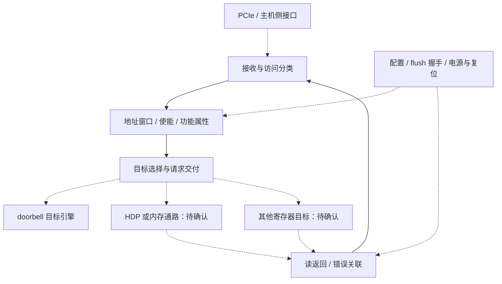

# NBIF 多轮技术论文研究方案

方案版本：v1.1；日期：2026-09-24；依据：[研究范本 v1.3](../chip-study-plan.md)。当前完成公开资料初读与规划，**尚未执行论文研究轮次**。下一项：第 1 轮核对目标 NBIF 的命名、端口与地址资源，再把公开 NBIO 软件接口映射为有证据的职责图。

接续入口：[模块上下文](README.md) → 本方案 → [资料集 IO5](../sources.md#io5)，复用 [IO2](../sources.md#io2)、[IO3](../sources.md#io3)、[IO6](../sources.md#io6)、[IO10](../sources.md#io10)。后续正文留在 NBIF 目录，资料摘要与笔记由本模块 sources/README.md 接入，全局编号保留在总集。

## 逐篇笔记与本方案的研究落点

先查[模块资料索引](sources/README.md)了解每篇讲什么，再读对应详细笔记；笔记内保留原文链接、版本、阅读位置、机制及重要限制。本次仅补资料与修订规划，下面的论文轮次完成状态不变。

| 微架构位置 | 对应轮次 | 可直接复用的技术笔记 | 本次补充的研究重点 |
| --- | --- | --- | --- |
| 窗口、目标和实例 | 第 1–2 轮 | [IO5](sources/IO5-nbio74-host-bridge.md)、[IO13](sources/IO13-nbio79-partition-doorbell.md)、[IO3](../PCIE/sources/IO3-linux-dma-api.md) | NBIO 是功能参照；framebuffer、doorbell、self-ring 与实例/AID 映射分开。 |
| 主机交付与维护连接 | 第 2–3 轮 | [IO1](../PCIE/sources/IO1-pg213-transactions.md)、[IO2](../HDP/sources/IO2-linux-device-io.md)、[IO6](../HDP/sources/IO6-hdp40-maintenance.md)、[IO14](../HDP/sources/IO14-hdp60-power-sequence.md) | HDP remap 的寄存器位置不证明 HDP 数据存储归属，posted write 不等于目标完成。 |
| 事件、分区与异常 | 第 3–4 轮 | [MG6](../IH/sources/MG6-ih60-ring-hardware.md)、[IO8](../IH/sources/IO8-linux-msi.md)、[IO9](../PCIE/sources/IO9-pci-error-recovery.md)、[IO12](../PCIE/sources/IO12-aer-error-path.md) | ring 地址/权限、replay 指标、故障隔离与恢复分别找证据。 |

## 范围与名称辨析

最终名称保持用户给出的 **NBIF**，不在证据不足时强行展开。联合检索 NBIO、BIF、northbridge interface、PCIe inbound/outbound bridge、doorbell aperture。它们分别是公开软件/硬件命名、历史系统类别或功能类比，不能全当别名；主机 host bridge 的系统地址转换与 GPU 内部接口也不能自动合并。

[Linux v6.12 `nbio_v7_4.c`](https://github.com/torvalds/linux/blob/v6.12/drivers/gpu/drm/amd/amdgpu/nbio_v7_4.c) 同时出现 `NBIO`、NBIF 中断源与 `NBIF_MGCG` 寄存器，足以支持联合检索；它未说明 shaobo/anshi 的 NBIF 等于整个 NBIO。文件按产品/IP 分支，不能把所有回调支持项累加成目标硬件功能全集。 技术笔记：[IO5](sources/IO5-nbio74-host-bridge.md)。

学习顺序从 [PCIe](../PCIE/research-plan.md) 的事务与地址契约进入本模块，再交给 [HDP](../HDP/research-plan.md) 深化主机内存访问。这里的顺序是知识依赖；PCIe、NBIF、HDP 的串行、旁路、嵌套及跨 die 关系仍待目标框图。

## 输入输出与功能骨架

代表场景选 CPU 更新队列后写 doorbell。另一条场景为主机访问 framebuffer aperture；两者共享什么入口、在哪里分流是核心问题。设备主动 DMA 是反向支路，先明确外部接口，不把 SDMA FE/BE/TBE 的细节复制进本仓库。

| 边界 | 要求明确的契约 | 当前证据状态 |
| --- | --- | --- |
| 主机/PCIe 侧 | 地址、请求类型、写数据、字节使能、发起功能与属性；读响应、错误、反压 | 通用 PCIe 基础可复用，目标 NBIF 端口格式待查 |
| 片内资源侧 | framebuffer 访问使能、doorbell 目标范围、普通寄存器访问的交接 | IO5 有配置回调；数据路径和每类资源的 owner 待查 |
| HDP 维护侧 | 发起 flush、request/done 关联与 register remap | IO5、IO10 支持公开版本的控制协作；不证明数据必经 HDP |
| IH/管理侧 | 错误事件、访问隔离、低功耗与恢复前提 | IO5 有 IH/RAS/ASPM 配置；控制关系不等于包含 |

以下为**待映射的功能研究图**。虚线表示外部交接候选，实线表示解释这类接口所需的功能依赖，不声明目标 RTL 具备这些独立子块。

正常 doorbell 闭环按职责走读：软件先使能窗口并配置某引擎的范围；生产者发布队列内容后写 doorbell；主机访问入口识别它并交付对应消费者；消费者依据自己的协议读取新任务并产生工作完成事件。**doorbell 写为 posted 访问时，协议层无需返回对应 Completion；队列工作完成也不等于 doorbell 被接收。** NBIF 对这个流程的实际承担范围待核实，不能凭窗口配置函数声称它保存队列、调度 VF 或执行任务。消费者取任务走哪条内存通路，在对应模块研究。

需要追踪的状态包括窗口使能、目标范围、功能隔离配置，以及进行中的读/维护请求和可能存在的缓冲资源。规划不预设缓冲深度或虚拟通道数量；研究者必须说明资源满时反压何处、读返回由谁持有 ID，以及停机/复位时哪些旧请求不得误匹配新请求。

性能分析围绕入口到交付的实际瓶颈：小额 doorbell 与批量主机数据是否竞争，读返回是否被写流压住，低功耗唤醒是否放大延迟。只有目标资料支持共享关系后才讨论仲裁策略，不能从软件函数同属一文件推定共享队列。

## 架构位置与研究主题

| 位置/优先级 | 研究问题 | 直接材料与定位 |
| --- | --- | --- |
| 地址与资源入口，核心 | framebuffer aperture、doorbell、MMIO remap 各映射什么地址？使能关闭如何影响新访问？ | [IO5 `nbio_v7_4.c`](https://github.com/torvalds/linux/blob/v6.12/drivers/gpu/drm/amd/amdgpu/nbio_v7_4.c)：`mc_access_enable`、`enable_doorbell_aperture`、`set_reg_remap`；均加 `nbio_v7_4_` 前缀  技术笔记：[IO5](sources/IO5-nbio74-host-bridge.md)。 |
| 目标交付，核心 | 引擎范围如何选择，doorbell index 与队列身份、VMID/VFID 有何区别？ | [IO5](https://github.com/torvalds/linux/blob/v6.12/drivers/gpu/drm/amd/amdgpu/nbio_v7_4.c)：`sdma_doorbell_range`、`ih_doorbell_range`；这些是编程入口，不能单独证明完整隔离机制  技术笔记：[IO5](sources/IO5-nbio74-host-bridge.md)。 |
| 流控与可见性，核心 | posted 写接收、缓冲释放、CPU 发布与消费顺序由谁保证？窗口关闭是否需等待存量访问？ | [IO2](https://docs.kernel.org/6.12/driver-api/device-io.html)：posted write 与 WC；目标 admission/drain 规范待查  技术笔记：[IO2](../HDP/sources/IO2-linux-device-io.md)。 |
| HDP 维护协作，核心 | remap 地址为何存在？flush 请求与完成匹配谁，是否占用数据通路资源？ | [IO5](https://github.com/torvalds/linux/blob/v6.12/drivers/gpu/drm/amd/amdgpu/nbio_v7_4.c)：`remap_hdp_registers`、`get_hdp_flush_req_offset`/`get_hdp_flush_done_offset`；[IO10 `gfx_v9_0_ring_emit_hdp_flush`](https://github.com/torvalds/linux/blob/v6.12/drivers/gpu/drm/amd/amdgpu/gfx_v9_0.c)  技术笔记：[IO5](sources/IO5-nbio74-host-bridge.md)、[IO10](../CF/sources/IO10-gfx90-register-control.md)。 |
| 保护、RAS 与低功耗，条件相关 | PF/VF 能访问哪些窗口？NBIF 错误如何与 IH/恢复协作？ASPM 进入条件与片内排空怎样关联？ | [IO5](https://github.com/torvalds/linux/blob/v6.12/drivers/gpu/drm/amd/amdgpu/nbio_v7_4.c)：`set_reg_remap`、`handle_ras_controller_intr_no_bifring`、`program_aspm`；有明确产品条件才展开  技术笔记：[IO5](sources/IO5-nbio74-host-bridge.md)。 |

## 四轮研究与写作

| 轮次 | 范围与前置问题 | 阅读入口、产出与完成条件 |
| --- | --- | --- |
| 1. 角色、窗口与请求闭环 | 复用 PCIe 第 1–2 轮的地址/请求契约；确认 NBIF 是否为目标独立 IP、其哪些职责可由 NBIO 资料参照 | 读 [IO5](https://github.com/torvalds/linux/blob/v6.12/drivers/gpu/drm/amd/amdgpu/nbio_v7_4.c)上述入口回调，配合 [IO3 地址空间](https://docs.kernel.org/6.12/core-api/dma-api-howto.html)。产出名称映射、功能图和 doorbell/主机读两例；验收为每条确定连接有证据，未知 owner 不隐藏  技术笔记：[IO5](sources/IO5-nbio74-host-bridge.md)、[IO3](../PCIE/sources/IO3-linux-dma-api.md)。 |
| 2. 请求交付、资源与返回 | 沿入口到目标分析解码、属性保留、读关联、反压；前置为窗口及目标边界 | 读 [IO5 doorbell 回调](https://github.com/torvalds/linux/blob/v6.12/drivers/gpu/drm/amd/amdgpu/nbio_v7_4.c)和 [IO2](https://docs.kernel.org/6.12/driver-api/device-io.html)，补目标接口资料。产出请求生命周期和并发竞争示例；验收为 posted 与读分别解释完成语义，拒绝/关闭窗口时不会留下无归属事务  技术笔记：[IO5](sources/IO5-nbio74-host-bridge.md)、[IO2](../HDP/sources/IO2-linux-device-io.md)。 |
| 3. 维护握手与隔离 | 将 HDP flush/remap、PF/VF 条件及生产者发布接回数据路径；前置为第 2 轮存量请求边界和 HDP 方案摘要 | 读 [IO10](https://github.com/torvalds/linux/blob/v6.12/drivers/gpu/drm/amd/amdgpu/gfx_v9_0.c)指定函数、[IO5](https://github.com/torvalds/linux/blob/v6.12/drivers/gpu/drm/amd/amdgpu/nbio_v7_4.c) remap/REQ/DONE 与 VF 分支。产出控制握手时序、维护完成范围和隔离问题表；验收为控制寄存器位置不被误当数据路径归属  技术笔记：[IO10](../CF/sources/IO10-gfx90-register-control.md)、[IO5](sources/IO5-nbio74-host-bridge.md)。 |
| 4. 低功耗、故障与整体收敛 | 主机接口暂停、错误上报和重新使能；前置为访问/维护如何终止及可恢复状态 | 读 [IO5](https://github.com/torvalds/linux/blob/v6.12/drivers/gpu/drm/amd/amdgpu/nbio_v7_4.c) RAS/ASPM、[IO9](https://docs.kernel.org/6.12/PCI/pci-error-recovery.html) §7.1。产出正常、拥塞、复位恢复走读和资源瓶颈分析；验收为不能恢复的操作有明确失败出口，所有图保留代际限制  技术笔记：[IO5](sources/IO5-nbio74-host-bridge.md)、[IO9](../PCIE/sources/IO9-pci-error-recovery.md)。 |

## 待确认与移交

首要缺口是目标 NBIF 的正式名称和顶层端口，尤其 NBIF 与 NBIO 的覆盖关系、主机内存请求是否经过 HDP、内部互联如何连接。其次是路由后的身份保留、VF 隔离检查位置、缓冲及排空条件。IOMMU/ATS 不因包含“northbridge”就归入本模块；先证实目标功能和接口，再引用 UTCL2/主机翻译研究。

本阶段无需复刻任一驱动的寄存器全表；驱动足以提出问题，却不能单独恢复完整微架构。将来目标资料改动归属时，保留通用 PCIe 契约与有效公开例子，只修改受影响连线和轮次。每轮先浏览资料集已读范围，再把新结论写回整体图；下一模块 HDP 直接复用窗口与维护接口说明。
