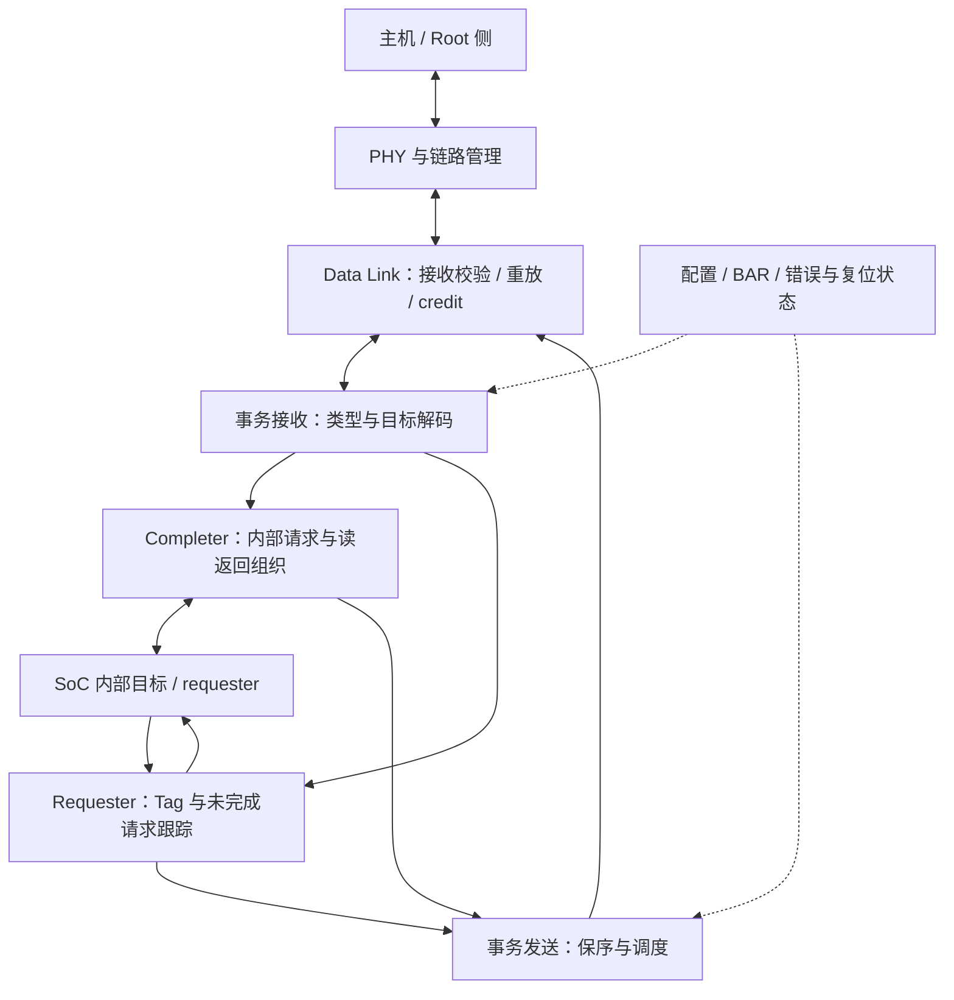

# PCIe 多轮技术论文研究方案

方案版本：v1.1；日期：2026-09-24；依据：[研究范本 v1.4](../chip-study-plan.md)。当前完成资料初读与规划，**论文研究轮次均未开始**。下一项：执行第 1 轮，建立主机 BAR 访问和设备 DMA 两条端到端路径，确认目标端口角色与协议代际。

接续入口：[模块上下文](README.md) → 本方案 → [资料集 IO1–IO4、IO8–IO9](../sources.md#io1)。后续在本目录维护一份技术正文，各轮整合回同一整体架构；论文文件建立后在本方案登记链接。

## 逐篇笔记与本方案的研究落点

先查[模块资料索引](sources/README.md)了解每篇讲什么，再读对应详细笔记；笔记内保留原文链接、版本、阅读位置、机制及重要限制。本次仅补资料与修订规划，下面的论文轮次完成状态不变。

| 微架构位置 | 对应轮次 | 可直接复用的技术笔记 | 本次补充的研究重点 |
| --- | --- | --- | --- |
| BAR/DMA 与请求完成 | 第 1–2 轮 | [IO1](sources/IO1-pg213-transactions.md)、[IO2](../HDP/sources/IO2-linux-device-io.md)、[IO3](sources/IO3-linux-dma-api.md)、[IO4](sources/IO4-base-spec-gap.md) | 区分地址域、descriptor/payload/byte enable、Split Completion 与在途身份。 |
| 有限资源、保序与翻译扩展 | 第 3–4 轮 | [IO1](sources/IO1-pg213-transactions.md)、[IO11](sources/IO11-ats-pri-pasid.md)、[IO5](../NBIF/sources/IO5-nbio74-host-bridge.md)、[IO13](../NBIF/sources/IO13-nbio79-partition-doorbell.md) | CQ NP credit 与链路 credit 分池；ATS/PRI/PASID 的能力、额度和 PF/VF 共享分别核对。 |
| 通知、链路和恢复 | 第 4–5 轮 | [IO8](../IH/sources/IO8-linux-msi.md)、[IO9](sources/IO9-pci-error-recovery.md)、[IO12](sources/IO12-aer-error-path.md)、[MEM6](../PHY/sources/MEM6-pcie-equalization.md)、[MEM7](../PHY/sources/MEM7-versal-cdr-equalizer.md) | MSI 排序、AER 严重性、早期 MMIO 与正常 DMA 恢复有不同完成条件。 |

## 范围、术语与上下游

保留 PCIe/PCI Express 名称。Endpoint、Root Port、Root Complex、host bridge 是角色或系统组件；transaction layer、data link layer、PHY 是协议分层，不自动等于目标 RTL 分块。AMD GPU 的 PCIe 接口、NBIF、HDP 分别建模，不把它们看成同义词，也不与本仓库 NoC/D2D SWITCH 混同。

学习以主机发起请求的方向安排为 PCIe → NBIF → HDP，但后两者的实际连接及哪些访问绕过 HDP 待确认。设备 DMA 时 requester 位于 GPU 侧，请求方向反转；CPU BAR/MMIO 访问不会因使用同一链路就成为 DMA。地址空间基础先读 [Linux 6.12 DMA guide：CPU and DMA addresses](https://docs.kernel.org/6.12/core-api/dma-api-howto.html) [IO3]。 技术笔记：[IO3](sources/IO3-linux-dma-api.md)。

| 场景 | 上游输入 | 本模块交付的下游结果与闭环 |
| --- | --- | --- |
| CPU 读设备 BAR | root 侧 Memory Read，地址、长度、Requester ID/Tag | 设备内部读取；Completion/data 返回原 requester，处理拆分和错误状态 |
| CPU 写 BAR/doorbell | posted Memory Write，地址、字节使能和数据 | 向内部目标交付；不期待每笔写的 Completion，另查生产者发布与消费者可见性的保证 |
| GPU DMA 访问主存 | 内部 requester 的读写及地址属性 | 形成外发事务；读数据完成后返回原客户端，写入后的通知需满足适用顺序规则 |

## 整体功能微架构

下图为传统 non-FLIT 端点的功能参考骨架，不是目标 GPU RTL。协议代际未明，Gen6+ FLIT/FEC 如适用再分支研究；PG213 的 AXI-stream 接口仅作为具体公开例子。

主闭环选一次 CPU 读：先枚举并配置 BAR；接收 TLP 后确认目标与请求属性，交给内部目标，保留返回关联；内部返回后组织一个或多个 Completion，发送端受资源与顺序约束调度；root 收齐数据或报告失败。读返回可能逆着请求方向流动；接收缓冲、未完成请求记录和发送资源的释放点须分别解释。第二例用 posted 写说明“链路接受、内部落地、消费者可见、软件操作完成”并非同一个事件。

骨架中的关键资源分别服务不同承诺：接收空间承诺能接住哪类事务；未完成请求状态记录尚缺多少返回及其归属；发送侧保存仍受流控或顺序约束的数据；重放相关状态服务于链路恢复。后续必须把这些资源的分配、等待、释放挂在同一事务流程上，不把它们画成一个笼统 FIFO。数据链路的成功确认也不能替代目标执行完成，精确重放规则待取得适用规范后核验。

扩展机制围绕它改变的架构位置安排：若目标支持更大的请求并发，检查 Tag 和返回空间；若支持多功能，检查身份、资源隔离与复位范围；若协议代际改变传输组织，再调整链路分层。无需为尚未证实存在的能力预先写一套完整实现。

## 从骨架派生的研究重点

| 架构位置与优先级 | 必须解决的问题 | 就近资料与阅读目的 |
| --- | --- | --- |
| 配置与入口，核心 | BAR 是地址窗口还是存储本体？寄存器、VRAM aperture、doorbell 如何区分？ | [IO2：device I/O](https://docs.kernel.org/6.12/driver-api/device-io.html)，Accessing the device 与 mapping modes；[IO3](https://docs.kernel.org/6.12/core-api/dma-api-howto.html)，地址图  技术笔记：[IO2](../HDP/sources/IO2-linux-device-io.md)、[IO3](sources/IO3-linux-dma-api.md)。 |
| Completer，核心 | posted/non-posted/completion 分类；读拆分、字节使能与错误如何关联原请求？ | [IO1：Memory Read](https://docs.amd.com/r/en-US/pg213-pcie4-ultrascale-plus/Completer-Memory-Read-Operation) 与 [Memory Write](https://docs.amd.com/r/en-US/pg213-pcie4-ultrascale-plus/Completer-Memory-Write-Operation)；正文已读，接口名仅属示例  技术笔记：[IO1](sources/IO1-pg213-transactions.md)。 |
| Requester，核心 | Tag 分配、completion 收集、timeout 与回收；DMA 请求地址和主机 CPU 地址怎样关联？ | [IO3](https://docs.kernel.org/6.12/core-api/dma-api-howto.html)；IO1 的 Tag Management 正文仍待取，结合 [IO4 规范入口](https://pcisig.com/PCIExpress/Specs/Base/_5.0_1.0)核验  技术笔记：[IO3](sources/IO3-linux-dma-api.md)、[IO4](sources/IO4-base-spec-gap.md)。 |
| 缓冲、流控与保序，核心 | 区分链路信用与内部接收许可；NP 阻塞时哪些事务仍须前进？跨请求流如何防止死锁？ | [IO1：Selective Flow Control](https://docs.amd.com/r/en-US/pg213-pcie4-ultrascale-plus/Selective-Flow-Control-for-Non-Posted-Requests) 与 [Maintaining Transaction Order](https://docs.amd.com/r/en-US/pg213-pcie4-ultrascale-plus/Maintaining-Transaction-Order)；区分示例实现与标准义务  技术笔记：[IO1](sources/IO1-pg213-transactions.md)。 |
| 返回、通知与恢复，核心 | Completion、MSI、软件 fence 各证明了什么？链路重放和软件恢复由谁处理？ | [IO8：MSI 第 4.2–4.3 节](https://docs.kernel.org/6.12/PCI/msi-howto.html)、[IO9：Error Recovery 第 7.1 节](https://docs.kernel.org/6.12/PCI/pci-error-recovery.html)  技术笔记：[IO8](../IH/sources/IO8-linux-msi.md)、[IO9](sources/IO9-pci-error-recovery.md)。 |
| 虚拟化与翻译，条件相关 | PF/VF、ATS/PASID/PRI、ACS/P2P 在目标中是否存在，功能边界如何交给 UTCL2/IOMMU 专题？ | [IO4](https://pcisig.com/PCIExpress/Specs/Base/_5.0_1.0) 为候选入口；目标能力表与相关扩展规范待查，不提前宣称支持  技术笔记：[IO4](sources/IO4-base-spec-gap.md)。 |

## 五轮研究与写作

| 轮次 | 架构范围、核心问题与前置基础 | 阅读入口与具体定位 | 文档产出及完成条件 |
| --- | --- | --- | --- |
| 1. 端点角色与最小闭环 | 从 CPU BAR 访问走到内部目标，反向补 GPU DMA；前置为目标角色/代际调查，缺失时明确参考范围 | [IO2](https://docs.kernel.org/6.12/driver-api/device-io.html) mapping modes；[IO3](https://docs.kernel.org/6.12/core-api/dma-api-howto.html) CPU and DMA addresses；[IO1](https://docs.amd.com/r/en-US/pg213-pcie4-ultrascale-plus/Completer-Request-Interface-Operation) | 角色/地址表、整体图、读写两例；每一跳的请求与返回对象明确，不能把 BAR、GPUVA、DMA 地址合成同一地址  技术笔记：[IO2](../HDP/sources/IO2-linux-device-io.md)、[IO3](sources/IO3-linux-dma-api.md)、[IO1](sources/IO1-pg213-transactions.md)。 |
| 2. 事务引擎与关联状态 | 沿接收、内部交付、返回、发送深化；前置为第 1 轮端口契约 | [IO1 读处理](https://docs.amd.com/r/en-US/pg213-pcie4-ultrascale-plus/Completer-Memory-Read-Operation)及写处理；从 [IO4](https://pcisig.com/PCIExpress/Specs/Base/_5.0_1.0)取合法目标版规范核验 Tag、Completion 状态、MPS/MRRS/RCB | 请求分类与生命周期图；解释拆分读如何收齐、失败如何结束，posted 写不凭空生成返回包；未取得规范的精确规则保留待核验  技术笔记：[IO1](sources/IO1-pg213-transactions.md)、[IO4](sources/IO4-base-spec-gap.md)。 |
| 3. 有限资源与顺序 | 接收空间、发送竞争、Tag/返回空间；前置为事务生命周期和资源释放点 | [IO1 NP 反压](https://docs.amd.com/r/en-US/pg213-pcie4-ultrascale-plus/Selective-Flow-Control-for-Non-Posted-Requests)、[发送顺序](https://docs.amd.com/r/en-US/pg213-pcie4-ultrascale-plus/Maintaining-Transaction-Order)，配合目标版规范 | 资源依赖图及阻塞案例；区分内部 ready/credit、链路信用、重放状态，能解释允许绕行与禁止超越的理由，不照搬示例容量  技术笔记：[IO1](sources/IO1-pg213-transactions.md)。 |
| 4. 软件可见性与隔离边界 | BAR 写、doorbell、DMA、通知与翻译/虚拟化边界；前置为第 3 轮顺序语义以及 NBIF/HDP 接口摘要 | [IO2](https://docs.kernel.org/6.12/driver-api/device-io.html) posted/readback/WC；[IO8](https://docs.kernel.org/6.12/PCI/msi-howto.html) §4.2–4.3；复用 NBIF/HDP 方案 | CPU 发布数据→通知设备、GPU 写结果→通知 CPU 两条有前提的时序；明确 fence、readback、HDP flush、TLB invalidate 的对象；ATS 等仅在证实支持后展开  技术笔记：[IO2](../HDP/sources/IO2-linux-device-io.md)、[IO8](../IH/sources/IO8-linux-msi.md)。 |
| 5. 恢复与性能整合 | link/事务/软件三个错误层次、复位后的状态恢复；前置为可见性与隔离边界 | [IO9](https://docs.kernel.org/6.12/PCI/pci-error-recovery.html) §7.1；[IO1](https://docs.amd.com/r/en-US/pg213-pcie4-ultrascale-plus/Selective-Flow-Control-for-Non-Posted-Requests)资源讨论；目标 LTSSM/AER 资料待补 | 正常、资源受限、错误恢复三类走读；用负载大小、并发、往返延迟解释瓶颈，检查所有图与接口一致。仅确有未决定量问题才另做模型  技术笔记：[IO9](sources/IO9-pci-error-recovery.md)、[IO1](sources/IO1-pg213-transactions.md)。 |

## 待决事项与接续条件

优先确认目标 PCIe 代际、Endpoint/Root 角色、dGPU/APU 场景，以及 NBIF/HDP 的硬件交接。PG213 不能用于宣称目标采用相同 CQ/CC/RQ/RC 或所有现代扩展。Tag、completion timeout、ordering 例外和错误状态的精确规范仍需合法全文；这里已安排研究入口，不把未读项当结论。

本模块方案交给下游的基础是事务类型、地址语义、posted 写与 completion 的差异。NBIF 方案据此研究片内交付，HDP 再研究实际主机数据通路及维护；不要求先完成整个 PCIe PHY 电气细节。每轮更新资料集的实际阅读范围与本页进度，完成规划不计为完成论文轮次。

## 2026-09-25 资料补齐对本方案的影响

第 2–4 轮优先复用 [IO4](sources/IO4-base-spec-gap.md)、[VM10](../UTCL2/sources/VM10-iommu-spec.md)。Base 5.0 官方下载本次要求会员登录，保留规范待补；AMD IOMMU 的 PRI/PPR 完成和溢出规则已补，可联读 IO11，但不能替 PCIe Base 的线协议规则。 本次仅更新依据和研究落点，不把任何待执行论文轮次改为完成。
