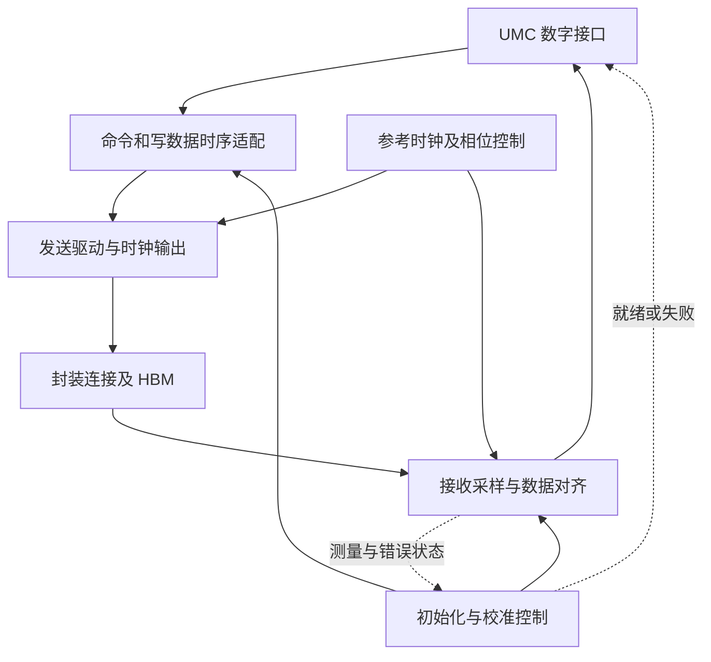

# PHY 微架构研究与论文规划

依据范本 v1.4；方案 v1.2，2026-09-25。当前完成规划与相关章节初读，**论文轮次尚未开始**。下一步执行第 1 轮：先确定内存 PHY 的两侧接口与训练所有权，接续 UMC 的读写场景。

资料集：[MEM1、MEM4–MEM8](../sources.md#mem4)。先读本方案及 [UMC 方案](../UMC/research-plan.md) 的接口约定，再读资料简介；按内存主线回到原文，PCIe/D2D 分支在对应协议基础具备后展开。所有实例仍保留在本目录一份技术稿中，不预建子目录。

## 当前范围与运用标准（U23）

HBM 主线重点解释命令/写数据对齐、读采样与有效期、初始化/训练就绪、停流与恢复。电气机制保留必要解释，料号级 AC/DC 数值与封装预算按需展开。 按 [项目上下文](../project-context.md#hbm-接口研究范围) 的场景/状态/等待条件验收；厂商器件数据表不是必读或阻塞项，轮次完成状态保持不变。

## 逐篇笔记与本方案的研究落点

先查[模块资料索引](sources/README.md)了解每篇讲什么，再读对应详细笔记；笔记内保留原文链接、版本、阅读位置、机制及重要限制。本次仅补资料与修订规划，下面的论文轮次完成状态不变。

| 微架构位置 | 对应轮次 | 可直接复用的技术笔记 | 本次补充的研究重点 |
| --- | --- | --- | --- |
| 内存接口、时钟与校准 | 第 1–3 轮 | [MEM1](../UMC/sources/MEM1-pg276-hbm-controller.md)、[MEM4](sources/MEM4-dfi-version-boundary.md)、[MEM5](sources/MEM5-ug586-phy.md)、[MEM15](sources/MEM15-pg150-dqs-gate.md) | 先数字/电气边界，再训练观测和配置；UG586 所读是 LPDDR2，PG150 是另一个实例。 |
| 串行采样和协议训练 | 第 4 轮 PCIe 分支 | [MEM6](sources/MEM6-pcie-equalization.md)、[MEM7](sources/MEM7-versal-cdr-equalizer.md) | CDR、均衡、眼图测量位置与协议阶段完成分开，done 必须带当前状态语境。 |
| D2D 与性能裕量 | 第 4–5 轮 | [R14](sources/R14-ucie-electrical-training.md)、[MEM8](sources/MEM8-ucie-official-qa.md)、[R10](../SWITCH/sources/R10-ucie-protocol-adapter.md)、[MEM11](../HBM/sources/MEM11-jedec-scope-gap.md) | lane/sideband 与协议重试分层；器件电气表未取得时不填写数值裕量或宣称合规。 |

## 范围、命名与上下游

PHY（physical layer / physical interface）是功能类别，目标 SoC 可能有多个不同实例。HBM PHY、PCIe PHY、D2D PHY 不是可互换别名，也不代表它们存在于同一个硬件父模块。

| 项目研究对象 | 行业入口与前置 | 应保留的边界 |
| --- | --- | --- |
| 内存 PHY，当前主线 | memory PHY、MC-PHY interface、training/calibration、source-synchronous I/O；上游 UMC 命令/数据，下游 HBM 电气接口 | DFI 是控制器与 PHY 间接口标准，不是外部 DRAM 协议；训练序列必须匹配 HBM 代际。 |
| PCIe PHY，后续分支 | PIPE、PCS/PMA、SerDes、CDR、equalization；先读 [PCIe 方案](../PCIE/research-plan.md) 的链路与 LTSSM 边界 | LTSSM、编码、lane 处理与模拟 PHY 的准确分界以产品为准；GTY/GTH 仅作公开实例。 |
| D2D PHY，后续分支 | die-to-die I/O、forwarded clock、lane repair、sideband；先复用 [SWITCH](../SWITCH/README.md) 的适配器/链路约定 | 短距并行 D2D 和串行 D2D 分别核对；UCIe 不等于 AMD Infinity Fabric 或 CAKE。 |

按内存请求方向 UMC→PHY→HBM 研究，读数据反向返回。PHY 不负责重新决定 UMC 的 bank 调度；它要把合法的数字接口操作转成可可靠接收的电气动作，并把接收结果交回。精确职责可随集成方式调整，不依据“物理层”名称先固定分工。

## 功能骨架与完整过程

下图是内存 PHY 的功能参考分解，不声称目标具有这些独立 RTL 实例。数据换宽、跨时钟和相位调整是否需要、放在哪里，须依据接口时钟关系确定；不能见到不同频率就自动放置异步 FIFO。

主线先解释初始化：控制端提供复位/时钟与配置，PHY 或约定的训练所有者执行初始化和采样校准，报告就绪或失败；UMC 在满足接口条件后才开放正常访问。这个分阶段模型可参考 [UG586 初始化](https://docs.amd.com/r/en-US/ug586_7Series_MIS/Memory-Initialization-and-Calibration-Sequence)，其 LPDDR2 具体训练阶段不能原样移植到 HBM。 技术笔记：[MEM5](sources/MEM5-ug586-phy.md)。

一次写从 UMC 的命令与写数据交接开始，适配逻辑保持相位/延迟关系，将数据送入驱动，经封装连接抵达 HBM；接口有效窗口必须满足器件要求。一次读由 UMC 先发命令，HBM 在规定窗口输出数据，PHY 在接收时钟/选通信号约束下采样、对齐并返回数据及有效信息。训练就绪不是持续无误的证明；运行中变化、错误与重训必须有状态反馈。

PHY 正常运行的数据窗口通常受既定协议时序约束，不能把 fabric 的逐拍 credit 机制直接搬到 DRAM 引脚。若需要停止新访问、重训或变频，研究上游如何停止发令、已发命令如何收尾以及恢复边界，而不是假设 PHY 可任意暂停已到来的读数据。

## 子功能与 feature 的研究落点

| 架构位置与优先级 | 关键问题与资料 |
| --- | --- |
| 数字接口，核心 | 命令/写数据/读有效的延迟和时钟关系，配置、训练及低功耗谁拥有控制权？读 [PG276 PHY Only Mode](https://docs.amd.com/r/en-US/pg276-axi-hbm/PHY-Only-Mode) 与 [DFI 组织说明](https://ddr-phy.org/)；未取得目标接口规范时先列契约，勿臆造 DFI 信号。  技术笔记：[MEM1](../UMC/sources/MEM1-pg276-hbm-controller.md)、[MEM4](sources/MEM4-dfi-version-boundary.md)。 |
| 时钟、换宽和采样，核心 | 数字处理频率如何对应 I/O 传输节拍；相位/频偏/跨字节 skew 在哪里消化？读 [PG276 Clocking](https://docs.amd.com/r/en-US/pg276-axi-hbm/Clocking) 与 [UG586 PHY Architecture](https://docs.amd.com/r/en-US/ug586_7Series_MIS/Overall-PHY-Architecture)。明确同步分频与异步域不同。  技术笔记：[MEM1](../UMC/sources/MEM1-pg276-hbm-controller.md)、[MEM5](sources/MEM5-ug586-phy.md)。 |
| 校准及生命周期，核心 | 初始窗口如何建立、校准结果存在哪里、失败何时阻止访问、重训是否影响存储内容？读 [UG586 Initialization](https://docs.amd.com/r/en-US/ug586_7Series_MIS/Memory-Initialization-and-Calibration-Sequence) 和 [DFI 5.0/6.0 公告](https://ddr-phy.org/)；只把它们当责任划分入口，HBM 专用训练仍待查。  技术笔记：[MEM5](sources/MEM5-ug586-phy.md)、[MEM4](sources/MEM4-dfi-version-boundary.md)。 |
| 采样窗口与误差来源，核心；具体电气预算，可选 | 抖动、skew、信道损耗、串扰、电源噪声与温度怎样缩小有效窗口？先解释窗口与补偿机制；只有开展具体电气预算时才需要目标协议的 eye/timing mask、封装模型与 PVT 条件。 [AM002 RX Equalizer](https://docs.amd.com/r/en-US/am002-versal-gty-transceivers/RX-Equalizer-DFE-and-LPM)只支持串行损耗/均衡对照，不能替代 HBM 电气表。  技术笔记：[MEM7](sources/MEM7-versal-cdr-equalizer.md)。 |
| PCIe 串行收发，条件相关 | 将采样恢复、均衡与上层训练交互分开；读 [AM002 RX CDR](https://docs.amd.com/r/en-US/am002-versal-gty-transceivers/RX-CDR) 与 [PG239 Equalization](https://docs.amd.com/r/en-US/pg239-pcie-phy/Equalization-Sequences)。解释数据通路和训练反馈的联系，避免只列模拟术语。  技术笔记：[MEM7](sources/MEM7-versal-cdr-equalizer.md)、[MEM6](sources/MEM6-pcie-equalization.md)。 |
| D2D 物理接口，条件相关 | mainband 与 sideband、logical/physical lane、训练/修复与封装通道预算分别在哪？读 [UCIe 1.0 Q&A](https://www.uciexpress.org/post/introduction-to-ucie-webinar-q-a-recap) 的 Physical Questions；完整规范另行定位，差错重传归属与适配器方案对齐。  技术笔记：[MEM8](sources/MEM8-ucie-official-qa.md)。 |
| 可观察性与验证，核心；电路仿真扩展 | 如何区分锁定失败、训练失败、读采样错误、写路径错误和协议错误？先建立症状→测量点→候选原因，再按需要安排 eye scan/PRBS/loopback；工具存在与否由实例资料决定。 |

## 五轮实施方案

采用三轮内存主线、一轮分支差异、一轮整合；若 PCIe 或 D2D 目标接口资料明显复杂，第 4 轮可拆开，不强求覆盖未知电路细节。

| 轮次与范围 | 前置、阅读位置与核心问题 | 文档产出与完成条件 |
| --- | --- | --- |
| 1：实例边界与端到端交接 | 前置 UMC 的发令与返回约定。读 [PG276 PHY Only Mode](https://docs.amd.com/r/en-US/pg276-axi-hbm/PHY-Only-Mode)、[Clocking](https://docs.amd.com/r/en-US/pg276-axi-hbm/Clocking) 和 MEM4。核对目标接口类型、版本及训练所有者。 | 一张实例范围表、内存 PHY 主图和读写流程。验收：数字接口与 DRAM 引脚协议区分，每条时钟标有来源/关系或明确未知。  技术笔记：[MEM1](../UMC/sources/MEM1-pg276-hbm-controller.md)。 |
| 2：发送、接收与时序预算 | 前置为第 1 轮接口。读 [UG586 PHY Architecture](https://docs.amd.com/r/en-US/ug586_7Series_MIS/Overall-PHY-Architecture)，结合 MEM16 的接口交接讨论，研究换宽、有效窗口、采样对齐和跨域交接；公开 DDR 实例只借用方法。目标 HBM datasheet 的 AC/DC 数值属于按需扩展，不作为本轮前置。 | 分解读写时序链及误差预算构成，不预设数值。验收：说明每项误差从哪里来、由谁补偿；芯片内部路径与封装路径能够对应。  技术笔记：[MEM5](sources/MEM5-ug586-phy.md)。 |
| 3：初始化、训练和运行期变化 | 前置为采样链。读 [UG586 Initialization](https://docs.amd.com/r/en-US/ug586_7Series_MIS/Memory-Initialization-and-Calibration-Sequence)，按目标补 HBM 训练、变频及低功耗文档。 | 形成初始化/就绪/运行/退出与恢复流程，标明 UMC 停流和存储内容保持要求。验收：成功与失败都能走完，不把一次校准成功当作所有 PVT 下成立。  技术笔记：[MEM5](sources/MEM5-ug586-phy.md)。 |
| 4：PCIe 与 D2D 的具体差异 | 前置对应 PCIe、SWITCH 方案中的协议/适配器边界。读 [PG239 Equalization](https://docs.amd.com/r/en-US/pg239-pcie-phy/Equalization-Sequences)、[AM002 CDR](https://docs.amd.com/r/en-US/am002-versal-gty-transceivers/RX-CDR)、[UCIe Q&A](https://www.uciexpress.org/post/introduction-to-ucie-webinar-q-a-recap)。 | 在同一稿内分别画需要的分支结构，比较时钟方式、lane 对齐、训练交互、错误责任。验收：不会把 HBM 当 PCIe SerDes，也不会把所有 D2D 视作同一物理链路。  技术笔记：[MEM6](sources/MEM6-pcie-equalization.md)、[MEM7](sources/MEM7-versal-cdr-equalizer.md)、[MEM8](sources/MEM8-ucie-official-qa.md)。 |
| 5：可观察性、性能与稿件整合 | 前置前三轮及适用分支。回读目标资料的调试章节；[AM002 RX Margin Analysis](https://docs.amd.com/r/en-US/am002-versal-gty-transceivers/RX-Margin-Analysis)已补读均衡后内部眼观测的介绍，扫描细节仍待查。 | 按故障症状选择测量点，解释 PHY 延迟/带宽预算与协议开销的关系；需要时提出最小验证。验收：每个结论有适用实例，调试不会混淆数字模型通过与实际信号裕量。  技术笔记：[MEM7](sources/MEM7-versal-cdr-equalizer.md)。 |

## 待确认与完成边界

最先确认目标 HBM 代际、PHY IP 及集成接口、时钟拓扑、训练控制权、初始化与管理处理器的关系。DFI 5.x 全文未读；DFI 6.0 公告称首次正式支持 HBM，而 PG276 的 PHY-only 已称 DFI：应核对厂商接口修订及兼容性，不能自行把两者合并成一份已知协议。

HBM 专用训练和电气表暂缺时，可完成明确标注的功能层说明，将数值、训练步骤与合法状态转移留待原文核验。模拟电路拓扑、完整 SI/PI 仿真、工艺参数和晶体管级设计不作为当前规划必做项。内存主线接口清楚后继续 [HBM 方案](../HBM/research-plan.md)；PCIe/D2D 分支复用自己的上游前置，不阻塞这条主线。

## 2026-09-25 资料补齐对本方案的影响

第 1–3 轮优先复用 [MEM16](sources/MEM16-dfi51-interface.md)、[MEM15](sources/MEM15-pg150-dqs-gate.md)。DFI 5.1 转录补启动与数据有效期；2022 PG150 原图补完整阶段、rank 分支和灰色未实现项。2025 图与 DFI 6.0 HBM profile 仍待原版，不合并年代；器件精确时序按 U23 仅在需要时查阅。 本次仅更新依据和研究落点，不把任何待执行论文轮次改为完成。

## U24：请求地址到 HBM bank 的跨模块落点

接入轮次：第 1–3 轮。将 UMC 的逻辑目标、命令地址及数据映射到实际 PHY/channel/PC 接口，核对对齐、读有效及返回关联；区分逻辑地址映射、物理 lane 对应和时序适配，不预设 PHY 重新选择 HBM stack 或重做系统 hash。

执行 [跨模块专题方案](../HBM/address-interleaving-plan.md)，将本模块的输入地址、配置/映射、输出目标与局部地址、子请求范围、返回关联填入同一组例子，结论写回本模块论文。先做资源/路径，再做映射、拆分返回和应用；不等所有模块论文完成，不将本次规划更新计为已完成研究轮次。
