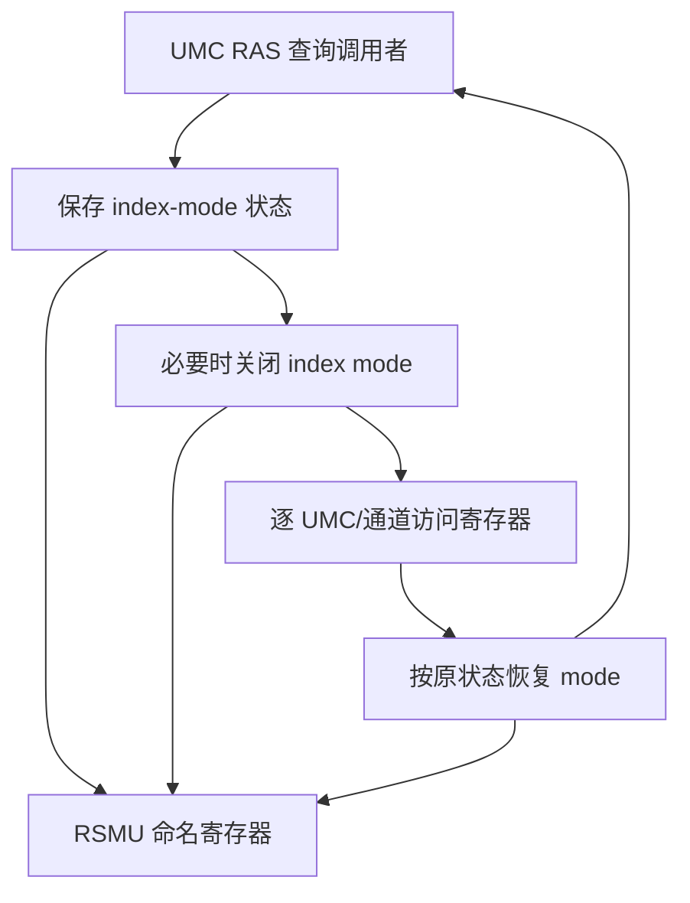

# RSMU 条件化多轮研究方案

范本：v1.2；方案：v1.0；日期：2026-09-24。状态：规划完成，三轮详细研究待执行；目标 RSMU 的职责及整体微架构尚不能确定。下一项：完成第 1 轮身份与接口定位，再判断后两轮可展开的架构范围。

## 已知、类比与命名边界

保留 AMD RSMU 名称，不展开字母 R，不默认 remote SMU，也不把它归为 SMU 子块。联合检索先用 RSMU、目标产品/IP 名、register access、UMC index mode；后两项是这次找到的**可验证功能线索**，不是已确认的模块别名。

Linux v6.12 AMDGPU 提供 [RSMU 寄存器头](https://github.com/torvalds/linux/tree/v6.12/drivers/gpu/drm/amd/include/asic_reg/rsmu) 和 [UMC v6.1 调用代码](https://github.com/torvalds/linux/blob/v6.12/drivers/gpu/drm/amd/amdgpu/umc_v6_1.c)，统一登记 [MG5](../sources.md#mg5)。头文件定义含 VG20 命名的 UMC index register 及 mode/instance/write-enable 字段；驱动确实读取、切换并恢复 index mode。它证明公开实现存在这组寄存器接口，不能证明 RSMU 全部职责、内部控制器、父级、每 die 实例数或与目标设计同名等价。

目前资料不足以形成完整 RSMU 微架构；本方案交付有依据的接口研究骨架和推进条件。首轮得出“公开线索无法对应目标”也是有效结果，但必须说明缺哪种证据，并保留已完成的查证记录。

## 从有依据的访问场景出发

下面仅表示 **UMC v6.1 软件调用关系和共享状态**，不是 RSMU RTL 图，也不表示 UMC 内存数据经过 RSMU。

代表性闭环：管理软件要查询 UMC 错误信息 → 读取原 index-mode 状态 → 必要时临时改变该状态 → 遍历实例和通道寄存器 → 恢复原设置并返回结果。代码中的 Arcturus 分支还在相关访问前后约束 DF C-state；该条件不能无差别复制到其他产品。

上游目前能够指认的是这组驱动函数，下游可观察对象是寄存器访问效果。访问如何在 NBIF/其他入口中译码，RSMU 是否承担端点选择、广播或额外控制职责，均须从定义和调用者进一步核实；寄存器字段名称只能引出问题，不能直接当协议说明。和 SMN 的关系也必须用同一产品的地址/接口资料证明。

## 依架构缺口安排研究主题

| 位置 / 优先级 | 当前问题与证据入口 |
| --- | --- |
| 模块身份与实例；核心 | 源码里的 RSMU IP 标识、寄存器地址和目标框图能否对应；[offset 头](https://github.com/torvalds/linux/blob/v6.12/drivers/gpu/drm/amd/include/asic_reg/rsmu/rsmu_0_0_2_offset.h)，再查目标 IP discovery/地址图，不能由文件名断定全称 |
| 访问状态与控制字段；核心 | MODE_EN、INSTANCE、WREN 在目标模式中的作用和相互约束；[mask 头](https://github.com/torvalds/linux/blob/v6.12/drivers/gpu/drm/amd/include/asic_reg/rsmu/rsmu_0_0_2_sh_mask.h) 只给编码，语义仍需调用者和寄存器说明 |
| 端点操作与返回；核心 | UMC RAS 查询为何保存/关闭/恢复 mode，读错实例会带来什么可观察问题；[umc_v6_1.c](https://github.com/torvalds/linux/blob/v6.12/drivers/gpu/drm/amd/amdgpu/umc_v6_1.c) 的 get/enable/disable_umc_index_mode、query_ras_error_count/address |
| 并发和状态归属；条件相关 | 该 mode 对哪些请求者共享，谁负责串行化，异常退出是否还原；同文件调用链可继续追踪，但当前不能声称它已有完整并发保护 |
| 电源与恢复；条件相关 | Arcturus 分支中的 DF C-state 条件如何影响寄存器可访问性；同文件 query_ras_error_count/address。其他代际必须重查，控制网络常开也不能据此断定 |
| 内部功能块；证据后展开 | 若目标证据确认译码、端点选择、权限或状态保持结构，再逐项建立微架构；未确认前不安排 mailbox 固件、DVFS、路由器或 DMA 作为 RSMU 固有 feature |

## 三轮条件化方案

| 轮次 | 架构范围、前置及核心问题 | 资料定位 | 文档产出与完成条件 |
| --- | --- | --- | --- |
| 1：身份和接口定位 | 从已知寄存器及真实调用者出发，核对产品/IP、全称是否有证据、地址单位、端点及目标对应；无需先理解 SMU 全部内部 | [MG5 offset](https://github.com/torvalds/linux/blob/v6.12/drivers/gpu/drm/amd/include/asic_reg/rsmu/rsmu_0_0_2_offset.h)、[mask](https://github.com/torvalds/linux/blob/v6.12/drivers/gpu/drm/amd/include/asic_reg/rsmu/rsmu_0_0_2_sh_mask.h)、[调用者](https://github.com/torvalds/linux/blob/v6.12/drivers/gpu/drm/amd/amdgpu/umc_v6_1.c)；目标资料待查 | 命名证据表、公开接口草图、目标对应结论；能清楚区分已证实接口与未知职责，若映射失败记录所需顶层/地址证据 |
| 2：已核实功能的微架构 | 前置是第 1 轮至少确认一个适用接口和状态语义。沿请求入口→选择/状态→端点→返回展开；如果只证实公开 UMC 例子，就写该接口机制，不宣称目标完整架构 | MG5 的 mode helpers、错误查询与清理路径；目标接口时序/寄存器手册按缺口补读 | 一次访问和模式切换的结构/状态说明；每个子块要么有目标证据，要么明确为公开参考或教学推导，不能将未知整体标为“完整” |
| 3：共享状态、异常与接续边界 | 前置为状态归属、访问参与者和端点约束已明确；分析竞争、复位/关电期间的可访问性、返回及状态恢复 | MG5 查询调用链及 Arcturus 条件分支；目标错误/复位规范待查；引用 SMN/UMC 已确认的接口结论 | 正常/失败访问对照、恢复责任表、最终范围与未决清单；能说明哪些状态必须恢复、由谁恢复，证据不足项仍保留条件，不生成虚假的性能指标 |

三轮可以随证据合并或增加：如果确认 RSMU 是更复杂的控制单元，再从已证实整体微架构拆出新增轮次；如果范围仅是有限寄存器接口，完成条件满足后不为凑轮数扩大研究。没有目标资料时可先完成公开参考研究，但目标 RSMU 的完整技术论文继续标为待资料。

## 本地接续与交接

本地 Codex 先读 [模块上下文](README.md)、本方案和 [MG5 资料简介](../sources.md#mg5)，随后从 mode helpers 向调用者及地址定义两侧追踪。已有公开源码不需复制入仓库；新增资料原名、版本、读到的位置仍写 sources.md。

本模块的后续研究顺序由已经确认的访问源和端点决定；UMC RAS 查询场景只需前置 UMC 寄存器接口概念，无须等待 HBM 时序论文完成。不要把管理接口线索加入内存数据通路，也不要将现有三轮规划当作三轮研究成果。

