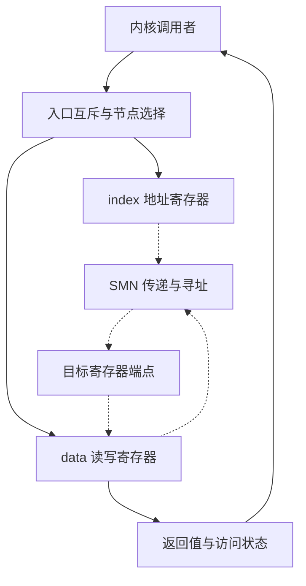

# SMN 多轮微架构研究方案

范本：v1.4；方案：v1.1；日期：2026-09-24。状态：规划完成，详细研究四轮待执行；目标网络内部尚未确定。下一项：定位目标 SMN 的名称、入口与端点地址空间。

## 逐篇笔记与本方案的研究落点

先查[模块资料索引](sources/README.md)了解每篇讲什么，再读对应详细笔记；笔记内保留原文链接、版本、阅读位置、机制及重要限制。本次仅补资料与修订规划，下面的论文轮次完成状态不变。

| 微架构位置 | 对应轮次 | 可直接复用的技术笔记 | 本次补充的研究重点 |
| --- | --- | --- | --- |
| 管理访问入口与选择状态 | 第 1–2 轮 | [MG4](sources/MG4-smn-indirect-access.md)、[MG10](sources/MG10-atl-system-identity.md) | node 与 register address 分层；index/data 锁覆盖两步，Read-as-Zero 需要调用者解释。 |
| 端点与相邻接口 | 第 2–3 轮 | [MG5](../RSMU/sources/MG5-rsmu-umc-index.md)、[MG1](../SMU/sources/MG1-smu-message-table.md)、[IO10](../CF/sources/IO10-gfx90-register-control.md) | 寄存器写效果、mailbox 执行和广播选择不同，未知物理网络先保持边界。 |
| 完成、低功耗和恢复 | 第 3–4 轮 | [IO2](../HDP/sources/IO2-linux-device-io.md)、[MG2](../SMU/sources/MG2-smu13-control.md)、[IO9](../PCIE/sources/IO9-pci-error-recovery.md) | 不以读回相等作为所有寄存器的通用成功规则，不把控制网常开当既定事实。 |

## 研究对象与资料边界

以 AMD SMN 名称组织，联合检索 System Management Network、management register access、indirect register access、sideband interconnect。后几项是访问机制或网络类别；不是证明 SMN 与某种行业总线等价的证据。CF 在本项目保留 Command Fabric 语境，Infinity Control Fabric、SMN、CANE 分别查证，不能依据“control/management”字样互相替代。

当前已读一手例子是 Linux v6.12 [amd_nb.c](https://github.com/torvalds/linux/blob/v6.12/arch/x86/kernel/amd_nb.c) 的 AMD x86 SMN 访问帮助函数 [MG4](../sources.md#mg4)。它说明**特定 CPU 平台的软件访问入口**，不代表 AMD GPU 的接线、路由或 SMN RTL。目标网络的拓扑、分层桥接、事务格式、仲裁和错误响应仍需目标资料。研究先建立请求的可观察契约，再补充内部结构，避免拿一段驱动函数画出虚构网络。 技术笔记：[MG4](sources/MG4-smn-indirect-access.md)。

## 请求主线与功能骨架

采用“软件读取目标 IP 状态寄存器”的代表场景，先研究发起者与入口，再研究地址选择/传递，最后研究端点和返回。图中实线表示 MG4 可观察的软件行为，虚线表示待目标架构说明的网络部分。

CPU 参考中，调用者提供 node、address 和 value；帮助函数选择 root，互斥保护 index/data 配对，先写地址再读写数据，返回后释放锁。读值还会检查 PCI error response，但零值是否有效要由调用者结合寄存器语义判断。写成功也不能统一用“读回等于写值”验证，因为 W1C、RAZ、WI 或保留位可能改变观察结果。

这条闭环解释入口共享资源和软件顺序；它不解释硬件如何仲裁多个 master。上游可能是驱动、固件或其他管理发起者，但目标中有哪些须列证据；下游是已确认地址对应的 IP 寄存器接口，端点内部功能属于其模块。SMU 可以是管理请求来源或交互对象，RSMU 的关系尚不确定，不把 SMU→SMN→RSMU 写成所有请求必经路径。

## 从架构位置提出问题

| 架构位置 / 优先级 | 研究问题与资料定位 |
| --- | --- |
| 入口窗口；核心 | index/data 为何需成对保护，地址单位与访问宽度是什么，多调用者会怎样错配；[amd_nb.c](https://github.com/torvalds/linux/blob/v6.12/arch/x86/kernel/amd_nb.c) 的 smn_mutex、__amd_smn_rw  技术笔记：[MG4](sources/MG4-smn-indirect-access.md)。 |
| 节点与端点寻址；核心 | node 选择与寄存器 address 各负责哪层身份；同文件的 root 查找及 read/write 调用。GPU/die/IP 映射待目标地址图，不把 CPU node 套成 GPU die |
| 网络内部；条件相关 | 在明确 target/initiator 后研究路由、仲裁、outstanding、返回匹配；目前直接架构来源待查，检索目标产品名 + SMN address map / register access。不能用软件全局锁推导硬件只有一个 outstanding |
| 返回与错误；核心 | PCI error、非法地址、读零、端点关电、写副作用分别如何呈现；[amd_nb.c](https://github.com/torvalds/linux/blob/v6.12/arch/x86/kernel/amd_nb.c) 的访问错误注释与 amd_smn_read，结合目标寄存器描述  技术笔记：[MG4](sources/MG4-smn-indirect-access.md)。 |
| 生命周期与管理交互；条件相关 | 上电、复位、clock gating 时入口和端点谁先可用，如何阻止无限等待；[SMU 方案](../SMU/research-plan.md) 提供控制端约定，目标 always-on/timeout 结构待资料 |
| 寄存器访问类比；扩展 | [UMC v6.1 参考](https://github.com/torvalds/linux/blob/v6.12/drivers/gpu/drm/amd/amdgpu/umc_v6_1.c) 的 RSMU index-mode 保存/恢复 [MG5] 可比较共享访问状态，但不能证明它就是 MG4 的同一窗口或网络  技术笔记：[MG5](../RSMU/sources/MG5-rsmu-umc-index.md)。 |

## 四轮研究与写作

| 轮次 | 范围、前置与核心问题 | 阅读入口 | 产出及完成条件 |
| --- | --- | --- | --- |
| 1：发起者、地址与模块边界 | 先核实目标名称/代际、一个合法入口和一个端点；用 CPU 公开例子认识间接访问，目标证据不足时分栏保留 | [MG4 原文](https://github.com/torvalds/linux/blob/v6.12/arch/x86/kernel/amd_nb.c) 的 __amd_smn_rw；项目模块映射；目标资料待查 | 范围/别名表、参考与目标分开的路径图、一次读事务；每个地址属于哪个空间有说明，未知连接不画实线  技术笔记：[MG4](sources/MG4-smn-indirect-access.md)。 |
| 2：入口序列化与端点语义 | 前置是入口寄存器契约；研究 index/data 状态、访问原子性、RMW与副作用，分别定义软件锁和硬件排序 | MG4 的 smn_mutex、amd_smn_read/write 及错误注释；目标端点寄存器说明 | 访问时序、两调用者竞争例子、读写错误矩阵；能解释锁的覆盖范围及为何某些写不能按普通 readback 判成功 |
| 3：从入口扩展到网络内部 | 只有取得目标寻址/端点/桥接依据后，才研究网络的分支、共享资源、请求/响应匹配、仲裁与反压；不预设 packet/VC 结构 | 目标 SMN 架构章节待查；[MG5 原文](https://github.com/torvalds/linux/blob/v6.12/drivers/gpu/drm/amd/amdgpu/umc_v6_1.c) 仅作访问上下文例子 | 有依据的内部功能图及两端点事务路径；若仍缺 RTL/协议证据，交付接口级章节和精确缺口，不以通用 NoC 教程填满本轮  技术笔记：[MG5](../RSMU/sources/MG5-rsmu-umc-index.md)。 |
| 4：异常与生命周期闭环 | 前置是端点可访问条件和返回行为；研究坏地址、关电/复位竞争、超时及恢复。性能只讨论瓶颈来源和需要测量的指标 | MG4 的失败返回边界；目标电源/复位规格；SMU 已确认的接口结论 | 故障与恢复流程、管理路径依赖表；区分软件错误返回和硬件超时保证，明确断电时由谁终结请求 |

## 未决与本地执行入口

最先补齐的是目标地址图和访问接口，之后才可确定网络布局、仲裁及超时主体。若现有资料只能证明寄存器访问，论文要明确停在功能/接口层；不会因此虚构 flit、VC、route table 或固定 latency。SMN 的研究顺序由各代表场景中的请求源决定，可复用已经规划的寄存器端点，不能按目录顺序机械前进。

接续阅读：[README](README.md) → 本方案 → [资料集 MG4](../sources.md#mg4)，需要类比时再读 MG5。第 1 轮将公开例子与目标待决表整合进本目录论文，后续资料摘要集中维护于 sources.md；本页只维护问题、轮次和实际进度。

## 2026-09-25 资料补齐对本方案的影响

第 2–3 轮优先复用 [MG5](../RSMU/sources/MG5-rsmu-umc-index.md)、[C01](../UTCL2/sources/C01-mm-utcl2-testbench.md)。已有 remote SMU 名称及 BOWEN SMN→rsmu 位置证据；分别记录公开职责和参考拓扑，仍不能推出所有产品的 SMN 网络或同一 index/data 窗口。 本次仅更新依据和研究落点，不把任何待执行论文轮次改为完成。
