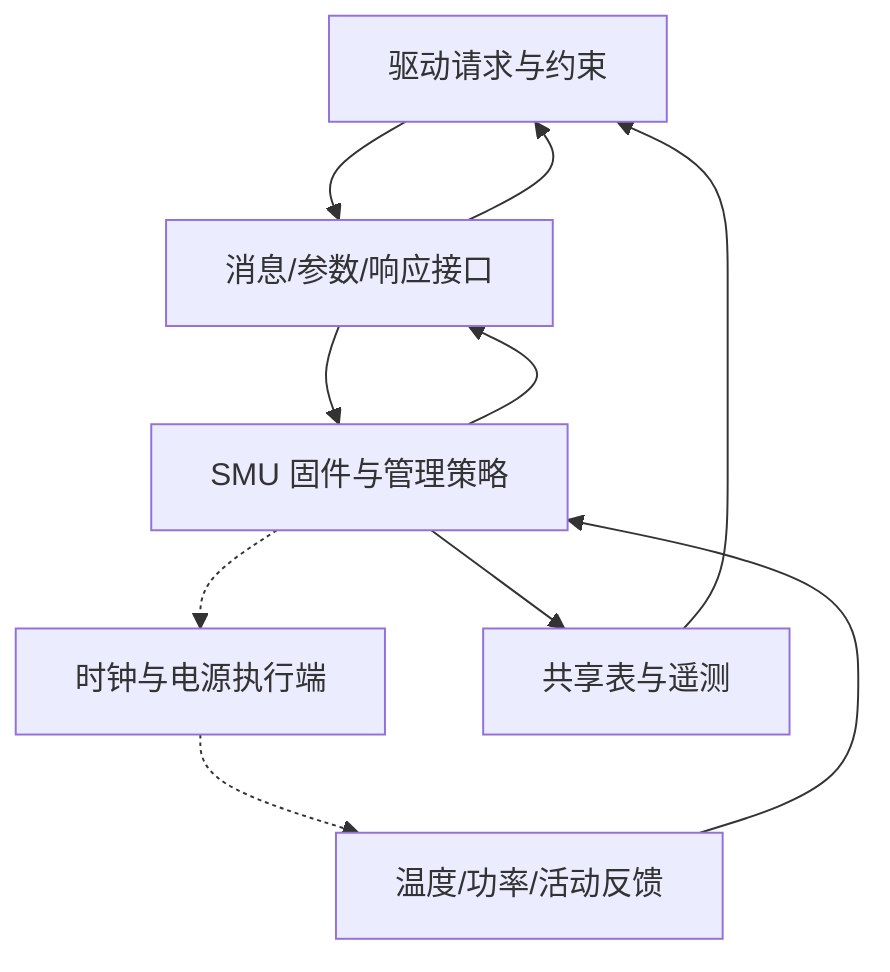

# SMU 多轮微架构研究方案

范本：v1.3；方案：v1.1；日期：2026-09-24。状态：规划完成，详细研究四轮均待执行。下一项：固定目标 SMU/IP 与 firmware interface 版本，完成第 1 轮的请求—响应骨架。

## 逐篇笔记与本方案的研究落点

先查[模块资料索引](sources/README.md)了解每篇讲什么，再读对应详细笔记；笔记内保留原文链接、版本、阅读位置、机制及重要限制。本次仅补资料与修订规划，下面的论文轮次完成状态不变。

| 微架构位置 | 对应轮次 | 可直接复用的技术笔记 | 本次补充的研究重点 |
| --- | --- | --- | --- |
| 管理请求和共享表 | 第 1–2 轮 | [MG1](sources/MG1-smu-message-table.md)、[MG2](sources/MG2-smu13-control.md)、[MG3](sources/MG3-smu13-firmware-abi.md) | message/response、ASIC 映射、锁、ABI 与数据可见性放在同一闭环。 |
| 策略约束与反馈 | 第 2–3 轮 | [MG9](sources/MG9-thermal-power-observability.md)、[IO14](../HDP/sources/IO14-hdp60-power-sequence.md)、[MEM4](../PHY/sources/MEM4-dfi-version-boundary.md)、[FAB5](../DF/sources/FAB5-xgmi-topology.md) | 请求频率、实际频率和平均值区分；本地低功耗序列不能自动当 SMU 完整算法。 |
| 错误、事件和恢复 | 第 3–4 轮 | [MG5](../RSMU/sources/MG5-rsmu-umc-index.md)、[MG6](../IH/sources/MG6-ih60-ring-hardware.md)、[MG8](../IH/sources/MG8-irq-dispatch-lifecycle.md)、[MEM3](../UMC/sources/MEM3-amdgpu-ras.md)、[IO9](../PCIE/sources/IO9-pci-error-recovery.md) | 管理访问、检测、通知和保护策略各自有状态；API 成功可能是条件跳过。 |

## 范围、术语与依据

以 AMD System Management Unit 为主名。联合检索 power management microcontroller、PMFW、DVFS、power/thermal management、firmware mailbox。PMFW 是研究固件职责的入口，DVFS 是功能主题，mailbox 是接口形态，都不是 SMU 的同义硬件块。公开 AMDGPU 的 SMC、MP1 命名需按代际对应；不由这些名称推断目标实例的处理器架构。

采用 Linux v6.12 的 SMU common 层与 SMU 13.0 驱动接口作为公开参考；它们能支持软件可见行为与功能划分，不能揭示完整固件调度器或目标 shaobo/anshi 的 RTL。资料集先读 [P2 总览](../sources.md)，再读 [MG1–MG3](../sources.md#mg1)。本模块不展开 SMN 路由和 RSMU 内部；管理关系不表示包含。

## 微架构主线与上下游

代表场景从驱动提出频率范围/功率约束开始，经过命令接口进入管理决策，再由实际时钟、电源执行端改变状态，最后以响应和遥测观测结果。图为公开资料支持的**功能骨架**；虚线内的决策/执行边界仍须目标资料确认，不代表已知 RTL 分块。

公开代码展示 message lock、消息编号映射、寄存器读写、响应轮询和共享表传输；它不证明每次管理请求都经过 SMN，也不证明所有策略都由软件串行执行。上游需交代请求权限、参数含义及同步要求；下游需交代能否接受请求、何时达到目标、异常如何反馈。SMN、IH、HDP 只在相应接口处接续，不能排成固定串行链。

典型闭环：检查能力与消息映射 → 序列化访问 mailbox → 按接口顺序发布参数和消息 → 等待、解码响应 → 必要时取回表格/状态 → 对照实际频率、温度或 throttling 指标。**命令返回成功与物理状态达到目标是不同观察点**，第 2–3 轮须按具体命令确认；不能把接口函数成功、被条件过滤和硬件执行完成混作一种结果。消息超时还要区分未发出、已发出无响应和恢复期间跳过，避免无条件重发有副作用的命令。

## 架构位置与研究重点

| 位置 / 优先级 | 需要解释的问题与就近资料 |
| --- | --- |
| 请求入口；核心 | message map、能力检查、虚拟化过滤如何决定可发的命令；[smu_cmn.c](https://github.com/torvalds/linux/blob/v6.12/drivers/gpu/drm/amd/pm/swsmu/smu_cmn.c)，读 `smu_cmn_send_smc_msg_with_param`  技术笔记：[MG1](sources/MG1-smu-message-table.md)。 |
| mailbox 与状态；核心 | message_lock 保护什么，resp/param/msg 的先后、busy/拒绝/超时怎样终结；同文件 `__smu_cmn_send_msg`、poll/response helpers。软件互斥不证明固件无并发 |
| 策略到执行；核心 | soft/hard frequency limits 与 power limit 的输入语义，目标值如何受热/功率条件约束；[smu_v13_0.c](https://github.com/torvalds/linux/blob/v6.12/drivers/gpu/drm/amd/pm/swsmu/smu13/smu_v13_0.c)，读 set_soft/hard_freq_limited_range、set_power_limit；实际执行顺序待目标文档  技术笔记：[MG2](sources/MG2-smu13-control.md)。 |
| 共享资源与可观测性；核心 | 大表为何另走内存，CPU/GPU 可见性如何保证；[smu_cmn.c](https://github.com/torvalds/linux/blob/v6.12/drivers/gpu/drm/amd/pm/swsmu/smu_cmn.c) 的 update_table；[SMU 13.0.0 interface](https://github.com/torvalds/linux/blob/v6.12/drivers/gpu/drm/amd/pm/swsmu/inc/pmfw_if/smu13_driver_if_v13_0_0.h) 的 PPTable_t、SmuMetrics_t  技术笔记：[MG1](sources/MG1-smu-message-table.md)、[MG3](sources/MG3-smu13-firmware-abi.md)。 |
| 异步事件与恢复；条件相关 | thermal/AC-DC 事件怎样经 IH 分发、ACK/re-enable，复位时哪些状态需重建；[smu_v13_0.c](https://github.com/torvalds/linux/blob/v6.12/drivers/gpu/drm/amd/pm/swsmu/smu13/smu_v13_0.c) 的 irq_process、register_irq_handler、check_fw_version，配合 [IH 方案](../IH/research-plan.md)  技术笔记：[MG2](sources/MG2-smu13-control.md)。 |

## 四轮安排

研究管理并发时，还需区分两个时间尺度：主机串行提交命令的顺序，以及固件在温度、功率和活动反馈变化时继续更新决策的过程。论文应解释命令处理期间遇到保护事件时如何决定观察点、错误和恢复责任；未公开的策略优先级不作定论。目标芯片若与 CPU 共享 SMU，还须先补齐请求权限和共享资源边界，再扩展多客户端内容，不能直接套用独立显卡假设。

| 轮次 | 架构范围、核心问题与前置 | 阅读定位 | 文档产出与完成条件 |
| --- | --- | --- | --- |
| 1：从请求者到 mailbox | 先选具体 IP/接口版本，建立驱动、固件、执行端、反馈端职责。前置为请求来源和可访问接口，目标未知则保留公开参考标识 | P2；[MG1 原文](https://github.com/torvalds/linux/blob/v6.12/drivers/gpu/drm/amd/pm/swsmu/smu_cmn.c) 的发送/响应函数 | 术语适用表、整体图、一次成功请求时序；每个箭头说明数据、控制及完成含义，不臆造固件内部流水  技术笔记：[MG1](sources/MG1-smu-message-table.md)。 |
| 2：接口并发与表格传输 | 从已确认 mailbox 协议深入消息序列化、错误路径、共享表 ownership/可见性；前置为第 1 轮命令语义 | MG1 的 response 状态映射、update_table；[MG3 原文](https://github.com/torvalds/linux/blob/v6.12/drivers/gpu/drm/amd/pm/swsmu/inc/pmfw_if/smu13_driver_if_v13_0_0.h) 表结构 | 接口状态图、表传输流程与失败分支；能判断响应对应哪条命令，说明表内容何时可读  技术笔记：[MG3](sources/MG3-smu13-firmware-abi.md)。 |
| 3：管理决策与物理反馈 | 基于已知约束和遥测建立 DVFS/功率/温度功能模型；前置为执行端边界及控制目标，未知的固件算法列为待查 | [MG2 原文](https://github.com/torvalds/linux/blob/v6.12/drivers/gpu/drm/amd/pm/swsmu/smu13/smu_v13_0.c) 的频率/功率接口；MG3 limits、metrics | 约束—执行—反馈图，典型负载变化的状态解释；区分请求值、限值、测量值和采样时间，不用寄存器布局冒充控制算法  技术笔记：[MG2](sources/MG2-smu13-control.md)。 |
| 4：异步保护与生命周期 | 将热告警、异常消息、初始化/复位/恢复接回主线；前置为 IH 基本交付和目标电源域约定 | MG2 irq_process、enable_thermal_alert；MG1 RAS filter、firmware state；目标文档缺口按需补查 | 保护事件和恢复流程、跨模块接口清单；说明何时可再次发命令、哪些状态重建，未知保护策略有明确证据需求 |

## 待决与本地接续

关键待决是目标 SMU 代际、固件 ABI、可见管理端口，以及功率状态/时钟域的执行边界。没有证据时，不填写控制周期、固件任务优先级或完整调压时序；这些不阻塞接口主线，但会限制第 3–4 轮的实现解释。

本地 Codex 从 [模块上下文](README.md) → 本方案 → [资料集 MG1–MG3](../sources.md#mg1) 开始，按第 1 轮补读具体产品调用者；论文正文在本目录逐轮整合，资料摘要仍维护于 sources.md。每轮回看整体闭环并更新本页实际进度，不能将本次规划计为论文第 1 轮已完成。
