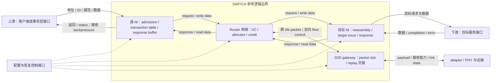

# SWITCH：多轮研究方案与当前接续

版本：v2.1；日期：2026-09-25；依据：[当前研究范本](../chip-study-plan.md)及用户 U31/U32/U35。U32 以提交 8c70f1d 的 v2.2 为基线重拟轮次；U35 已实施第三轮并形成[详细稿 v2.3](../switch/switch_detailed_guide.md)。**总计六轮：第 1–3 轮已完成，第 4–6 轮待执行。** 第三轮的文档推演与台账检查范围见[核查记录](round3-review.md)，未修改或重跑既有 Router 模型。

入口：[模块上下文](README.md) → [实际进度](../switch/RESEARCH_PROGRESS.md) → 本方案 → [逐篇资料索引](sources/README.md)。后续仍在原位修订中文详细稿，常用英文术语按[统一规则](../chip-study-plan.md#常用英文术语保留原文)保留原文。R0/R1 是教学设计编号，不是研究轮次或 AMD 目标规格。

## U32 的基线审查：保留什么，后续补什么

v2.2 已把前两轮组织成完整的理解主线。U32 据此区分已有基础与待深化内容，形成下表。**该表保存重拟方案时的判断；其中第三轮 NI 缺口现已按明确的参考子集在 v2.3 深化，实际状态以下文和进度页为准。** 后续不再从零重写已经具备的 NI、整体图和普通读写基础。

| 当前正文 | 已有基础及证据边界 | 仍需深化的核心问题 | 新安排 |
| --- | --- | --- | --- |
| 第 1–5 节 | 需求、feature、上下游与内部结构、六类接口、256 B 普通读写闭环已说明 | 新机制必须回写这些图和例子；目标接口仍待核实 | 各轮同步维护，不另开基础重写轮 |
| 第 6 节 | 源/目标 NI 职责、事务表、response reservation、ID 生命周期已说明；同一相关 flow 采用保守串行 | 多笔 outstanding 如何进入、等待、返回和 retire；独立 AW/W 与具体 ordering domain 如何落实到状态和资源 | 第 3 轮 |
| 第 7–10、12 节 | Router、allocator、credit/ownership、共享容量和失败路径已有较深说明；第二轮模型只实现声明的子集 | 当 NI、恢复或网关改变接口时核对受影响约束；无需再讲一遍 allocator 教程 | 复用第 1–2 轮，按具体影响检查 |
| 第 11、13 节 | routing deadlock 与协议依赖的区别、backpressure、CDC、quiesce/drain/reset 的原则已说明 | 在同一片内基线中列完整资源等待关系、环境进展条件、停止/恢复状态及 late response 处理，形成可逐步追踪的闭环 | 第 4 轮 |
| 第 14 节 | 两 die、整包 gateway、三类容量、LRP-64 replay/去重与 PRE/POST 已说明 | 把正常、ACK 丢失、控制受阻、部分状态丢失和恢复放进同一套状态/资源模型；明确 adapter/PHY 的交接 | 第 5 轮 |
| 第 15、17 节 | 性能口径、BDP、219 ns 教学预算和历史 credit sweep 已有 | 有负载时 NI、Router、目标和 D2D 谁限制吞吐及 tail latency；用受控比较解释原因 | 第 6 轮 |
| 第 16 节 | SDMA 与存储侧的接口责任、完成层次、HBM 地址专题边界已说明 | 真实全路径的翻译、interleave、维护、软件完成要依赖相应模块的详细结论 | 必要接口在第 3–5 轮处理；完整跨模块复审另行接续 |

仍保留四个后续轮次，是因为剩余工作分别产出 **NI transaction contract、片内进展与恢复论证、D2D 状态与资源交接、性能解释和模块收尾**。它们有清楚的前置和完成条件；把 NI、系统等待和跨 die 故障全部压成一轮，会掩盖尚未讲清的责任。这个数量来自当前缺口，不是继续沿用固定六轮的格式。

原第 6 轮的完整 SDMA 系统复审移到相关模块基础具备后的跨模块阶段。SWITCH 的上下游接口、response 接收、完成和恢复责任仍是本模块必做内容，不能借此延后。U24 的 HBM 地址专题继续保持核心必做属性。

## 整体微架构与贯穿场景

沿用正文第 3–6 节的角色和基线。下面是研究职责图，不是 AMD RTL 层级或已验证的 DF→SWITCH→UMC 串接。

adapter/replay 的实际归属须按所选实现核对；图中只固定本研究需要的交接责任。各正向通路还需有对应的反向接纳/容量约定，不能因图中未画每条 credit 线而省略。

| 必要外部契约 | 本模块必须取得或明确的内容 | 影响内部结构 |
| --- | --- | --- |
| 上游请求与返回 | 输入地址空间或已选目标、操作/长度/byte mask、原 ID 与 ordering domain、接纳条件、返回消费与完成含义 | transaction table、写数据关联、response reservation、admission |
| 下游服务端 | 命令/数据接纳、服务及返回能力、ordering、错误和副作用边界 | 目标 NI 状态、response buffer、资源等待边 |
| adapter/PHY | 本地交付与可靠接收边界、backpressure、时钟/宽度、初始化及错误/低功耗状态 | gateway slot、replay 责任、CDC 容量与恢复次序 |
| 配置/恢复来源 | 映射与 epoch 生效条件、允许停止的流量、drain/abort/reset 完成条件 | 旧事务隔离、ID/credit 重建及重新开放 |

教学 R0 仍从已翻译地址、16 B 对齐且长度为 16 B 倍数、最多 256 B 的普通读写出发；核心场景增加两个源、快慢两个目标、不同 ID 的并发，以及同一 ordering domain 的后续请求。读、写及其 response 在同一场景下逐步加入 backpressure、错误和停止/恢复。第 5 轮才加入两 die、每包最多跨一次的 R1 分支。更大请求与多目标 child transaction 按 U24 说明责任，不能把 packetization 自动当作内存事务拆分。

保持现有 Router 的容量/ownership 契约。若新机制确需改变，记录原因、受影响正文和验证边界；例如 R1 的 PRE/POST 从每输入四个 VC 扩展为八个 VC，性能比较必须计算增加的资源。

## 旧任务如何迁移

| 原第 3–6 轮 | 本次处理 |
| --- | --- |
| 3：NI 事务契约、排序与协议映射 | 收紧为新第 3 轮的 NI admission、outstanding、ordering、response/retire；把整网 progress 与生命周期切换放入第 4 轮 |
| 4：D2D 网关、可靠性及状态交接 | 移到第 5 轮；先用第 4 轮确定片内资源和恢复责任，再研究跨 die 新增的条件 |
| 5：负载与性能 | 移到第 6 轮；增加有限 NI/目标边界及 D2D 的适用比较，补模块范围内的技术和读者审核 |
| 6：SDMA 系统交叉复审 | 移出 SWITCH 固定轮次，保留为跨模块接续；所需最小接口立即在相关轮次核实 |

原第 1、2 轮及 v2.2 重整的完成事实不变。U32 重拟本身没有完成或换名计数任何研究轮次；U35 此后按新第三轮实际完成 NI 深化。下面保留各轮任务及其当前状态。

## 第 3 轮：NI transaction contract 与并发处理

**状态：已完成（U35，v2.3）。** 已固定 full-width INCR 普通读写子集、每 domain 单笔到 retire、有限源/目标容量、AW/W 关联和完整错误收尾；深化正文第 3–6、16–17 节，并同步受影响的进展/停止及性能口径。19 类场景作了契约推演，12 行台账、32 组 byte coverage 与 6 项边界算式检查通过。实际证据及未实现范围见[核查记录](round3-review.md)。

**前置与范围：** 先读正文第 3–6、16 节；复用第 7–10 节 Router 契约。只读取客户端/DF 与目标服务端的必要接口，不等待它们的完整论文。目标协议未确认时，采用 R0 普通读写及固定 AXI4 子集作有明确边界的公开参考。

**核心任务：**

1. 把“接纳请求”分到真实事件：AW、W、AR 的接收、事务表项分配、完整 payload 就绪、response 容量预约、首次注入、target issue、response 接收与对上游 retire。分清 channel beat 已接收与整笔 transaction 可以发出的条件。
2. 明确源/目标 NI 子模块、保存的状态及 allocate/free 条件；把原端口/原 ID、内部 TxnID、目标 ID、预期字节和 response 位置对应起来。AW/W 独立到达及返回 backpressure 都须有合法落点，不能仅列字段名。
3. 以不同 ordering domain 的有限并发为主线，同一 domain 先保留串行的可解释基线。比较同 ID 同目标限制与 ROB 的收益和成本；只有具体需求需要时选一种扩展，不能同时堆出多套未闭合实现。读 response ordering、写 response ordering 与跨读写 visibility 分开说明。
4. 明确 packetization/depacketization、byte coverage、长请求或多目标 child 的责任。支持的子集必须保留协议所需属性；不支持项有合法限制或 error 路径。已接收 burst 的错误收尾不能简化成丢弃后续 beat。
5. 用快慢两个目标追踪不同 ID 返回交错、同 ID 请求等待、W 先到/AW 先到、上游暂不接 R/B、目标报错等场景；说明哪些资源继续占用、何时重新可用。

**阅读定位：** [R8](sources/R8-axi-ordering-contract.md) 的 IHI 0022H A3/A5/A6；[R7](sources/R7-floonoc-paper.md) §III-A 的 NI/ROB 与无 ROB 对照；[R22](sources/R22-garnet-network-interface.md) 的 target consumption/tail stall。精确协议问题回对应原文；R7 的确定性路由不能脱离目标服务顺序，直接推出任意同目标事务必然按序返回。[R23](sources/R23-chi-ea-protocol.md) 仅在需要说明 coherent 边界时选读，完整 CHI node、snoop/atomic 不成为本轮默认建设范围。

**产出与落点：** 原位深化第 4–6、16 节，回写第 3 节图；形成同一基线的 interface contract、NI 状态/资源生命周期和并发过程。表和时序用于解释必要事件，不展开与行为无关的全部位宽/RTL。

**完成条件：** 每个已接纳的支持事务都能追踪到对应数据/错误和 retire，ID/response 空间不提前复用；每个等待都有持有资源及解除条件；协议子集和目标未知明确。局部状态表或定向检查可用于解决具体疑点，不要求本轮构建完整 AXI 仿真平台。全局等待关系及 reset 中断由第 4 轮沿本轮契约继续研究。

## 第 4 轮：片内 end-to-end progress 与恢复

**状态：待执行，为下一轮。** 先读取 v2.3 第 6 节已确定的 entry/domain、AW FIFO、read/write slot、目标 record 和 R/B retire，再按本节分析组合后的资源与恢复条件；不把第三轮的正常事件推演当作全局进展证明。

**前置与范围：** 第 3 轮已固定的 NI/目标接口，加上原 Router 基线。研究 source NI→NoC→target NI→response 的片内闭环；这是在明确接口下的本模块分析，不等于完整 SoC 的形式化证明。

**核心任务：**

1. 把 NI 表项、request/response buffer、VC ownership、credit、target queue 与真实消费者放进同一张“持有资源→等待资源”图。分别检查 route 可达性、routing dependency、协议/端点依赖、共享容量和仲裁服务条件。
2. 说明 R0 的 response reservation 和请求/响应资源隔离究竟切断哪条等待边；资源保留要对应真实容量，不能仅靠 VN 名称。把 deadlock、starvation、livelock 与无条件时延保证区分开。
3. 给出 quiesce→drain→停止/重建→重新开放的状态与转换条件。分别列出新事务、已接纳的写数据、response、credit 和控制消息何时允许继续；drain 条件须覆盖 NI、目标、packet/flit 及在途归还，不能只看某个 outstanding 计数归零。
4. 在源 NI、NoC、target 已接纳/可能执行、response 待交付等位置触发错误或停止请求；定义可完成、可按契约终止、结果未知三类出口。reset 是否允许/如何反馈 error 取决于接口，不虚构 AXI 的任意 transaction cancel。
5. 说明 CDC 两侧接纳/可见延迟、容量和 reset 协调的必要责任；处理 late response、epoch 切换和 ID 再用。epoch 数值不同并非充分证明，要说明旧流量隔离、drain 或寿命条件。

**阅读定位：** [R13](sources/R13-channel-dependency-scope.md) §II–IV 的 CDG 前提；[R22](sources/R22-garnet-network-interface.md) 的端点等待；[R19](sources/R19-booksim-buffer-state.md) 的容量与 ownership；[R8](sources/R8-axi-ordering-contract.md) 的接口收尾。若比较 CHI 的 P-Credit/L-Credit 或 link state，仅用 [R23](sources/R23-chi-ea-protocol.md) 的相应正式规范范围，不将其机制混入 R0。

**产出与落点：** 深化第 11、13 节，联动第 6、9–10、17 节。保存片内资源依赖图、环境进展假设、停止/恢复状态图和关键事件轨迹；有实际机制改动时用最小有界检查支持受影响性质。

**完成条件：** 对声明的基线说明如何避免已识别的等待环；目标最终服务/报错、consumer 消费、仲裁和控制进展等假设可见。停止与恢复不制造重复许可、不误交旧 response、不把结果未知的副作用当作安全重试。结论区分结构论证、已检查轨迹与未验证的 RTL/CDC 电气行为。

## 第 5 轮：D2D gateway、replay 与状态交接

**前置与范围：** 第 3 轮 transaction contract、第 4 轮片内 progress/恢复条件，以及 PHY/adapter 的最小接口。先沿 R1 两 die、单次跨 die 的教学结构完成新增责任，不重新展开相邻 PHY 的完整内部设计。

**核心任务：**

1. 将 source NoC、TX gateway、adapter/replay、RX reassembly、remote NoC 的接纳及释放分开；沿用并细化本地 NoC credit、远端 packet-slot credit、TX replay slot 三种账本。有限包槽、replay 空间及读写/校验带宽都须覆盖已作出的承诺。
2. 在统一状态图上走正常发送、data/ACK 丢失或重复、超时、control backpressure 和窗口/epoch 边界。重发同一副本不能再次扣一份新 packet 许可，ACK 释放副本也不能提前释放远端 record 槽或原业务事务。
3. 将第 4 轮恢复流程扩展到两端不同步、去重状态丢失、link down、低功耗进入/退出；分别说明 link acceptance、可靠交付、target execution、transaction completion。不能默认任意 reset 后仍有 exactly-once。
4. 把 gateway、replay、控制通路和远端消费加入资源图，核对 PRE/POST 单向转换及整包吸收点；说明控制机会与错误升级，避免用无限 retry 代替进展条件。
5. 用固定版本/模式的 UCIe 资料比较职责，说明 Protocol/Adapter/PHY、FDI/RDI 及 Raw/streaming 的边界。LRP-64 保持教学身份；精确 UCIe 字段/超时或合规结论只有取得匹配规范后才能写成规范事实。

**阅读定位：** [R10](sources/R10-ucie-protocol-adapter.md) 的 Hot Chips 2023 协议/adapter、初始化与 PM；[R11](sources/R11-ucie11-streaming.md) 的 1.1 streaming 说明；[R16](sources/R16-remote-control-deadlock.md) 的跨网络组合与整包预约；[PHY R14](../PHY/sources/R14-ucie-electrical-training.md) 的数字接口、training/repair 边界。上述教程和功能说明不能代替完整正式规范；只在需要精确条文时定向补证。

**产出与落点：** 深化第 14 节，联动第 4、9、11、13、15 节及附录 A；交付分层接口/资源表、正常与故障过程、两端停止/恢复条件和跨边界依赖分析。需要时只为 replay/容量或状态竞态建立小型模型，不以搭建全多 die 仿真作为默认任务。

**完成条件：** 每份容量和副本都有唯一的承诺与释放时点；接收重复、控制重复和状态切换不会造成重复业务交付或重复归还；不能确认的执行结果有明确责任出口。两端恢复能保证和不能保证的性质分开，目标 AMD 协议与 UCIe 合规未知继续保留。

## 第 6 轮：性能归因、设计取舍与模块收尾

**前置与范围：** 第 3–5 轮已固定的接口、资源、服务和恢复假设；沿用现有 Router 模型作为可复用的局部基础。性能评估只测或计算模型实际表达的机制，不把现有理想 source NI 当作完整 transaction/ROB/replay 实现。

**核心任务：**

1. 先定义测量边界、流量单位、warm-up/测量/drain、随机种子或确定性 trace、目标服务假设。分别记录 offered、accepted、injected、delivered；source queue、network、target service、response wait 分别归因。
2. 用有区分度的场景定位瓶颈：低负载基线；short control 与 long data 混合；同目标 hotspot 与分散目标；慢 target/response consumer；本地与适用的跨 die 分支。每个对照只改变可解释的因素，不做无目的的全参数扫描。
3. 研究有限 outstanding/response 空间、VC ownership 周转、credit RTT、gateway/replay 容量与服务率的耦合。比较时注明总 buffer 容量、VC 数、带宽和时钟边界，避免把增加资源的收益全归给某个算法。
4. 以 throughput、完成延迟分布、队列占用、主阻塞原因和各 flow 服务情况解释结果；p95/p99 仅在样本量与统计窗口支持时报告。重叠事件计数不能直接相加成延迟。
5. 为要量化的 NI/target 或 D2D 因果关系增加最小有限行为模型或局部实验；未建模部分只能给注明假设的预算/上界，不能填成测量数据。既有 219 ns 和历史 credit sweep 保留原来源及条件，不冒称本轮新结果。
6. 把结果与取舍回写现稿，沿同一读写例子完成模块级技术及读者审核；同步简化版、术语、接口图、进度、模型边界和跨模块依赖问题。

**阅读定位：** [R3](sources/R3-booksim-method.md) §II–V 的模型与源端排队/统计口径；[R1](sources/R1-pipelined-router-delay.md) 的延迟/credit/负载前提；[R7](sources/R7-floonoc-paper.md) §III-A、IV-A1、VI-A/B 的 NI、多 stream 与性能观察。R7 §II–VI 已有阅读记录，按问题复用及补核实验条件，不再笼统列成“IV–V 未读”。现有代码与历史报告从[进度页](../switch/RESEARCH_PROGRESS.md)进入。

**产出与落点：** 深化第 15、17 节，按结果修订第 6、9、11、14、16 节；保存实际使用的参数、方法、结果及解释。无需引入无关仿真平台或复制第二套正文。

**完成条件：** 对所选代表性场景，能把吞吐/延迟变化归到具体资源和等待，并给出可复核的对照；结论不超出模型覆盖。整篇参考微架构的结构、接口、状态、正常/受阻/恢复过程和性能口径一致。模块研究完成不等于目标 AMD 实现已核实、真实 PPA 已测得或完整跨模块专题已完成。

## 跨模块接续与关键未知

完整 SDMA 搬运、维护/可见性和恢复复审，在相关模块提供必要详细结论后集中进行，回写原论文的相应位置，不机械命名为 SWITCH 第 7 轮。其价值与条件由[路线图](../research-roadmap.md#已确定的跨模块主线与其他候选)维护；不等待所有模块或可选细节全部完成。

| 具体依赖问题 | 所需外部结论 | 当前处理及影响 |
| --- | --- | --- |
| SWITCH 入口的地址/目标选择属于谁 | 客户端、DF/CS 的地址空间、映射配置及目标 ID 契约 | 第 3 轮立即核最小接口；未知时保持 R0 映射为教学选择，不能推目标 HBM 位图 |
| 返回/写 response 对哪种观察者算完成 | 目标服务端及相关 DF/UMC/cache 语义 | 第 3–4 轮按明确接口定义；不能把成功响应直接推广为软件 fence 或 HBM cell 更新 |
| adapter/PHY 出错或状态丢失后可恢复什么 | 固定模式的交接、reset、link/error 能力 | 第 5 轮明确条件；无正式条文不能给精确 UCIe 合规结论 |
| copy、翻译/维护和通知如何全路径衔接 | SDMA 外部只读接口结论及相关 UTCL/HUBS/DF/存储/IH 基础 | 先保存 SWITCH 所需契约，后续跨模块统一；不复制独立 SDMA 规格 |

目标拓扑、接口协议、实例/DF/CAKE 归属、D2D 模式仍是影响映射的关键未知。教学研究可以在明确边界下推进；目标结论只能在匹配证据到位后成立。可选 CAM/指针编码、CRC 电路、完整 CHI coherence、任意自适应路由、多 gateway/multi-hop D2D、STA/PPA 等不自动成为必过任务；若后来改变主线正确性，再记录理由升级。

## U24：请求地址到 HBM bank 的跨模块落点

SWITCH 的局部必做项进入第 3 轮：输入地址空间或目标 ID、目标映射与 next-hop 的区别、packetization 与 memory child 的区别、byte coverage、返回关联及 ordering。跨 die 分支联读第 5 轮；第 4 轮核资源和恢复责任，第 6 轮观察目标分布/response backpressure 对本模块的影响。

完整地址 interleave、HBM 资源分配及逐地址演算继续执行[专题方案](../HBM/address-interleaving-plan.md)，待相关模块核心结论形成后集中统一。必要接口疑点在本模块当下处理，不能推迟；缓存 slice、translation、内存目标 interleave、UMC decode 与 Router routing 保持分层。

## 已完成的 v2.2 重整与 U32 审查记录

v2.2 的全文重写及技术/读者审核已经完成，旧 49 章映射保存在正文附录 B；这不增加已完成轮次。历史模型及结果保留原样。

U32 审查时实际通读 v2.2、既有方案/进度与资料索引，选读 R3/R7/R8/R10/R11/R13/R16/R22/R23 笔记，并核看现有模型的范围说明与报告入口；未把所有源码函数重新审查一遍。另回查 [FlooNoC v1](https://arxiv.org/html/2409.17606v1) §III-A、VI-A/B 的职责与章节定位，以及 [UCIe 1.1 官方说明](https://www.uciexpress.org/post/ucie-1-1-provides-streaming-protocol-solution-for-error-detection-and-replay) 的模式边界；未新增来源、未扩大为完整规范精读。随后 U35 第三轮只定向补核并更新 R7/R8/R22 的复用边界，现有 105 篇全局笔记及本模块 21 篇主笔记的数量不变。

后续从第 4 轮接续：先读 v2.3 第 6、9–11、13 节及第三轮核查记录，再按具体依赖选读 R13/R19/R22，必要时回 R8/R23 核接口条件。每轮仍原位修订同一主稿并同步实际进度；第三轮完成不自动启动第 4 轮。
