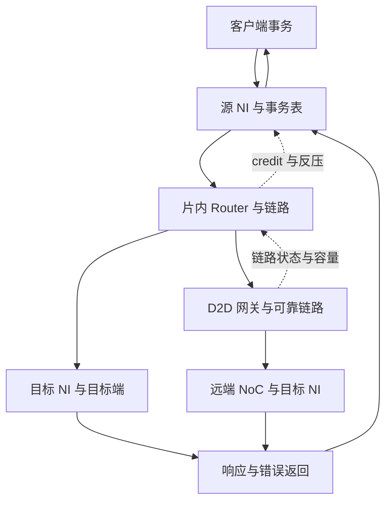

# SWITCH：保留既有两轮基础的后续研究方案

版本：v1.1；日期：2026-09-24；依据：[研究范本 v1.3](../chip-study-plan.md)。状态：本次完成旧计划复核与后续规划；实际研究仍为第 1、2 轮完成，第 3–6 轮未完成。下一步是修订后的第 3 轮，不能把本次规划记作第 3 轮成果。

入口：[模块上下文](README.md) → [实际研究进度](../switch/RESEARCH_PROGRESS.md) → 本方案 → [资料集 P6](../sources.md#p6switch-公开研究资料组)。正文继续原位维护 [switch_detailed_guide.md](../switch/switch_detailed_guide.md)，保留大小写目录和历史原稿。P6 内部的 R1–R21 继续沿用，本次阅读定位见资料集；当前目标芯片拓扑和协议仍未确定。

## 逐篇笔记与本方案的研究落点

先查[模块资料索引](sources/README.md)了解每篇讲什么，再读对应详细笔记；笔记内保留原文链接、版本、阅读位置、机制及重要限制。本次仅补资料与修订规划，下面的论文轮次完成状态不变。

| 微架构位置 | 对应轮次 | 可直接复用的技术笔记 | 本次补充的研究重点 |
| --- | --- | --- | --- |
| 既有 Router 两轮的证据复查 | 复用第 1–2 轮 | [R1](sources/R1-pipelined-router-delay.md)、[R2](sources/R2-low-latency-vc-router.md)、[R3](sources/R3-booksim-method.md)、[R4](sources/R4-garnet-overview.md)、[R5](sources/R5-garnet-switch-allocator.md)、[R6](sources/R6-garnet-input-output-credit.md)、[R18](sources/R18-islip-matching.md)、[R19](sources/R19-booksim-buffer-state.md)、[R20](sources/R20-damq-buffer.md)、[R21](sources/R21-elastistore.md) | 固定 allocator/credit/free-buffer 语义；教材/论文的工作负载、工艺和吞吐例外不得遗漏。 |
| NI、排序和协议映射 | 后续第 3 轮 | [R7](sources/R7-floonoc-paper.md)、[R8](sources/R8-axi-ordering-contract.md)、[R9](sources/R9-chi-model-user-guide.md)、[R12](sources/R12-arm-system-architecture.md)、[R15](sources/R15-floonoc-router-code.md)、[R22](sources/R22-garnet-network-interface.md)、[IO3](../PCIE/sources/IO3-linux-dma-api.md)、[FAB7](../DF/sources/FAB7-amdgpu-fence-lifecycle.md) | R9 是 CHI 模型指南，R12 是架构介绍；FlooNoC 当前代码与旧论文不同；端点背压也影响 VC 回收。 |
| D2D 交接、进展与评估 | 后续第 4–6 轮 | [R10](sources/R10-ucie-protocol-adapter.md)、[R11](sources/R11-ucie11-streaming.md)、[R13](sources/R13-channel-dependency-scope.md)、[R14](../PHY/sources/R14-ucie-electrical-training.md)、[R16](sources/R16-remote-control-deadlock.md)、[MEM8](../PHY/sources/MEM8-ucie-official-qa.md)、[FAB1](../DF/sources/FAB1-cdna3-iod-memory.md) | R13 仅摘要已读；UCIe/Remote Control 的保证按层和前提使用，不为教学模型背书。 |

## 范围、术语与研究次序

SWITCH 研究片内 NoC 与 die-to-die 互联，区分封装内和跨封装链路的适用边界；UCIe 在本方案中作为封装内互联参照。NoC router、network interface/bridge、packet switch、chiplet interconnect、link adapter 都是有效检索入口，但职责不同。AMD Infinity Fabric 是产品互联体系名称，不能从名称推出 mesh、VC 数、AXI/CHI 或 UCIe；P1 的 CAKE 与本项目 SWITCH 也没有已核验的一一对应。

先理解 [DF](../DF/research-plan.md) 及客户端提出的请求/返回约定，再研究 NI、Router、D2D 的输运责任。上游是发起事务的客户端接口，下游是目标端接口或远端网关；读数据沿反向返回。学习先后不证明 DF→SWITCH→UMC 是实际固定串行连线。CF 命令支路仅在确知共用输运资源时纳入共同依赖分析。

当前正文仍围绕封装内教学设计；跨封装材料用于厘清链路与端点条件，是否深入按目标需求决定。板级 PCIe switch 和多节点 scale-out 继续不纳入当前正文主线。

## 微架构主线与闭环

以下是既有 R0/R1 教学设计的职责视图，不是 AMD 实际实现：

源 NI 保留原事务与拆包的关联，并在注入前满足接收返回的约定；Router 处理路由、buffer、VC/VA/SA、链路许可；目标 NI 重组并交接目标接口，响应返回源 NI 完成关联。跨 die 路径额外加入 CDC/宽度转换、链路状态、检错及适用的重放责任。资源必须从接收到归还闭合；链路可靠接收、目标副作用发生、事务返回和软件完成分别解释。

第一轮提供系统骨架，第二轮第 38–49 章已经深入 commit、存储与容量承诺、VC 生命周期和失败路径；这些是可复用基础。尚待研究的是端点语义如何约束资源、跨 die 恢复怎样保持同一事务身份，以及系统流量怎样验证现有设计取舍。

## 对旧第 3–6 轮的实质调整

| 原安排 | 修订后的主线与理由 |
| --- | --- |
| 3：AXI/CHI 子集准确映射 | 改为“NI 事务契约、排序与协议映射”。先以目标接口问题驱动；可用已取得的 AXI Issue H 作教学实例，CHI 仅在一致性场景需要且取得匹配规范时深入。旧 R9 是 bundle 用户指南，不能充当完整 CHI 架构规范 |
| 4：UCIe Adapter/PHY/retry | 改为“D2D 网关、可靠性及状态交接”。AMD 目标协议先核实；UCIe 是公开比较实例，必须同时固定规范版本、承载协议与模式。原创 LRP-64 继续标为教学设计，不改名成 UCIe |
| 5：性能与拥塞 | 保留，但扩充源/目标节流、NI outstanding、返回空间和网关 replay 对性能的影响；不只扫描 Router 深度或饱和注入 |
| 6：SDMA 系统复审 | 延后到相关模块取得实际详细研究结论以后，复审数据与命令闭环、翻译/排空/完成契约。全部模块“规划完成”本身不足以启动最终结论复核 |

目前仍保留六轮，是因为旧两轮加上四个独立缺口有清晰边界；未来若第 4 轮实际需要区分多个不可合并协议，可拆分，但必须保留原进度映射。

## 主题与就近资料

| 架构位置与级别 | 需要回答的问题 | 阅读链接及定位 |
| --- | --- | --- |
| NI，核心 | 请求/数据通道如何汇合；ID、拆包、目标选择和重排怎样配合；何时预留返回空间 | [R8：AXI IHI0022H](https://developer.arm.com/-/media/Arm%20Developer%20Community/PDF/IHI0022H_amba_axi_protocol_spec.pdf)，A3.3、A5、A6；[R7：FlooNoC v1](https://arxiv.org/html/2409.17606v1)，III-A 的有/无 ROB 方案。用于研究方法，不证明 AMD 接口采用 AXI  技术笔记：[R8](sources/R8-axi-ordering-contract.md)、[R7](sources/R7-floonoc-paper.md)。 |
| Router，核心复用 | 新协议类别是否改变 VN/VC、共享池、保序和最终 commit；旧包状态可否被提前复用 | 正文第 38–45 章；[R19：固定 BookSim2 buffer_state.cpp](https://github.com/booksim/booksim2/blob/28f43299f1706a3160ffac721ca461d74eb6e618/src/buffer_state.cpp)，容量与 ownership。不再次展开同一套 allocator 教程  技术笔记：[R19](sources/R19-booksim-buffer-state.md)。 |
| D2D，核心 | 网关在哪里终止局部流控；重放占何种容量；reset/低功耗期间旧事务如何排空或显式失败 | [R10：UCIe Hot Chips 教程](https://hc2023.hotchips.org/assets/program/tutorials/ucie/UCIe%20Protocol.pdf)，打印页 27、34、36–45；[R11：1.1 Streaming 说明](https://www.uciexpress.org/post/ucie-1-1-provides-streaming-protocol-solution-for-error-detection-and-replay)。正式规范字段尚待匹配版本原文核验  技术笔记：[R10](sources/R10-ucie-protocol-adapter.md)、[R11](sources/R11-ucie11-streaming.md)。 |
| 全网络依赖，核心 | NI、Router、target、gateway 的局部进展能否组合；不同资源类别怎样阻断等待环 | [R16：Modular SoC 原论文](https://arxiv.org/pdf/1910.04882v1)，引言与第 2 节；其 Remote Control 算法不等于正文 PRE/POST 方案 |
| 性能与物理边界，核心/条件 | 输入负载与交付带宽怎么区分；tail latency、热点、反向堵塞如何归因；何时需要 CDC/PHY 模型 | [R7](https://arxiv.org/html/2409.17606v1)，III-C、IV–V，完整实验章节留第 5 轮；[PHY 入口](../PHY/README.md)。物理实现和功耗是条件深入内容  技术笔记：[R7](sources/R7-floonoc-paper.md)。 |

自适应路由、bypass、共享 buffer 优化、完整 CHI 一致性节点及最新 UCIe 扩展均按实际问题触发，不要求全部塞进主线。

## 后续四轮执行表

| 轮次 | 范围与前置 | 阅读与产出 | 完成条件 |
| --- | --- | --- | --- |
| 3：从事务到输运 | 依赖客户端/DF 接口约定与第二轮资源模型；研究合法请求集、ID/ordering、写数据绑定、拆合包、响应预留及错误出口 | R8 A3.3/A5/A6、R7 III-A；更新正文第 4–6、19、32 章，增加“目标事实/教学子集/不支持项”对照与一读一写时序 | 每个支持的事务都能追到目标和返回；不同 ID、同 ID 不同目标、慢响应、不支持属性有明确定义；不声称全 AXI/CHI 合规 |
| 4：D2D 交接 | 依赖第 3 轮完成点与 PHY 接口职责；研究流控域、重放/去重、链路状态、CDC、故障升级及跨边界依赖 | R10/R11/R16；更新第 24–30、21 章，补充正常发送、重放、停链/恢复三类闭环；正式规范未取得的细节登记待查 | 能解释每份容量何时承诺和释放、重放为何不新增业务事务；明确恢复能保证什么及谁处理不确定完成，不能以无限 retry 掩盖故障 |
| 5：负载与性能 | 依赖适用的第 3–4 轮结构；明确有限源、有限目标、包长/读写比例、热点与拥塞观测边界 | R7 IV–V 待读、R1/R3 与现有模型；更新第 22–23、43、45–47 章，必要时扩展模型与保存参数/结果 | 区分 offered/injected/delivered load，解释吞吐、尾延迟与阻塞原因；对照实验能验证具体假设，模拟数值不冒充 AMD ns/PPA |
| 6：系统交叉复审 | 等 DF、UTCL/HUBS、内存/I/O/IH 等相关模块完成必要详细研究；SDMA 外部项目只读 | 读取这些模块已形成的接口结论；更新第 31–33、36、49 章及简化版、进度页 | 用本地与跨 die 搬运检查顺序、翻译/失效、完成、异常与复位；冲突回到责任模块修订，未知保持可追踪，不复制 SDMA 详细规格 |

## 接续与重要未知

第 3 轮先核对仓库当前提交及已有模型，保存教学子集的明确边界；不能为了写接口映射先改掉第二轮容量/ownership 约定。目标 SWITCH 拓扑、客户端协议、DF/CAKE 归属和 D2D 模式仍为优先未知。本次仅调整方案；旧正文第 49 章和进度页的后续安排应引用本方案，历史已完成说明保留。

每轮完成后更新正文受影响章节、[实际进度](../switch/RESEARCH_PROGRESS.md)、资料集及 README 的下一步。研究门槛是解释与证据闭合，代码检查仅在能解答具体问题时增加，有限随机通过不等于全系统无死锁证明。
