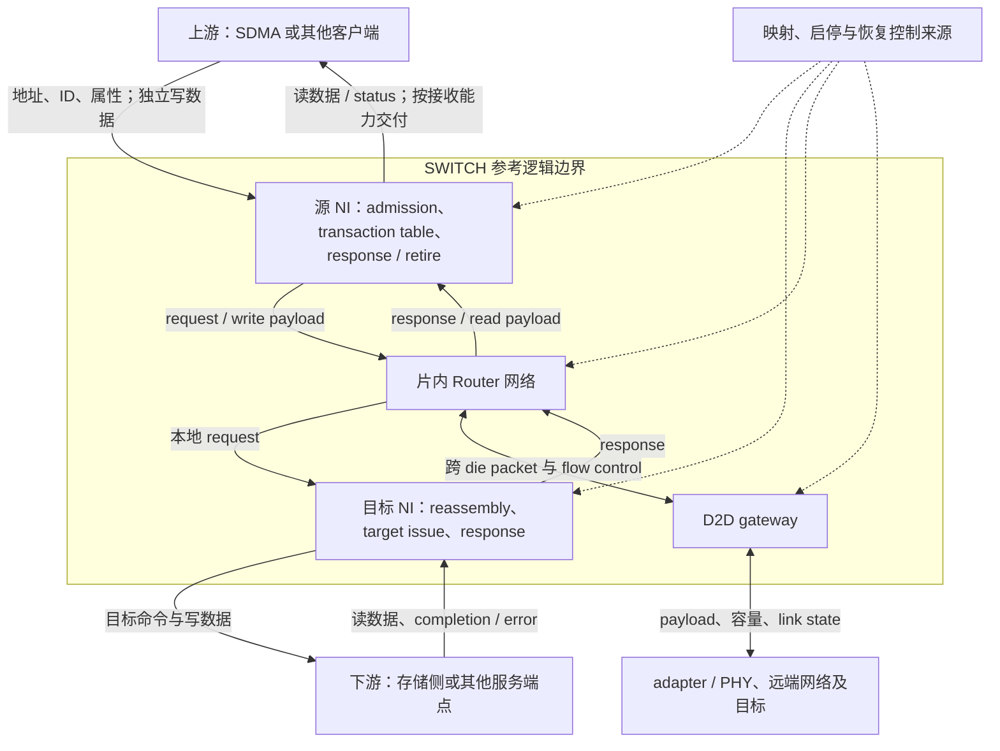
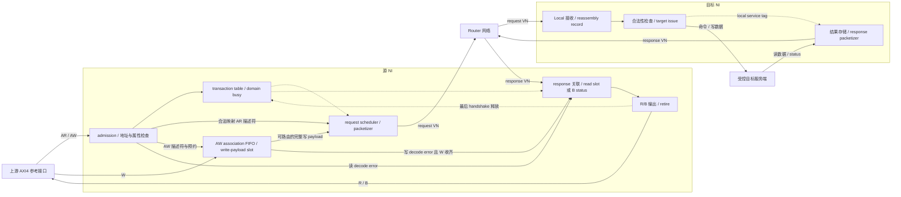
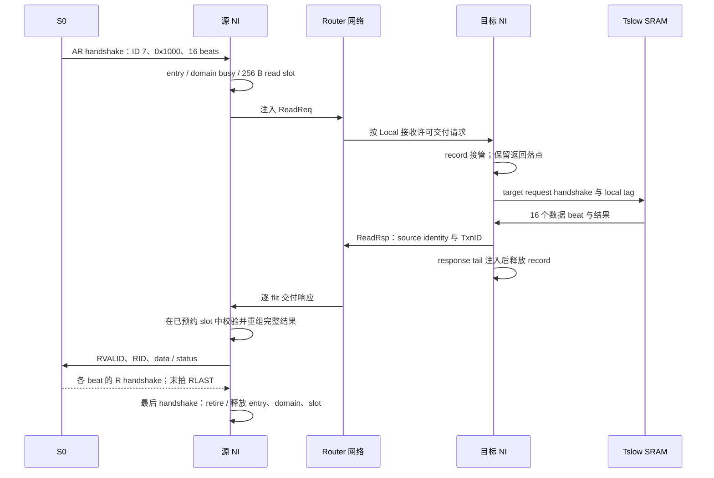
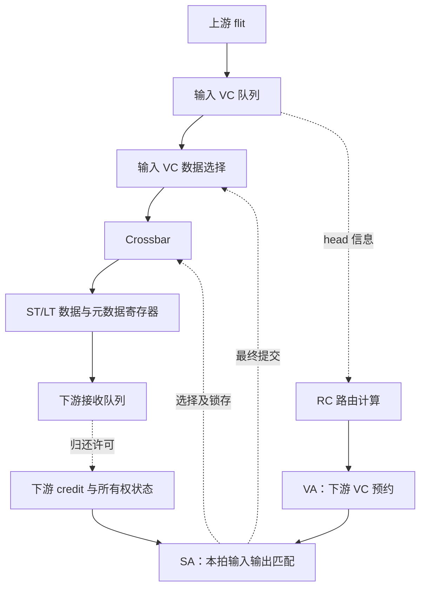
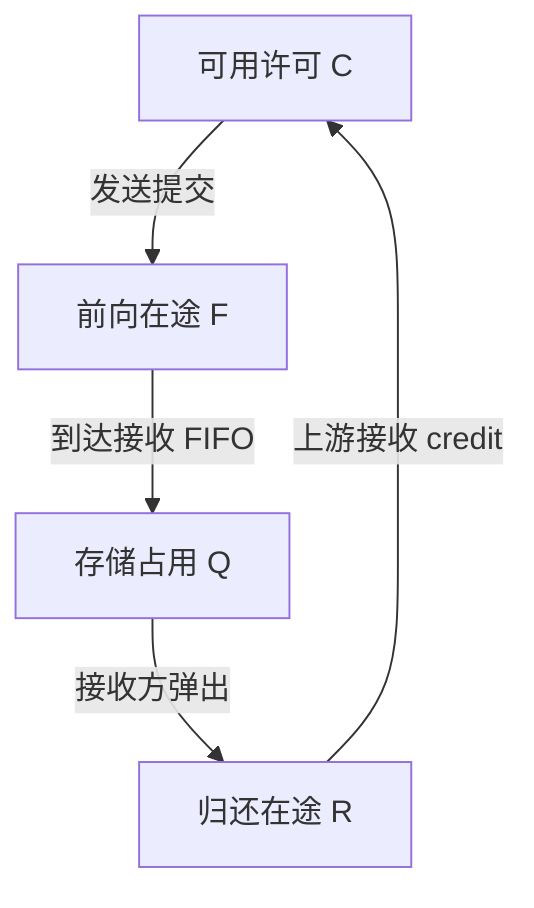
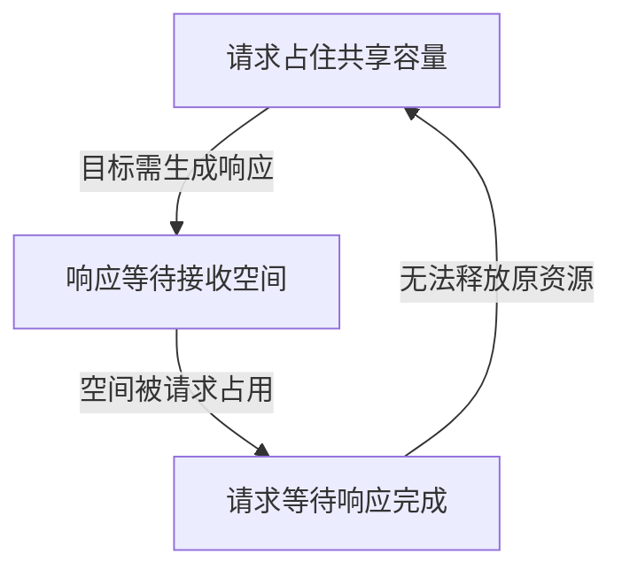
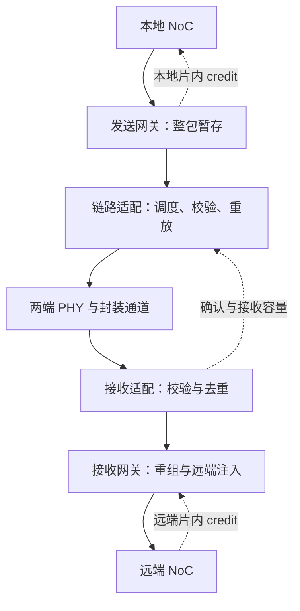

# SWITCH 微架构详解：从系统需求、上下游接口到 NI、Router 与跨 die 传输

版本：v2.3（第三轮已完成，证据见[进度页](RESEARCH_PROGRESS.md)）；更新日期：2026-09-25。本文在 v2.2 的整体结构中深化 NI transaction contract、有限并发、response 与 retire，并联动架构、接口和读写例子；Router 既有研究与模型结果继续保留。

常用英文名词与术语保留原文，必要时首次作简短中文解释，后文保持一致；具体规则见[写作范本](../chip-study-plan.md#常用英文术语保留原文)。正文按主题持续演进，轮次和执行证据单独记录；本轮正常 NI 契约不替代第 4 轮的全局 progress/reset 分析或第 5 轮的 D2D 深化。

本文要建立的是一套能讲清资源、接口和完整行为的参考微架构。研究对象以本项目的 AMD SWITCH 命名组织；由于目标芯片的真实拓扑和内部协议尚未公开确认，下面把**公开资料中的机制、本文选定的教学设计、目标实现待核实项**分开说明。片内基线沿用 R0，跨 die 扩展沿用 R1；它们是本文设计编号。

读完主线后，应能解释：一次请求为什么进入 SWITCH，谁决定目标，谁保存未完成状态，竞争时谁等待谁，返回如何找到原请求，以及“发出”“接收”“完成”各发生在哪里。精确教学位段和深层实现分支放在后部，资料细节可从[逐篇索引](../SWITCH/sources/README.md)进入。

## 1. 为什么需要 SWITCH

### 1.1 系统先提出了什么问题

设有两个请求源，同时访问两个目标。源端可能是 SDMA 的数据接口，也可能是缓存侧送出的访问；目标可能是本地存储侧端点，也可能需要跨 die 才能到达。

如果两个请求去不同目标，系统希望它们并行。如果都去同一个目标，就必须决定先服务谁。目标暂时不能接收时，已经接纳的请求不能丢失；读数据返回时，还必须知道交给哪个源、对应哪笔请求。

这些需求决定了 SWITCH 至少包含三类工作：

1. **选择路径与搬运数据**：识别目标，选择输出，把数据送到下一站。
2. **管理有限资源**：保存等待的内容，协调竞争，阻止发送方把接收方塞满。
3. **维持事务关联**：让请求、数据、响应和错误保持正确身份，并在约定的完成点归还责任。

组合多路选择器能选择当前数据，却不能独自完成后两类工作。因而微架构必须包含队列、状态、仲裁与接口控制，而不只是几组 MUX。

### 1.2 什么时候需要网络化

少量相邻 IP 可以直连，单级交叉开关也适用于规模有限的集中连接。当端点增多、距离变长、物理布线和共享带宽成为约束时，可以把传输拆成多个 Router 和链路，组成片上网络 NoC。

这是一种结构取舍：增加中间节点会引入排队和流水延迟，但可以限制单个节点的连线规模，并提供多条并行路径。不能仅凭“NoC”名称断言延迟更低，或推断具体 AMD 芯片一定使用 mesh。

### 1.3 本文所说的 SWITCH 包括哪一层

“switch”在不同资料中可能指交叉矩阵、一个 Router，或由端点接口、Router、链路组成的互联系统。本文先从完整传输服务看，再逐层打开：

| 名称 | 在本文中负责什么 | 不能据名称推定的能力 |
| --- | --- | --- |
| Crossbar | 在一个节点内，把选中的输入连接到选中的输出 | 自身不管理完整事务、路由或缓冲 |
| Router | 缓存 flit，选择下一跳，分配 VC 和输出带宽 | 不默认执行地址翻译、一致性目录或内存调度 |
| NI / NIU / bridge | 将端点事务变成网络消息，维护身份、接纳与返回 | 不天然支持全部 AXI、CHI 或 AMD 私有协议 |
| NoC | 组织 NI、Router 与片内链路 | 不自动包含跨 die 可靠性和 PHY |
| D2D gateway / adapter | 处理网络边界、传输格式、有限容量及适用的可靠性机制 | 点对点 D2D 链路本身不等于多端口交换机 |
| PHY | 在实际物理通道上发送、采样和恢复数据 | PHY 接收完成不等于内存事务完成 |

行业名称用于帮助检索和理解；最终应回到目标设计的模块边界。NI/Router 的公开划分可参考 [Garnet 总览 R4](../SWITCH/sources/R4-garnet-overview.md)，具体流水与职责以对应实现为准。

## 2. 典型功能与 feature：从需求推导结构

先区分“完成基本传输必需的功能”和“特定场景才需要的扩展”。同一个 feature 可能跨多个子模块，不能只给它找一个方框后就认为研究结束。

| 系统需求 | 功能或 feature | 主要位置及后续问题 |
| --- | --- | --- |
| 请求到达正确目标 | 目标映射、路由 | NI 确定目的端，Router 选择下一跳；两者作用域不同 |
| 端点事务格式与内部通路不同 | 打包、拆包、宽度适配 | NI 保存事务信息；网络按自己的粒度传输 |
| 多个源争用有限通路 | 仲裁、匹配 | 输入读口与输出链路都受约束，必须形成可兑现的匹配 |
| 下游速度变化 | 缓冲、流控、反压 | 接收存储与发送许可构成闭环 |
| 某个包受阻时，其他包仍有机会前进 | 多队列、VC、按需采用 VOQ | 减少相互阻塞，同时增加状态与调度成本 |
| 请求发出后还要接收结果 | 事务表、返回关联、接收预约 | NI 与目标端共同维护；Router 空槽不能替代返回空间 |
| 某些访问必须保序 | 排序域、注入限制或返回重排 | 在适用接口边界实现，不把局部 FIFO 顺序当全局顺序 |
| 请求与响应相互依赖 | 资源隔离、进展分析 | 网络队列、端点队列和共享池一起考虑 |
| 流量需要区别对待 | 公平仲裁、限流、QoS | 基础 RR 与最低带宽、时延保证分别研究 |
| 通路跨 die 或时钟域 | 网关、CDC、适用的检错/重放 | 增加新的资源承诺与状态恢复责任 |
| 复位、停链、错误不能污染后续事务 | quiesce、drain、错误收尾、身份隔离 | 需要端点、网络、链路和控制面协作 |
| 需要判断瓶颈 | 分层计数与延迟观察 | 指标必须注明位置、对象、单位与完成边界 |

本文先用有限的普通读写建立闭环，再说明相关扩展。原子、一致性 snoop、多播、完整协议兼容属于条件相关能力，不能因为包头留了字段就宣称已实现。

## 3. 整体微架构：先放回上下游系统

### 3.1 一条参考访问路径

下图描述**本文教学结构**。源与目标端点是明确的接口角色，不是已经核实的 AMD RTL 连线。真实芯片的模块映射在下一节单独说明。



这张图先回答“本模块接谁”。源 NI 面对业务接口，Router 面对网络传输接口；目标 NI 把消息重新转换为目标可处理的事务。只有目标在远端时才经过 D2D 分支。

读请求正向走，主要数据反向走；写请求的主要数据随请求正向走。因而“上游/下游”通常按请求服务关系命名，不能据此认为所有数据都朝同一方向流动。每条发送路径还有反向的流控信息，其作用在第 9 节解释。

### 3.2 放到 AMD 项目中，哪些关系已有依据

| 相邻对象 | 研究 SWITCH 时需要知道什么 | 现有依据和边界 |
| --- | --- | --- |
| SDMA | 请求类型、地址空间、数据供给、返回空间、完成及停止发起后的责任 | shaobo 摘要记载 BE 的 DF 数据接口、TBE 的翻译/MMHUB 联系；不能合成所有 SDMA 请求共用的一条链。见[模块映射](../module-map.md)及[SDMA 接口方案](../SDMA/research-plan.md) |
| GC / GL2、EA、HUBS | 何处产生需继续传输的请求，哪些访问被 cache 满足，身份和属性如何交接 | 按产品和请求分支核实；这些学习目录不证明它们一定直接连接本文 NI。见[GC1](../GC/sources/GC1-cdna2-memory.md)、[HUBS 入口](../HUBS/README.md) |
| DF / CS | 地址归属、目标选择、适用的一致性/顺序与响应责任 | AMD 历史资料区分 master、transport、CS 和 UMC；其具体连接不直接外推到目标 GPU。见[P1](../DF/sources/P1-ryzen-fabric-topology.md) |
| CAKE / 跨 die 端点 | 哪层承担封装或芯片间扩展，和 SWITCH、adapter、PHY 如何分工 | CAKE 与本项目 SWITCH 的一一对应未确认；不能按名称直接相等。见[P1](../DF/sources/P1-ryzen-fabric-topology.md)、[FAB1](../DF/sources/FAB1-cdna3-iod-memory.md) |
| UMC、PHY、HBM | 存储侧请求如何接纳、何时返回；网络的“目的端”离实际 bank 还有哪些处理 | UMC 的命令调度、HBM 行/bank 行为留在对应模块；SWITCH 必须保留所需身份与完成约定。见[HBM 地址路径方案](../HBM/address-interleaving-plan.md) |
| UTCL1 / UTCL2 | 当前接口接收哪类地址，翻译结果与权限由谁提供 | 翻译服务与数据传输分开；本文 R0 在入口使用已完成所需翻译的地址，不把所有 payload 画成串行穿过 TLB |
| 配置、复位与管理来源 | 谁配置目标映射，何时允许注入，停流/复位如何通知 | 按目标控制接口确认；不把 CF、SMN、RSMU 自动视为同一控制网络 |

这种定位必须先做，才能知道内部设计在解决谁的需求。同时，当前只需研究相邻模块提供的接口约定，不必把它们整套内部实现搬进 SWITCH 文档。

**待核实的目标事实：** SWITCH 的实际拓扑、端点数量、接口协议、与 DF/CAKE 的归属、地址映射所在模块及 D2D 模式。这些会改变架构判断，属于关键未知；后文教学结构不会替它们作答。

### 3.3 从外部接口打开内部子模块

| 子模块 | 为什么需要 | 输入、输出与关键状态 |
| --- | --- | --- |
| 接纳与入口检查 | 在承诺服务前确认请求合法且有资源 | 端点请求→合法内部事务；保存请求属性和资源预约 |
| 事务表与目标映射 | 网络传输时间不固定，源身份需跨多个阶段保留 | 地址/原 ID→目的节点/内部 ID；保存返回关联、排序域、完成状态 |
| AW association 与 write-payload buffer | AW/W 可独立出现，W 又不能自行携带 AXI4 事务 ID 选择目标 | AW 接纳顺序→entry/slot；按 beat 填充，整包就绪后注入 |
| Response buffer 与 retire 控制 | 目标返回和上游接收可能相隔很久 | 预留 slot→完整结果→R/B 交付；维护输出稳定性和最后一次 handshake |
| Packetizer / depacketizer | 事务长度与链路粒度不同 | 事务↔packet/flit；保存包边界、长度和重组进度 |
| 输入队列与 VC 描述符 | 下游未就绪时保留数据及包的上下文 | flit→队头；保存占用、路由、VC 映射及包状态 |
| 路由计算 RC | 决定当前节点从哪个方向继续 | 目的节点+当前位置→输出方向 |
| VC 分配 VA | 给整包取得下一跳的逻辑队列使用权 | 待路由 head→下游 VC 预约 |
| Switch 分配 SA | 决定本拍哪些数据实际共享交换矩阵 | 可服务 VC→输入/输出匹配 |
| Crossbar 与链路流水 | 把赢家的数据和身份送往下一跳 | 队头→输出 flit；保存不可变的传输快照 |
| 下游资源状态与 credit 处理 | 距离使“对面当前有空”无法即时观察 | 返回许可→可发送数量/VC 所有权状态 |
| 目标适配与响应生成 | 网络到达只完成运输，目标仍需处理业务 | 请求包→目标接口→响应包；保存执行与错误状态 |
| D2D 网关与适配 | 跨 die 通路有不同格式、容量和可靠性边界 | 本地 packet↔跨 die record；保存重组、重放和接收承诺 |

各功能可以在实现中合并，但合并以后责任仍然存在。例如把 VA 合入 SA，不代表下游 VC 可以不分配；把事务表和返回缓冲合并，也不代表两者释放时间相同。

### 3.4 NI 的内部接入位置

下面把同一条访问路径打开到 NI 内部。实线表示请求/数据/结果交接，虚线表示身份、资源预约和调度控制。源 NI 和目标 NI 是职责角色；一个物理端点也可以同时具备两种角色。



R/B 输出到上游、目标命令/数据到服务端、flit 到 Local 接收侧，都有独立的接纳条件。反向 READY/credit 和具体资源释放见第 4、6 节；图中的一条箭头不是无限容量，也不表示所有交接能在同一拍完成。

## 4. 接口先讲清，再讨论内部如何执行

### 4.1 六类关键交接

| 接口边界 | 传递什么 | 接纳及流控 | 返回/完成的含义 |
| --- | --- | --- | --- |
| 请求源↔源 NI | AR/AW 地址、ID、长度及属性；独立 W；反向 R/B | AR 预约 entry/read slot；AW 预约 entry、AW 关联和 write slot；W 按队首关联接收 | AR/AW handshake 是 admission；最后 R handshake 或 B handshake 才是本 NI 的 retire |
| NI↔本地 Router | flit、包边界、网络类别和所用 VC | 使用明确的注入/弹出协议；本项目模型的源注入是理想 ready/valid，不能冒称已实现完整 NI | 注入完成只说明包已离开 NI；弹出后还需重组和业务交付 |
| Router↔Router | 正向 flit、逐跳 VC；反向槽 credit 与 VC 释放信息 | 发送前已有接收许可，许可包含在途承诺 | credit 归还只释放相邻队列资源 |
| 目标 NI↔目标服务端 | 操作、地址、长度、local service tag；写数据与返回数据/status | record 已保存完整写 payload 或预留读返回空间；命令、数据和结果各自交接 | 本文受控 SRAM 写更新并对其后续读可见后返回；target issue 本身不是 completion |
| NoC↔D2D 网关↔adapter/PHY | 包、跨链路传输单元、状态和流控 | 本地槽、远端整包容量和重放空间分别管理 | 链路确认与业务完成分开 |
| 控制面↔上述子模块 | 映射、启停、配额、错误与恢复命令 | 配置生效需兼容在途状态和已承诺容量 | 停止接纳、排空、复位完成是不同状态 |

这里的“接口”首先是一份行为约定。信号名和位宽是其实现形式；如果不先说明谁接管责任、何时允许撤销，就算列出全部端口，也难以解释系统是否正确。

### 4.2 四种传输粒度

| 粒度 | 含义 | 本文例子 |
| --- | --- | --- |
| 命令 | 源端要完成的整体工作 | 一次 SDMA 搬运可拆成多笔读和写 |
| Transaction | 需要关联和完成判断的业务访问 | 读 256 B，等待对应数据或错误 |
| Packet | 网络按包维护路径/状态的传输对象 | 一个读请求包和一个读响应包 |
| Flit | 网络流控与交换的基本数据粒度 | R0 每 flit 16 B；长 packet 含多个 flit |

物理传输粒度还可能更小。16 B flit 通过 4 B 宽通路需要多个传输节拍；NoC flit、UCIe flit 和本文教学链路 cell 也不是同一格式。换宽度会改变吞吐、缓冲与时序，不能只改一个名词。

### 4.3 地址、目标和身份不要混成一件事

在 R0 中，源 NI 根据地址和映射决定目标节点 DstID；Router 用 DstID 与当前位置选择下一跳。**目标归属与下一跳路由是两次不同的选择。** 若真实系统已由 DF/CS 或其他模块给出目标 ID，NI 可以只接收该结果；具体分工需由目标资料决定。

原请求 ID、内部 TxnID、节点 ID、逐跳 VC 编号及软件上下文标签也各有作用。TxnID 用于找到未完成事务，VC 编号用来定位这一跳的队列。同一个 packet 可在每跳使用不同 VC，返回时仍通过事务身份关联原请求。

对 HBM 而言，Router 选一条可达目标的路径，不等于重新决定数据存在哪个 stack、channel 或 bank。系统目标交织、UMC 地址解码与 NoC 路由应分别定位；分包是否同时拆成多个内存事务也需明确责任。

### 4.4 本轮固定的 AXI4 参考子集

本项目目标协议尚未确认。以下是用于 R0 的公开协议参考约束，定义本文究竟支持哪类输入，不能称为 AMD 的真实接口或完整 AXI4 bridge。

| 项目 | 本文采用的约定 | 对内部结构的影响 |
| --- | --- | --- |
| 地址与范围 | 已完成所需翻译；地址按 16 B 对齐；整个访问归一个目标，不能跨 4 KB | admission 核对完整范围；Router 只处理选定目标 |
| 数据与 burst | AXI data width=128 bit；INCR；AxSIZE=4；AxLEN=0–15，即 1–16 个 full-width beat、16–256 B | 一个 payload beat 对应一个 16 B data flit；最长 payload slot 为 256 B |
| 写 byte lanes | 正常数据访问 WSTRB 全有效；W 的先后与 AW 接纳顺序关联 | 无需把所有 byte-enable/宽度转换组合混入基线；边界仍按计数和 WLAST 核对 |
| Memory attributes | Normal Non-cacheable Non-bufferable，AxCACHE=0b0010；AxLOCK=0；固定已授权的 data context | 源 NI 不提前产生成功 B，不做 cache/coherence；属性与保护边界不能静默降级 |
| 并发和 ordering | 每个源/端口、AXI ID、读写方向构成一个 domain；每 domain 一笔到 retire，不同 domain 有限并发 | table 保存 domain busy；读写分别控制，不假设跨通道顺序 |
| Response | 读仍返回 AxLEN+1 个 beat，最后一个带 RLAST；写每笔只返回一次 B | 最后 handshake 才释放相应责任；错误也不得提前截断 |
| 目标完成 | 受控 SRAM 读出规定数据；写更新并对该目标后续读可见后响应 | target NI 保存 service tag 和返回容量；替换为 UMC/cache 时重新核 completion contract |

AXI 的握手、属性编码、burst 和顺序依据见 [R8](../SWITCH/sources/R8-axi-ordering-contract.md) A3–A6。这里的容量、整包存储和单 domain 串行是本文选择，不是协议强制的唯一实现。普通读写以外的 exclusive、atomic、snoop、WRAP、窄传输等是显式范围限制，集成时须约束输入或提供另行验证的适配；不能把“未研究”当作可随意丢弃已接纳数据的理由。

## 5. 先走完一次普通读写

### 5.1 为贯穿例子固定最少假设

沿用既有 R0：同一 die 上的 mesh；每个 Router 最多 N/E/S/W/Local 五个输入和输出；每输入四个私有 VC，分为请求 VN 两个、响应 VN 两个；每 VC 八个槽；16 B/flit；一个物理输出每周期最多发一个 flit。

VN 是按协议用途划分的资源类别，VC 是类别内可分别保存包状态的队列。本例中请求和响应使用独立槽与状态，而不只是一个分类标签。目标先用行为明确的受控 SRAM：读出数据后返回；写完成并对该控制器后续读取可见后返回。将它替换为真实 UMC 或缓存端点时，必须重定完成语义。

合法事务使用第 4.4 节的完整子集。贯穿场景有 S0/S1 两个源及 Tslow/Tfast 两个受控 SRAM 目标；下面先跟随 S0 的一笔访问，第 6.10 节再加入同时在途的其他请求。源 NI 演算配置为 4 个 entry、2 个 read-response slot、2 个 write-payload slot，后两者每个 256 B；目标 NI 各有 2 个有限 record。这些 NI 参数不改变既有 Router 模型，也不表示已经把完整 NI 接入该模型。

### 5.2 读 256 B：请求很短，返回很长

假设 S0 读取 Tslow 地址 0x1000 起的 256 B，ARID=7、ARLEN=15、ARSIZE=4。只有 table、read domain 和完整返回 slot 都可接纳时，AR 才 handshake；源 NI 分配内部 TxnID=7，并保存它与原端口/ARID 的关系。两个 ID 此处数值相同只是例子，不能依此省掉映射。R0 包头独占一个 16 B flit：

- 读请求只有一个同时标记 head/tail 的 flit，长度字段描述要读多少数据。
- 读响应是一个 head 加十六个数据 flit，共十七个；最后一个带 tail。
- 网络发送该读请求时不需要把 256 B 数据随请求送出，因为数据尚在目标端。



图中网络不是一次无条件转发。每跳都可能等待 VC、输出带宽或 credit；但源 NI 的表项在这段等待中持续存在。请求包离开源 NI，并不让 TxnID=7 立刻可复用。

响应到达时，NI 根据完整关联键找到表项，核对类型、长度和预期字节范围。收到 head 只说明返回开始，收到 tail 并通过检查后才能判断整包是否齐全；向源端交付还要遵守该接口的接收和顺序约定。

因此 RREADY 暂时为零时，返回数据可以已存入预约 slot，entry 仍不能释放。只有 16 个 R beat 全部被上游接收才 retire；只交付前 15 个 beat 不等于整笔读完成，错误 RRESP 也不减少要求的拍数。

### 5.3 写 256 B：数据齐全与写完成之间还有一段路

S0 写 Tfast 地址 0x8000 起的 256 B，AWID=9、AWLEN=15、AWSIZE=4。AW 与 W 可以独立出现；R0 的保守方案先为 AW 分配 entry、AW association 和完整 payload slot，按关联接收 16 个 W beat，收齐后才向网络注入，因此 WriteReq 仍是十七 flit。

| 过程 | 接管者及发生的事件 | 哪些状态可以释放 |
| --- | --- | --- |
| W 先出现 | 尚无对应 AW 时不发生 W handshake，数据由源端保持 | 无；NI 尚未接下这拍数据 |
| AW admission | 源 NI 保存地址/ID，预约 payload 和 B status | 无；后续 W 接收责任已经成立 |
| W 全部收齐 | 16 个 beat 均握手且 WLAST 正确 | AW association FIFO 元素释放；payload 和 transaction entry 保留 |
| WriteReq tail 注入 | 本地 Router 已接管最后 flit | 源 write-payload slot 释放；entry 和 write domain 继续等待 |
| 目标重组与执行 | 目标 record 收齐后下发命令/数据；SRAM 更新并达到规定可见性 | 不产生源端提前 retire；目标 record 仍要保存 WriteRsp |
| WriteRsp tail 注入 | 目标的响应由本地 Router 接管 | 目标 record 释放 |
| 源 NI 收到响应 | 核对 source/TxnID 后提供 BVALID/BID/BRESP | BREADY=0 时继续保持；只有 B handshake 才 retire |

这样选择的原因是：一旦 head 占住网络路径，若后续数据还依赖一个无法前进的本地生产者，网络资源可能被长时间扣留。先收齐再注入，把这类等待放在可控的入口缓冲中。代价是更大的 NI 存储与额外首包延迟。

流式注入可以降低这部分成本，但必须重新说明数据供应、取消、部分包和恢复责任。它是可研究的结构分支，不能在保持其他前提不变时直接删掉整包缓冲。

### 5.4 哪里会停，停住以后保留什么

| 停顿位置 | 仍须保存的内容 | 允许恢复的条件 |
| --- | --- | --- |
| NI 没有 entry/slot 或同 domain 仍忙 | 尚未接纳的地址由源端保持；已有事务的资源不能撤销 | 对应资源释放，且 domain 已 retire |
| W 已出现但尚无对应 AW | W beat 仍由源端保持，尚未发生数据交接 | AW admission 和已预约 payload slot 就绪 |
| Router 没有下游 VC | 输入包、路由结果及已收到 flit | 合法下游 VC 可分配 |
| VC 已分配但没有 credit | 当前 packet ownership、队列及后续路径 | 下游归还接收许可 |
| 本拍输掉输出仲裁 | 完整队头与状态 | 后续真正获得匹配 |
| 目标尚未接纳或完成 | 目标 record、local service tag、payload/返回容量 | 目标取得服务并返回数据或可收尾错误 |
| 源端暂不取 R/B | NI 已接收结果、entry/domain 和稳定的输出 beat/status | 最后 R handshake 或 B handshake；不能仅因 response 到达就回收 |

这个表把等待落到资源上。后续各节要解释的，就是这些资源如何取得、保持与释放。

## 6. NI：把业务事务与网络传输接起来

NI 需要跨越两个不同的时间尺度：上游在某个 edge 交付一拍地址或数据，网络和目标却可能很久以后才送回结果。因此 NI 的核心不是把字段换个名字，而是**从 admission 到 retire 持续保存一笔 transaction 的责任**。下面沿第 5 节的同一 R0 基线展开；协议事实来自 [R8](../SWITCH/sources/R8-axi-ordering-contract.md)，具体队列、容量及调度选择是本文参考设计。

### 6.1 Admission：一次握手承诺了什么

对于上游，AR handshake 表示 NI 已接下整个读请求；AW handshake 表示已接下写地址及随后接收对应 W burst 的责任。W 的每次 handshake 只转移一个 beat。三者都不能用“以后网络也许有空”作为接纳依据。

本轮用一组有限容量演算行为：每个源 NI 有 **4 个 transaction table entry、2 个 256 B read-response slot、2 个 256 B write-payload slot**，AW association FIFO 最多记录 4 个 entry 索引。每个 entry 内有独立的 completion status，因而写响应不再临时申请一个可能被长读占满的公共 buffer。R/B 各有一个保持当前输出的寄存器位置；它们不是额外的事务额度。这些数值用于解释接纳和等待，不是目标芯片参数或吞吐最优配置。

| Admission 事件 | 必须同时可用的资源与条件 | 接纳后必须持续承担的责任 |
| --- | --- | --- |
| AR handshake | 空闲 table entry；该 read domain 空闲；一个完整 read-response slot；已完成入口检查 | 保存地址、原 ID、内部 TxnID 和目标；保留返回容量直至最后一个 R beat 被上游接收 |
| AW handshake | 空闲 entry；该 write domain 空闲；一个完整 write-payload slot；AW FIFO 位置；entry 内 B status 可用 | 保存写地址和顺序位置；接收全部 W beats；等待目标或本地错误结果；交付一次 B |
| W handshake | AW FIFO 队首已有已接纳地址；其 payload slot 已预约；当前 beat 有写入机会 | 只写入队首事务的下一个 beat；更新计数，不为 W 另建一笔 transaction |

read/write domain 在第 6.5 节定义。短读即使只有 16 B，也占用一个 256 B slot；未写入的余量仍已承诺给该 entry，不能再次分配。改为可变长度池能减少这种浪费，但还要说明碎片、分配元数据和端口约束，本基线先不引入。

表中的条件是资源判定，不是把输入信号直接组合连接到 READY 的代码。AXI 边界采用寄存后的 READY/VALID；向下一拍发出 READY 许可时，相关额度已为该候选保留，不能再授给另一个 AR/AW。真正的 transaction 接纳记录在 handshake edge。并发候选由 admission 仲裁统一扣除可用额度，返回释放在下一拍成为可申请资源；下面的事件表省略这些准备拍，不声称零气泡接纳。握手稳定性和无输入到输出组合路径的规范依据见 R8 的 A3.1–A3.3。

### 6.2 AW/W 独立到达，怎样仍然配对正确

AXI4 的 W 通道没有用于选择事务的 WID。本文按**同一源端口的 AW 接纳顺序**维护 association FIFO：每个元素指向一个已分配的 transaction entry 和 payload slot；W 只能填队首，直到规定的最后一个 beat 握手后才弹出这个关联元素。这条 FIFO 管写数据配对，不承担全网 transaction ordering。

| 到达情况 | 本基线怎样接收 | 为什么不会把数据配给别的事务 |
| --- | --- | --- |
| AW 先到 | 接纳 AW、预约 slot；W 以后逐拍写入 | 地址、长度和 slot 已在队首 entry 中固定 |
| W 先出现 | 尚无对应 AW 时 WREADY 保持低；源端保持 WVALID、WDATA、WSTRB、WLAST，继续独立提供 AW | 未握手的数据仍归源端；NI 不猜它的 ID 或目标 |
| AW/W 同时出现且 FIFO 原先为空 | 先完成 AW admission；随后才给对应 W 接纳机会 | 基线不使用同 edge 穿透，避免地址与资源尚未提交就接下数据 |
| 前一写的 W 尚未收齐，后一 AW 已接纳 | 后一 entry 和 slot 可以先占位，W 仍属于队首 | 最后一次 W handshake 才切换关联，不能因后一目标更快而跳过前一 burst |

源端的 AWVALID/WVALID 必须遵守协议依赖，不能等 NI 拉高 READY 才产生 VALID。因而“NI 等 AW 后再接 W”是本设计选择，“源端必须先等 W 被接收才肯给 AW”则不能作为兼容的输入前提。[R8](../SWITCH/sources/R8-axi-ordering-contract.md) A3.3.2、A5.2 保存相应规则。

以 256 B 写为例，AWLEN=15，接收第 0–15 个 W beat；只有 beat 15 的 handshake 同时携带 WLAST，payload 才完整。WLAST 是核对边界，不能替代按 AWLEN 保存的计数。过早/过晚 WLAST 属于协议违约，不能当作普通 SLVERR 后擅自把余下 W 配给下一项；本轮针对合法发送者，不声称已实现任意畸形输入的恢复。

收齐 W 后，AW FIFO 位置可以复用，write-payload slot 仍须保留，直到整个 WriteReq 被本地 Router 接管。这解释了为什么 AW FIFO pop、payload free 和 B retire 是三个不同事件。

### 6.3 从 entry 的状态看完整生命周期

每个 entry 保存原端口/AXI ID、读写方向、内部 TxnID、上下文、目标、地址和长度、slot 索引、收发计数、结果状态及是否已交付。entry 的核心阶段如下；等待状态不代表占用专用物理流水级。

| 阶段 | 进入条件与正在做的事 | 保留的资源 | 前进或释放事件 |
| --- | --- | --- | --- |
| GATHER_W | AW 已接纳，逐拍收 W | entry、write domain、AW FIFO 位置、payload slot、B status | 合法最后 W beat 后弹出 AW 关联，转 READY_REQ；本地 decode error 则转 READY_RSP |
| READY_REQ | AR 已接纳，或完整写 payload 已就绪 | entry/domain；读的返回 slot 或写 payload | request scheduler 选中且注入接口接受首 flit，转 ISSUING |
| ISSUING | 沿同一 packet 发送剩余 flit | entry/domain、发送进度；写 payload 不提前覆盖 | 请求 tail 被本地 Router 接管，转 WAIT_RSP；此时写 payload slot 可释放 |
| WAIT_RSP | 请求已交给网络，等待目标处理与返回 | entry/domain；读的 response slot；写的 B status | 匹配 response 全部接收并核对后转 READY_RSP |
| READY_RSP / DELIVER | 已有完整读结果或一个写 status，等待/执行上游交付 | entry/domain；读 slot；当前输出的 ID、data/status、beat 位置 | 最后 R handshake 或唯一 B handshake 才 retire |
| FREE | 前一 transaction 已 retire | 无旧事务责任 | 后续 admission 才能重新分配 |

单 flit ReadReq 可以在一次注入 handshake 同时完成首、尾交接，但不能据此释放 entry。源 NI 采用完整接收 ReadRsp 后再对上游发送 R 的保守策略，因此 response head 到达、response tail 到达和最后 R handshake 又是不同事件。

本地生成的 decode error 沿同样的 READY_RSP/DELIVER 出口完成，不向 NoC 发请求。只有正常字段和完整 packet 可按上述状态推进；身份、长度或 packet 边界损坏须进入故障处理，不得把“等待太久”写成成功 retire。reset、epoch 切换和故障隔离的闭环由第 4 轮接续，第 13 节保留当前边界。

### 6.4 容量和身份分别在何时回收

| 对象 | Allocate / reserve | 保持到何时 | 不能用什么事件提前释放 |
| --- | --- | --- | --- |
| transaction entry、内部 TxnID、domain busy | AR/AW admission | 上游最后 R handshake 或 B handshake；异常中按恢复契约处理 | 请求注入、目标接纳、response head 或 tail 到达 |
| 源 read-response slot | AR admission | 该读 retire，整 slot 归还 | 数据已经写进 slot，或仅前几个 R beat 已交付 |
| 源 write-payload slot | AW admission | 正常请求 tail 被本地 Router 接管；本地 decode error 则在全部 W 收齐后释放 | AW FIFO pop、首 flit 注入 |
| AW association FIFO 元素 | AW admission | 规定的最后一个 W beat 握手 | WVALID 仅出现、目标已可用 |
| entry 内的 B status | 随写 entry 预留 | B handshake | 目标发出 B 或 NI 收到 WriteRsp |
| 目标 NI record | 接下新 request head 前 | 对应 response tail 被本地 Router 接管 | request tail 已接收、target issue 或目标刚执行完 |
| Local 接收 VC/槽许可 | 网络接口分配/接收规则 | flit 确实转入已预约的 NI 存储后归还槽许可；完整 tail 接管后归还 ownership | 业务尚未接管时仅看“已经到终点” |

对于本轮正常 R0，返回关联键至少包含 source NI identity 与内部 TxnID；每个源 NI 的 table 再恢复原端口、AXI ID 和方向。S0、S1 都使用 AXI ID=7，甚至各自分配内部 TxnID=7，也不会成为同一笔访问。目标 NI 的 local service tag、NoC 节点 DstID 和逐跳 VC 编号仍各自独立，不能互相替代。

返回时同时检查 entry 有效、预期目标/来源、类型、长度及上下文，不只看一个数值 TxnID。正常情况下 retire 后才允许复用；有 late response 或状态丢失时，还须满足第 13 节的旧流量隔离条件。有限 epoch 回绕不能单独构成安全证明。

### 6.5 Ordering：先把需要保持的顺序定义清楚

本基线将 ordering domain 定义为 **源 NI/源端口、AXI ID、读或写方向**的组合。同一 domain 从 AR/AW admission 到 R/B retire 只允许一笔 transaction；即使下一笔去同一个目标，也先等待。不同 domain 可以并发，受总 entry、slot 和真实端口带宽限制。

这个选择直接维持同 ID 的 read-response ordering 和 write-response ordering，并以更强的串行约束简化同方向访问的 issue 顺序。读与写分别建 domain：同一个数值的 ARID 与 AWID 不形成跨通道 fence。若 S0 必须写后读到新值，在本文受控 SRAM 场景中，先接收该写的成功 B，再发起相关读；不能只令读写 ID 相等。多个源并发改写同一地址仍需要上层同步，不能由 NI 的 ID 规则猜出业务先后。[R8](../SWITCH/sources/R8-axi-ordering-contract.md) A5/A6 说明顺序与 observation/completion 的区别。

限制也要讲清：一个未能接纳的同 ID 请求占住上游 AR/AW 通道时，后面的不同 ID 请求可能无法越过它。已经接纳的其他 entry 仍可继续，但本文不声称任意输入排列下都没有 HOL。源端怎样组织独立请求，仍影响实际并行度。

| 策略 | 为同一 domain 允许什么 | 必需状态与前提 | 代价 |
| --- | --- | --- | --- |
| 本文单笔在途 | 前一笔 retire 后再接下一笔 | domain busy、每笔返回容量与唯一关联 | 简单，但同 ID 延迟难以隐藏 |
| 同 ID 同目标限制 | 可在一个目标保持多笔，旧事务未收敛前不换目标 | outstanding 计数、目标记录；从 NI 注入、目标服务到返回调度都须保持所需顺序 | 减少重排需求，跨目标时仍可能阻塞 |
| 带 ROB 的 NI | 同 ID 可同时访问不同延迟目标，返回先入对应位置再按序交付 | sequence/reorder table、按返回大小预约的存储、提交指针；另行满足请求 issue/观察顺序 | 存储与控制更复杂，并可能出现等待早期响应的占用 |

[FlooNoC §III-A / R7](../SWITCH/sources/R7-floonoc-paper.md)提供后两种行业比较。其静态路由和目标返回顺序假设必须一起看；在本文多 VC 网络中，仅说“都是 XY routing”不能推出同目标多笔必定按序。ROB 也不能修复已经错误执行的有副作用写顺序。本轮完整展开第一种策略，后两种保留条件和取舍，不把三者混成同一个基线。

因此，本例虽然有 read-response buffer，却没有用于同 ID 多笔乱序提交的 ROB。buffer 解决数据落在哪里，ROB 还解决多笔结果按哪个先后交付。

### 6.6 目标 NI：从最后一跳接管，到目标真正执行

源 NI 的 response reservation 不会自动给远端分配 request 空间。目标 NI 另有有限 record；本轮每个目标 NI 使用 **2 个 record，每个含描述符、最多 256 B 的 payload 区及 response status**。一个 record 的数据区在写时接收请求 payload，在读时存放返回数据；同一 record 不同时承担两笔事务。

最后一跳 Router 与 NI 之间的 Local 接收队列先按 flit credit 限制在途流量。NI 将 request head 从该队列转入新 record 前，必须先取得整个 record；没有 record 时 head 留在有容量保护的 Local 队列中，backpressure 经网络返回。取得 record 后，将该 packet 后续 flit 放入它，按实际转移归还槽 credit；合法 tail 完整接管后可归还 VC ownership，而 record 继续等待目标。这是**网络资源交给 NI 存储**，不是把尚未执行的请求丢掉。

| 目标 record 阶段 | 必须已具备什么 | 等待对象与保留内容 |
| --- | --- | --- |
| REASSEMBLE | 已分配 record；packet 与 Local VC 关联固定 | 等其余 flit；保存来源、TxnID、操作、字节数与已到数据 |
| WAIT_TARGET | 整包核对完成；读 response 容量或写 payload 已在 record 中 | 等目标 req_ready；描述符和数据不能改指向 |
| EXECUTE | target request 已被接受 | 写按 beat 向目标交付，读按 beat 接回；local service tag 始终指向原 record |
| SEND_RSP | 全部读结果或写 status 已取得 | 等 response VN 注入；保存返回目的、原 TxnID 和完整结果 |
| FREE | response tail 被本地 Router 接管 | record 才能供新 request head 使用 |

目标接口在本文采用行为明确的命令/数据交接：req handshake 交付操作、地址、长度和 local service tag；写数据另按 16 B beat 和 last 交接，读结果或写 status 带回该 tag。目标 NI 只有在完整 WriteReq 已重组后才发写命令，读命令发出前返回空间已经落实。描述符先被目标接纳，不等于数据可以立即覆盖。

两个受控 SRAM 目标各自一次执行一笔访问；目标 NI 按完整请求就绪顺序选择待执行 record。正常写在全部数据接收、更新完成且对该控制器后续读可见后返回成功 status；读给出规定数量的数据后结束。目标暂不接纳时保持命令稳定，执行后若返回接口受阻则保持结果，不依赖先接新命令才能返回旧结果。真实缓存/UMC 若采用不同的完成点、多个 service tag 或乱序执行，必须重新核对该契约。

R0 的读目标在开始返回前确定整笔 OKAY 或 SLVERR，所有 beat 使用同一 RRESP；失败读返回规定数量的占位数据，内容不作为有效读结果。这是受控目标的限制，不是 AXI 一般规则。若后续桥接的目标会逐 beat 混合报错，必须增加逐 beat status 保存/传输，不能把它压成一个不加说明的整包 status。

[Garnet R22](../SWITCH/sources/R22-garnet-network-interface.md)中，tail 可能因协议 MessageBuffer 无空间而继续占住 VC。本基线在完整 record 接管后释放网络 VC，后续阻塞落在有限 record 中。释放点不同的原因是已接管容量不同，不能把模拟器中删除 flit 对象当作硬件 payload 可以丢弃。

### 6.7 Response 接收与 retire：容量已经有了，端口仍可能等待

源 NI 按返回键把 response 写入 admission 时预约的 slot，记录收到的 beat 数和整包检查结果。预约保证存储所有权，不表示写端口每拍无限可用；发生端口冲突时，Local 队列/credit 仍可短暂停顿。目标、网络和端点最终获得服务，是继续前进的环境条件。

ReadRsp 完整后进入可交付集合。R 通道的 RR 选择一个就绪 entry，并保持该 burst 直到最后一个 beat handshake；本基线不交织不同 ID 的 R beats。RREADY=0 时，RVALID、RID、RDATA、RRESP、RLAST 与 beat 指针保持，不能因为另一个更早完成的 packet 到达就替换当前输出。最后一个 R handshake 才同时清除 domain busy、entry 和 read slot。

B 通道独立选择已取得结果的写 entry，BREADY=0 时同样保持 BVALID/BID/BRESP。只有一次 B handshake 才 retire；BVALID 首次拉高和 B handshake 不能各释放一遍。R/B 独立保持状态，堵住 R 不要求暂停已经有 status 的 B。

对合法输入，写 response 不能早于 AW 和全部 W 的接纳；正常成功 B 还须等受控目标定义的写完成。源 NI “收齐 W”“把 WriteReq 发走”都不是提前成功应答的理由。本基线选择 Non-bufferable 接口，回应责任落在目标；规范及属性范围见 [R8](../SWITCH/sources/R8-axi-ordering-contract.md) A3、A4、A6。

### 6.8 错误也必须走完已经接下的 transaction

正常 backpressure 表示暂时没有资源，尚未 handshake 的请求仍归源端。地址错误则是一个需要有确定结果的访问，不能通过永久压低 READY 冒充错误处理。

| 情况 | 本基线的处理 | 何时才能 retire |
| --- | --- | --- |
| 子集内读地址未映射 | AR admission 时分配正常 entry/read slot，转本地 error responder；不注入 NoC，生成 AxLEN+1 个 R beat，RRESP=DECERR | 最后 R beat handshake |
| 子集内写地址未映射 | AW 仍分配 entry、AW 关联及 payload slot；消费全部对应 W 后释放 payload，生成一个 DECERR B | 唯一 B handshake |
| 受控目标读失败 | 经正常返回键传送完整长度的错误读结果；本例各 beat 为 SLVERR | 完整错误 R burst 被源端接收 |
| 受控目标写失败 | 目标收尾全部写数据后给一个 SLVERR，按正常 WriteRsp 返回 | B handshake；错误不证明写完全无副作用 |
| response 身份/长度不匹配、重复 tail、credit 损坏 | 停止把该内容当成正常结果，保存可用故障证据并进入第 13 节的恢复边界 | 不能凭一个伪造成功响应回收未知责任 |

例如一个 256 B 读在地址解码时已知失败，仍要交付 16 个 R beat，只有最后一个 RLAST=1；一个 256 B 写即使在 AW 时已知失败，也仍要消费其 16 个 W beat 后再给一次 B。AXI 的错误收尾和不可提前终止规则见 [R8](../SWITCH/sources/R8-axi-ordering-contract.md) A3.4；不能把错误等同于任意 transaction cancel。

本参考系统在集成时限制第 4.4 节的输入子集。其他合法 AXI 功能并未因表中错误路径而自动获得支持；接通用 AXI master 前，需要能力约束或覆盖其完整长度/属性的合法适配与 error responder。畸形 WLAST、违反稳定性等协议违约也不属于本轮正常完成保证。写错误可能已产生部分副作用，本轮不透明重发失败写。

### 6.9 Packetization 与 memory child transaction 的边界

在 R0 子集中，一笔读产生一个 ReadReq 和一个 ReadRsp，一笔写产生一个 WriteReq 和一个 WriteRsp；payload 按 16 B 分成 flit，没有因此生成更多目标内存请求。第 k 个 full-width beat 覆盖地址 A+16k 到 A+16k+15，0≤k<N；总覆盖恰为 16N 字节，tail/last 对应 k=N−1。

入口核对整个地址范围由同一目标承担，并满足 4 KB 边界；源端保存原地址与长度，目标服务端取得对应范围。本文未把改动 route header 解释为修改内存地址，也未用 Router 的 next-hop 决定 HBM bank。

若上层访问超过 256 B、跨目标映射粒度或实际控制器要求拆分，需要一个有明确归属的 splitter。它应保存 parent ID、每个 child 的 byte offset/length/目标、未完成集合及错误汇总，并在全部需要的 child 收敛后满足 parent 的 completion contract。该职责可能属于 SDMA、DF/CS 或扩展 NI，须由接口证据决定；当前 R0 不默默增加 splitter，也不把多个 child 的 B 分别冒充原写的唯一 B。U24 的完整地址路径按第 16.3 节接续。

### 6.10 两个源与快慢目标：逐事件看资源怎样变化

仍用 S0/S1 两个源、Tslow/Tfast 两个受控目标。以下地址仅为教学映射：0x1000 一带归 Tslow，0x8000 一带归 Tfast，例中每笔范围都落在单个目标；不代表目标 SoC interleave 位。

S0 先接纳 A：ID=7、读 Tslow 的 256 B；再接纳 B：ID=8、读 Tfast 的 128 B。S0 的 C 使用 ID=7，是 A 之后的 16 B 读，必须等待 A retire。S1 也可用 ID=7 发起访问，其 table 和返回身份独立；同名 ID 不会让它等待 S0 的 A。

下表只记 S0；E 表示已接纳且尚未 retire 的 entry 数，R/W 表示占用的 256 B read/write slot 数。事件编号不是 clock cycle，跨表行可以隔很多拍。

| 事件 | 本次发生什么 | E | R | W | 尚未消失的责任 |
| --- | --- | ---: | ---: | ---: | --- |
| e0 | 初始 | 0 | 0 | 0 | 无 |
| e1 | A 的 AR handshake，预约返回 | 1 | 1 | 0 | A 的 16 个 R beat 及最终交付 |
| e2 | B 的 AR handshake，预约返回 | 2 | 2 | 0 | B 虽仅 128 B，仍独占第二个 slot |
| e3 | C 出现，但 ID=7 read domain 忙 | 2 | 2 | 0 | C 未 handshake，NI 尚未为它分配 entry |
| e4 | B 先返回完整 8 个数据 beat，RREADY=0 | 2 | 2 | 0 | B 保留数据和输出；A 的预约也不可挪给 C |
| e5 | 独立 AW 通道接纳 D：ID=9、写 Tfast 的 256 B | 3 | 2 | 1 | 等 D 的全部 W；R 阻塞不取消 B status 的容量 |
| e6 | D 的 16 个 W 收齐；随后 WriteReq tail 注入 | 3 | 2 | 0 | payload 已交给网络；D 的 entry/domain 仍等 B |
| e7 | B 的第 8 个 R beat handshake，B retire | 2 | 1 | 0 | A 尚未 retire，C 仍因同 domain 等待 |
| e8 | A 完整返回并交付，最后 R handshake | 1 | 0 | 0 | 此时 ID=7 read domain 才空闲 |
| e9 | C 的 AR handshake | 2 | 1 | 0 | 为 C 新预约一个完整 slot |
| e10 | 目标完成 D，D 的 B handshake | 1 | 1 | 0 | D 只 retire 一次；C 仍在途 |
| e11 | C 返回一个 R beat 并被接收，C retire | 0 | 0 | 0 | 本表的四笔已接纳 transaction 全部收敛 |

B 先回来是不同 ID 的合法完成次序。C 在 e7 以后已有空 slot，却仍须等 e8，说明容量和 ordering 是两个独立条件。D 在 e6 释放 payload 却没有释放 entry，说明“运输已交接”和“业务已完成”也不同。

资源耗尽用同样台账继续检查：两个 read slot 都占用时，第三个不同 ID 的读仍不能 admission；两个 write slot 等待注入时，第三个写必须等待；两笔读加两笔写可以占满四个 entry，即使写 payload 后来已发走，只要 R/B 未 retire，新的 AR/AW 仍不能超额进入。目标两个 record 占满时，新 request head 留在受保护的接收队列，已接纳的返回仍按自己的资源推进。

### 6.11 本轮结论与下一层问题

源端 admission 固定返回落点，AW FIFO 固定写数据归属，domain busy 固定同类顺序，目标 record 固定执行与返回责任，R/B handshake 固定 retire。因而在声明的合法输入、无 transport 状态损坏且各参与者最终提供服务的条件下，可以逐笔追踪数据、错误和资源归还；这不等于已证明任意整网负载都能前进。

逐事件复核及证据边界见[第三轮核查记录](../SWITCH/round3-review.md)。第 4 轮将把这些明确资源放入同一张端到端依赖图，并深化 drain/reset/epoch；第 5 轮再研究跨 die 增加的责任。目标 AMD 的实际 NI 结构、协议和容量仍待对应证据。

> 可选深入问题：在上述行为不变时，transaction table 使用 CAM 还是索引 RAM、slot 怎样压缩、同拍能否复用刚释放的资源？只有这些选择改变接口、容量承诺或核心行为时，才升级为正文任务。

## 7. Router 内部：从队头到真正发送

### 7.1 数据路径与控制路径怎样配合

NI 已把事务转成网络 packet。Router 此时要解决的是：这个包从哪个输出走，下一跳是否有可用队列，本拍能否取得输入读口与输出链路。



数据在等待期间通常留在输入 FIFO。控制逻辑先根据 head 信息和资源状态作决定，只有形成真实发送提交后才弹出数据、更新资源并进入流水。这让“想发送”“被选中”“已经发送”各有明确位置。

输入端口与输出端口是物理传输通道；VC 是附着其上的逻辑队列。一个 West 输入可能汇聚多个源，不等于某一个 requester 的专属入口。R0 的四个 VC 也不等于四个软件 queue、VF 或 VMID。

### 7.2 输入 VC 不只是一个 FIFO

FIFO 保存 flit，VC 描述符保存包正在经历的过程。二者必须同时存在：当 head 已离开而 body 尚未到达时，FIFO 可以暂时为空，但这个 VC 仍属于当前 packet，路径不能清掉。

| 输入 VC 状态 | 代表的阶段 | 需要保存什么 | 何时前进 |
| --- | --- | --- | --- |
| IDLE | 可接受一个新包的 head | 空闲状态及队列位置 | 接收合法 head |
| RC | 正在决定输出方向 | 目的节点、类别及包上下文 | 提交路由结果 |
| WAIT_VA | 方向已知，等待下一跳 VC | route_out、已接收的 flit | 取得合法 VC |
| ACTIVE | 已取得下一跳 VC，逐 flit 争取发送 | route_out、outVC、包状态和剩余数据 | 普通 pop 保持；tail pop 结束 |

body 可以在等待 VA 时继续到达，只要它属于该包且已有槽许可。单 flit 包同时是 head/tail，也要完成所需资源取得；不能因为它短就绕过所有权与容量检查。

非法 body 开始一个 IDLE VC、在旧包未结束时收到新 head、长度与边界不一致，都意味着包状态可能损坏。如何报告和恢复见第 13 节，不能随意丢掉一个 flit 后继续当作边界仍正确。

### 7.3 RC：目标不变，当前输出逐跳决定

R0 使用无环回边的二维 mesh，并采用 XY 路由：先完成 X 方向移动，再沿 Y 方向移动；到目标坐标后使用 Local 输出。North 对应 y 增大只是本文的坐标约定。

head 计算 route_out 后，body/tail 继承它。这样一个包在当前 VC 内保持顺序，不会把 body 因“另一个端口更空”随意送往不同路径。

RC 只给出方向，尚未获得下一跳 VC 或缓冲槽。它也不重新执行页表翻译或完整系统地址解码。非法目的节点应在适当入口处理，边界 Router 不能向不存在的端口发送。

自适应路由需要额外考虑拥塞信息、合法转向、逃逸资源和进展规则。把 XY 改成“选择较空端口”会改变资源依赖，不能作为不影响结构的小优化直接加入。

### 7.4 VA：为整包取得下一跳 VC 使用权

假设当前输入 West.VC0 要从 East 输出，下一 Router 对应接收端是 West 输入。VA 在**下一跳这个接收输入的合法 VC 集合**中选择一个，并在本 Router 保存其使用权镜像。

这一使用权从分配开始，覆盖 head、body、tail 的全过程。当前包因缺数据暂时停顿时，它仍然有效。VA 回答的是“这个 packet 可以用下一跳哪个逻辑队列”，不是“本拍能送多少数据”。

R0 的简单分配方法是：

1. 每个 WAIT_VA 输入 VC 根据 route 和 VN 筛选空闲候选。
2. 每个申请者只提名一个候选，避免同时拿到多个 output VC。
3. 每个被申请的 output VC 对竞争者做 RR。
4. 获胜时在同一提交点写入输入侧映射及输出侧 owner。

不同输入 VC 可以取得同一物理输出上的不同 VC，但之后仍要争用该输出每拍的一次发送机会。

若允许一个输入同时申请所有空闲 VC，就要增加输入侧 accept 或等价协调，防止两个输出 VC 同时授予一个申请者。若把 VA 流水化为多拍，也需要临时预约或最终重查，以免多个请求依据同一旧“空闲”状态重复预订。这些是分配正确性问题，不是仅给图多画一级寄存器。

### 7.5 SA：为本拍取得一条可执行的数据通路

一个 VC 进入 SA 的条件至少包括：队头有数据、包处于 ACTIVE、route/outVC 映射有效、下游 credit 大于零、数据与流水已就绪，以及当前允许的顺序和链路状态。

R0 每个物理输入只有一条数据通路，每个输出每拍最多一个 flit。因此不能只给每个输出放一个仲裁器：同一输入的两个 VC 可能分别赢得两个输出，但数据面无法同时读出两份。

R0 采用两级分配：

- SA-I：每个输入在自己的可服务 VC 中提名一个。
- SA-II：每个输出在指向自己的输入提名中选择一个。

最终每输入、每输出最多参与一次发送，形成部分一对一匹配。Crossbar 是否能连接某条边，与 allocator 本拍是否选出最好组合，是两件事。

例如 I0 有去 E 和 N 的两个候选，I1 只有去 E 的候选。若 I0 和 I1 都先提名 E，最终只发出一个 flit，N 空闲；若选择 I0→N、I1→E，则能同时发两个。这解释了为何网络可能仍有空闲输出，却存在待发数据。

[R5](../SWITCH/sources/R5-garnet-switch-allocator.md)的固定版本 Garnet 也有两级选择，但在胜出 head 路径上分配 outVC，未采用本文独立 VA 流水。此次按源码核对了发送、扣 credit 与 tail/free 更新；概述中的阶段名字不能替代具体实现。

### 7.6 RR、公平性与匹配质量各管什么

Round-robin 保存下一次扫描起点，在真正完成规定服务后推进指针。当前被提名却没能发送的请求，不能被记成已经服务过。

对孤立、持续可服务的竞争者，RR 能轮流给机会。但在网络中，eligible 状态可能因 credit、输入一级提名或目标阻塞不断变化，不能由局部 RR 直接推出端到端最大等待时间。

匹配还要区分：

| 概念 | 判断标准 | 对性能的含义 |
| --- | --- | --- |
| 合法匹配 | 不重复使用受限输入/输出资源 | 是能实际发送的基本条件 |
| Maximal | 不改动已选边时，无法再直接加入一条不冲突边 | 仍可能错失更好的重新安排 |
| Maximum | 当前申请图中，匹配边数最多 | 仍不自动保证长期公平或低尾延迟 |

iSLIP 是研究匹配的一个对照：request、grant、accept 可多轮迭代，原算法对第一迭代被接受匹配更新持久指针，后续迭代规则不同。它与 R0 的简单两级提名不是同一个算法，不能混用局部逻辑。机制和适用前提见[R18](../SWITCH/sources/R18-islip-matching.md)。

> 可选深入问题：在相同服务规则下，轮转选择用 mask、旋转编码还是树形结构实现，哪一种更适合目标时序？本文暂不展开门级实现。

### 7.7 Crossbar 传输必须携带旧包的完整快照

R0 的数据面可以理解为：每输入先选一个 VC，再由每输出的多路选择连接到它。增加 VC 主要增加队列、描述符和仲裁规模，不必把 5×5 物理交叉矩阵直接变成 20×20。

flit 离开输入 FIFO 后，ST/LT 必须同时保存 data、有效位、输出方向、output VC 和 head/tail。原因是 tail 弹出后，本地输入 VC 可能很快开始处理新包；仍在流水中的旧 tail 不能重新读取已经被新包覆盖的 route。

这体现一个通用原则：可复用资源的编号不等于当前传输的永久身份。验证模型可额外保存 packet/generation 标签检查旧状态误用，但这些旁观标签不等于线上必须增加同样字段。

## 8. 流水中的“提交”：哪些状态必须一起变化

### 8.1 先约定观察旧状态，再提交新状态

R0 把每拍行为理解为读取当前状态、计算候选、在采样沿提交更新。此处是设计约定，不是要求额外增加三个物理流水级。

在本基线中，某边沿新捕获的 flit 或 credit 不反过来影响该边沿已经作出的选择，只参与下一次计算。例如 edge 9 收到 free credit，最早在随后计算并于 edge 10 提交新的分配。若实现想做同拍旁路，必须明确新增组合路径及竞争优先级。

这样的约定避免软件模型因函数执行顺序，偷偷拥有硬件没有的“提前可见”能力。BookSim 的求值/更新思想可作为对照，具体时间边界仍由本模型自己定义，见[R3](../SWITCH/sources/R3-booksim-method.md)。

### 8.2 send_commit 是资源交接点

本文固定 ST/LT 为已预留、不能再回堵的两拍前向通路。形成最终匹配后，只有所有许可均有效，才产生 send_commit。它同时完成：

- 取出旧队头，释放当前输入存储槽。
- 扣除一份下一跳接收 credit。
- 锁存数据及路由/VC/边界元数据。
- 更新真正获服务的仲裁状态。
- 向上游生成本槽的归还事件；tail 还结束本地输入包状态。

其中数据尚未到达下一跳，所以扣过的 credit 必须覆盖它在 ST/LT 中的存续期。把扣减拖到链路出口，会允许多个前向在途 flit 使用同一份许可。

若改用可暂停的输出 FIFO，必须把输出可接纳条件纳入 commit。可以在申请前筛出一定能提交的赢家，也可以保存 grant/payload 等待接纳；不能让一个未完成握手的 payload 随每拍重新仲裁任意变化。

### 8.3 同拍事件怎么合并

| 同时发生的事件 | 必须保持的行为 |
| --- | --- |
| 普通 pop 与新 body 到达 | 读出旧队头、写入新内容，占用量按净变化更新 |
| credit return 与 send_commit | 两次事件都被记录，credit 数值可以净不变 |
| 旧 tail 进入流水与输入 VC 后续复用 | 流水保存旧包快照，不能回读新包描述符 |
| free 返回与新 VA | 按基线的旧状态约定，在下一次分配中使用 |
| reset 与未完成传输 | 转入协调恢复流程，不能只把某一侧计数器清零 |

占用更新可写成 count_next = count + push − pop，但这只是结果；还要保证旧数据读出、同址读写和指针更新语义一致。多个独立赋值互相覆盖，不会因为公式正确而变成正确实现。

### 8.4 用一个 head 看清延迟和吞吐

| 时刻 | 动作与责任变化 |
| --- | --- |
| edge 0 | head 被当前 Router 输入 FIFO 捕获 |
| edge 1 | RC 结果提交 |
| edge 2 | VA 提交，获得下游 VC |
| edge 3 | SA/send_commit，弹出队头、扣 credit 并锁存快照 |
| edge 3→4 | ST，数据通过交换路径 |
| edge 4→5 | LT；edge 5 被下一接收点捕获 |

无竞争且许可充足时，body/tail 在 head 后以每拍一个 flit 的节奏前进。首 flit 经过五拍，不等于稳态每五拍才能发送一个。

源注入、目标弹出、存储读延迟和 CDC 若发生在测量边界内，都要另计。本文的可执行模型采用理想源注入与有限 sink；它并未把第 6 节全部 NI 事务处理实现进来。

## 9. Credit 与 VC ownership：两个不同的闭环

### 9.1 为什么不直接看“下游现在满不满”

发送端和接收端之间存在流水与传播延迟。即使此刻看到接收 FIFO 有空位，已经合法发出的 flit 也可能尚未到达。Credit 将接收容量预先变成许可，使发送方可以依据自己持有的承诺发送。

发送方持有一个 credit，意味着它可以为指定下游队列发送一个 flit；不要求此刻所有存储内容都已在远端可见。发送前扣许可，消费后返许可，才能把在途量纳入容量预算。

### 9.2 一份容量沿四个状态移动

对 R0 的一个私有下游 VC：

| 符号 | 意义 |
| --- | --- |
| C | 上游尚可使用的发送许可 |
| F | 已扣许可、尚未进入接收 FIFO 的 flit，含 ST/LT |
| Q | 接收 FIFO 中的 flit |
| R | 已释放槽、归还 credit 尚未被上游接收的数量 |
| D | 该 VC 的接收容量 |

容量守恒为 **C + F + Q + R = D**。



这个图强调许可的交接，而不是把 credit 当实时满空信号。即使接收 FIFO 当前 Q=0，也可能因为许可仍在 F 或 R 中而暂时没有新发送机会。

当同拍发送和归还各一份许可时，C 数值不变，但其他状态已发生两个合法转移。模型和 RTL 都应处理这两个事件，而不是只保留最后一次计数器赋值。

### 9.3 槽可以全部空着，但 VC 仍属于旧包

VA 授予的是 packet ownership；credit 保护的是逐 flit 存储。一个长包的 head 已经被下游消费、后续 body 尚未到达时，credit 可以全部回来，但它仍没有发完 tail，下一包不能接管该 VC 的描述符。

R0 选择保守复用：本端 tail 发送后，output VC 进入等待释放；只有下游 tail 被消费，并且带 free 的归还信息实际回来，才释放 output VC 使用权。与此同时，本端输入 VC 已可按其自身的 tail-pop 规则结束。

| 事件 | 本地输入 VC | 相关 output VC 镜像 |
| --- | --- | --- |
| VA 成功 | 保存 outVC 映射 | 记录 owner |
| 普通 flit 发出 | 包仍 ACTIVE | 使用权保持，credit 减少 |
| 本地 tail pop | 结束该输入 packet，旧 tail 快照进入流水 | 等待下游释放 |
| 下游 tail pop | 不直接修改已复用的本地输入描述符 | 生成 free 返回 |
| free 到达 | 不应误清新包状态 | 释放旧 owner，允许后续分配 |

本基线还要求 credit 返回保持所需关联与顺序；正常 free 归还时，该私有 VC 的全部槽许可已经恢复。其他共享或提前复用策略要重新定义这些前提。[R6](../SWITCH/sources/R6-garnet-input-output-credit.md)与[R19](../SWITCH/sources/R19-booksim-buffer-state.md)分别提供实现对照。

### 9.4 深度不足怎样形成气泡

一个许可从本端发送提交，到下游到达、等待/消费，再返回本端，有一个周转时间。若每拍希望发一个 flit，而 D 小于这段时间内需要的许可数，就会出现“早先 flit 尚未归还许可，后续 flit 无法发送”的间隔。

增加 D 可以缓解这一类气泡，但不会自动增加输出带宽，也不会增加 packet 所有权槽位。短包流量可能先受 VC 复用周转限制，而不是数据槽深度限制。

反向 credit 通路也需要吞吐：R0 每物理输入每拍最多 pop 一个 flit，可匹配每拍一个携带 VC/free 的归还事件。若增加内部 speedup 或并发弹出数，归还带宽或事件队列也必须相应调整。Credit 发送不能依赖被它自己阻塞的普通业务包。

## 10. 缓冲组织：既影响性能，也改变控制语义

### 10.1 多 VC、VOQ 与共享容量解决不同问题

单 FIFO 的队头去往拥塞输出时，后面去空闲输出的包也无法越过，称为 head-of-line blocking。多个独立队列能减少这种耦合；但同一 packet 的 body 仍必须遵循其 head 建立的顺序和路径。

VC 强调多个逻辑通道共享物理链路；VOQ 强调按目的输出组织队列。Shared buffer 则讨论队列是否共享物理存储容量。它们可组合，但不能将“有多个 VC”直接理解为“每个目标都有独立 VOQ”，也不能将“共享 SRAM”理解为队列和状态可以合并。

### 10.2 换成 SRAM 后，为什么仲裁也要改

基线浅寄存器 FIFO 可以使队头在组合路径上可用；同步 SRAM 则有读请求到数据返回的延迟。若 SA 本拍才选择 VC，本拍末就要求把它的数据送入 ST，可能赶不上。

因此需要选择一种明确结构：提前读取并缓存队头，或把存储读阶段加入流水。每物理输入一块 1R1W 存储是一种便于解释的扩展：一拍最多接收一个 flit、读取一个候选，同时保存 read_pending、对象标识和返回落点。

读出的数据进入 landing register 后，可能再次因下游 credit 不足等待。若所有 VC 只共享一个 landing slot，被堵的 VC 就可能阻止其他 VC 预取；每 VC head cache 或更多落点能缓解，但增加存储和调度。

这些变化影响可服务资格、资源及流水，应在正文交代。RAM 宏具体端口编码和电路实现可以按需深入。

### 10.3 预读是复制，还是移动

| 方案 | 数据与容量如何处理 | 何时能返网络 credit |
| --- | --- | --- |
| 复制式 head cache | 原槽仍保存逻辑 flit，缓存只是副本 | 真正释放原槽时；不能把副本算成额外可接收容量 |
| 搬移式 landing | 数据离开原槽，进入另一份独占存储 | 只有新的容量与所有权模型覆盖 landing 占用时才能提前归还 |

如果提前返还原槽，却没有把已占满的 landing 纳入许可约束，上游可以继续发送而本地无处安置。反之把同一个逻辑 flit 同时算作两份独立占用，也会错误降低容量。

把多个物理输入合到一块存储还需考虑 bank/端口冲突。五输入同时接收、五输出同时发送，并不是一块 1R1W SRAM 可以无条件满足的能力。SA 的赢家必须能取得真正的数据访问端口，否则“已授权的并行传输”无法兑现。

### 10.4 共享池要同时管理队列和空闲槽

沿用既有扩展：每物理输入共享 B 个 flit 槽，每个逻辑队列保存 head、tail、count；存储条目有 data 和 next 指针，另有空闲表。

入队从可分配空闲集合取得槽，写数据并连接到该队列尾部。出队读取旧队头，更新 head，并归还旧槽。这种结构能让空闲容量服务不同队列，但元数据同样需要读写带宽和原子更新。

| 旧队列长度 | 同拍操作 | 正确的新状态 |
| --- | --- | --- |
| 0 | 只入队 | head=tail=新槽，count=1 |
| 1 | 只出队 | 队列变空 |
| 1 | 出队并入队 | 读出旧数据，head=tail=新槽，count=1 |
| ≥2 | 出队并入队 | head 转到旧第二项，旧 tail 接新槽，count 不变 |

基线局部检查不使用“刚归还地址同拍立即重新分配”的捷径。若需要这种优化，必须规定同址读写、链表和空闲池的合并更新语义。DAMQ 的原始结构及其与本文设计的区别见[R20](../SWITCH/sources/R20-damq-buffer.md)。

### 10.5 物理空闲不等于可再承诺

共享池当前没有实际数据，并不意味着所有槽都可给新流使用。若八个槽已经作为 credit 承诺给 VC0，即使这八个 flit 尚未到达，也不能再把同一容量授给 VC1。

将未授出的容量记为 U，共享池的守恒式为：

**B = U + Σ(C_v + F_v + Q_v + R_v)。**

物理空闲为 B − ΣQ_v；可以新作承诺的容量是 U。这是两个不同数字。动态配额缩小、共享策略切换和复位都不能直接撤回已发出的许可。

请求与响应共享池时，还需要保护关键类别的进展容量。逻辑上分成两个 VN，如果底层仍允许请求借光全部空间，响应仍会被堵。最低保留量要依据消息依赖和接纳方式确定，不能机械认为“一类保留一个槽就够”。

> 可选深入问题：在接口、承诺容量和吞吐已明确的前提下，空闲池用位图还是链表，next 指针如何压缩？这些细节可结合目标 RAM 与规模再展开。

## 11. 并发、反压与进展：局部正确还不够

### 11.1 反压怎样逐步传回源头

当目标停止接收，目标端队列逐渐填满，最后一跳无法继续归还许可。上游先消耗已持有的 credit，随后停止发送；更上游重复这一过程，最终 NI 不再具备接纳新请求的资源。

已经合法发出的 flit 仍需被先前承诺的容量吸收，因此不能在目标一停顿时就假定整个网络同时停止。这也是 credit、弹性容量及在途状态必须一起研究的原因。

反压本身不是错误。它表示有限资源在限制输入速率；问题是等待期间状态是否保留、返回是否仍有空间、恢复后是否能继续。

### 11.2 路由无环与事务无死锁分别检查

R0 的无环回 mesh 使用 XY，先走 X 再走 Y，禁止完成 Y 后又转回 X。它提供了分析路由通道依赖的结构基础。

但全系统还包含 NI 返回空间、目标队列、重排缓冲、共享池和跨 die 网关。只检查物理路由，可能漏掉如下等待：



修复应切断具体依赖，例如预留响应接收空间、保护响应资源、让消费响应不依赖发新请求。仅增加几个 VC 或加大 buffer，不会自动消除该环。

第 6 节已经固定了源 read slot、写 entry 内的 B status、AW association、目标 record 和各自释放点，后续依赖分析应使用这些真实资源。上图是需要防止的反例，不能在采用独立预约后仍把它不加区分地画成本基线必然存在的环。完整片内组合与恢复条件留在第 4 轮核查。

[R13](../SWITCH/sources/R13-channel-dependency-scope.md)保存了确定性路由定理的模型前提；不能把它当作任意自适应、共享池和一致性系统的通用证明。[R22](../SWITCH/sources/R22-garnet-network-interface.md)说明终点消费者也能继续持有网络资源。

### 11.3 无死锁、公平与有限完成时间

无死锁表示没有一组资源永远循环等待；饥饿是某流长期得不到服务，其他流仍在前进；活锁则是不断移动或重试但不完成。

因此还要给出环境前进条件：目标最终服务或报错，控制消息能获得机会，持续 eligible 的请求按相应规则获得服务，故障有明确升级出口。随机测试排空可以检查所运行的轨迹，不能证明所有状态和负载均有时延上界。

所谓 escape VC 也必须有受保护资源、合法路由和转换规则。若进入后又回到先前资源类别，或容量被普通流全部借走，名字叫 escape 仍不能保证进展。

### 11.4 QoS 的作用点与观察位置

本文基线使用 RR，不提供硬实时保证。要区分延迟敏感控制流和大块搬运，可以在 NI 限制速率/突发，在输出选择类别，再在类别内仲裁。但限制必须反映到真正共享的资源，不能只设置一个 QoS 字段。

按 packet 轮转时，17-flit 数据包与 1-flit 控制包消耗的链路时间不同；按 flit 轮转增加交错，却可能延长某包占有 VC 的时间。按 byte/deficit 调度还需要保存配额及补充规则。

性能观察也要分清原因。一个 VC 同拍既无 credit 又没被 SA 选中，两个计数可以同时增加，却不能直接相加成两拍等待。互斥主阻塞原因适合解释时间，允许重叠的事件计数适合诊断相关性；它们都应写明按 VC、端口还是整个 Router 计数。

## 12. 提升流水性能时，必须保留失败路径

### 12.1 哪些工作可以重叠

R0 把 RC、VA、SA 分开，便于说明责任。真实设计可以并行或提前完成部分工作，但每次缩短等待，都需要回答：原来由哪个状态保证安全，现在由什么替代？

| 优化 | 希望减少什么 | 必须新增或保留的约束 |
| --- | --- | --- |
| Look-ahead routing | 当前节点的路由计算等待 | 上游计算的下一跳信息必须有效，不能绕过合法路径检查 |
| 推测 VA/SA | 等待 VA 完成后才开始 SA 的串行时间 | VA 失败时，SA 结果不能导致真实发送 |
| Bypass | 不必要的入队与出队等待 | 旧 flit 顺序、下游容量、输出许可和失败落点都要满足 |
| 弹性流水 | 让不同阶段在有限缓冲内解耦 | 反压生效前仍会到达的数据必须有容量吸收 |
| 更高内部 speedup | 单周期处理更多队列/传输 | 读写端口、crossbar、反向 credit 带宽一起扩展 |

这些分支可参考[R1](../SWITCH/sources/R1-pipelined-router-delay.md)、[R2](../SWITCH/sources/R2-low-latency-vc-router.md)、[R21](../SWITCH/sources/R21-elastistore.md)。本文现有 mesh 模型仍是基本流水，不声称已实现上述全部扩展。

### 12.2 推测成功与失败分别如何处理

以 head 的 VA 和 SA 并行为例，选定“VA 成功后可以保留预约”的策略：

| VA 结果 | SA 结果 | 正确动作 |
| --- | --- | --- |
| 成功 | 成功 | 只有最终路径、VC、数据和空间全部一致才 commit |
| 成功 | 失败 | 保留已取得的 VC，head 留队，之后再申请 SA |
| 失败 | 成功 | 取消推测授权，不 pop、不扣 credit、不按已服务推进 RR |
| 失败 | 失败 | 队头不前进，等待后续机会 |

已有 VC 和 credit 的 body/tail 本来可以发送，若被一个最终失败的推测 head 抢走机会，就会白白浪费本拍带宽。因此推测与非推测流量的优先关系，也是微架构的一部分。

是否能在发现失败后同拍补选另一请求，要看组合路径和数据可用性，不能在模型里免费补一次仲裁后就宣称硬件能实现同样收益。

### 12.3 Bypass 为什么必须有落点

新到 flit 可以走捷径的前提，是不存在必须先走的旧 flit，包状态与路径匹配，有下游接收许可，并能占到输出。如果其中任一条件失败，它仍应落入原本承诺的输入存储或其他明确缓冲。

同一 flit 本拍只能有一个接受归宿：不能既入 FIFO，又作为 bypass 数据发送两次。body 还必须继承 head 的路径。此前已返回给上游的 credit 也不能因本拍 bypass 失败被追溯撤销。

弹性流水同理：接收方发出停止信号时，上游可能还会因反馈延迟继续合法发送。应按最大在途量安排吸收空间，而不是为所有链路固定画两个寄存器就认为已经安全。

> 可选深入问题：look-ahead 元数据怎样编码、推测选择怎样压缩到目标频率、bypass 的优先编码采用什么电路？先保持这里的成功/失败和容量语义，再按实现需要细化。

## 13. 错误、CDC、停流与复位

### 13.1 先区分业务失败与运输状态损坏

非法地址、权限或不支持操作，通常可以在相应端点按接口规则产生相关错误响应。它仍需要保留原请求身份，并正确收尾已接受的数据和资源。

非法 VC、包边界损坏、credit 计数异常或未纠正的数据错误，则可能破坏运输层对“多少数据、谁拥有资源”的认识。此时不能只丢弃当前 body 并继续等待一个可能永远不来的 tail。

不同实现可以选择 parity/ECC、poison、局部重试或系统恢复；本文没有选定目标芯片的具体错误协议。正文必须保留的边界是：哪些错误仍能对应一笔业务访问，哪些已经需要阻止传播并重新建立运输状态。

### 13.2 跨时钟域会改变容量与可见时间

宽数据跨时钟域不能按每一位独立同步后假设整体仍一致。可采用有明确读写边界的异步 FIFO 等结构，数据存储、读写指针和同步后的状态共同决定满空与接纳。

CDC 增加反馈可见延迟，也可能改变 credit 周转。它只能吸收有限速率差；如果长期接收速度低于发送速度，最终仍需反压。

需要在本层解释：数据由哪一侧接管、满空何时可见、复位双方怎样协调，以及容量如何计算。具体指针编码、同步链深度和物理约束按所选实现核查；本文既有模型未验证亚稳态或 CDC 电路。

### 13.3 停止发起不等于旧事务已经消失

一个可理解的关闭流程包含几个不同阶段：

| 阶段 | 可以停止什么 | 仍应允许什么 |
| --- | --- | --- |
| 停止新事务接纳 | 新业务进入 | 已接纳业务的必要数据与状态推进 |
| 收敛已接纳请求的注入 | 新业务访问继续关闭 | 既有 GATHER_W/READY_REQ/ISSUING 的 W 接收与 request 注入；response、credit 和恢复控制继续 |
| 排空与核对 | 等待 outstanding 收敛 | 端点消费、必要重放与错误收尾 |
| 一致复位/重新初始化 | 按约定重建状态 | 在两侧状态和容量一致后重新开放 |

不能先关掉返回和 credit，再等待请求自行排空。若一侧把 credit 重置为 D，另一侧却保留旧数据，新流量可能覆盖仍有效内容。

结合第 6 节，停止 admission 后，已接纳但尚处于 GATHER_W、READY_REQ 或 ISSUING 的事务仍须按契约推进：继续收其 W，并允许其尚未完成的 request 注入，才能等待正常 response/retire。“停止新请求”不能误用为同时截断这些已承诺访问。若确要终止它们，必须有另行定义的 abort/恢复出口；本轮不新增 AXI cancel 语义。

无法排空时要有明确的 abort/故障策略。旧请求是否可能已执行、晚到响应如何隔离、表项与 context 何时可复用，都必须说明。把计数器清成零不能代替这些责任。

### 13.4 不确定完成必须向上层保留

链路超时可能发生在目标尚未收到之前，也可能发生在目标已经执行、但响应尚未返回之后。后一种情形下，盲目重试有副作用的 MMIO 或原子操作可能执行两次。

所以要区分已确认未执行、已完成但响应重传，以及执行结果未知。具体恢复由目标协议和系统约定决定，本文不把所有错误描述为可以透明重发。

同样，preemption 或 VF/context 切换需要保存、排空或按架构终止旧状态；不能仅停止当前队列发起，就立即让新 context 使用所有旧 ID。

## 14. 跨 die：在相同事务主线上增加哪些部件

### 14.1 为什么不能只把片内链路拉长

跨 die 后，时钟、通路宽度、封装传输和错误处理可能发生变化，远端资源反馈也可能更慢。本文 R1 在原有事务身份和请求/响应主线上增加网关、链路适配与 PHY，并把片内 credit 与跨链路资源管理分开。



图中只画一个方向，反向业务有对称责任。返回的链路控制和业务响应也必须区分：一个 ACK 可以只确认传输副本被接管，不能代替目标读写的响应。

R1 暂只讨论两 die 点对点，一包最多跨 die 一次。多 gateway、多 die 路由或再次跨回源 die 都会改变路径和依赖，需要另立条件。

### 14.2 网关为什么预留整包空间

本文两端网关都采用收齐整包再转发。接受一个新 packet/record 的起点时，预留容纳其完整合法内容的 slot；因此合法后续数据不会因只剩半个包的空间而卡住。

本地 VC 在本地网关消费完该包后按本地规则释放；远端网关随后为重新注入申请新的 VC。逐跳 VC 编号不跨链路保持业务身份，事务 ID 和包级信息才负责关联。

整包边界增加存储及延迟，却把两侧瞬时阻塞隔开。Cut-through 可作为替代，但会把部分包、错误检查、重放和远端 credit 耦合起来，必须重新分析，不能只从延迟公式中删掉等待项。

### 14.3 三种资源分别是什么

| 资源 | 防止什么问题 | 何时释放 |
| --- | --- | --- |
| 本地/远端 NoC credit | 下一跳片内接收队列溢出 | 对应接收槽被消费并完成许可归还 |
| 远端 packet-slot credit | 启动新包后，远端没有完整重组空间 | 远端不再使用该完整 record 槽，并归还许可 |
| TX replay slot | 发出的传输单元尚未确认，却没有副本可重发 | 收到有效确认后释放相应副本 |

接收端已经确认一个 cell，不表示它的整包槽已空；发送端释放 replay 副本，也不表示原业务请求已经完成。

本文例子每 VN 有四个最大 280 B record 槽；状态依次为 FREE、ASSEMBLING、COMPLETE、INJECTING，直到远端 NoC 接管最后一个 flit 且该槽不再被读取才变回 FREE。容量之外还要有接收写入和校验带宽，否则“有槽”仍不保证能每拍吃下链路数据。

### 14.4 用教学链路说明检错、重放与去重

沿用既有 LRP-64，只作为教学格式，**不与 UCIe 互操作**。网关为 NoC packet 增加 8 B record 头：单 flit 请求形成 24 B record，17-flit 数据包形成 280 B record。链路 cell 固定 80 B，其中最多 64 B 有效 payload，剩余是头部、填充和校验。

同一 VN 内按 record 顺序发送，不交织两个 record；不同 VN 可以逐 cell 交替。每 VN 独立保存发送序号、接收 expected、重放窗口和 packet 容量账本。这些隔离是设计前提，不应仅留在一句“支持可靠传输”中。

一次正常发送的责任变化为：

1. 新 record 开始前取得远端 packet 许可，保证远端能完整接收。
2. 每个新 cell 取得本地 replay 空位，在不可撤销发送前保留副本。
3. 接收端通过校验、格式和世代检查，并有已承诺的存储后，接管该 cell。
4. 对期望序号只交付一次，推进 expected，并发送累计确认。
5. 发送端仅依据合法窗口内的确认释放副本。
6. 远端 record 被后续网络接管后，再归还 packet 容量。

因此确认有两种时间尺度：cell 副本可回收，以及完整 record 槽可重新接收新包。

### 14.5 出错以后哪些动作不能重复

| 接收情况 | 教学处理 | 保持的约束 |
| --- | --- | --- |
| 校验失败 | 不提交内容，依赖可信恢复信息或发送超时处理 | 不信任已损坏头部中的 class/seq |
| 序号正是 expected | 接管一次并推进 | ACK 对应真正的存储接管 |
| 序号是已接收过的旧项 | 不再次交付，可重复确认 | 避免重复业务副作用 |
| 序号跳过 expected | 拒绝越过缺口，请求从缺失处恢复 | 保持所选顺序语义 |
| ACK 丢失导致发送方重放 | 按原序号重送副本 | 不再消耗一次新的 packet 许可 |

16-bit 序号、32-cell 未确认窗口是本文既有示例。模序号比较需要有界窗口及旧消息寿命约束，epoch 切换必须两端协调。若一端在执行后丢失去重状态，就不能继续声称跨复位 exactly-once；不确定结果要升级到上一节的系统恢复。

packet credit 可用累计归还计数抵抗控制消息重复：可用量由初始许可、累计归还和首次启动的新包数计算。控制重传不能被解释为又多归还一次容量。回绕、世代和重建条件必须与这个账本一致。

### 14.6 控制消息也需要获得前进机会

如果 ACK 或 credit 消息必须先取得普通 data packet 许可，而 data 又在等它们返回，就会自己堵住自己。R1 为控制消息保留独立发送机会；既有例子规定每八个可用时隙至少给控制一次机会，空闲时让数据利用。

重放也不能无限压倒业务响应；持续错误超过规定条件应进入故障处理。链路状态从初始化、协商、容量建立到 ACTIVE；退出时先停新工作、保持必要控制与旧事务收敛，再进入低功耗或复位。

这些是参考状态责任，不是对 UCIe 状态名和精确时序的复刻。

### 14.7 怎样与真实 UCIe 对照

UCIe 资料中的 Protocol、D2D Adapter、PHY 分层，以及 FDI/RDI 边界，可帮助定位职责。Raw 模式与使用 adapter 检错/重放的模式不同；官方 UCIe 1.1 说明已支持 streaming 协议复用检错和重放，因此不能把旧 Raw 限制当作所有模式的统一行为。

本文使用的 80 B cell 是教学选择；真实 UCIe 的格式、版本、模式、payload 容量和控制都需按对应规范判断。详细定位见[R10](../SWITCH/sources/R10-ucie-protocol-adapter.md)、[R11](../SWITCH/sources/R11-ucie11-streaming.md)。本次回查了官方 streaming 说明，未声称补完所有 UCIe 正式条文。

PHY 则负责所选物理接口的发送、采样、时钟关系、lane 映射、对齐与适用的训练/修复。其宽度或速率可能需要 gearbox/CDC 接到数字侧。PHY 稳态传输延迟、训练/唤醒时间和远端内存事务延迟应分别报告，见[PHY 的 R14 笔记](../PHY/sources/R14-ucie-electrical-training.md)。

### 14.8 跨 die 后重新检查依赖

两张分别无死锁的网络，增加网关连接后仍可能形成新的等待环。[Remote Control R16](../SWITCH/sources/R16-remote-control-deadlock.md)解释了这种组合风险；本文的具体 PRE/POST 设计是独立教学选择。

R1 将跨 die 前后的资源分为 PRE 与 POST，禁止 POST 再回到 PRE 或再次跨 die。沿用每类两个 VC 时，资源数量变为 2 VN × 2 phase × 2 VC，即每输入八 VC；这不是原四 VC 基线在不增加资源下凭空获得的能力。

局部网络继续采用相应 XY 规则，TX/RX 网关、请求/响应和控制资源也要保留所需隔离。阶段单向推进有利于构造无环依赖，但端点消费、共享容量和返回仍需检查；现有脚本未完成整个多 die 系统的形式化证明。

> 可选深入问题：教学 record/cell 的精确位段、CRC 电路和累计计数器怎样实现？字段历史保留在[重写前详细稿](https://github.com/niyingsong123/soc_study/blob/585661dfa3d90f3d0488cd3f6c5d50f6be8103a6/switch/switch_detailed_guide.md)，当前主线先把责任、容量和失败路径讲清。

## 15. 用微架构解释性能

### 15.1 先固定观察边界

| 观察量 | 起点与终点 | 容易漏掉的等待 |
| --- | --- | --- |
| 单跳 head 延迟 | 输入捕获到下一接收点捕获 | RC/VA/SA、前向流水 |
| 完整 packet 延迟 | 选定接纳/注入点到 tail 接收 | 包长、credit 气泡、整包边界 |
| 读事务 RTT | 源接口接纳到完整读响应交付 | NI、目标服务及响应返回 |
| 搬运完成时间 | 命令约定开始到数据/通知规定完成点 | 拆分、读写衔接、fence 与软件观察 |
| PHY 延迟 | 规范定义的物理层边界 | 不包含所有端点、网络和存储延迟 |

计算与实验必须使用相同边界。尤其 tail 到达、sink 消费和最后一份 credit/free 归还不是同一事件。

### 15.2 首 flit、尾 flit 与稳态吞吐

对于无竞争、无 credit 气泡、同宽并且可流水穿过的 H 个服务跳：

**T_head = 注入延迟 + H × L_hop + 弹出延迟。**

**T_tail = T_head + (F − 1) × flit 服务间隔。**

这些式子依赖明确前提。普通流水不能每跳都重复加一遍整包串行时间；但整包收齐再转发的网关确实会造成额外边界，必须单独计算。

R0 每输出 16 B/cycle，假定 1 GHz，裸通路为 16 GB/s。256 B payload 加一个 16 B head，共 272 B，对应理想 payload 上限约 15.06 GB/s，尚未考虑控制、空拍或争用。五个输入不能同时独占同一个单输出的全部带宽。

### 15.3 既有模型结果说明了什么

下面复用已保存的第二轮结果，**v2.2 重整及本次 v2.3 NI 修订均未重新运行网络测试，也未改变该模型**。模型例子从源注入到 sink 到达经过三个 Router 服务段；计数包含目标 Router 的 Local 弹出服务，不应误读为固定三条物理 Router 间连线。

| 每 VC 深度 D | 反向归还延迟 | 首 flit 到达 edge | 尾 flit 到达 edge | 排空后下一模型 edge |
| --- | --- | --- | --- | --- |
| 1 | 1 | 15 | 95 | 98 |
| 8 | 1 | 15 | 31 | 34 |
| 8 | 12 | 15 | 47 | 61 |

三个实验首 flit 路径相同，但后续数据受到许可周转限制，因此完整包延迟不同。只看 head latency 会漏掉大量吞吐气泡。

“排空后下一模型 edge”是软件循环计数，不是另一种物理传播延迟。真实目标若暂停或通路引入其他阶段，还会产生不同结果。

### 15.4 三种 BDP，对应三类存储责任

| 对象 | 估算关系 | 释放条件 |
| --- | --- | --- |
| Router 槽许可 | flit 发送率 × credit 可复用时间 | 下一跳消费并返还许可 |
| 事务在途量 | 目标 payload 带宽 × 事务 RTT | 相应事务达到完成/回收点 |
| 链路 replay 存储 | 线上字节率 × 确认闭环时间 | 有效 ACK 覆盖相应副本 |

三者可能都被笼统称为 outstanding，但不能互相替代。增加事务数无法绕过不足的下一跳 credit，增加 replay 也无法增加目标控制器服务率。

Packet ownership 还有独立周转限制：新的短包可能已经有数据槽，却仍等旧包的 VC free。深度、VC 数和 RTT 应结合负载分析，不能只扩大某一个参数。

### 15.5 保留 219 ns 算例，但说明每一项来自哪里

沿用既有教学假设：读远端 256 B，两侧各三个 5 ns 的 NoC 服务跳；两端网关都收齐整包；链路 raw 32 B/ns；目标从完整请求到完整数据可用为 80 ns；无排队、错误、唤醒或额外流控气泡。

| 单向固定项 | 数值 |
| --- | --- |
| 源 NI | 2 ns |
| 源侧 NoC 首 flit | 15 ns |
| 两端 gateway 固定处理合计 | 4 ns |
| D2D 固定处理，含选定 PHY/CDC/校验预算，不含串行化 | 8 ns |
| 目标侧 NoC 首 flit | 15 ns |
| 目标 NI | 2 ns |
| 合计 | 46 ns |

24 B 请求 record 占一个 80 B cell，因此请求为 46 + 80/32 = **48.5 ns**。

响应为 17 个 NoC flit，280 B record 需要五个 cell，线上共 400 B。两个独立 NoC 段在整包网关边界处分别出现 16 ns 的尾部展开，因此响应为 46 + 16 + 400/32 + 16 = **90.5 ns**。

读 RTT 为 48.5 + 80 + 90.5 = **219 ns**。这是按声明处理边界相加的预算；真实校验/适配若与收发重叠，应重新确定测量边界，不能再机械叠加相同延迟。

若希望达到 12 B/ns 的 payload 服务率，初步在途需求为 12 × 219 = 2628 B，除以每事务 256 B，向上取整为 **11 笔**。这只是理想初始估计，尚需 NI 返回区、ID、网关槽、控制器队列和实际服务率共同支持。

第 6 节用于正确性演算的每源 4 entry、2 read slot 配置不满足这里至少 11 笔读的在途预算。219 ns 也没有纳入本轮逐 beat 上游 R 交付的具体时序；不能把两个不同用途的算例拼成该 NI 已达到 12 GB/s 的结论。端到端性能需要按第 6 轮统一资源、服务和测量边界后评估。

在此大包格式下，LRP 的理想 payload 上限为 32 × 256/400 = **20.48 GB/s**，而单个 R0 NoC 输出约为 15.06 GB/s。由此可定位一个可能先到达的瓶颈，不能把 D2D 的 raw 32 GB/s 直接当作 SDMA 有效带宽。

### 15.6 有负载时怎样判断慢在哪里

至少区分源端想发出的量、被系统接纳的量、实际注入网络的量，以及最终交付的量。有限 buffer 会把等待传回源端；只统计已注入包的网络延迟，可能隐藏入口的大量排队。

结合等待分布、队列占用、VC 获取时间、credit stall、匹配空洞和目标服务情况解释瓶颈。同拍可以同时满足多个阻塞条件，因此诊断计数不能无条件相加。

包变长可以摊薄 header 开销，也可能延长 VC、网关或目标资源占有；更多 outstanding 可以隐藏等待，也可能加重热点排队。优化应对应当前受限资源，而不是只追求更大 buffer 或更多并发。

## 16. 回到 SDMA 与存储侧：什么才叫搬运完成

### 16.1 一次 copy 不是一个网络 packet

SDMA 命令可以产生多笔读和写。读数据需要落入有预约的缓冲，再形成后续写请求；源数据、目的地址、子请求范围及完成计数由相应端点/引擎维护。

如果写方向拥塞，已经发出的读仍然可能返回。因此不能把读返回缓冲提前借给新任务，或要求“先把旧数据写走才能接收当前响应”而又未预留足够容量。Router 的槽 credit 只解决相邻传输，不替代这一端到端承诺。

Queue 数、NI 表项、TxnID 数、Router VC 数分别限制不同对象。软件上下文身份和隔离也要由可信属性、权限及资源策略落实，不能从 VC 编号直接推出。

本轮将返回落点选在源 NI 的 read-response slot 中；上游 SDMA 的 R handshake 表示它已把相应 beat 接进自己的有效存储或消费通路。最后 R handshake 后，NI 才可释放 slot，SDMA 此时仍可能负有后续写入责任。若系统改由 SDMA buffer 直接承担 NI 的返回预约，必须有不可撤销的容量交接协议，不能同时把同一空间登记为两份独立容量。

### 16.2 完成点沿路径逐步变化

| 事件 | 已经说明什么 | 仍未自动说明什么 |
| --- | --- | --- |
| 源端接纳命令 | 接下了工作责任 | 所有子请求已发出 |
| 源 NI 的 AR/AW handshake | 第 6 节定义的 entry、数据/返回容量和关联责任已成立 | W 已全部到达、请求已注入或目标已执行 |
| NI/Router 发出 packet | 运输开始或离开某段 | 目标已接收或执行 |
| D2D ACK | 链路按约定接管传输内容 | 写对业务观察者可见 |
| 目标接纳 | 进入目标执行责任 | 已达到规定完成点 |
| 目标产生成功响应 | 满足该协议定义的完成条件 | 所有协议和观察域都采用同一种保证 |
| 源 NI 收齐 response | 结果已落入匹配的 entry/slot | 上游已接收全部 R/B，或 ID 已可复用 |
| 最后 R handshake / B handshake | 本笔 NI transaction retire，按契约释放 domain、entry 和相关 slot | 整个 SDMA copy、软件通知或所有观察域都已完成 |
| 软件观察完成 | 规定通知路径已发生 | 不需要任何其他同步或缓存维护 |

Fence 等待哪个事务集合、哪个可见性范围，由具体指令与系统约定决定。Router 可以承载相关消息，但不自动执行 GCR、cache flush、GPUVM/ATC 失效的完整语义。

软件侧的 DMA 地址、映射生命周期及内存顺序问题，继续复用[IO3](../PCIE/sources/IO3-linux-dma-api.md)；完成对象与 AMDGPU fence 路径分别见[FAB4](../DF/sources/FAB4-dma-fence-contract.md)、[FAB7](../DF/sources/FAB7-amdgpu-fence-lifecycle.md)。这些是接口参照，不替代独立 SDMA 项目的详细规格。

### 16.3 SWITCH 与 HBM 地址分配的关系

一笔访问最终落到哪个 HBM 资源，需要沿实际路径核对翻译、缓存命中、目标交织、局部地址形成和控制器解码。对 SWITCH 当前应先讲清：

- 它的入口收到的是哪种地址，还是已经选择好的目标 ID。
- 它是否承担目标映射，或只负责把既定目标转换为下一跳。
- 网络分包是否仅改变传输单位；若生成多个内存子请求，谁维护字节覆盖与 parent/child 身份。
- 多目标返回在哪里重组，哪里满足原请求的完成和错误条件。

缓存 slice/bank、网络队列 bank 与 HBM bank 不是同一资源。不能由 packet 经过某个 Router，推出其 HBM interleave 位；也不能把所有请求都画成依次通过 UTCL1、UTCL2、HUBS、EA、DF、UMC 的唯一链。

完整逐地址演算仍按[专题方案](../HBM/address-interleaving-plan.md)在相关模块基础具备后集中完成。本稿先提供可用于对接的 SWITCH 接口责任，不声称已查明目标 GPU 的位图或全部实例连接。

本轮已经固定的局部契约是：源 NI 接收已翻译地址，对整个 16–256 B 范围选择一个目标；Router 用 DstID 做 next-hop；源 table 保存原长度和返回身份；目标 NI 将地址范围交给服务端，数据按 byte coverage 返回。多目标或更长访问的 splitter、parent/child 管理与错误汇总责任见第 6.9 节，归属须由上游/DF 接口继续确认。目标 UMC 的 interleave、bank/row/column decode 不由本例地址窗口推定。

## 17. 证据、模型与后续阅读

### 17.1 哪些内容已经有执行证据

既有[有限缓冲模型](examples/router_round2.py)实现二维 mesh、每输入四个私有 VC、独立 RC/VA、两级 SA、两拍 ST/LT、延迟 credit/tail-free、有限 sink，以及包内顺序和容量检查。源 NI 是简化注入器，不是完整业务 NI。

[第二轮结果](examples/round2_results.json)记录 14 个测试组通过；其中 16 次随机配置运行共交付 1728 个 packet、11249 个 flit，执行 25343 次 SA commit。模型检查数据身份、顺序、容量与最后排空；sink 暂停、源端间歇、低深度和长返回路径用于构造受阻情形。

iSLIP、共享池许可和链表入出队是局部独立检查，没有被替换进主 mesh。没有真实 RTL、SRAM/CDC、STA、功耗或完整 CHI/UCIe 合规验证，也没有完整多 die 和实际 SDMA 指令模型。随机检查支持已运行轨迹，不能替代所有状态的无死锁证明。

复现既有模型可在仓库根目录运行：

```bash
python3 switch/examples/router_round2.py --report /tmp/round2_results.json
```

第三轮另行完成 NI 契约、资源生命周期和场景推演：AW/W 三种到达关系、domain/身份区分、容量耗尽、目标与返回 backpressure、DECERR/SLVERR 完整收尾。第 6.10 节的 12 行资源台账与字节/包长算式做了独立算术检查；完整记录、可复核输入和局限见[第三轮核查记录](../SWITCH/round3-review.md)。这些是文档级行为推演和台账检查，未把完整 AXI NI、ROB 或新的 D2D 机制实现到第二轮模型中；历史网络测试未重跑。实际范围和下一项任务见[研究进度](RESEARCH_PROGRESS.md)。

### 17.2 核心不变量应回到具体结构

| 要保持的性质 | 对应结构或责任 |
| --- | --- |
| 不超出接收容量 | credit、在途、FIFO 与归还的守恒 |
| 同一 VC 不被两个 packet 非法共享 | VA/owner 生命周期与 tail-free |
| 一次传输只发生一次 | 唯一 send_commit，bypass/普通路径互斥，重放去重 |
| 数据不会用到新包覆盖的旧状态 | 流水快照、存储读返回身份和世代管理 |
| 原请求能找到全部数据与错误 | NI 事务表、子请求范围、重组及完成收尾 |
| W 不错配到另一笔写 | AW association FIFO 的队首绑定、beat 计数和 WLAST 核对 |
| 返回到达不会提前回收源端身份 | domain busy、entry/read slot 保持到最后 R handshake 或 B handshake |
| R/B 暂停时结果不被替换 | 各自锁定的输出对象、稳定的 data/status 和只在 handshake 推进的指针 |
| 阻塞能恢复或明确终止 | 资源依赖分析、受保护容量、服务条件与错误升级 |
| 复位不制造额外许可或误交旧响应 | 两侧状态协调、排空/abort 和身份复用规则 |

这些性质帮助判断解释是否完整。第三轮通过公开条文对照和有限事件轨迹检查 NI 局部契约；第 4 轮继续核全局等待与恢复，第 5 轮核跨 die 组合，不能把表中所有性质统一宣称为已形式化证明。

### 17.3 读资料时从当前问题进入

| 当前想理解什么 | 先读哪些笔记 |
| --- | --- |
| AMD 系统位置及相邻职责 | [P1](../DF/sources/P1-ryzen-fabric-topology.md)、[GC1](../GC/sources/GC1-cdna2-memory.md)、[FAB1](../DF/sources/FAB1-cdna3-iod-memory.md) |
| Router 流水、credit 周转和低延迟分支 | [R1](../SWITCH/sources/R1-pipelined-router-delay.md)、[R2](../SWITCH/sources/R2-low-latency-vc-router.md)、[R3](../SWITCH/sources/R3-booksim-method.md) |
| 对照可追踪的 Router 实现 | [R5](../SWITCH/sources/R5-garnet-switch-allocator.md)、[R6](../SWITCH/sources/R6-garnet-input-output-credit.md)、[R15](../SWITCH/sources/R15-floonoc-router-code.md) |
| NI、保序和真正的终点消费 | [R7](../SWITCH/sources/R7-floonoc-paper.md)、[R8](../SWITCH/sources/R8-axi-ordering-contract.md)、[R22](../SWITCH/sources/R22-garnet-network-interface.md) |
| 正式 CHI 边界及资源类别 | [R23](../SWITCH/sources/R23-chi-ea-protocol.md)；R9/R12 仅作模型/总览补充 |
| 匹配、共享容量及弹性结构 | [R18](../SWITCH/sources/R18-islip-matching.md)、[R19](../SWITCH/sources/R19-booksim-buffer-state.md)、[R20](../SWITCH/sources/R20-damq-buffer.md)、[R21](../SWITCH/sources/R21-elastistore.md) |
| 路由与跨边界进展 | [R13](../SWITCH/sources/R13-channel-dependency-scope.md)、[R16](../SWITCH/sources/R16-remote-control-deadlock.md) |
| D2D 适配、模式与 PHY | [R10](../SWITCH/sources/R10-ucie-protocol-adapter.md)、[R11](../SWITCH/sources/R11-ucie11-streaming.md)、[PHY R14](../PHY/sources/R14-ucie-electrical-training.md) |

笔记包含每份来源的详细内容、版本、实际阅读范围和原文位置。先按问题选读，避免为接续一节正文从头重读全部材料。

### 17.4 仍应区分的两类问题

目标拓扑、协议版本、接口映射和完成语义的缺口，会影响架构判断，必须继续核实；暂时没有证据时保留条件边界。

仲裁电路实现、教学字段压缩、具体存储宏等更深细节，只有在影响结构、接口或行为时才升级为主线问题。本稿已在相关位置留“可选深入问题”，它们不计作未完成任务，也不阻塞论文轮次。

后续研究依据[模块方案](../SWITCH/research-plan.md)。v2.3 把第三轮 NI 成果整合回现有主线；下一轮以第 6 节确定的资源和接口为起点，开展第 4 轮片内 progress/恢复，再进行第 5 轮 D2D、第 6 轮性能与模块收尾。完整 SDMA 系统复审仍在跨模块阶段；必要接口疑点在本模块及时核实，不能把目标事实缺口隐藏成参考设计的已知条件。

## 附录 A：贯穿全文的教学参数与边界

| 项目 | 当前基线 |
| --- | --- |
| R0 拓扑 | 示例 4×4 无环回 mesh；实验按其报告使用其他尺寸 |
| 每节点端口 | 最多 N/E/S/W/Local 五入五出；收发方向分别建模 |
| 数据宽度与速率 | 128 bit/flit，每输出每周期至多一个；1 GHz 仅为算例 |
| 逻辑资源 | 两 VN，每 VN 两 VC；每输入四个私有 VC |
| 私有队列 | 每 VC 八槽，基线为可取得队头的寄存器 FIFO；深度扫描另行注明 |
| Packet 使用权 | 一个 input VC 同时属于一个 packet；output VC 等下游 tail-free 返回后复用 |
| 流水 | RC、VA、SA 分开；发送提交后固定两拍 ST/LT |
| 接口子集 | AXI4 参考；128 bit、INCR、AxSIZE=4、AxLEN=0–15、16 B 对齐、完整 WSTRB、不跨 4 KB 且单目标；Normal Non-cacheable Non-bufferable；具体范围见第 4.4 节 |
| 源 NI 演算容量 | 每源 4 个 transaction entry；2 个 256 B read-response slot；2 个 256 B write-payload slot；AW FIFO 深度 4；每 entry 独立 completion status |
| 源 NI ordering | domain=(源/端口、AXI ID、读写方向)；每 domain 一笔到 retire，不同 domain 有限并发；R 按整 burst 交付，不实现同 ID 多笔 ROB |
| 目标 NI 演算容量 | 每目标 2 个 record，各含最多 256 B 数据区与描述符/status；每个受控 SRAM 一次执行一笔访问 |
| NI 数据存储核算 | 每源裸 payload/response 数据容量为 2×256+2×256=1024 B；每目标为 2×256=512 B；不含元数据、Local 接收队列与输出寄存器，不能加进 Router FIFO 后冒称实际面积 |
| NI 验证边界 | 文档契约、场景推演与独立台账算术检查；未接入既有 Router 执行模型；reset/epoch 切换及跨 die 故障仍待后续轮次深化 |
| 地址与身份 | 已完成所需翻译的地址；节点、事务、上下文与逐跳 VC 身份分别保存 |
| 包长度 | 读请求/写响应可为一 flit；256 B 写请求/读响应为十七 flit |
| R1 范围 | 两 die 点对点，每包最多跨一次；PRE/POST 扩展为每输入八 VC |
| R1 网关 | 每 VN 四个最大 280 B record 槽；教学 80 B cell、至多 64 B payload |
| R1 replay | 每 VN 32 个 80 B cell 副本；共两 VN，裸副本存储 5120 B |
| 可靠性边界 | 稳态去重不等于跨任意复位 exactly-once；目标事实与协议合规仍待对应证据 |

R0 裸 FIFO 数据加 head/tail 存储为 5×4×8×130 bit = 20800 bit，即 2600 B；未计描述符、指针、credit、流水、ECC 和实现开销。该数值是存储核算，不是芯片面积。

原 128-bit 包头位段及 LRP-64 精确教学字段未作为主线必读内容。历史细节保留在[重写前 v2.1](https://github.com/niyingsong123/soc_study/blob/585661dfa3d90f3d0488cd3f6c5d50f6be8103a6/switch/switch_detailed_guide.md)，第一轮完整原稿另见[v2.0](switch_detailed_guide_v2.0.md)。历史稿用于追溯，不作为第二套当前架构。

## 附录 B：旧稿内容现在放在哪里

| 旧稿内容 | 当前阅读位置 |
| --- | --- |
| 原第 1–3 章：整体层次与参数 | 第 1–4 节及附录 A |
| 原第 4–6、19 章：包、NI、目标和协议 | 第 4–6 节 |
| 原第 7–15、38–40 章：Router、allocator、提交与 credit | 第 7–9 节 |
| 原第 16、41–42 章：HOL、SRAM 与共享池 | 第 10 节 |
| 原第 17–18、45 章：依赖、QoS 与观察 | 第 11 节 |
| 原第 20、44 章：推测、look-ahead、bypass、弹性分支 | 第 12 节 |
| 原第 21 章：CDC、reset、错误 | 第 13 节 |
| 原第 24–30 章：跨 die、教学可靠链路与 PHY | 第 14 节及附录 A；精确字段按需追溯历史稿 |
| 原第 22–23、31、43 章：性能、BDP、219 ns 与 credit 实验 | 第 15 节 |
| 原第 32–33 章：SDMA、fence 与软硬件责任 | 第 13、16 节；寄存器组织细节留在历史稿 |
| 原第 34–35、46–47 章：检查与执行证据 | 第 17 节、[进度页](RESEARCH_PROGRESS.md)及既有模型/结果 |
| 原第 36–37、48–49 章：认识、来源与后续边界 | 分散整合到对应主题；来源见逐篇笔记，后续任务见模块方案 |
