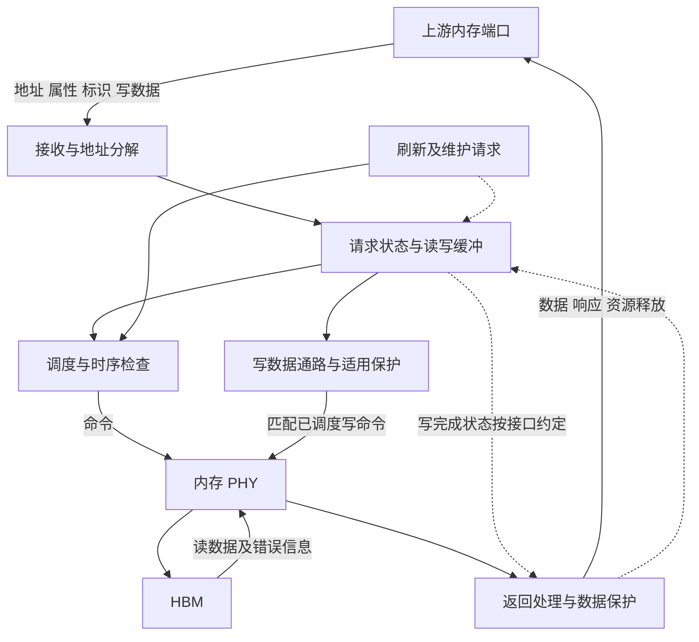

# UMC 微架构研究与论文规划

依据范本 v1.4；方案 v1.1，2026-09-24。当前完成研究规划与相关资料初读，**论文轮次尚未开始**。下一步执行第 1 轮：固定代表性内存访问及 UMC 两侧接口，建立可工作的读写闭环。

资料集：[MEM1–MEM4](../sources.md#mem1)，另复用 [P1](../sources.md) 的 AMD 命名与 [MG5](../sources.md#mg5) 的特定 UMC 驱动代码。先读本方案骨架，再看资料简介及已读范围，按每轮链接回到原文。后续正文集中写入本目录一份技术稿，逐轮更新受影响章节与本页状态。

## 逐篇笔记与本方案的研究落点

先查[模块资料索引](sources/README.md)了解每篇讲什么，再读对应详细笔记；笔记内保留原文链接、版本、阅读位置、机制及重要限制。本次仅补资料与修订规划，下面的论文轮次完成状态不变。

| 微架构位置 | 对应轮次 | 可直接复用的技术笔记 | 本次补充的研究重点 |
| --- | --- | --- | --- |
| 请求、映射与命令调度 | 第 1–3 轮 | [MEM1](sources/MEM1-pg276-hbm-controller.md)、[MEM2](sources/MEM2-ramulator2-paper.md)、[MEM12](sources/MEM12-ramulator-hbm-controller.md)、[MEM13](../HBM/sources/MEM13-ramulator-hbm3-model.md) | 两级重排、行/bank 状态、行列命令槽、共享命令总线与维护请求共同决定可发性。 |
| PHY 交接与刷新/低功耗 | 第 3–4 轮 | [MEM4](../PHY/sources/MEM4-dfi-version-boundary.md)、[MEM5](../PHY/sources/MEM5-ug586-phy.md)、[MEM15](../PHY/sources/MEM15-pg150-dqs-gate.md)、[MEM9](../HBM/sources/MEM9-micron-hbm3e.md) | 先写训练/就绪所有权；DFI 6.0 公告并不证明 PG276 历史接口符合该 profile。 |
| 错误、地址隔离与观测 | 第 4–5 轮 | [MEM3](sources/MEM3-amdgpu-ras.md)、[MEM14](sources/MEM14-umc810-ras-address.md)、[MG5](../RSMU/sources/MG5-rsmu-umc-index.md)、[MG11](../RSMU/sources/MG11-umc67-ras-comparison.md) | 错误分类、地址有效、候选 PA 和坏页状态分开；重复读可能清除状态。 |

## 范围、术语与研究位置

UMC 按公开 AMD 命名 Unified Memory Controller 组织；行业入口为 memory controller、DRAM controller、request scheduler、address mapping、refresh controller。它们分别是功能类别或子功能，不是与所有 AMD UMC 实例完全等价的别名。

代表性场景为已路由至本地内存的普通读和写：上游 fabric/内存端口 → UMC → 内存 PHY → HBM，读取数据沿相反方向返回。该方向用于安排学习，不证明目标芯片中的 DF、CS 与 UMC 的直接 RTL 连接；远端内存请求进入此支路前的路由由前级 fabric 处理，参阅 DF 并核对目标路径。UMC 研究物理内存地址的通道/bank/row/column 分解，与 UTCL2 的 VA→PA 翻译区分。

第 1 轮只前置 HBM 的 channel、bank、开放行以及 ACT/RD/WR/PRE/REF 最小知识，可读 [PG276 Topology](https://docs.amd.com/r/en-US/pg276-axi-hbm/HBM-Topology)。不要求先完成 HBM 全部研究，随后仍按 UMC→PHY→HBM 深入。主线为 HBM 连接场景；DDR/GDDR 差异仅在目标配置需要时纳入。 技术笔记：[MEM1](sources/MEM1-pg276-hbm-controller.md)。

**证据边界：** PG276 是 AMD FPGA HBM IP；Ramulator 是公开研究模型；Linux RAS 是软件可观察接口。下图由这些资料形成的功能参考骨架用于组织问题，不是 AMD GPU UMC 的已知 RTL。具体接口协议、队列数与深度、调度策略及原子操作归属均待目标资料确认。

## 整体功能骨架与读写过程

一次读先由上游完成目标选择，UMC 接收地址、长度、事务标识及适用属性；资源不足时在其接口规则内反压。地址分解确定目标存储资源，请求状态保留返回关联。调度器根据开放行与时序状态选择命令：必要时先预充电和激活，再发读；PHY 执行发送与采样。返回数据经适用的数据保护/错误处理，与原请求匹配并交给上游，释放占用。必须同时解释“可以重排执行”与“上游要求怎样返回”的差别。

一次写还需保证写命令和数据匹配、写数据可用，才进入可执行集合。调度器协调读写方向切换与 bank 状态；部分写是否需要 RMW 取决于保护粒度和接口能力。进入写缓冲、发出存储器命令、上游收到完成响应是不同事件：目标完成语义未明时逐项标待确认，不能把它们当同一时间点。刷新、scrub 与正常请求争用相同资源，必须说明如何暂停、恢复及避免无限推迟。

## 从骨架分解研究主题

| 架构位置与优先级 | 需要解释的问题与就近阅读 |
| --- | --- |
| 接收与地址分解，核心 | 上游已完成哪些路由/交织？UMC 还决定哪些地址位？怎样避免重复映射？比较访问连续性、通道分布与 bank 冲突；读 [PG276 Address Map](https://docs.amd.com/r/en-US/pg276-axi-hbm/HBM-Address-Map-and-Protocol-Considerations) 的物理地址表与映射讨论，参数仅作 FPGA 实例。  技术笔记：[MEM1](sources/MEM1-pg276-hbm-controller.md)。 |
| 请求及数据缓冲，核心 | 命令、数据、返回标识如何关联；依赖检查、读后写/写后读及反压需保留什么状态？读 [Ramulator II-A](https://arxiv.org/html/2308.11030v2#S2.SS1) 的请求、命令与维护三条路径；软件组件划分不能直接当 RTL 流水级。  技术笔记：[MEM2](sources/MEM2-ramulator2-paper.md)。 |
| 调度与命令生成，核心 | 区分请求挑选和命令合法性；开放行命中、bank 并行、读写切换、年龄限制怎样共同决定发令？读 [PG276 Reordering](https://docs.amd.com/r/en-US/pg276-axi-hbm/HBM-Reordering-Options) 与 [Ramulator II-B](https://arxiv.org/html/2308.11030v2#S2.SS2)。FR-FCFS 等作为比较策略，不预选为目标实现。  技术笔记：[MEM1](sources/MEM1-pg276-hbm-controller.md)、[MEM2](sources/MEM2-ramulator2-paper.md)。 |
| 刷新与电源状态，核心；具体优化条件相关 | 刷新截止需求、提前/推迟、温度变化、self-refresh 进入退出由谁负责？读 [PG276 Refresh/Power](https://docs.amd.com/r/en-US/pg276-axi-hbm/Reorder-Refresh-and-Power-Savings-Options-Tab)；单 bank 刷新、lookahead 等需目标支持证据。  技术笔记：[MEM1](sources/MEM1-pg276-hbm-controller.md)。 |
| 返回与 RAS，核心边界；具体编码条件相关 | 控制器 ECC、链路 parity、HBM 内部纠错分别保护哪里？错误如何保留请求关联、传播至上游、触发页隔离？读 [PG276 Error Protection](https://docs.amd.com/r/en-US/pg276-axi-hbm/Data-Path-Error-Protection) 及 [Linux 6.12 RAS](https://docs.kernel.org/6.12/gpu/amdgpu/ras.html)。  技术笔记：[MEM1](sources/MEM1-pg276-hbm-controller.md)、[MEM3](sources/MEM3-amdgpu-ras.md)。 |
| 性能解释，核心；建模扩展 | 将等待分成上游供给、队列、bank/命令时序、总线切换、刷新和返回阻塞，避免只看峰值带宽。最小模型只在无法用时序实例澄清问题时建立；参考 [Ramulator II](https://arxiv.org/html/2308.11030v2#S2)。  技术笔记：[MEM2](sources/MEM2-ramulator2-paper.md)。 |

## 五轮实施方案

五轮分别解决接口闭环、正常命令执行、维护竞争、错误闭环和整体解释；避免一开始并列展开所有调度算法。

| 轮次与范围 | 前置、核心问题及阅读位置 | 文档产出与完成条件 |
| --- | --- | --- |
| 1：接口到返回的工作模型 | 前置为上游物理地址/请求标识约定及 HBM 最小命令知识。读 [PG276 Address Map](https://docs.amd.com/r/en-US/pg276-axi-hbm/HBM-Address-Map-and-Protocol-Considerations)、[PHY Only Mode](https://docs.amd.com/r/en-US/pg276-axi-hbm/PHY-Only-Mode) 和 Ramulator II-A。区分系统交织与本地地址拆分。 | 形成整体图、职责/接口表、读写各一条完整过程及完成语义待决点。验收：每个请求和数据有去向，每项占用有释放条件；不依赖虚构协议字段。  技术笔记：[MEM1](sources/MEM1-pg276-hbm-controller.md)。 |
| 2：缓冲、调度与时序合法性 | 前置为第 1 轮请求生命周期。读 [PG276 Reordering](https://docs.amd.com/r/en-US/pg276-axi-hbm/HBM-Reordering-Options) 与 Ramulator II-B。研究同 bank 不同行、跨 bank、读写切换和同地址依赖；精确时序值待匹配器件手册。 | 增补队列/状态职责图与少量命令时间线。验收：说明为什么此刻可以/不可以发命令，区分吞吐优化与正确性约束，并保留公平性问题。  技术笔记：[MEM1](sources/MEM1-pg276-hbm-controller.md)。 |
| 3：刷新、低功耗和持续进展 | 前置为第 2 轮资源竞争与状态。读 [PG276 Refresh/Power](https://docs.amd.com/r/en-US/pg276-axi-hbm/Reorder-Refresh-and-Power-Savings-Options-Tab) 的 Refresh、Power Saving 段。研究正常流量如何让出资源，恢复前有哪些约束。 | 把维护请求并入主图，形成刷新与低功耗的进入/等待/恢复流程。验收：不会把刷新描述为独立后台且不影响带宽；不会把 self-refresh 等同普通 clock gating。  技术笔记：[MEM1](sources/MEM1-pg276-hbm-controller.md)。 |
| 4：数据完整性与 RAS | 前置为读写返回和维护路径。读 [PG276 Error Protection](https://docs.amd.com/r/en-US/pg276-axi-hbm/Data-Path-Error-Protection)、[Linux RAS](https://docs.kernel.org/6.12/gpu/amdgpu/ras.html) 和 [UMC v6.1 驱动](https://github.com/torvalds/linux/blob/v6.12/drivers/gpu/drm/amd/amdgpu/umc_v6_1.c) 的 error count/address 查询（MG5）。 | 形成保护域、错误传播及驱动观测表，解释部分写/RMW、scrub 的条件。验收：区分 CE/UE、poison、坏页处置及目标未证实项；不把驱动寄存器访问顺序当调度硬件。  技术笔记：[MEM1](sources/MEM1-pg276-hbm-controller.md)、[MEM3](sources/MEM3-amdgpu-ras.md)、[MG5](../RSMU/sources/MG5-rsmu-umc-index.md)。 |
| 5：整体验证与技术稿收束 | 前置为前四轮和相邻 PHY/HBM 的接口结果。复读最相关来源与 [PG276 Activity Monitor](https://docs.amd.com/r/en-US/pg276-axi-hbm/Activity-Monitor)（计数细节待查），必要时再选固定版本模型。 | 用连续流、小随机访问、混合读写、刷新重叠解释瓶颈；更新整体图而非另写并行教程。验收：性能结论能回指具体资源/证据，反压与错误仍闭环，模型限制明确。  技术笔记：[MEM1](sources/MEM1-pg276-hbm-controller.md)。 |

## 未决项与接续边界

优先确认目标产品/代际、UMC 与 HBM channel 的映射、上游请求/响应协议、物理地址交织责任、写完成和排序语义。随后核实 ECC 与原子操作、scrub、加密、错误重试的实际归属；未证实的 feature 不直接纳入核心实现。

MC-PHY 接口须同时核对 [PG276 的 DFI 命名](https://docs.amd.com/r/en-US/pg276-axi-hbm/PHY-Only-Mode) 和 [DFI 标准组织](https://ddr-phy.org/)的版本覆盖，不能默认 HBM 使用 DFI 5.x，也不能因 6.0 支持 HBM 而回推旧产品采用 6.0。完整规范与器件时序表未读的范围见资料集。 技术笔记：[MEM1](sources/MEM1-pg276-hbm-controller.md)、[MEM4](../PHY/sources/MEM4-dfi-version-boundary.md)。

第 1 轮产出能闭环后即可继续；目标资料暂缺时维护明确标注的功能参考模型，把实例级问题留在本节。完成 UMC 方案后沿内存请求方向接续 [PHY 方案](../PHY/research-plan.md)，HBM 仅提前提供必要接口知识。

## 2026-09-25 资料补齐对本方案的影响

第 2–4 轮优先复用 [MEM11](../HBM/sources/MEM11-jedec-scope-gap.md)、[MEM16](../PHY/sources/MEM16-dfi51-interface.md)。JESD238A 转录补 PC 独立状态与共享命令资源；DFI 5.1 转录补控制/数据交接，分别注明层级与版本。具体时序图和 HBM profile 尚未核验，先形成作用域明确的调度模型。 本次仅更新依据和研究落点，不把任何待执行论文轮次改为完成。
