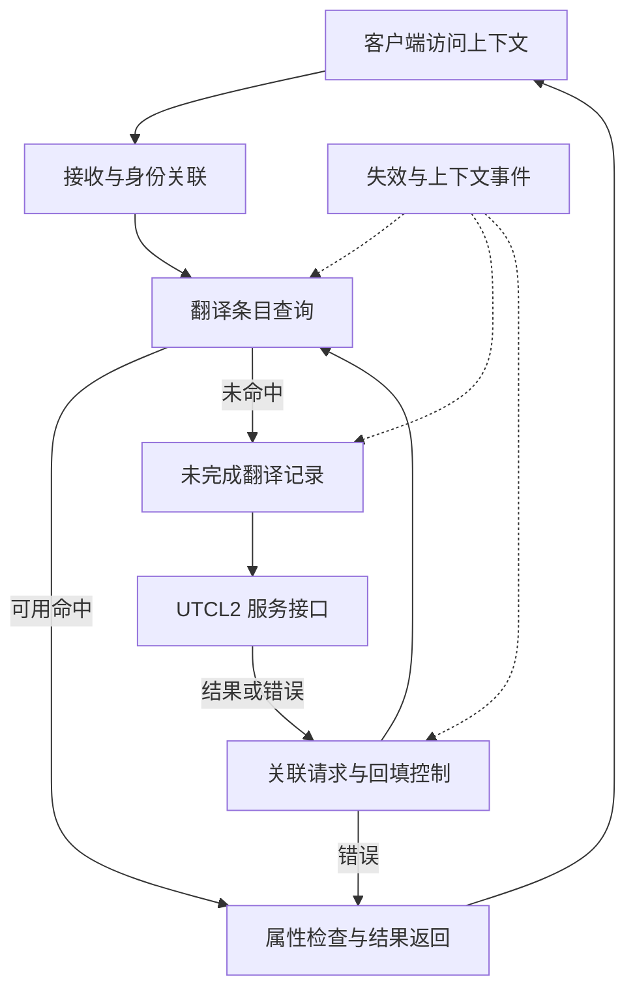

# UTCL1 多轮研究与论文方案

依据范本：v1.3；方案版本：v1.1；日期：2026-09-24。**状态：规划完成，四轮详细研究均待执行。** 下一步从第一轮的客户端接口与命中闭环开始。本页是写作任务安排，不是目标芯片的已验证规格。

接续顺序：[模块上下文](README.md) → 本页整体骨架 → [资料集](../sources.md#vm1)中的 VM1、VM2、VM3、VM5 → 对应原文。资料简介与实际阅读范围集中在资料集；每轮完成后更新本页状态，并把新增结论合入后续创建的本目录 `technical-paper.md`，不另建并行教程。

## 逐篇笔记与本方案的研究落点

先查[模块资料索引](sources/README.md)了解每篇讲什么，再读对应详细笔记；笔记内保留原文链接、版本、阅读位置、机制及重要限制。本次仅补资料与修订规划，下面的论文轮次完成状态不变。

| 微架构位置 | 对应轮次 | 可直接复用的技术笔记 | 本次补充的研究重点 |
| --- | --- | --- | --- |
| 客户端身份、命中与 miss | 第 1–2 轮 | [VM1](../UTCL2/sources/VM1-gpuvm-address-spaces.md)、[C01](../UTCL2/sources/C01-mm-utcl2-testbench.md)、[C03](../UTCL2/sources/C03-utcl2-topology.md)、[VM7](sources/VM7-gem5-vega-tlb.md) | 用本地页图与 gem5 功能模型对照；模型中 ASID/失效简化不能当成目标能力。 |
| 合并、等待与资源释放 | 第 2–3 轮 | [VM9](sources/VM9-gem5-coalescer.md)、[VM5](../UTCL2/sources/VM5-mask-paper.md)、[C05](../HUBS/sources/C05-mmhub-dagb-ea.md) | 区分合并键、上游请求数和下游翻译数；保留客户端返回与 credit 释放。 |
| 失效与地址空间复用 | 第 3–4 轮 | [VM3](../UTCL2/sources/VM3-gpuvm-invalidation.md)、[VM11](../UTCL2/sources/VM11-vmid-lifetime.md)、[VM10](../UTCL2/sources/VM10-iommu-spec.md)、[IO11](../PCIE/sources/IO11-ats-pri-pasid.md) | 把 VMID 重用、翻译失效、IOMMU/ATC 分支分别解释，不套统一流水。 |

## 研究范围与上下游

AMD 名称沿用 Unified Translation Cache – Level 1，既有术语依据为 [P5](../sources.md)。行业检索使用 L1 TLB、client translation cache、translation request、miss handling；MMU 是更大的翻译与权限管理体系，UTCL1 不是完整 MMU，也不是数据 L1 cache。

以“客户端提交带地址空间身份的虚拟地址请求，取得翻译或错误后继续处理”为主场景。上游先读 [SDMA 入口](../SDMA/README.md)已有的客户端约定，或 [GC 方案](../GC/research-plan.md)中相关访问场景；仅复用接口，不研究外部 SDMA 细节。现有 shaobo 摘要支持 TBE 内 `dma_utcl1` miss 请求 UTCL2 [L2]，但不能据此确定其他实例的宿主、数量或协议。下游进入 [UTCL2 方案](../UTCL2/research-plan.md)，UTCL2 内部尚未展开时先约定请求、响应、拒绝/等待和失效接口。

这里按**翻译请求方向**定义上下游；翻译返回与客户端数据返回分别建模。UTCL1 是否截住整个数据请求，还是只提供旁路翻译服务，必须由目标接口确认，不能把业务读写 payload 默认画进 UTCL1。

## 整体功能微架构

下图为公开 TLB 机制启发的**研究骨架**；命中检查、未完成请求记录等是必须解释的功能，不代表已确认的 RTL 子块。主要参考 [GPUVM 软件接口 VM1](https://github.com/torvalds/linux/blob/v6.12/drivers/gpu/drm/amd/amdgpu/amdgpu_vm.c)与 [MASK 第 3 节 VM5](https://rausavar.github.io/pubs/mask-asplos18.pdf)，后者是研究模型。 技术笔记：[VM1](../UTCL2/sources/VM1-gpuvm-address-spaces.md)、[VM5](../UTCL2/sources/VM5-mask-paper.md)。

关键资源是翻译条目、请求身份、等待中的客户端和响应接纳能力；是否独立设置 miss queue、是否合并同页请求、是否支持旁路均为待判定选择。图不指定容量、流水级数或替换算法。

代表性闭环：客户端提供 VA、访问类型及适用的 VMID/上下文；查询命中后检查该次访问能否使用缓存的权限和属性；miss 时保留关联信息并向 UTCL2 请求；下游返回成功结果或 fault，UTCL1 依据当前上下文与失效状态决定能否回填、唤醒和返回。若没有接纳空间，应解释怎样停止接收以及怎样恢复。原业务请求何时能访问数据系统、失败后由谁终止或重试，属于接口契约，不能用“翻译完成”代替“访存完成”。

## 由架构导出的研究主题

| 架构位置 / 优先级 | 核心问题 | 就近资料与阅读用途 |
| --- | --- | --- |
| 输入与查询 / 核心 | 请求身份如何与 VA、页大小、访问类型关联？同一 VA 不同 VMID 如何隔离？ | [VM1](https://github.com/torvalds/linux/blob/v6.12/drivers/gpu/drm/amd/amdgpu/amdgpu_vm.c)，`DOC: GPUVM`，理解地址空间和权限的软件契约  技术笔记：[VM1](../UTCL2/sources/VM1-gpuvm-address-spaces.md)。 |
| 命中与返回 / 核心 | 条目保存哪些翻译属性？命中是否仍可能权限不符？地址页偏移在哪里组合？ | [VM2](https://github.com/torvalds/linux/blob/v6.12/drivers/gpu/drm/amd/amdgpu/mmhub_v2_0.c)，`setup_vmid_config`、fault 状态；仅用于提出需要核实的边界  技术笔记：[VM2](../HUBS/sources/VM2-mmhub-v2.md)。 |
| miss 交接 / 核心 | outstanding 的身份、资源占用和返回配对；下游停顿如何传回客户端？ | [VM5](https://rausavar.github.io/pubs/mask-asplos18.pdf)，第 3、4.1 节，理解 TLB miss 对等待者的影响  技术笔记：[VM5](../UTCL2/sources/VM5-mask-paper.md)。 |
| 回填与失效 / 核心 | 失效期间仍在途的旧翻译能否回填？ACK 表示什么已经完成？ | [VM3](https://github.com/torvalds/linux/blob/v6.12/drivers/gpu/drm/amd/amdgpu/gmc_v9_0.c)，`flush_gpu_tlb` 的请求/ACK；不能从驱动推定内部排空规则  技术笔记：[VM3](../UTCL2/sources/VM3-gpuvm-invalidation.md)。 |
| 合并、预取、多页大小 / 条件 | 哪些客户端/代际支持？减少 miss 与增加资源占用如何权衡？ | [VM5](https://rausavar.github.io/pubs/mask-asplos18.pdf)，第 3、4 节为比较起点；目标 UTCL1 预取机制尚无直接证据  技术笔记：[VM5](../UTCL2/sources/VM5-mask-paper.md)。 |
| 性能观察 / 核心 | 区分查询吞吐、miss 服务时间、等待者数量和被阻塞周期 | [P5](https://rocm.docs.amd.com/en/docs-6.0.0/conceptual/gpu-arch/mi200-performance-counters.html)，既有 MI200 计数器入口；先核实实际可用计数器再设计观测  技术笔记：[P5](../GC/sources/P5-mi200-counters.md)。 |

## 四轮研究安排

### 第一轮：客户端契约与可工作的基础路径

- **范围与前置：** 输入、查询、成功/失败返回；先选择一个有依据的实例，列明地址空间和上下游接口，保留与公共 UTCL1 主题的区别。
- **阅读：** VM1 `DOC: GPUVM`；VM5 第 3 节两种翻译结构；回看仓库 L2 已登记的 TBE 实例关系，不读取或复制外部资料。
- **产出：** 论文的职责边界、结构图、命中/miss 两条流程及最小接口表；区分翻译服务与数据服务。
- **完成条件：** 给定一个命中请求和一个 miss 请求，读者能说清每一步由谁持有请求、何时可返回、有哪些尚未确认的端口。

### 第二轮：并发 miss、回填与反压

- **范围与前置：** 第一轮接口稳定后，研究多个翻译同时未完成、响应交错与资源释放；同页合并只在证据支持或教学对照下展开。
- **阅读：** VM5 第 4.1 节的等待与突发恢复；UTCL2 第一轮形成的服务约定。
- **产出：** 在原结构上补未完成请求生命周期；说明被拒绝、已接收、等待返回及完成的区别，给出不同 VMID 同 VA 的配对示例。
- **完成条件：** 下游暂停、返回顺序变化和等待资源用尽时均能解释不丢失、不重复完成的要求；无需先确定 RTL 队列深度。

### 第三轮：失效、权限与异常闭环

- **范围与前置：** 已了解在途状态，再研究页表更新、VMID 重用和失效与回填竞争；fault 是否可重试需按实例核实。
- **阅读：** VM2 `get_invalidate_req`、`setup_vmid_config`；VM3 `flush_gpu_tlb` / `flush_gpu_tlb_pasid`，与 UTCL2 第四轮对齐接口语义；可先记录候选语义和待查项，不要求 UTCL2 所有轮次预先完成。
- **产出：** 失效参与者与完成条件表、旧响应到达场景、权限失败和正常 miss 的分支；显式区分 TLB invalidation、数据 cache flush 和业务 outstanding。
- **完成条件：** 能说明何时禁止旧映射再次被使用，哪些状态需等待或拒收；缺少硬件语义处保留待查，不把所有 flush 都描述为全管线排空。

### 第四轮：条件机制与整体验证问题

- **范围与前置：** 基础正确性闭环成立后，评估多页大小、可选预取、并发优化和可观测性；不为凑轮次假设它们存在。
- **阅读：** VM5 第 3、4 节及 P5 的相关计数器定义；按已识别缺口补目标版本资料。
- **产出：** 需求场景到瓶颈的解释、条件 feature 取舍、贯穿论文的微架构复核。仅当推理仍有争议时安排小型请求序列模型。
- **完成条件：** 命中、miss、错误、反压和失效共用同一套接口解释；优化收益和副作用可定位到已有资源，而非孤立知识点。

## 未决问题与执行入口

第一轮优先核实客户端传入的是哪种地址、VMID 与其他身份如何组合、响应是否携带权限和属性、失效事件由谁发起。随后核实页大小、回填竞争、miss 合并与可选预取；资料不足不阻止公共参考部分写作，但不能把候选设计改为目标事实。

本地 Codex 下一步：读取本页与资料集 VM1/VM5，创建第一轮论文骨架并补最小接口契约；仅在完成条件满足后把第一轮改记为完成。UTCL1 与 UTCL2 的层级表示服务关系，不表示包含；不要把四模块研究次序写成 UTCL1→UTCL2→MMHUB→EA 的统一硬件路径。

## U24：请求地址到 HBM bank 的跨模块落点

接入轮次：第 1–2 轮。标明输入地址空间、页内偏移、翻译结果与父请求关联；跟踪跨页子请求的不同翻译，避免把虚拟连续当作物理连续或把 TLB 合并当数据请求合并。

按[跨模块专题方案](../HBM/address-interleaving-plan.md)与[单模块聚焦规则](../chip-study-plan.md#文档用途与单模块聚焦)，先研究本模块的输入地址、配置/映射、输出目标与局部地址、子请求范围和返回关联，保存所需外部接口及依赖问题、假设和影响。必要接口疑点立即核实；相关模块的核心基础具备后，再统一完整路径与地址例子。详细稿采用[当前写作方法](../chip-study-plan.md#详细文档写作方法)，可选深入问题不自动成为必做项；本次方案更新不计为完成新研究轮次。
