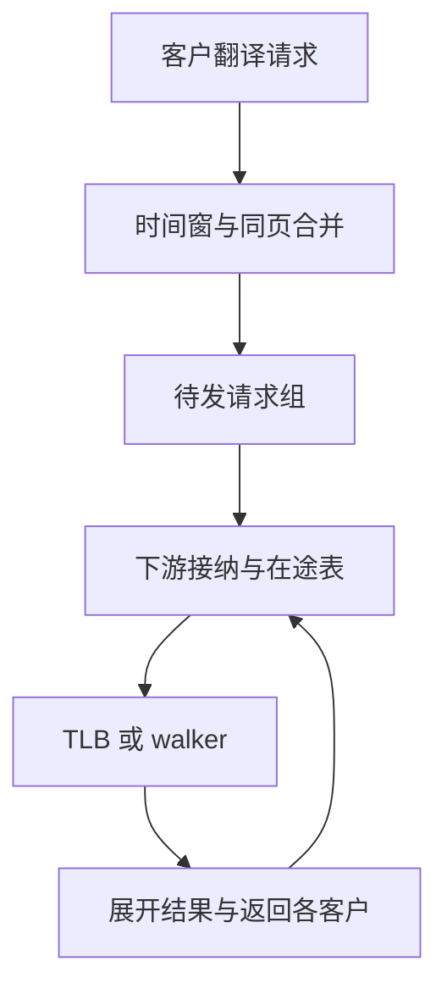

# VM9：翻译请求合并：时间窗、在途表与响应展开

更新日期：2026-09-24。

导读：解释多个同页请求如何共用一次下游翻译，以及如何保留每个请求的 offset、返回端口和统计数量。适合研究 miss 合并与有限资源；明确模型的多地址空间限制。
来源：[tlb_coalescer.cc，gem5 v24.1.0.1](https://github.com/gem5/gem5/blob/v24.1.0.1/src/arch/amdgpu/vega/tlb_coalescer.cc)。新增资料。
阅读状态：精读 canCoalesce、recvTimingReq、processProbeTLBEvent、updatePhysAddresses、retry、cleanup、stall/unstall；未仿真。

## 结构及请求生命周期

时间窗由 issueTime/coalescingWindow 决定；同一窗内还要求落在同一基础页并有相同 Read/Write 等 mode，才合并成组。合并后的代表 packet 不会取代其他客户，组里保留全部 packet；reqCnt 还记录跨层合并所代表的原始访问数量。

## 接纳与容量

发射时先检查下游槽位和每周期 probe 上限。若同一虚拟页已有在途翻译，则该组继续等待，其他可发组可继续检查。只有 `sendTimingReq` 成功后才增加下游占用、将组转入 issuedTranslationsTable 并从待发结构移除。失败时仍保留原组，等待 retry，不额外复制一份“重试请求”。

这提供三个可以分别计数的量：原始请求数、合并组数、当前已下发组数。减少下发次数不等于降低了所有客户等待时间；过长合并窗口也可能增加排队时间。

## 返回展开的重要细节

代表请求取得物理页后，其余客户要用自己的 VA offset 形成 PA，而不是直接复制代表请求的完整地址。uncacheable、system bit、命中层级等属性也要传播；返回端口从各自 sender state 中取出。下游占用在返回后减少并唤醒被阻塞端口，tracking 的实际删除在同周期 cleanup 中完成。

## 不能照搬的假设

本版本合并键和 issued table 主要以 VA 页组织，所读路径没有完整体现 PASID/VMID/VFID 的参与，并有 `VMID TODO`。真实共享服务必须防止“不同地址空间相同 VA”被错误合并；相同页但权限/属性不同的请求也要按实际接口判断能否合并。

代码直接发送 timing response 的做法不是完整硬件返回反压规格。若设计多个返回端口、有限 replay 存储或失效并发，需要额外定义谁持有结果、何时释放以及怎样防旧回填。后续 Codex 应复用生命周期思路，保留这些模型缺口。

---

[本模块资料索引](README.md) · [模块研究方案](../research-plan.md) · [全局资料入口](../../sources.md)
