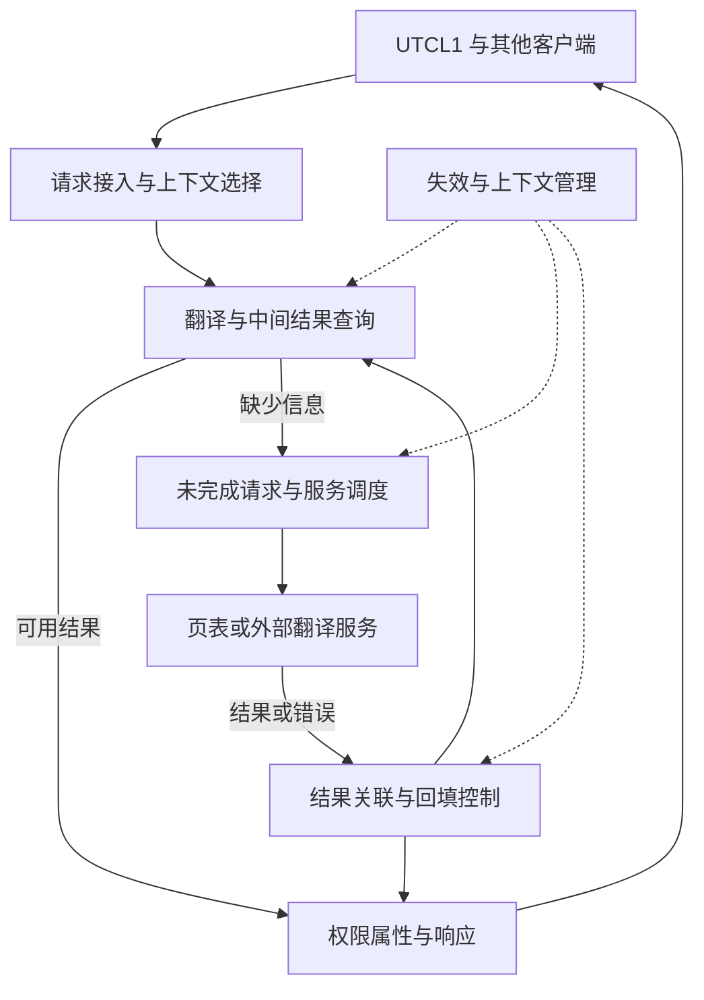

# UTCL2 多轮研究与论文方案

依据范本：v1.2；方案版本：v1.0；日期：2026-09-24。**状态：规划完成，六轮详细研究均待执行。** 下一步确认服务边界与地址空间模型。本方案只建立研究基础，公开软件接口与研究模型不代表 shaobo/anshi 实现。

接续：[模块上下文](README.md) → 本页 → [资料集 VM1–VM5](../sources.md#vm1) → 具体原文。每轮维护资料集的阅读范围，在本页记录真实进度，详细内容逐步合入后续创建的本目录 `technical-paper.md`。C01–C04 缺失正文不恢复；本次未读取本地原件或仓库现有页面图片，不把既有资料标题当作技术证据。

## 对象、术语与上下游

沿用 AMD Unified Translation Cache – Level 2 [P5]；联合检索 shared TLB、GPU MMU、page-table walker、page-walk cache、GPUVM、ATC、IOMMU、ATS。这里 MMU/GPUVM 是更广的功能体系，PTW 是遍历功能，ATC/IOMMU 属于可能相关的系统翻译路径，均不能直接等同 UTCL2。

上游是需要共享翻译服务的 UTCL1/客户端；shaobo TBE 的 UTCL1 miss 向 UTCL2 请求，是仓库既有摘要支持的部分关系 [L2]。先复用 [UTCL1](../UTCL1/research-plan.md)的请求身份、返回和失效约定，再研究服务端。下游包含“取得页表/其他翻译服务”以及“向客户端返回结果”两类接口；页表遍历单元的位置、访存经过哪个 hub、是否经过 GL2 都待目标证据确认。后续 [HUBS](../HUBS/research-plan.md)接续 hub 集成，不以目录顺序推断包含。

**必须保持两个分离：** GL2 缓存业务数据，UTCL2 研究翻译信息；GPUVM 处理 GPU 地址空间，系统 IOMMU 处理系统侧 I/O 翻译与保护。系统内存访问是否还需 IOMMU、是否启用 ATS/ATC、地址处于 GPUVA/IOVA/系统 PA 的哪一层，应逐场景说明。[VM1 GPUVM 段](https://github.com/torvalds/linux/blob/v6.12/drivers/gpu/drm/amd/amdgpu/amdgpu_vm.c)与 [VM4 AMD IOMMU 驱动](https://github.com/torvalds/linux/blob/v6.12/drivers/iommu/amd/iommu.c)提供不同软件边界；二者代码名称不构成硬件等价证明。

## 整体功能微架构与请求闭环

图为**公开参考支持的研究骨架**，只表示功能依赖。页表服务刻意画在边界之外，后续取得框图才判断是否在 UTCL2 本体；PTE/PDE 保存结构也不预设为若干固定物理 cache。

主闭环采用一个 GPUVM 翻译 miss：客户端提交地址和身份 → 选择地址空间与上下文 → 查找可用的最终或中间翻译信息 → 缺失部分向页表服务请求 → 关联返回、检查访问权限和页表状态 → 决定回填并返回翻译/错误 → 上游继续或处理失败。遍历产生的读请求另有 outstanding，与客户端原始业务读写分开记录；每一类都需说明等待位置和完成条件。

第二条闭环是页表更新：更新数据可见 → 发起相应失效 → 各参与者处理条目及在途状态 → 完成确认 → 允许依赖新映射的访问。这里的箭头是研究所需的顺序问题，具体屏障、ACK 与排空责任待协议确认；不能把 ACK 自动解释为所有业务写入已到 DRAM。

## 重点与阅读位置

| 架构位置 / 优先级 | 需要回答的问题 | 资料直链与定位 |
| --- | --- | --- |
| 接入与上下文 / 核心 | VMID/PASID/地址空间如何关联？哪些属性参与隔离，哪些只影响目标路由？ | [VM1](https://github.com/torvalds/linux/blob/v6.12/drivers/gpu/drm/amd/amdgpu/amdgpu_vm.c)，`DOC: GPUVM`；[VM3](https://github.com/torvalds/linux/blob/v6.12/drivers/gpu/drm/amd/amdgpu/gmc_v9_0.c)，VMID/PASID flush 路径 |
| 查询与遍历服务 / 核心 | final translation、PDE/PTE 缓存、PTW 各解决什么？未命中由谁补齐？ | [VM2](https://github.com/torvalds/linux/blob/v6.12/drivers/gpu/drm/amd/amdgpu/mmhub_v2_0.c)，`init_cache_regs`；[VM5](https://rausavar.github.io/pubs/mask-asplos18.pdf)，第 3 节，比较 TLB 与 walk cache |
| 共享并发 / 核心 | 客户端公平性、同页合并条件、请求追踪、服务反压和返回拥塞如何影响吞吐？ | [VM5](https://rausavar.github.io/pubs/mask-asplos18.pdf)，第 4 节，研究干扰与阻塞；算法只作对照 |
| 权限与 fault / 核心 | 无映射、权限失败、遍历读失败、可重试事件如何区分并通知原请求？ | [VM2](https://github.com/torvalds/linux/blob/v6.12/drivers/gpu/drm/amd/amdgpu/mmhub_v2_0.c)，`print_l2_protection_fault_status`、`setup_vmid_config` |
| 失效 / 核心 | 清哪些层级、如何防旧回填、哪个 outstanding 需等待、谁返回完成？ | [VM2](https://github.com/torvalds/linux/blob/v6.12/drivers/gpu/drm/amd/amdgpu/mmhub_v2_0.c)，`get_invalidate_req`；[VM3](https://github.com/torvalds/linux/blob/v6.12/drivers/gpu/drm/amd/amdgpu/gmc_v9_0.c)，`flush_gpu_tlb` |
| 系统翻译 / 条件 | IOMMU 缓存失效与设备 ATC 失效有哪些不同参与者？目标场景支持哪条路径？ | [VM4](https://github.com/torvalds/linux/blob/v6.12/drivers/iommu/amd/iommu.c)，`build_inv_iommu_pages`、`device_flush_iotlb`、`domain_flush_complete` |
| 预取与优化 / 条件或扩展 | 预取对象是 PTE/PDE、翻译结果还是数据？跨页权限、fault、资源配额和失效如何约束？ | [VM5](https://rausavar.github.io/pubs/mask-asplos18.pdf)，第 4 节支持干扰分析，**不证明 AMD 预取算法**；目标机制资料待查 |

## 六轮研究安排

### 第一轮：整体边界与地址空间

- **前置与范围：** UTCL1 基础接口；选择 GPUVM 的一个本地内存场景、一个系统内存条件分支。先明确谁持有地址、谁解释身份、谁产生数据请求。
- **阅读：** VM1 `DOC: GPUVM`，VM2 `setup_vm_pt_regs` / `setup_vmid_config`；VM4 仅用于识别系统侧边界。
- **产出：** 论文总图、术语关系及请求字段的功能分类；标注 unknown 的物理归属。
- **完成条件：** 能走通一次请求，并能区分翻译返回、数据返回和地址空间转换，避免把所有访问画成固定串行链。

### 第二轮：翻译层级与 miss 服务

- **前置与范围：** 第一轮上下文确定后，研究最终条目、中间页表信息、页大小及页表服务；PTW 内外归属未知时采用服务边界。
- **阅读：** VM2 `init_cache_regs`，VM5 第 3 节与 Fig.2。
- **产出：** 命中层级与缺失信息的路径图、遍历依赖和返回关联；说明 translation cache 与缓存页表数据的 data cache 差异。
- **完成条件：** 对“中间信息命中但叶级缺失”能解释剩余工作及错误出口；不复制研究论文的级数或容量为目标参数。

### 第三轮：并发、共享资源与故障处理

- **前置与范围：** 已知正常 miss 生命周期，再研究多客户端竞争、下游阻塞、权限与遍历异常。
- **阅读：** VM5 第 4 节；VM2 fault 状态解码与 retry 相关配置。
- **产出：** outstanding 类型和资源释放表、错误分类、可重试/终止流程；如存在同页合并，明确不同上下文不能错误合并。
- **完成条件：** 任一已接收请求均有可说明的完成或异常出口，fault 不被误写成普通 cache miss，回压不丢失上下文。

### 第四轮：invalidation 与在途事务

- **前置与范围：** 已掌握在途状态，再研究更新可见性、失效范围、旧回填竞争和完成确认。
- **阅读：** VM2 `get_invalidate_req`，VM3 `flush_gpu_tlb`、`flush_gpu_tlb_pasid`、`emit_flush_gpu_tlb`。
- **产出：** 页表更新到重新使用的时序、参与者/条目/在途状态/完成条件表；legacy/light/heavy 名称只有在目标协议证实后才写入语义表。
- **完成条件：** 分清翻译查询、PTW 读、已翻译业务事务三类 outstanding；说明哪些必须等待及依据。驱动的 FLUSH_TYPE 数值不能替代硬件协议证明。

### 第五轮：系统 IOMMU 与 ATS 条件分支

- **前置与范围：** 第四轮失效基础完成，先核实目标系统是否启用相关能力；不支持时缩为边界说明，与第四轮合并。
- **阅读：** VM4 两类 invalidate 构造、`__domain_flush_pages` 与 `domain_flush_complete`；AMD IOMMU 文档 48882 和 PCIe ATS 原文的版本/可访问章节仍待取得。
- **产出：** GPUVM、系统 IOMMU、设备 ATC 的参与者图，地址与身份转换表，外部失效和本地失效的责任差异。
- **完成条件：** 不把 GPUVM TLB、ATC 与 IOMMU cache 当作同一缓存；没有协议原文支持时不确定 NACK、heavy 排空或自动续跑细节。

### 第六轮：预取、性能与全文收敛

- **前置与范围：** 基础正确性闭环后，判断预取是否适用；分析命中率、服务延迟、并发度与下游干扰，优化只在已存在的资源上讨论。
- **阅读：** VM5 第 4、5.3 节作干扰研究；目标预取证据尚待补充，不能凭 C04 标题还原设计。
- **产出：** 条件机制取舍、瓶颈诊断、需要验证的代表性序列；回写整体图和边界，移除无证据的具体实现断言。
- **完成条件：** 每个优化能对应性能问题且保留权限/失效/fault 约束；最终论文的正常与异常流程一致，不以功能列表代替微架构。

## 优先未知项与下一步

先确定目标代际、UTCL2 所属域、请求/响应契约、PTW 归属和地址空间模型；这些影响第一、二轮。失效完成语义在第四轮优先核实；预取算法和精确容量留后。公开 MMHUB 2.1.x 源码注明无 ATCL2 [VM2]，说明系统翻译能力确有版本边界，不能因此反推 shaobo/anshi。

本地 Codex 从第一轮开始，在 `technical-paper.md` 建立有来源的结构和两类地址场景。本页六轮是复杂度选择，允许证据到来后合并或拆分；任何调整均不增加已完成轮次数。
