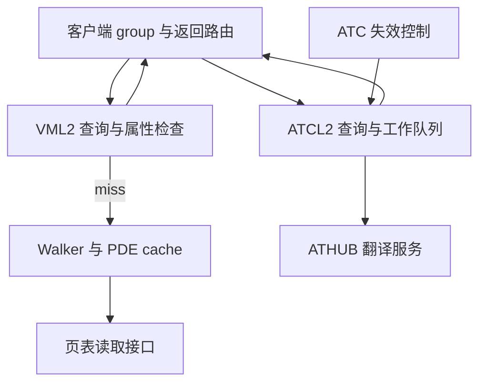

# C03：UTCL2 总图：GPUVM、ATC 与 walker 的资源边界

更新日期：2026-09-24。

导读：从一张总图建立请求入口、VML2 bank、walker、ATCL2 与返回网络的关系，适合快速判断一个 feature 应放在哪个子模块；图中的实例数只属于该图配置。
来源：[仓库既有 utcl2_top/page-001.png](https://github.com/niyingsong123/soc_study/blob/585661dfa3d90f3d0488cd3f6c5d50f6be8103a6/UTCL2/assets/utcl2_top/page-001.png)。用户提供拓扑，具体芯片/版本尚未确认。
阅读状态：已直接查看整张高分辨率图并核对主要连接；未据此推导图中没有标明的吞吐、端口时序或协议完成保证。

## 读图顺序与关键分支

顶部多组 router/group 负责聚合请求与返回。GPUVM 请求进入左侧 VMC/VML2 的 bank 组织，bank 内区分 BigK、4K 和 identity 等路径；命中、直接通过、fault/error 和 miss 有不同出口。miss 才进入底部 walker，最终结果再按来源送回 group。右侧是 ATCL2 的 cache/work-queue/SDP 路径，经 ATHUB 获取翻译；ATC invalidate 另有控制通道。

此图只表达资源边界，未声称每个入口都能无条件选择所有分支。具体 GPUVM 后是否继续 ATC 由 APT 决策，见 [C01](../../UTCL2/sources/C01-mm-utcl2-testbench.md)/[C05](../../HUBS/sources/C05-mmhub-dagb-ea.md)。

## 从图中可以可靠提取的结构

入口分组与 cache banking 是不同层级：更多 group 不等于更多独立 walker。VML2 返回网络需要把 hit、fault 和 walker result 汇合，同时恢复原始来源；后续分析应记录 source/tag 的分配、保存、释放与复用时刻。

Walker 中存在输入 FIFO、仲裁、queue、rdif、每请求 state 和 PDE2/1/0 cache。图示列出的 state 0…127 是该配置的资源线索；不能从中推出“每周期完成 128 次翻译”。取表请求到 TCC 的链路与 ATCL2 到 ATHUB 的链路不同，二者 miss 的性能和异常原因必须分开统计。

ATCL2 的 4K/2M 组织、工作队列和独立 invalidate 通道说明：缓存条目、未完成请求和失效事务是三种并存状态。清缓存不能自动保证已发 ATS 不会携旧结果返回，需要定义在途返回的丢弃、重试或 epoch 规则；总图没有给出该规则，只能列为后续检查项。

## feature 如何落到微架构

大页/fragment 应落实到 cache tag/比较、PTE 格式和 walker 终止；miss merge 应落实到 queue/state 与返回扇出；预取应落实到 rdif/取表仲裁、独立缓存与信用；公平性应落实到 group、bank、walker 和返回各处仲裁，不能只写一种全局 RR。失效需同时列出对象和确认路径。

本图适合与 [C02](../../UTCL2/sources/C02-utcl2-cache-organization.md) 的 cache 机制、[C04](../../UTCL2/sources/C04-translation-prefetch.md) 的 rdif 预取、[VM8](../../UTCL2/sources/VM8-gem5-page-walker.md) 的事件模型一起使用。容量、时钟、端口宽度、替换策略与全局完成条件仍需补充目标证据；本图不支持断言 GC 与 MMHUB 物理共享同一个 UTCL2。

---

[本模块资料索引](README.md) · [模块研究方案](../research-plan.md) · [全局资料入口](../../sources.md)
