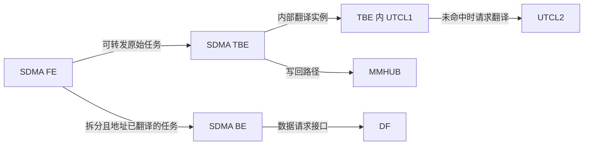

# 模块关系与归档映射

当前尚无目标 SoC 的完整顶层框图。下文分别标注“本地资料”“用户分组”“公开参考”和“待确认”，不把不同产品的框图拼成一个真实芯片。

## 已知关系与目录决策

| 关系 | 类型及证据 | 当前处理 |
| --- | --- | --- |
| SDMA → FE / BE / TBE | 本地资料确认的模块划分；代际职责不同 [L1、L2] | 统一在 SDMA 外部项目研究 |
| shaobo SDMA.TBE → dma_utcl1 | 本地摘要明确记载 TBE 内有 UTCL1；其与 copy engine 同级 [L2，「地址翻译与限制」，回指 S1] | 按用户要求 [U3]，公共模块独立建 UTCL1 目录，同时保留 TBE 实例归属 |
| HUBS → MMHUB / CH | 用户指定的学习分组；不证明存在一个名为 HUBS 的 RTL 父实例 [U1] | 统一放 HUBS，不建立子目录 |
| DF → CS / CAKE | 公开 AMD 架构中的 DF 相关组件；本项目按此暂归档，目标芯片直接父级待核实 [P1] | 放 DF，不单列 CS、CAKE 目录 |
| GC → RLC | Linux AMDGPU 硬件结构说明明确将 RLC 列为 GC 内部微控制器 [P2] | 放 GC；shaobo/anshi 层级仍需资料 |
| GC → GL2 / GRBM | 公开文档将其描述为 GFX 缓存与图形寄存器管理模块，支持按图形/计算域归档；精确 RTL 直接父级未确认 [P3、P4] | 与 RLC 一并放 GC |
| UTCL2 → 所属 hub；EA → 所属客户端/图形域 | 目标设计归属待确认 | 暂保留 UTCL2、EA 独立入口 |
| RSMU → SMU？NBIF → PCIe？SWITCH → DF？ | 现有资料不足，不能根据缩写或连线断定包含关系 | 暂独立管理 |

上述公开参考的链接及版本见 [sources.md](sources.md)。GC 是上级归档名称；HUBS 是用户分组；UTCL1 是跨模块主题，这三种情况不混作同一种硬件层次。

## 全部名称的对应位置

| 名称 | 入口 | 说明 |
| --- | --- | --- |
| DF | [DF](DF/README.md) | Data Fabric |
| CF | [CF](CF/README.md) | 本地资料为 Command Fabric |
| SMN | [SMN](SMN/README.md) | 管理网络，和 CF 分开 |
| UTCL2 | [UTCL2](UTCL2/README.md) | 二级翻译；不包含所有 UTCL1 |
| UTCL1 | [UTCL1](UTCL1/README.md) | 一级翻译；TBE 实例属于 SDMA.TBE |
| EA | [EA](EA/README.md) | 仲裁主题；不直接等同于目标设计的 GCEA |
| NBIF | [NBIF](NBIF/README.md) | 不自动改名 NBIO |
| 芯片互联（switch） | [SWITCH](SWITCH/README.md) | 尚未确认是片内、跨 die 或 PCIe switch |
| UMC | [UMC](UMC/README.md) | 控制器 |
| HBM | [HBM](HBM/README.md) | 存储器，不是 UMC 内部子模块 |
| PCIE / PCIe | [PCIE](PCIE/README.md) | 目录大写，正文通常写 PCIe |
| CS | [DF](DF/README.md) | 暂按 Coherent Slave；须用本项目资料确认同名含义 |
| HDP | [HDP](HDP/README.md) | 与 PCIe/NBIF 的准确边界待确认 |
| CAKE | [DF](DF/README.md) | 跨芯片 fabric 接口参考主题 |
| PHY | [PHY](PHY/README.md) | 多类物理接口的统称 |
| HUBS | [HUBS](HUBS/README.md) | 用户分组 |
| mmhub / MMHUB | [HUBS](HUBS/README.md) | 文档统一写 MMHUB，原始资料名称保留 |
| CH | [HUBS](HUBS/README.md) | 不猜测英文全称，不自动视为 GCHUB |
| SDMA | [SDMA](SDMA/README.md) | 外部独立项目 |
| FE | [SDMA](SDMA/README.md) | Front End |
| BE | [SDMA](SDMA/README.md) | Back End |
| TBE | [SDMA](SDMA/README.md) | Tile Back End |
| GL2 | [GC](GC/README.md) | 数据缓存；不同于 UTCL2 地址翻译缓存 |
| IH | [IH](IH/README.md) | 中断汇聚 |
| RSMU | [RSMU](RSMU/README.md) | 与 SMU 的层级待确认 |
| GRBM | [GC](GC/README.md) | 按用户纠正后的名称管理 |
| RLC | [GC](GC/README.md) | GC 内的控制模块参考主题 |
| SMU | [SMU](SMU/README.md) | 系统管理 |

## 接口连接不等于包含

- **UTCL1 与 UTCL2：** shaobo TBE 的 UTCL1 未命中时向 UTCL2 请求翻译；这不表示 UTCL1 是 UTCL2 内部模块 [L2]。
- **GL2 与 UTCL2：** 前者研究数据缓存，后者研究地址翻译缓存；虽然都有“L2”，不是同一个模块 [P3、P5]。
- **UMC、PHY、HBM：** 分别从控制器、物理接口、存储器角度学习；目标芯片的 UMC/PHY 边界须看集成图，HBM 不归为控制器内部逻辑。
- **PCIe、NBIF、HDP：** 暂视为需要核对接口的相关主题，不把三者直接画成嵌套关系。
- **SMN、SMU、RSMU：** 网络、管理控制器与待确认模块要分别辨认，名称接近不等于包含。
- **DF、CF、SWITCH：** shaobo 资料区分命令与数据网络；switch 是否实现其中某层或指跨芯片交换，需要顶层拓扑证明 [L1、L2]。

## 从已知 SDMA 路径建立整体认识

下面只表示 shaobo 本地摘要支持的部分请求路径，不是完整总线连线或全 SoC 层级图 [L2]。

这里不推定所有 SDMA 访问均经过 GL2，也不把上述 shaobo 路径套用到 anshi 或所有 AMD GPU。

## 后续资料优先解决的问题

1. 目标芯片/代际、die 划分、顶层 block diagram 与实际模块名称。
2. CS 是否确实为 Coherent Slave；CAKE 和 switch 的具体边界及相互关系。
3. MMHUB、CH、UTCL2、EA 的包含关系和实例数量；各 UTCL1 的宿主模块。
4. NBIF、PCIe、HDP 的职责分工；PHY 的类型和实际父级。
5. SMN、RSMU、SMU 的职责与接口；GL2、GRBM、RLC 在目标设计中的层级。

这些待确认项不影响当前目录用于接收资料；新证据到来后再调整归属。
