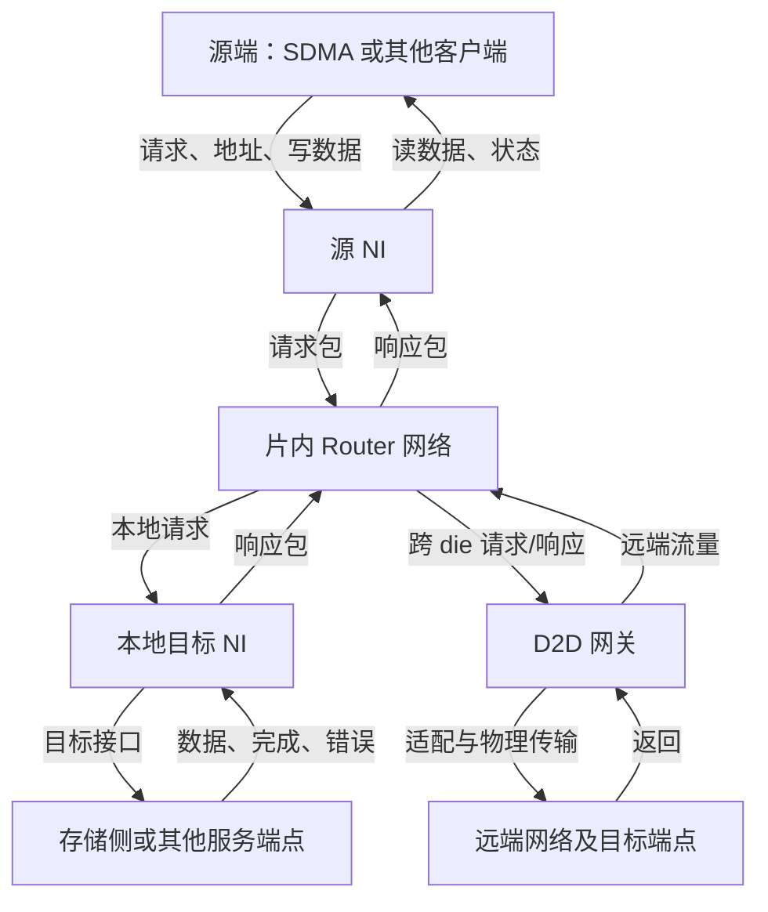
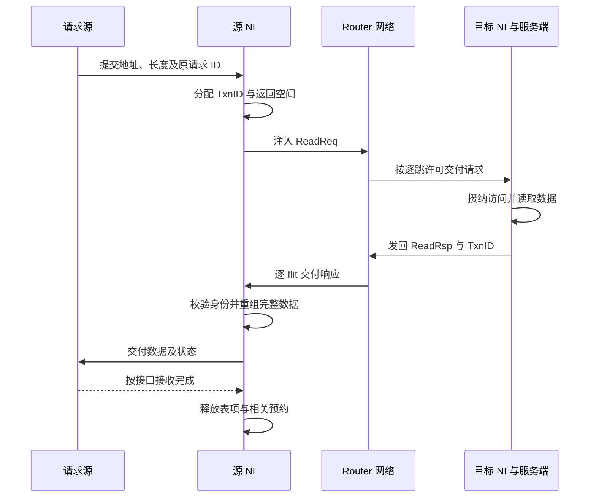
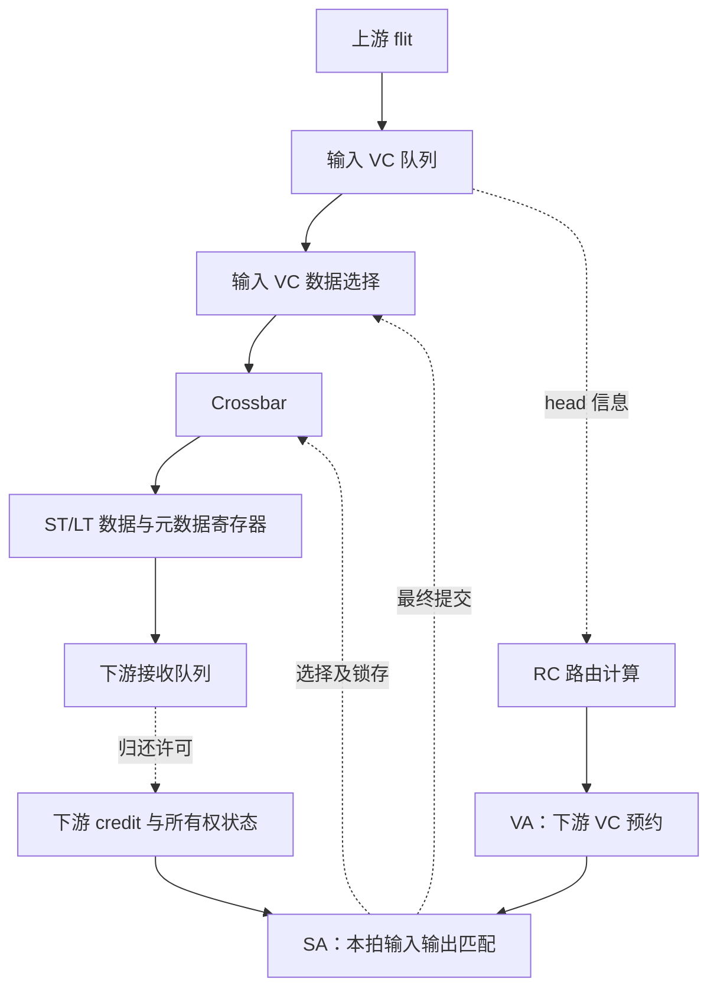
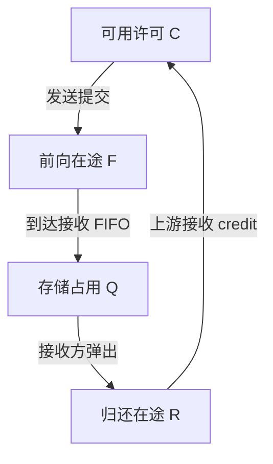
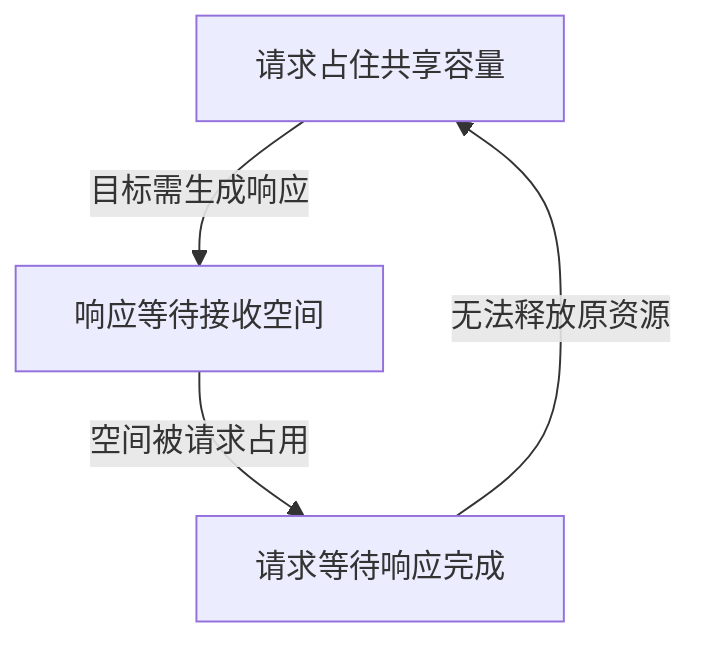

> 工作草稿检查点：第 1–11 节已写出，后续章节与整体审核尚未完成。请勿将本分支草稿当作最终完成稿。

# SWITCH 微架构详解：从系统需求、上下游接口到 NI、Router 与跨 die 传输

版本：v2.2；重写日期：2026-09-25。本文整合已完成的前两轮研究，按理解顺序重新组织。研究轮次及模型执行记录见[进度页](RESEARCH_PROGRESS.md)，本次重写不代表第 3–6 轮完成。

本文要建立的是一套能讲清资源、接口和完整行为的参考微架构。研究对象以本项目的 AMD SWITCH 命名组织；由于目标芯片的真实拓扑和内部协议尚未公开确认，下面把**公开资料中的机制、本文选定的教学设计、目标实现待核实项**分开说明。片内基线沿用 R0，跨 die 扩展沿用 R1；它们是本文设计编号。

读完主线后，应能解释：一次请求为什么进入 SWITCH，谁决定目标，谁保存未完成状态，竞争时谁等待谁，返回如何找到原请求，以及“发出”“接收”“完成”各发生在哪里。精确教学位段和深层实现分支放在后部，资料细节可从[逐篇索引](../SWITCH/sources/README.md)进入。

## 1. 为什么需要 SWITCH

### 1.1 系统先提出了什么问题

设有两个请求源，同时访问两个目标。源端可能是 SDMA 的数据接口，也可能是缓存侧送出的访问；目标可能是本地存储侧端点，也可能需要跨 die 才能到达。

如果两个请求去不同目标，系统希望它们并行。如果都去同一个目标，就必须决定先服务谁。目标暂时不能接收时，已经接纳的请求不能丢失；读数据返回时，还必须知道交给哪个源、对应哪笔请求。

这些需求决定了 SWITCH 至少包含三类工作：

1. **选择路径与搬运数据**：识别目标，选择输出，把数据送到下一站。
2. **管理有限资源**：保存等待的内容，协调竞争，阻止发送方把接收方塞满。
3. **维持事务关联**：让请求、数据、响应和错误保持正确身份，并在约定的完成点归还责任。

组合多路选择器能选择当前数据，却不能独自完成后两类工作。因而微架构必须包含队列、状态、仲裁与接口控制，而不只是几组 MUX。

### 1.2 什么时候需要网络化

少量相邻 IP 可以直连，单级交叉开关也适用于规模有限的集中连接。当端点增多、距离变长、物理布线和共享带宽成为约束时，可以把传输拆成多个 Router 和链路，组成片上网络 NoC。

这是一种结构取舍：增加中间节点会引入排队和流水延迟，但可以限制单个节点的连线规模，并提供多条并行路径。不能仅凭“NoC”名称断言延迟更低，或推断具体 AMD 芯片一定使用 mesh。

### 1.3 本文所说的 SWITCH 包括哪一层

“switch”在不同资料中可能指交叉矩阵、一个 Router，或由端点接口、Router、链路组成的互联系统。本文先从完整传输服务看，再逐层打开：

| 名称 | 在本文中负责什么 | 不能据名称推定的能力 |
| --- | --- | --- |
| Crossbar | 在一个节点内，把选中的输入连接到选中的输出 | 自身不管理完整事务、路由或缓冲 |
| Router | 缓存 flit，选择下一跳，分配 VC 和输出带宽 | 不默认执行地址翻译、一致性目录或内存调度 |
| NI / NIU / bridge | 将端点事务变成网络消息，维护身份、接纳与返回 | 不天然支持全部 AXI、CHI 或 AMD 私有协议 |
| NoC | 组织 NI、Router 与片内链路 | 不自动包含跨 die 可靠性和 PHY |
| D2D gateway / adapter | 处理网络边界、传输格式、有限容量及适用的可靠性机制 | 点对点 D2D 链路本身不等于多端口交换机 |
| PHY | 在实际物理通道上发送、采样和恢复数据 | PHY 接收完成不等于内存事务完成 |

行业名称用于帮助检索和理解；最终应回到目标设计的模块边界。NI/Router 的公开划分可参考 [Garnet 总览 R4](../SWITCH/sources/R4-garnet-overview.md)，具体流水与职责以对应实现为准。

## 2. 典型功能与 feature：从需求推导结构

先区分“完成基本传输必需的功能”和“特定场景才需要的扩展”。同一个 feature 可能跨多个子模块，不能只给它找一个方框后就认为研究结束。

| 系统需求 | 功能或 feature | 主要位置及后续问题 |
| --- | --- | --- |
| 请求到达正确目标 | 目标映射、路由 | NI 确定目的端，Router 选择下一跳；两者作用域不同 |
| 端点事务格式与内部通路不同 | 打包、拆包、宽度适配 | NI 保存事务信息；网络按自己的粒度传输 |
| 多个源争用有限通路 | 仲裁、匹配 | 输入读口与输出链路都受约束，必须形成可兑现的匹配 |
| 下游速度变化 | 缓冲、流控、反压 | 接收存储与发送许可构成闭环 |
| 某个包受阻时，其他包仍有机会前进 | 多队列、VC、按需采用 VOQ | 减少相互阻塞，同时增加状态与调度成本 |
| 请求发出后还要接收结果 | 事务表、返回关联、接收预约 | NI 与目标端共同维护；Router 空槽不能替代返回空间 |
| 某些访问必须保序 | 排序域、注入限制或返回重排 | 在适用接口边界实现，不把局部 FIFO 顺序当全局顺序 |
| 请求与响应相互依赖 | 资源隔离、进展分析 | 网络队列、端点队列和共享池一起考虑 |
| 流量需要区别对待 | 公平仲裁、限流、QoS | 基础 RR 与最低带宽、时延保证分别研究 |
| 通路跨 die 或时钟域 | 网关、CDC、适用的检错/重放 | 增加新的资源承诺与状态恢复责任 |
| 复位、停链、错误不能污染后续事务 | quiesce、drain、错误收尾、身份隔离 | 需要端点、网络、链路和控制面协作 |
| 需要判断瓶颈 | 分层计数与延迟观察 | 指标必须注明位置、对象、单位与完成边界 |

本文先用有限的普通读写建立闭环，再说明相关扩展。原子、一致性 snoop、多播、完整协议兼容属于条件相关能力，不能因为包头留了字段就宣称已实现。

## 3. 整体微架构：先放回上下游系统

### 3.1 一条参考访问路径

下图描述**本文教学结构**。源与目标端点是明确的接口角色，不是已经核实的 AMD RTL 连线。真实芯片的模块映射在下一节单独说明。

这张图先回答“本模块接谁”。源 NI 面对业务接口，Router 面对网络传输接口；目标 NI 把消息重新转换为目标可处理的事务。只有目标在远端时才经过 D2D 分支。

读请求正向走，主要数据反向走；写请求的主要数据随请求正向走。因而“上游/下游”通常按请求服务关系命名，不能据此认为所有数据都朝同一方向流动。每条发送路径还有反向的流控信息，其作用在第 9 节解释。

### 3.2 放到 AMD 项目中，哪些关系已有依据

| 相邻对象 | 研究 SWITCH 时需要知道什么 | 现有依据和边界 |
| --- | --- | --- |
| SDMA | 请求类型、地址空间、数据供给、返回空间、完成及停止发起后的责任 | shaobo 摘要记载 BE 的 DF 数据接口、TBE 的翻译/MMHUB 联系；不能合成所有 SDMA 请求共用的一条链。见[模块映射](../module-map.md)及[SDMA 接口方案](../SDMA/research-plan.md) |
| GC / GL2、EA、HUBS | 何处产生需继续传输的请求，哪些访问被 cache 满足，身份和属性如何交接 | 按产品和请求分支核实；这些学习目录不证明它们一定直接连接本文 NI。见[GC1](../GC/sources/GC1-cdna2-memory.md)、[HUBS 入口](../HUBS/README.md) |
| DF / CS | 地址归属、目标选择、适用的一致性/顺序与响应责任 | AMD 历史资料区分 master、transport、CS 和 UMC；其具体连接不直接外推到目标 GPU。见[P1](../DF/sources/P1-ryzen-fabric-topology.md) |
| CAKE / 跨 die 端点 | 哪层承担封装或芯片间扩展，和 SWITCH、adapter、PHY 如何分工 | CAKE 与本项目 SWITCH 的一一对应未确认；不能按名称直接相等。见[P1](../DF/sources/P1-ryzen-fabric-topology.md)、[FAB1](../DF/sources/FAB1-cdna3-iod-memory.md) |
| UMC、PHY、HBM | 存储侧请求如何接纳、何时返回；网络的“目的端”离实际 bank 还有哪些处理 | UMC 的命令调度、HBM 行/bank 行为留在对应模块；SWITCH 必须保留所需身份与完成约定。见[HBM 地址路径方案](../HBM/address-interleaving-plan.md) |
| UTCL1 / UTCL2 | 当前接口接收哪类地址，翻译结果与权限由谁提供 | 翻译服务与数据传输分开；本文 R0 在入口使用已完成所需翻译的地址，不把所有 payload 画成串行穿过 TLB |
| 配置、复位与管理来源 | 谁配置目标映射，何时允许注入，停流/复位如何通知 | 按目标控制接口确认；不把 CF、SMN、RSMU 自动视为同一控制网络 |

这种定位必须先做，才能知道内部设计在解决谁的需求。同时，当前只需研究相邻模块提供的接口约定，不必把它们整套内部实现搬进 SWITCH 文档。

**待核实的目标事实：** SWITCH 的实际拓扑、端点数量、接口协议、与 DF/CAKE 的归属、地址映射所在模块及 D2D 模式。这些会改变架构判断，属于关键未知；后文教学结构不会替它们作答。

### 3.3 从外部接口打开内部子模块

| 子模块 | 为什么需要 | 输入、输出与关键状态 |
| --- | --- | --- |
| 接纳与入口检查 | 在承诺服务前确认请求合法且有资源 | 端点请求→合法内部事务；保存请求属性和资源预约 |
| 事务表与目标映射 | 网络传输时间不固定，源身份需跨多个阶段保留 | 地址/原 ID→目的节点/内部 ID；保存返回关联、排序域、完成状态 |
| Packetizer / depacketizer | 事务长度与链路粒度不同 | 事务↔packet/flit；保存包边界、长度和重组进度 |
| 输入队列与 VC 描述符 | 下游未就绪时保留数据及包的上下文 | flit→队头；保存占用、路由、VC 映射及包状态 |
| 路由计算 RC | 决定当前节点从哪个方向继续 | 目的节点+当前位置→输出方向 |
| VC 分配 VA | 给整包取得下一跳的逻辑队列使用权 | 待路由 head→下游 VC 预约 |
| Switch 分配 SA | 决定本拍哪些数据实际共享交换矩阵 | 可服务 VC→输入/输出匹配 |
| Crossbar 与链路流水 | 把赢家的数据和身份送往下一跳 | 队头→输出 flit；保存不可变的传输快照 |
| 下游资源状态与 credit 处理 | 距离使“对面当前有空”无法即时观察 | 返回许可→可发送数量/VC 所有权状态 |
| 目标适配与响应生成 | 网络到达只完成运输，目标仍需处理业务 | 请求包→目标接口→响应包；保存执行与错误状态 |
| D2D 网关与适配 | 跨 die 通路有不同格式、容量和可靠性边界 | 本地 packet↔跨 die record；保存重组、重放和接收承诺 |

各功能可以在实现中合并，但合并以后责任仍然存在。例如把 VA 合入 SA，不代表下游 VC 可以不分配；把事务表和返回缓冲合并，也不代表两者释放时间相同。

## 4. 接口先讲清，再讨论内部如何执行

### 4.1 六类关键交接

| 接口边界 | 传递什么 | 接纳及流控 | 返回/完成的含义 |
| --- | --- | --- | --- |
| 请求源↔源 NI | 操作、地址、长度、数据、原身份及属性 | NI 有表项和必要缓冲才不可撤销地接纳；写数据分阶段接收时保存关联 | 仅表示该接口责任交接；整笔完成还要等待规定响应 |
| NI↔本地 Router | flit、包边界、网络类别和所用 VC | 使用明确的注入/弹出协议；本项目模型的源注入是理想 ready/valid，不能冒称已实现完整 NI | 注入完成只说明包已离开 NI；弹出后还需重组和业务交付 |
| Router↔Router | 正向 flit、逐跳 VC；反向槽 credit 与 VC 释放信息 | 发送前已有接收许可，许可包含在途承诺 | credit 归还只释放相邻队列资源 |
| 目标 NI↔目标服务端 | 解包后的地址、操作、写数据与属性 | 目标接纳能力、命令/数据配对和响应能力共同约束 | 目标必须定义何时完成及何种可见性成立 |
| NoC↔D2D 网关↔adapter/PHY | 包、跨链路传输单元、状态和流控 | 本地槽、远端整包容量和重放空间分别管理 | 链路确认与业务完成分开 |
| 控制面↔上述子模块 | 映射、启停、配额、错误与恢复命令 | 配置生效需兼容在途状态和已承诺容量 | 停止接纳、排空、复位完成是不同状态 |

这里的“接口”首先是一份行为约定。信号名和位宽是其实现形式；如果不先说明谁接管责任、何时允许撤销，就算列出全部端口，也难以解释系统是否正确。

### 4.2 四种传输粒度

| 粒度 | 含义 | 本文例子 |
| --- | --- | --- |
| 命令 | 源端要完成的整体工作 | 一次 SDMA 搬运可拆成多笔读和写 |
| Transaction | 需要关联和完成判断的业务访问 | 读 256 B，等待对应数据或错误 |
| Packet | 网络按包维护路径/状态的传输对象 | 一个读请求包和一个读响应包 |
| Flit | 网络流控与交换的基本数据粒度 | R0 每 flit 16 B；长 packet 含多个 flit |

物理传输粒度还可能更小。16 B flit 通过 4 B 宽通路需要多个传输节拍；NoC flit、UCIe flit 和本文教学链路 cell 也不是同一格式。换宽度会改变吞吐、缓冲与时序，不能只改一个名词。

### 4.3 地址、目标和身份不要混成一件事

在 R0 中，源 NI 根据地址和映射决定目标节点 DstID；Router 用 DstID 与当前位置选择下一跳。**目标归属与下一跳路由是两次不同的选择。** 若真实系统已由 DF/CS 或其他模块给出目标 ID，NI 可以只接收该结果；具体分工需由目标资料决定。

原请求 ID、内部 TxnID、节点 ID、逐跳 VC 编号及软件上下文标签也各有作用。TxnID 用于找到未完成事务，VC 编号用来定位这一跳的队列。同一个 packet 可在每跳使用不同 VC，返回时仍通过事务身份关联原请求。

对 HBM 而言，Router 选一条可达目标的路径，不等于重新决定数据存在哪个 stack、channel 或 bank。系统目标交织、UMC 地址解码与 NoC 路由应分别定位；分包是否同时拆成多个内存事务也需明确责任。

## 5. 先走完一次普通读写

### 5.1 为贯穿例子固定最少假设

沿用既有 R0：同一 die 上的 mesh；每个 Router 最多 N/E/S/W/Local 五个输入和输出；每输入四个私有 VC，分为请求 VN 两个、响应 VN 两个；每 VC 八个槽；16 B/flit；一个物理输出每周期最多发一个 flit。

VN 是按协议用途划分的资源类别，VC 是类别内可分别保存包状态的队列。本例中请求和响应使用独立槽与状态，而不只是一个分类标签。目标先用行为明确的受控 SRAM：读出数据后返回；写完成并对该控制器后续读取可见后返回。将它替换为真实 UMC 或缓存端点时，必须重定完成语义。

合法事务为 16 B 对齐、16 B 倍数、最多 256 B 的普通读写，使用已翻译地址。不支持的属性不应静默丢弃；真实协议入口应限制协商子集、完成合法转换或按协议报错。

### 5.2 读 256 B：请求很短，返回很长

假设源要读取地址 0x1000 起的 256 B，源 NI 分配内部 TxnID=7，并记录它与源端原请求身份的关系。R0 包头独占一个 16 B flit：

- 读请求只有一个同时标记 head/tail 的 flit，长度字段描述要读多少数据。
- 读响应是一个 head 加十六个数据 flit，共十七个；最后一个带 tail。
- 网络发送该读请求时不需要把 256 B 数据随请求送出，因为数据尚在目标端。

图中网络不是一次无条件转发。每跳都可能等待 VC、输出带宽或 credit；但源 NI 的表项在这段等待中持续存在。请求包离开源 NI，并不让 TxnID=7 立刻可复用。

响应到达时，NI 根据完整关联键找到表项，核对类型、长度和预期字节范围。收到 head 只说明返回开始，收到 tail 并通过检查后才能判断整包是否齐全；向源端交付还要遵守该接口的接收和顺序约定。

### 5.3 写 256 B：数据齐全与写完成之间还有一段路

R0 的保守方案在源 NI 收齐写 payload 后才向网络注入，因此写请求也是十七 flit。目标 NI 重组后交给目标服务端；达到约定完成点后，产生一个单 flit 的写响应。

这样选择的原因是：一旦 head 占住网络路径，若后续数据还依赖一个无法前进的本地生产者，网络资源可能被长时间扣留。先收齐再注入，把这类等待放在可控的入口缓冲中。代价是更大的 NI 存储与额外首包延迟。

流式注入可以降低这部分成本，但必须重新说明数据供应、取消、部分包和恢复责任。它是可研究的结构分支，不能在保持其他前提不变时直接删掉整包缓冲。

### 5.4 哪里会停，停住以后保留什么

| 停顿位置 | 仍须保存的内容 | 允许恢复的条件 |
| --- | --- | --- |
| NI 没有事务表项或返回空间 | 尚未接纳的请求仍由源端持有；已接纳内容按接口保留 | 表项/空间可用 |
| Router 没有下游 VC | 输入包、路由结果及已收到 flit | 合法下游 VC 可分配 |
| VC 已分配但没有 credit | 当前 packet ownership、队列及后续路径 | 下游归还接收许可 |
| 本拍输掉输出仲裁 | 完整队头与状态 | 后续真正获得匹配 |
| 目标尚未完成 | 执行上下文和返回关联 | 达到目标完成条件或产生可收尾错误 |
| 源端暂不取返回数据 | NI 已接收数据及其事务状态 | 源端接收；不能撤销此前承诺的返回容量 |

这个表把等待落到资源上。后续各节要解释的，就是这些资源如何取得、保持与释放。

## 6. NI：把业务事务与网络传输接起来

### 6.1 接纳是一份资源承诺

源 NI 的事务表至少需要保存：原来源和 ID、内部 TxnID、上下文/世代、操作和目标、预期/已收到的字节、返回槽位置、排序域及完成状态。字段是否合并、具体位宽多少，可以后续决定；这些信息承担的责任不能丢失。

在不可撤销地接受新事务之前，就应落实所需资源。对于读，R0 预留完整返回数据空间及状态；对于写，除了写 payload，还要保证写响应/错误能被接收和交付。不能只防长读响应溢出，却让短完成消息永久无处落脚。

返回空间可以物理上位于 NI，也可以由有明确预约协议的源端缓冲承担。关键是容量在请求发出后不能被其他流占走，响应的接收也不能依赖先发出另一笔请求。

### 6.2 ID 为什么不能过早复用

假设请求 A 使用 TxnID=7，head 离开后立刻把 7 分给请求 B。若 A 的响应稍晚到达，只凭数值 7 就可能误写 B 的返回区。

因此 ID 生命周期覆盖所需的全部响应、交付和错误收尾。内部 ID 转换还要保留原端口/原 ID；多个源恰好都使用 ID=7，并不意味着它们是同一事务。

复位或 context 切换会进一步增加风险：旧响应可能在新 context 建立后到达。世代标签可以帮助区分，但有限位宽会回绕；必须配合排空、隔离或明确恢复协议，不能声称加一个 epoch 字段便自动解决所有旧包问题。

### 6.3 排序应该放在哪个边界

本文允许互不依赖的普通事务独立进行。对需要保持完成顺序的同一流，R0 采用容易解释的办法：同一时刻只允许一个相关事务在途，达到定义的完成点后再放行下一个。

这牺牲并发换取简单性。若要维持多个 outstanding，就可能需要源端顺序记录、目标限制或返回重排缓冲。必须指出维护的是哪类顺序：同源同 ID、某地址范围、某接口可见性，还是软件定义的同步域。

仅让一个 VC 内 flit 不乱序，不能保证不同 VC、不同目标的事务按要求完成。[FlooNoC R7](../SWITCH/sources/R7-floonoc-paper.md)可用于比较端点重排和限制同 ID 目标等思路；不要将它们混成一套无成本策略。

### 6.4 目标 NI 同样需要状态

目标 NI 负责接收/重组、合法性检查、目标接口适配、请求与写数据配对、返回关联和响应生成。接收长包时必须明确缓冲或流式接纳能力；不能接下 head 后又没有任何办法接住合法后续数据。

响应资源的责任也要在接纳请求时考虑。对于本文简单目标，可以为被接受的事务分配必要响应状态，保证响应路径最终可推进；真实控制器的执行队列和数据返回约定应单独核实。

Garnet 的目的 NI 提供了一个有用对照：网络 tail 到达后，若协议消费者无空间，仍可能保持 tail/VC，直到允许交付才归还释放信息。这说明“到达终点 Router”和“被端点接管”是不同事件。详见[R22 笔记及固定版本源码](../SWITCH/sources/R22-garnet-network-interface.md)。

### 6.5 接真实协议时，哪些知识不可省略

AXI4 桥接需处理 AW/W 的独立到达及其关联，AR 的读请求，以及 R/B 的返回与顺序。NI 不能假设地址永远先到，也不能把内部有限读写子集冒充所有 AXI 功能。一个已经接受的 burst 出错，仍须按协议完成相应收尾；不能简单丢掉余下传输。

AXI 的响应只在其规定的属性和边界下表达完成，不自动意味着写已到 HBM 存储单元。细节与原文位置见[R8](../SWITCH/sources/R8-axi-ordering-contract.md)，特别是 IHI 0022H 的 A3、A5、A6。本次重整已回查握手、写响应依赖及允许缓冲响应的条件；更深 burst/独占规则继续复用笔记。

CHI 的 REQ/RSP/SNP/DAT、端点角色、TxnID/DBID、协议级重试和链路容量有不同职责。本文两类 VN 的普通读写模型不足以覆盖这些依赖。正式协议依据改用[R23：CHI E.a](../SWITCH/sources/R23-chi-ea-protocol.md)；R9 是模型用户指南，不承担协议规范依据。

> 可选深入问题：在保持本节事务与完成语义不变时，事务表采用 CAM 还是索引 RAM，字段怎样压缩？只有这些选择改变接纳带宽或接口行为时，才需要回到正文展开。

## 7. Router 内部：从队头到真正发送

### 7.1 数据路径与控制路径怎样配合

NI 已把事务转成网络 packet。Router 此时要解决的是：这个包从哪个输出走，下一跳是否有可用队列，本拍能否取得输入读口与输出链路。

数据在等待期间通常留在输入 FIFO。控制逻辑先根据 head 信息和资源状态作决定，只有形成真实发送提交后才弹出数据、更新资源并进入流水。这让“想发送”“被选中”“已经发送”各有明确位置。

输入端口与输出端口是物理传输通道；VC 是附着其上的逻辑队列。一个 West 输入可能汇聚多个源，不等于某一个 requester 的专属入口。R0 的四个 VC 也不等于四个软件 queue、VF 或 VMID。

### 7.2 输入 VC 不只是一个 FIFO

FIFO 保存 flit，VC 描述符保存包正在经历的过程。二者必须同时存在：当 head 已离开而 body 尚未到达时，FIFO 可以暂时为空，但这个 VC 仍属于当前 packet，路径不能清掉。

| 输入 VC 状态 | 代表的阶段 | 需要保存什么 | 何时前进 |
| --- | --- | --- | --- |
| IDLE | 可接受一个新包的 head | 空闲状态及队列位置 | 接收合法 head |
| RC | 正在决定输出方向 | 目的节点、类别及包上下文 | 提交路由结果 |
| WAIT_VA | 方向已知，等待下一跳 VC | route_out、已接收的 flit | 取得合法 VC |
| ACTIVE | 已取得下一跳 VC，逐 flit 争取发送 | route_out、outVC、包状态和剩余数据 | 普通 pop 保持；tail pop 结束 |

body 可以在等待 VA 时继续到达，只要它属于该包且已有槽许可。单 flit 包同时是 head/tail，也要完成所需资源取得；不能因为它短就绕过所有权与容量检查。

非法 body 开始一个 IDLE VC、在旧包未结束时收到新 head、长度与边界不一致，都意味着包状态可能损坏。如何报告和恢复见第 12 节，不能随意丢掉一个 flit 后继续当作边界仍正确。

### 7.3 RC：目标不变，当前输出逐跳决定

R0 使用无环回边的二维 mesh，并采用 XY 路由：先完成 X 方向移动，再沿 Y 方向移动；到目标坐标后使用 Local 输出。North 对应 y 增大只是本文的坐标约定。

head 计算 route_out 后，body/tail 继承它。这样一个包在当前 VC 内保持顺序，不会把 body 因“另一个端口更空”随意送往不同路径。

RC 只给出方向，尚未获得下一跳 VC 或缓冲槽。它也不重新执行页表翻译或完整系统地址解码。非法目的节点应在适当入口处理，边界 Router 不能向不存在的端口发送。

自适应路由需要额外考虑拥塞信息、合法转向、逃逸资源和进展规则。把 XY 改成“选择较空端口”会改变资源依赖，不能作为不影响结构的小优化直接加入。

### 7.4 VA：为整包取得下一跳 VC 使用权

假设当前输入 West.VC0 要从 East 输出，下一 Router 对应接收端是 West 输入。VA 在**下一跳这个接收输入的合法 VC 集合**中选择一个，并在本 Router 保存其使用权镜像。

这一使用权从分配开始，覆盖 head、body、tail 的全过程。当前包因缺数据暂时停顿时，它仍然有效。VA 回答的是“这个 packet 可以用下一跳哪个逻辑队列”，不是“本拍能送多少数据”。

R0 的简单分配方法是：

1. 每个 WAIT_VA 输入 VC 根据 route 和 VN 筛选空闲候选。
2. 每个申请者只提名一个候选，避免同时拿到多个 output VC。
3. 每个被申请的 output VC 对竞争者做 RR。
4. 获胜时在同一提交点写入输入侧映射及输出侧 owner。

不同输入 VC 可以取得同一物理输出上的不同 VC，但之后仍要争用该输出每拍的一次发送机会。

若允许一个输入同时申请所有空闲 VC，就要增加输入侧 accept 或等价协调，防止两个输出 VC 同时授予一个申请者。若把 VA 流水化为多拍，也需要临时预约或最终重查，以免多个请求依据同一旧“空闲”状态重复预订。这些是分配正确性问题，不是仅给图多画一级寄存器。

### 7.5 SA：为本拍取得一条可执行的数据通路

一个 VC 进入 SA 的条件至少包括：队头有数据、包处于 ACTIVE、route/outVC 映射有效、下游 credit 大于零、数据与流水已就绪，以及当前允许的顺序和链路状态。

R0 每个物理输入只有一条数据通路，每个输出每拍最多一个 flit。因此不能只给每个输出放一个仲裁器：同一输入的两个 VC 可能分别赢得两个输出，但数据面无法同时读出两份。

R0 采用两级分配：

- SA-I：每个输入在自己的可服务 VC 中提名一个。
- SA-II：每个输出在指向自己的输入提名中选择一个。

最终每输入、每输出最多参与一次发送，形成部分一对一匹配。Crossbar 是否能连接某条边，与 allocator 本拍是否选出最好组合，是两件事。

例如 I0 有去 E 和 N 的两个候选，I1 只有去 E 的候选。若 I0 和 I1 都先提名 E，最终只发出一个 flit，N 空闲；若选择 I0→N、I1→E，则能同时发两个。这解释了为何网络可能仍有空闲输出，却存在待发数据。

[R5](../SWITCH/sources/R5-garnet-switch-allocator.md)的固定版本 Garnet 也有两级选择，但在胜出 head 路径上分配 outVC，未采用本文独立 VA 流水。此次按源码核对了发送、扣 credit 与 tail/free 更新；概述中的阶段名字不能替代具体实现。

### 7.6 RR、公平性与匹配质量各管什么

Round-robin 保存下一次扫描起点，在真正完成规定服务后推进指针。当前被提名却没能发送的请求，不能被记成已经服务过。

对孤立、持续可服务的竞争者，RR 能轮流给机会。但在网络中，eligible 状态可能因 credit、输入一级提名或目标阻塞不断变化，不能由局部 RR 直接推出端到端最大等待时间。

匹配还要区分：

| 概念 | 判断标准 | 对性能的含义 |
| --- | --- | --- |
| 合法匹配 | 不重复使用受限输入/输出资源 | 是能实际发送的基本条件 |
| Maximal | 不改动已选边时，无法再直接加入一条不冲突边 | 仍可能错失更好的重新安排 |
| Maximum | 当前申请图中，匹配边数最多 | 仍不自动保证长期公平或低尾延迟 |

iSLIP 是研究匹配的一个对照：request、grant、accept 可多轮迭代，原算法对第一迭代被接受匹配更新持久指针，后续迭代规则不同。它与 R0 的简单两级提名不是同一个算法，不能混用局部逻辑。机制和适用前提见[R18](../SWITCH/sources/R18-islip-matching.md)。

> 可选深入问题：在相同服务规则下，轮转选择用 mask、旋转编码还是树形结构实现，哪一种更适合目标时序？本文暂不展开门级实现。

### 7.7 Crossbar 传输必须携带旧包的完整快照

R0 的数据面可以理解为：每输入先选一个 VC，再由每输出的多路选择连接到它。增加 VC 主要增加队列、描述符和仲裁规模，不必把 5×5 物理交叉矩阵直接变成 20×20。

flit 离开输入 FIFO 后，ST/LT 必须同时保存 data、有效位、输出方向、output VC 和 head/tail。原因是 tail 弹出后，本地输入 VC 可能很快开始处理新包；仍在流水中的旧 tail 不能重新读取已经被新包覆盖的 route。

这体现一个通用原则：可复用资源的编号不等于当前传输的永久身份。验证模型可额外保存 packet/generation 标签检查旧状态误用，但这些旁观标签不等于线上必须增加同样字段。

## 8. 流水中的“提交”：哪些状态必须一起变化

### 8.1 先约定观察旧状态，再提交新状态

R0 把每拍行为理解为读取当前状态、计算候选、在采样沿提交更新。此处是设计约定，不是要求额外增加三个物理流水级。

在本基线中，某边沿新捕获的 flit 或 credit 不反过来影响该边沿已经作出的选择，只参与下一次计算。例如 edge 9 收到 free credit，最早在随后计算并于 edge 10 提交新的分配。若实现想做同拍旁路，必须明确新增组合路径及竞争优先级。

这样的约定避免软件模型因函数执行顺序，偷偷拥有硬件没有的“提前可见”能力。BookSim 的求值/更新思想可作为对照，具体时间边界仍由本模型自己定义，见[R3](../SWITCH/sources/R3-booksim-method.md)。

### 8.2 send_commit 是资源交接点

本文固定 ST/LT 为已预留、不能再回堵的两拍前向通路。形成最终匹配后，只有所有许可均有效，才产生 send_commit。它同时完成：

- 取出旧队头，释放当前输入存储槽。
- 扣除一份下一跳接收 credit。
- 锁存数据及路由/VC/边界元数据。
- 更新真正获服务的仲裁状态。
- 向上游生成本槽的归还事件；tail 还结束本地输入包状态。

其中数据尚未到达下一跳，所以扣过的 credit 必须覆盖它在 ST/LT 中的存续期。把扣减拖到链路出口，会允许多个前向在途 flit 使用同一份许可。

若改用可暂停的输出 FIFO，必须把输出可接纳条件纳入 commit。可以在申请前筛出一定能提交的赢家，也可以保存 grant/payload 等待接纳；不能让一个未完成握手的 payload 随每拍重新仲裁任意变化。

### 8.3 同拍事件怎么合并

| 同时发生的事件 | 必须保持的行为 |
| --- | --- |
| 普通 pop 与新 body 到达 | 读出旧队头、写入新内容，占用量按净变化更新 |
| credit return 与 send_commit | 两次事件都被记录，credit 数值可以净不变 |
| 旧 tail 进入流水与输入 VC 后续复用 | 流水保存旧包快照，不能回读新包描述符 |
| free 返回与新 VA | 按基线的旧状态约定，在下一次分配中使用 |
| reset 与未完成传输 | 转入协调恢复流程，不能只把某一侧计数器清零 |

占用更新可写成 count_next = count + push − pop，但这只是结果；还要保证旧数据读出、同址读写和指针更新语义一致。多个独立赋值互相覆盖，不会因为公式正确而变成正确实现。

### 8.4 用一个 head 看清延迟和吞吐

| 时刻 | 动作与责任变化 |
| --- | --- |
| edge 0 | head 被当前 Router 输入 FIFO 捕获 |
| edge 1 | RC 结果提交 |
| edge 2 | VA 提交，获得下游 VC |
| edge 3 | SA/send_commit，弹出队头、扣 credit 并锁存快照 |
| edge 3→4 | ST，数据通过交换路径 |
| edge 4→5 | LT；edge 5 被下一接收点捕获 |

无竞争且许可充足时，body/tail 在 head 后以每拍一个 flit 的节奏前进。首 flit 经过五拍，不等于稳态每五拍才能发送一个。

源注入、目标弹出、存储读延迟和 CDC 若发生在测量边界内，都要另计。本文的可执行模型采用理想源注入与有限 sink；它并未把第 6 节全部 NI 事务处理实现进来。

## 9. Credit 与 VC ownership：两个不同的闭环

### 9.1 为什么不直接看“下游现在满不满”

发送端和接收端之间存在流水与传播延迟。即使此刻看到接收 FIFO 有空位，已经合法发出的 flit 也可能尚未到达。Credit 将接收容量预先变成许可，使发送方可以依据自己持有的承诺发送。

发送方持有一个 credit，意味着它可以为指定下游队列发送一个 flit；不要求此刻所有存储内容都已在远端可见。发送前扣许可，消费后返许可，才能把在途量纳入容量预算。

### 9.2 一份容量沿四个状态移动

对 R0 的一个私有下游 VC：

| 符号 | 意义 |
| --- | --- |
| C | 上游尚可使用的发送许可 |
| F | 已扣许可、尚未进入接收 FIFO 的 flit，含 ST/LT |
| Q | 接收 FIFO 中的 flit |
| R | 已释放槽、归还 credit 尚未被上游接收的数量 |
| D | 该 VC 的接收容量 |

容量守恒为 **C + F + Q + R = D**。

这个图强调许可的交接，而不是把 credit 当实时满空信号。即使接收 FIFO 当前 Q=0，也可能因为许可仍在 F 或 R 中而暂时没有新发送机会。

当同拍发送和归还各一份许可时，C 数值不变，但其他状态已发生两个合法转移。模型和 RTL 都应处理这两个事件，而不是只保留最后一次计数器赋值。

### 9.3 槽可以全部空着，但 VC 仍属于旧包

VA 授予的是 packet ownership；credit 保护的是逐 flit 存储。一个长包的 head 已经被下游消费、后续 body 尚未到达时，credit 可以全部回来，但它仍没有发完 tail，下一包不能接管该 VC 的描述符。

R0 选择保守复用：本端 tail 发送后，output VC 进入等待释放；只有下游 tail 被消费，并且带 free 的归还信息实际回来，才释放 output VC 使用权。与此同时，本端输入 VC 已可按其自身的 tail-pop 规则结束。

| 事件 | 本地输入 VC | 相关 output VC 镜像 |
| --- | --- | --- |
| VA 成功 | 保存 outVC 映射 | 记录 owner |
| 普通 flit 发出 | 包仍 ACTIVE | 使用权保持，credit 减少 |
| 本地 tail pop | 结束该输入 packet，旧 tail 快照进入流水 | 等待下游释放 |
| 下游 tail pop | 不直接修改已复用的本地输入描述符 | 生成 free 返回 |
| free 到达 | 不应误清新包状态 | 释放旧 owner，允许后续分配 |

本基线还要求 credit 返回保持所需关联与顺序；正常 free 归还时，该私有 VC 的全部槽许可已经恢复。其他共享或提前复用策略要重新定义这些前提。[R6](../SWITCH/sources/R6-garnet-input-output-credit.md)与[R19](../SWITCH/sources/R19-booksim-buffer-state.md)分别提供实现对照。

### 9.4 深度不足怎样形成气泡

一个许可从本端发送提交，到下游到达、等待/消费，再返回本端，有一个周转时间。若每拍希望发一个 flit，而 D 小于这段时间内需要的许可数，就会出现“早先 flit 尚未归还许可，后续 flit 无法发送”的间隔。

增加 D 可以缓解这一类气泡，但不会自动增加输出带宽，也不会增加 packet 所有权槽位。短包流量可能先受 VC 复用周转限制，而不是数据槽深度限制。

反向 credit 通路也需要吞吐：R0 每物理输入每拍最多 pop 一个 flit，可匹配每拍一个携带 VC/free 的归还事件。若增加内部 speedup 或并发弹出数，归还带宽或事件队列也必须相应调整。Credit 发送不能依赖被它自己阻塞的普通业务包。

## 10. 缓冲组织：既影响性能，也改变控制语义

### 10.1 多 VC、VOQ 与共享容量解决不同问题

单 FIFO 的队头去往拥塞输出时，后面去空闲输出的包也无法越过，称为 head-of-line blocking。多个独立队列能减少这种耦合；但同一 packet 的 body 仍必须遵循其 head 建立的顺序和路径。

VC 强调多个逻辑通道共享物理链路；VOQ 强调按目的输出组织队列。Shared buffer 则讨论队列是否共享物理存储容量。它们可组合，但不能将“有多个 VC”直接理解为“每个目标都有独立 VOQ”，也不能将“共享 SRAM”理解为队列和状态可以合并。

### 10.2 换成 SRAM 后，为什么仲裁也要改

基线浅寄存器 FIFO 可以使队头在组合路径上可用；同步 SRAM 则有读请求到数据返回的延迟。若 SA 本拍才选择 VC，本拍末就要求把它的数据送入 ST，可能赶不上。

因此需要选择一种明确结构：提前读取并缓存队头，或把存储读阶段加入流水。每物理输入一块 1R1W 存储是一种便于解释的扩展：一拍最多接收一个 flit、读取一个候选，同时保存 read_pending、对象标识和返回落点。

读出的数据进入 landing register 后，可能再次因下游 credit 不足等待。若所有 VC 只共享一个 landing slot，被堵的 VC 就可能阻止其他 VC 预取；每 VC head cache 或更多落点能缓解，但增加存储和调度。

这些变化影响可服务资格、资源及流水，应在正文交代。RAM 宏具体端口编码和电路实现可以按需深入。

### 10.3 预读是复制，还是移动

| 方案 | 数据与容量如何处理 | 何时能返网络 credit |
| --- | --- | --- |
| 复制式 head cache | 原槽仍保存逻辑 flit，缓存只是副本 | 真正释放原槽时；不能把副本算成额外可接收容量 |
| 搬移式 landing | 数据离开原槽，进入另一份独占存储 | 只有新的容量与所有权模型覆盖 landing 占用时才能提前归还 |

如果提前返还原槽，却没有把已占满的 landing 纳入许可约束，上游可以继续发送而本地无处安置。反之把同一个逻辑 flit 同时算作两份独立占用，也会错误降低容量。

把多个物理输入合到一块存储还需考虑 bank/端口冲突。五输入同时接收、五输出同时发送，并不是一块 1R1W SRAM 可以无条件满足的能力。SA 的赢家必须能取得真正的数据访问端口，否则“已授权的并行传输”无法兑现。

### 10.4 共享池要同时管理队列和空闲槽

沿用既有扩展：每物理输入共享 B 个 flit 槽，每个逻辑队列保存 head、tail、count；存储条目有 data 和 next 指针，另有空闲表。

入队从可分配空闲集合取得槽，写数据并连接到该队列尾部。出队读取旧队头，更新 head，并归还旧槽。这种结构能让空闲容量服务不同队列，但元数据同样需要读写带宽和原子更新。

| 旧队列长度 | 同拍操作 | 正确的新状态 |
| --- | --- | --- |
| 0 | 只入队 | head=tail=新槽，count=1 |
| 1 | 只出队 | 队列变空 |
| 1 | 出队并入队 | 读出旧数据，head=tail=新槽，count=1 |
| ≥2 | 出队并入队 | head 转到旧第二项，旧 tail 接新槽，count 不变 |

基线局部检查不使用“刚归还地址同拍立即重新分配”的捷径。若需要这种优化，必须规定同址读写、链表和空闲池的合并更新语义。DAMQ 的原始结构及其与本文设计的区别见[R20](../SWITCH/sources/R20-damq-buffer.md)。

### 10.5 物理空闲不等于可再承诺

共享池当前没有实际数据，并不意味着所有槽都可给新流使用。若八个槽已经作为 credit 承诺给 VC0，即使这八个 flit 尚未到达，也不能再把同一容量授给 VC1。

将未授出的容量记为 U，共享池的守恒式为：

**B = U + Σ(C_v + F_v + Q_v + R_v)。**

物理空闲为 B − ΣQ_v；可以新作承诺的容量是 U。这是两个不同数字。动态配额缩小、共享策略切换和复位都不能直接撤回已发出的许可。

请求与响应共享池时，还需要保护关键类别的进展容量。逻辑上分成两个 VN，如果底层仍允许请求借光全部空间，响应仍会被堵。最低保留量要依据消息依赖和接纳方式确定，不能机械认为“一类保留一个槽就够”。

> 可选深入问题：在接口、承诺容量和吞吐已明确的前提下，空闲池用位图还是链表，next 指针如何压缩？这些细节可结合目标 RAM 与规模再展开。

## 11. 并发、反压与进展：局部正确还不够

### 11.1 反压怎样逐步传回源头

当目标停止接收，目标端队列逐渐填满，最后一跳无法继续归还许可。上游先消耗已持有的 credit，随后停止发送；更上游重复这一过程，最终 NI 不再具备接纳新请求的资源。

已经合法发出的 flit 仍需被先前承诺的容量吸收，因此不能在目标一停顿时就假定整个网络同时停止。这也是 credit、弹性容量及在途状态必须一起研究的原因。

反压本身不是错误。它表示有限资源在限制输入速率；问题是等待期间状态是否保留、返回是否仍有空间、恢复后是否能继续。

### 11.2 路由无环与事务无死锁分别检查

R0 的无环回 mesh 使用 XY，先走 X 再走 Y，禁止完成 Y 后又转回 X。它提供了分析路由通道依赖的结构基础。

但全系统还包含 NI 返回空间、目标队列、重排缓冲、共享池和跨 die 网关。只检查物理路由，可能漏掉如下等待：

修复应切断具体依赖，例如预留响应接收空间、保护响应资源、让消费响应不依赖发新请求。仅增加几个 VC 或加大 buffer，不会自动消除该环。

[R13](../SWITCH/sources/R13-channel-dependency-scope.md)保存了确定性路由定理的模型前提；不能把它当作任意自适应、共享池和一致性系统的通用证明。[R22](../SWITCH/sources/R22-garnet-network-interface.md)说明终点消费者也能继续持有网络资源。

### 11.3 无死锁、公平与有限完成时间

无死锁表示没有一组资源永远循环等待；饥饿是某流长期得不到服务，其他流仍在前进；活锁则是不断移动或重试但不完成。

因此还要给出环境前进条件：目标最终服务或报错，控制消息能获得机会，持续 eligible 的请求按相应规则获得服务，故障有明确升级出口。随机测试排空可以检查所运行的轨迹，不能证明所有状态和负载均有时延上界。

所谓 escape VC 也必须有受保护资源、合法路由和转换规则。若进入后又回到先前资源类别，或容量被普通流全部借走，名字叫 escape 仍不能保证进展。

### 11.4 QoS 的作用点与观察位置

本文基线使用 RR，不提供硬实时保证。要区分延迟敏感控制流和大块搬运，可以在 NI 限制速率/突发，在输出选择类别，再在类别内仲裁。但限制必须反映到真正共享的资源，不能只设置一个 QoS 字段。

按 packet 轮转时，17-flit 数据包与 1-flit 控制包消耗的链路时间不同；按 flit 轮转增加交错，却可能延长某包占有 VC 的时间。按 byte/deficit 调度还需要保存配额及补充规则。

性能观察也要分清原因。一个 VC 同拍既无 credit 又没被 SA 选中，两个计数可以同时增加，却不能直接相加成两拍等待。互斥主阻塞原因适合解释时间，允许重叠的事件计数适合诊断相关性；它们都应写明按 VC、端口还是整个 Router 计数。
